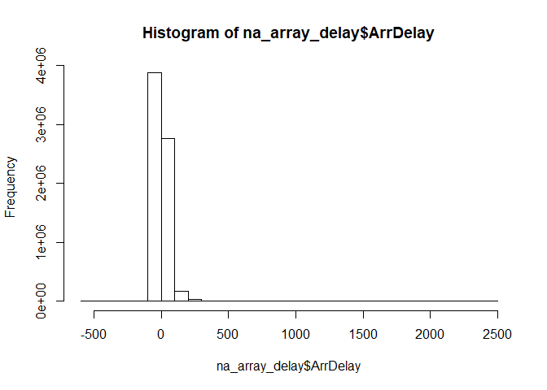
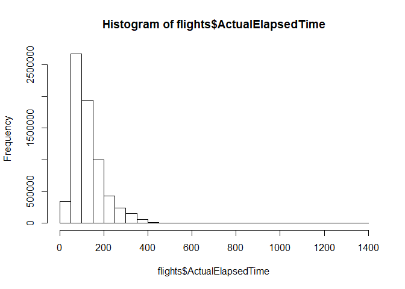
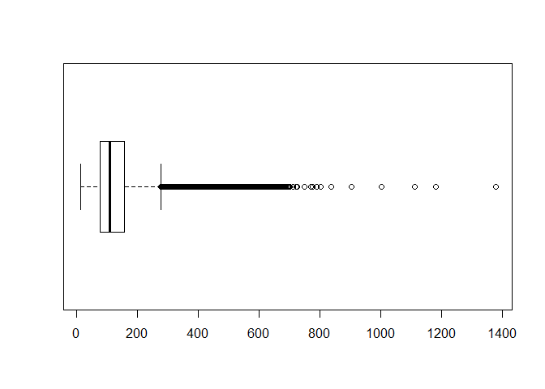
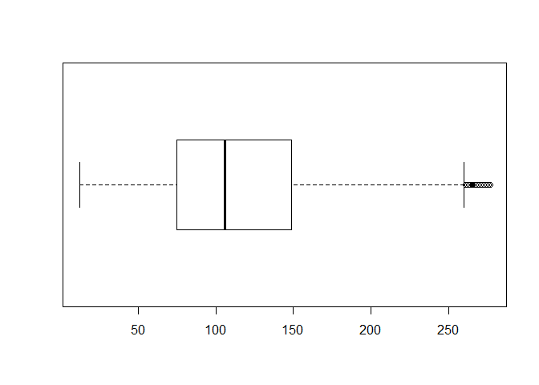
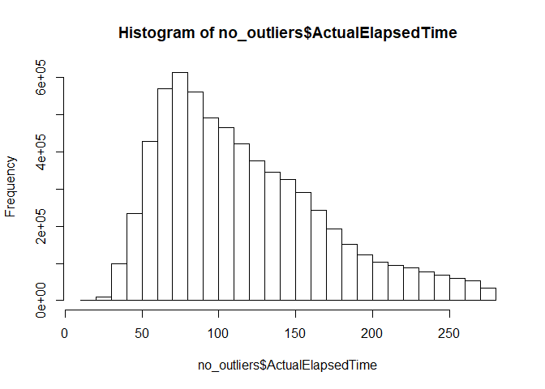

Managing datasets with dplyr
================

Índice
------

1.  [Select](#select)
2.  [Mutate](#mutate)
3.  [Filter](#filter)
4.  [Arrange](#arrange)
5.  [Summarise](#summarise)
6.  [Group By](#group-by)
7.  [Top\_n](#top_n)
8.  [Mutate\_If](#mutate_if)
9.  [Mutate\_At](#mutate_at)
10. [Trabajando con outliers](#trabajando-con-outliers)
11. [Valores nulos](#valores-nulos)
12. [Separate y Unite](#separate-y-unite)
13. [Spread y Gather](#spread-y-gather)
14. [Joins](#joins)
15. [Fechas](#fechas)

Importamos una tabla

``` r
flights <- readr::read_csv('data/flights/2008.csv', progress = FALSE)
```

    ## Parsed with column specification:
    ## cols(
    ##   .default = col_integer(),
    ##   UniqueCarrier = col_character(),
    ##   TailNum = col_character(),
    ##   Origin = col_character(),
    ##   Dest = col_character(),
    ##   CancellationCode = col_character()
    ## )

    ## See spec(...) for full column specifications.

Nombres de las columnas

``` r
names(flights)
```

    ##  [1] "Year"              "Month"             "DayofMonth"       
    ##  [4] "DayOfWeek"         "DepTime"           "CRSDepTime"       
    ##  [7] "ArrTime"           "CRSArrTime"        "UniqueCarrier"    
    ## [10] "FlightNum"         "TailNum"           "ActualElapsedTime"
    ## [13] "CRSElapsedTime"    "AirTime"           "ArrDelay"         
    ## [16] "DepDelay"          "Origin"            "Dest"             
    ## [19] "Distance"          "TaxiIn"            "TaxiOut"          
    ## [22] "Cancelled"         "CancellationCode"  "Diverted"         
    ## [25] "CarrierDelay"      "WeatherDelay"      "NASDelay"         
    ## [28] "SecurityDelay"     "LateAircraftDelay"

Cabecera

``` r
head(flights)
```

    ## # A tibble: 6 x 29
    ##    Year Month DayofMonth DayOfWeek DepTime CRSDepTime ArrTime CRSArrTime
    ##   <int> <int>      <int>     <int>   <int>      <int>   <int>      <int>
    ## 1  2008     1          3         4    2003       1955    2211       2225
    ## 2  2008     1          3         4     754        735    1002       1000
    ## 3  2008     1          3         4     628        620     804        750
    ## 4  2008     1          3         4     926        930    1054       1100
    ## 5  2008     1          3         4    1829       1755    1959       1925
    ## 6  2008     1          3         4    1940       1915    2121       2110
    ## # ... with 21 more variables: UniqueCarrier <chr>, FlightNum <int>,
    ## #   TailNum <chr>, ActualElapsedTime <int>, CRSElapsedTime <int>,
    ## #   AirTime <int>, ArrDelay <int>, DepDelay <int>, Origin <chr>,
    ## #   Dest <chr>, Distance <int>, TaxiIn <int>, TaxiOut <int>,
    ## #   Cancelled <int>, CancellationCode <chr>, Diverted <int>,
    ## #   CarrierDelay <int>, WeatherDelay <int>, NASDelay <int>,
    ## #   SecurityDelay <int>, LateAircraftDelay <int>

Dimensión

``` r
dim(flights)
```

    ## [1] 7009728      29

Descripción

``` r
summary(flights)
```

``` r
summary(flights$CarrierDelay)
```

    ##    Min. 1st Qu.  Median    Mean 3rd Qu.    Max.    NA's 
    ##       0       0       0      16      16    2436 5484993

Cargamos librerías para operar con tablas

``` r
library(dplyr)
```

    ## 
    ## Attaching package: 'dplyr'

    ## The following objects are masked from 'package:stats':
    ## 
    ##     filter, lag

    ## The following objects are masked from 'package:base':
    ## 
    ##     intersect, setdiff, setequal, union

``` r
library(tidyverse)
```

    ## -- Attaching packages -------------------------------------------------------------------------------------------- tidyverse 1.2.1 --

    ## v ggplot2 2.2.1     v readr   1.1.1
    ## v tibble  1.4.2     v purrr   0.2.5
    ## v tidyr   0.8.1     v stringr 1.3.1
    ## v ggplot2 2.2.1     v forcats 0.3.0

    ## -- Conflicts ----------------------------------------------------------------------------------------------- tidyverse_conflicts() --
    ## x dplyr::filter() masks stats::filter()
    ## x dplyr::lag()    masks stats::lag()

Extracción de una muestra:

``` r
sample_n(flights, 10)
```

    ## # A tibble: 10 x 29
    ##     Year Month DayofMonth DayOfWeek DepTime CRSDepTime ArrTime CRSArrTime
    ##    <int> <int>      <int>     <int>   <int>      <int>   <int>      <int>
    ##  1  2008     6         15         7    1414       1414    1457       1453
    ##  2  2008     7         23         3    1128       1130    1458       1459
    ##  3  2008     3         14         5    1719       1715    1839       1836
    ##  4  2008     1         23         3     701        711     853        919
    ##  5  2008     5          7         3    1055       1100    1211       1216
    ##  6  2008     4         13         7    1944       1945    2106       2122
    ##  7  2008     7         11         5     959       1000    1102       1120
    ##  8  2008     7          1         2    1115       1115    1403       1410
    ##  9  2008     7         30         3     951        946    1034       1040
    ## 10  2008     4          2         3    1242        600    1347        719
    ## # ... with 21 more variables: UniqueCarrier <chr>, FlightNum <int>,
    ## #   TailNum <chr>, ActualElapsedTime <int>, CRSElapsedTime <int>,
    ## #   AirTime <int>, ArrDelay <int>, DepDelay <int>, Origin <chr>,
    ## #   Dest <chr>, Distance <int>, TaxiIn <int>, TaxiOut <int>,
    ## #   Cancelled <int>, CancellationCode <chr>, Diverted <int>,
    ## #   CarrierDelay <int>, WeatherDelay <int>, NASDelay <int>,
    ## #   SecurityDelay <int>, LateAircraftDelay <int>

Select
======

Selecciona columnas de un dataframe

``` r
a <- select(flights, ActualElapsedTime, ArrDelay, DepDelay)
head(a)
```

    ## # A tibble: 6 x 3
    ##   ActualElapsedTime ArrDelay DepDelay
    ##               <int>    <int>    <int>
    ## 1               128      -14        8
    ## 2               128        2       19
    ## 3                96       14        8
    ## 4                88       -6       -4
    ## 5                90       34       34
    ## 6               101       11       25

Funciones de ayuda para seleccionar:

-   `starts_with(“X”)`: every name that starts with “X”
-   `ends_with(“X”)`: every name that ends with “X”
-   `contains(“X”)`: every name that contains “X”
-   `matches(“X”)`: every name that matches “X”, where “X” can be a regular expression
-   `num_range(“x”, 1:5)`: the variables named x01, x02, x03, x04 and x05
-   `one_of(x)`: every name that appears in x, which should be a character vector

``` r
select(flights, Origin:Cancelled)  # Cógeme todas las columnas entre esas dos
select(flights, -(DepTime:AirTime))  # Cógeme todas las columnas menos las que están entre esas dos
select(flights, UniqueCarrier, FlightNum, contains("Tail"), ends_with("Delay"))  # Ambas condiciones (or)
```

Mutate
======

Crea campos computados

``` r
foo <- mutate(flights, ActualGroundTime = ActualElapsedTime - AirTime)  # Creamos la columna ActualGroundTime
```

``` r
# Podemos combinar varias operaciones a la vez (crear varios campos a la vez)

foo <- mutate(flights, 
              loss = ArrDelay - DepDelay, 
              loss_percent = (loss/DepDelay) * 100 )  # Incluso aquí puedo usar la variable que he creado justo antes
```

Con la función recode podemos recodificar un campo:

``` r
flights %>% 
  mutate(CancellationCode = recode(CancellationCode, "A"="Carrier", "B"="Weather", "C"="National Air System", 
                                   .missing="Not available", 
                                   .default="Others" ))
```

Filter
======

-   `x < y`, TRUE if x is less than y
-   `x <= y`, TRUE if x is less than or equal to y
-   `x == y`, TRUE if x equals y
-   `x !=`y, TRUE if x does not equal y
-   `x >= y`, TRUE if x is greater than or equal to y
-   `x > y`, TRUE if x is greater than y
-   `x %in% c(a, b, c)`, TRUE if x is in the vector c(a, b, c)

``` r
filter(flights, Distance > 3000)
filter(flights, UniqueCarrier %in% c('AA', 'UA'))
filter(flights, TaxiIn + TaxiOut > AirTime)  # No hace falta hacer el mutate
filter(flights, DepDelay > 0 & ArrDelay < 0)
filter(flights, Cancelled == 1, DepDelay > 0)  # La coma es equivalente al &

# Para negaciones -> al principio

filter(flights, !UniqueCarrier %in% c('AA', 'UA'))
```

Arrange
=======

Ordena. Es un ORDER BY.

``` r
( cancelled <- select(flights, UniqueCarrier, Dest, Cancelled, CancellationCode, DepDelay, ArrDelay) )

( cancelled <- filter(cancelled, Cancelled == 1, !is.na(DepDelay)) )  # Cancelados y que no tengan nulos en DepDelay
```

``` r
arrange(cancelled, DepDelay)  # Ordena cancelled por DepDelay

arrange(cancelled, CancellationCode)

arrange(cancelled, UniqueCarrier, DepDelay)

arrange(cancelled, UniqueCarrier, desc(DepDelay))  # Descending

arrange(flights, DepDelay + ArrDelay)  # Podemos hacer operaciones dentro del arrange (como en el filter)

arrange(filter(flights, Dest == 'JFK'), desc(AirTime))
```

Summarise
=========

No es lo mismo que un GROUP BY. Aplicar un summarise es que me va a dar una sola fila con la media, mediana, etc... Esto será útil cuando lo juntemos con un groupby para que me obtenga esas magnitudes para grupos. Es la manera de agrupar en `dplyr`.

-   `min(x)` – minimum value of vector x.
-   `max(x)` – maximum value of vector x.
-   `mean(x)` – mean value of vector x.
-   `median(x)` – median value of vector x.
-   `quantile(x, p)` – pth quantile of vector x.
-   `sd(x)` – standard deviation of vector x.
-   `var(x)` – variance of vector x.
-   `IQR(x)` – Inter Quartile Range (IQR) of vector x.

-   `first(x)` - The first element of vector x.
-   `last(x)` - The last element of vector x.
-   `nth(x, n)` - The nth element of vector x.
-   `n()` - The number of rows in the data.frame or group of observations that summarise() describes.
-   `n_distinct(x)` - The number of unique values in vector x.

``` r
# Print out a summary with variables min_dist and max_dist
a <- summarize(flights, min_dist = min(Distance), max_dist = max(Distance))
head(a)
```

    ## # A tibble: 1 x 2
    ##   min_dist max_dist
    ##      <dbl>    <dbl>
    ## 1      11.    4962.

``` r
# Remove rows that have NA ArrDelay: temp1
na_array_delay <- filter(flights, !is.na(ArrDelay))

# Generate summary about ArrDelay column of temp1

df <- summarise(na_array_delay, 
                earliest = min(ArrDelay), 
                average = mean(ArrDelay), 
                latest = max(ArrDelay), 
                sd = sd(ArrDelay))

head(df)
```

    ## # A tibble: 1 x 4
    ##   earliest average latest    sd
    ##      <dbl>   <dbl>  <dbl> <dbl>
    ## 1    -519.    8.17  2461.  38.5

``` r
# Si hay NANs el summarize me va a dar error. Para eso, na.rm = True

df <- summarise(flights, 
                earliest = min(ArrDelay), 
                average = mean(ArrDelay), 
                latest = max(ArrDelay), 
                sd = sd(ArrDelay),
                na.rm = TRUE)
```

``` r
hist(na_array_delay$ArrDelay)
```



Group By
========

Con summarise sumarizo toda la tabla y obtengo medidas (mínimo, máximo, etc...) de las variables que yo quiero. Combinándolo con el group\_by, calcularé estas medidas pero de los grupos que yo defina.

``` r
group_by(flights, UniqueCarrier)
```

    ## # A tibble: 7,009,728 x 29
    ## # Groups:   UniqueCarrier [20]
    ##     Year Month DayofMonth DayOfWeek DepTime CRSDepTime ArrTime CRSArrTime
    ##    <int> <int>      <int>     <int>   <int>      <int>   <int>      <int>
    ##  1  2008     1          3         4    2003       1955    2211       2225
    ##  2  2008     1          3         4     754        735    1002       1000
    ##  3  2008     1          3         4     628        620     804        750
    ##  4  2008     1          3         4     926        930    1054       1100
    ##  5  2008     1          3         4    1829       1755    1959       1925
    ##  6  2008     1          3         4    1940       1915    2121       2110
    ##  7  2008     1          3         4    1937       1830    2037       1940
    ##  8  2008     1          3         4    1039       1040    1132       1150
    ##  9  2008     1          3         4     617        615     652        650
    ## 10  2008     1          3         4    1620       1620    1639       1655
    ## # ... with 7,009,718 more rows, and 21 more variables:
    ## #   UniqueCarrier <chr>, FlightNum <int>, TailNum <chr>,
    ## #   ActualElapsedTime <int>, CRSElapsedTime <int>, AirTime <int>,
    ## #   ArrDelay <int>, DepDelay <int>, Origin <chr>, Dest <chr>,
    ## #   Distance <int>, TaxiIn <int>, TaxiOut <int>, Cancelled <int>,
    ## #   CancellationCode <chr>, Diverted <int>, CarrierDelay <int>,
    ## #   WeatherDelay <int>, NASDelay <int>, SecurityDelay <int>,
    ## #   LateAircraftDelay <int>

``` r
# El group_by es lazy, al igual que en python. Lo combinaré con el summarise.
```

Para combinar estas operaciones: **piping**:

Con el símbolo `%>%` (Ctrl + Shift + M) encadenamos operaciones:

``` r
summarize(filter(mutate(flights, diff = TaxiOut - TaxiIn),!is.na(diff)), avg = mean(diff))

# vs

flights %>%
  mutate(diff=(TaxiOut-TaxiIn)) %>%
  filter(!is.na(diff)) %>%
  summarise(avg=mean(diff))
```

Por tanto, para hacer group by:

``` r
flights %>% 
  group_by(UniqueCarrier) %>% 
  summarise(n_flights = n(), 
            n_canc = sum(Cancelled), 
            p_canc = 100*n_canc/n_flights, 
            avg_delay = mean(ArrDelay, na.rm = TRUE)) %>% 
  arrange(avg_delay)
```

    ## # A tibble: 20 x 5
    ##    UniqueCarrier n_flights n_canc p_canc avg_delay
    ##    <chr>             <int>  <int>  <dbl>     <dbl>
    ##  1 AQ                 7800     42  0.538     -2.89
    ##  2 HA                61826    570  0.922      1.26
    ##  3 US               453589   6582  1.45       2.85
    ##  4 9E               262208   7100  2.71       4.11
    ##  5 AS               151102   2139  1.42       4.80
    ##  6 WN              1201754  12389  1.03       5.18
    ##  7 F9                95762    303  0.316      6.11
    ##  8 OO               567159  12436  2.19       6.60
    ##  9 NW               347652   2906  0.836      7.37
    ## 10 DL               451931   6813  1.51       7.86
    ## 11 FL               261684   2236  0.854      9.09
    ## 12 MQ               490693  18331  3.74       9.89
    ## 13 EV               280575   5026  1.79      10.2 
    ## 14 XE               374510   9992  2.67      10.6 
    ## 15 CO               298455   3702  1.24      11.0 
    ## 16 B6               196091   3205  1.63      11.1 
    ## 17 UA               449515  10541  2.34      11.3 
    ## 18 YV               254930   9219  3.62      11.8 
    ## 19 OH               197607   6462  3.27      11.8 
    ## 20 AA               604885  17440  2.88      12.6

``` r
# Obtengo las variables del summarise para cada grupo.
```

``` r
# Por ejemplo, para sacar un ranking:

rank(c(21, 22, 24, 23))  # Te saca un ranking
```

    ## [1] 1 2 4 3

``` r
flights %>% 
  filter(!is.na(ArrDelay)) %>%  # Quita retrasos
  group_by(UniqueCarrier) %>%  # Agrupa por compañia. EL groupby es lazy como en python
  summarise(p_delay = sum(ArrDelay >0)/n()) %>%  # Este n() es cada n de cada compañía
  mutate(rank = rank(p_delay)) %>% 
  arrange(rank) 
```

    ## # A tibble: 20 x 3
    ##    UniqueCarrier p_delay  rank
    ##    <chr>           <dbl> <dbl>
    ##  1 AQ              0.246    1.
    ##  2 HA              0.306    2.
    ##  3 9E              0.356    3.
    ##  4 US              0.376    4.
    ##  5 WN              0.396    5.
    ##  6 OO              0.396    6.
    ##  7 AS              0.419    7.
    ##  8 B6              0.433    8.
    ##  9 MQ              0.437    9.
    ## 10 EV              0.447   10.
    ## 11 XE              0.447   11.
    ## 12 YV              0.453   12.
    ## 13 FL              0.455   13.
    ## 14 UA              0.458   14.
    ## 15 NW              0.461   15.
    ## 16 DL              0.471   16.
    ## 17 CO              0.482   17.
    ## 18 F9              0.491   18.
    ## 19 AA              0.501   19.
    ## 20 OH              0.504   20.

Top\_n
======

``` r
flights %>% 
  group_by(UniqueCarrier) %>% 
  top_n(2, ArrDelay) %>%  # Me coge el top 2 de ArrDelay
  select(UniqueCarrier,Dest, ArrDelay) %>% 
  arrange(desc(UniqueCarrier))
```

    ## # A tibble: 40 x 3
    ## # Groups:   UniqueCarrier [20]
    ##    UniqueCarrier Dest  ArrDelay
    ##    <chr>         <chr>    <int>
    ##  1 YV            IAD        606
    ##  2 YV            DEN        604
    ##  3 XE            EWR        838
    ##  4 XE            IAH        781
    ##  5 WN            DEN        677
    ##  6 WN            SAN        702
    ##  7 US            PHL        876
    ##  8 US            LAS        749
    ##  9 UA            HNL       1267
    ## 10 UA            LAX       1322
    ## # ... with 30 more rows

Mutate\_if
==========

Me realiza una transformación con una condición:

``` r
flights %>% 
  mutate_if(is.character, str_to_lower)

# A las columnas que son de tipo caracter, ponlas en minúsculas
```

Mutate\_at
==========

Me permite hacer una transformación sobre las columnas que yo quiera (eligiéndolas como en un select):

``` r
foo <- flights %>% 
  head %>% 
  select(contains("Delay")) %>%   # Se queda con las columnas que contienen Delay
  mutate_at(vars(ends_with("Delay")), funs(./2))   
# le digo que sobre las variables que terminen en delay y le aplicas funs (divídelas entre dos)
# El . es un comodín porque funs tiene como argumento el objeto al que le aplico la función, pero como ya se lo estoy diciendo con el pipe, pongo un '.'
```

Trabajando con outliers
=======================

``` r
# Gestionaremos los outliers de la variable ActualElapsedTime.
summary(flights$ActualElapsedTime)
```

    ##    Min. 1st Qu.  Median    Mean 3rd Qu.    Max.    NA's 
    ##    12.0    77.0   110.0   127.3   157.0  1379.0  154699

``` r
hist(flights$ActualElapsedTime)  # Vemos en el histograma que hay outliers
```



``` r
boxplot(flights$ActualElapsedTime,horizontal = TRUE)
```



``` r
# Esto nos devuelve una lista de outliers en base al criterio del boxplot
outliers <- boxplot.stats(flights$ActualElapsedTime)$out
length(outliers)
```

    ## [1] 333184

``` r
no_outliers <- flights %>% 
  filter(!ActualElapsedTime %in% outliers) 
```

``` r
boxplot(no_outliers$ActualElapsedTime,horizontal = TRUE)
```



``` r
hist(no_outliers$ActualElapsedTime)
```



Valores nulos
=============

Eliminar todas las filas con algún NA

``` r
# Manera 1

flights %>% na.omit

# Manera 2

flights %>% filter(complete.cases(.)) 

# Manera 3

library(tidyr) # para drop_na()
flights %>% drop_na()
```

Eliminar todos los NA de una variable o un conjunto de variables

``` r
flights %>% 
  drop_na(ends_with("Delay"))
```

Sustitución de NAs:

``` r
# Sustituir por cero
flights %>% 
  mutate(DepTime = coalesce(DepTime, 0L))  # Esto me pone DepTime a 0 en los missings (lo del L es para que sea integer)


# Sustituir por el valor de otra columna en ese mismo registro
flights %>% 
  mutate(DepTime = coalesce(DepTime, CRSDepTime))  #  Ponle el valor de otra columna


# Sustituir un valor raro por un NA
foo <- flights %>% 
  mutate(CancellationCode = na_if(CancellationCode, "A"))  # Sustituyo 'A' por NA
```

Separate y Unite
================

Separate: Separa una columna en varias:

``` r
flights %>% select(TailNum) %>% 
  separate(TailNum, into = c('T1', 'T2'), sep = "2")
```

    ## Warning: Expected 2 pieces. Additional pieces discarded in 216895 rows [25,
    ## 51, 53, 114, 138, 146, 167, 175, 177, 181, 193, 214, 218, 311, 337, 349,
    ## 351, 370, 372, 386, ...].

    ## Warning: Expected 2 pieces. Missing pieces filled with `NA` in 4956800 rows
    ## [5, 7, 9, 10, 11, 12, 13, 14, 18, 19, 20, 21, 23, 24, 26, 29, 31, 32, 33,
    ## 35, ...].

    ## # A tibble: 7,009,728 x 2
    ##    T1     T2   
    ##    <chr>  <chr>
    ##  1 N71    SW   
    ##  2 N77    SW   
    ##  3 N4     8WN  
    ##  4 N61    SW   
    ##  5 N464WN <NA> 
    ##  6 N7     6SW  
    ##  7 N763SW <NA> 
    ##  8 N4     8WN  
    ##  9 N689SW <NA> 
    ## 10 N648SW <NA> 
    ## # ... with 7,009,718 more rows

``` r
# Separa TailNum en dos columnas T1 y T2 con el separador '2'
```

Unite: Une dos o más columnas

``` r
flights %>% 
  head(20) %>% 
  unite("code", UniqueCarrier, TailNum, sep = "-")  # Esto es igual que un paste, solo que el paste he de meterlo en un mutate. El equivalente de paste en tuberías es el unite
```

Spread y gather
===============

Spread: me coge un conjunto de datos en formato largo y me lo pone en formato ancho.

Gather: lo contrario

``` r
flights %>% 
  group_by(Origin, Dest) %>% 
  summarise(n = n()) %>% 
  arrange(-n) %>%   # Ordena descendentemente
  spread(Origin, n) %>%  # Me crea una columna con cada origen
  gather("Origin", "n", 2:ncol(.)) %>%  # Créame una columna Origin y otra n con las columnas que hay desde la posición 2 hasta el final
  arrange(-n) 
```

Joins
=====

``` r
# Importamos dos tablas:

airlines <- readr::read_csv('data/airlines.csv', progress = FALSE)
```

    ## Parsed with column specification:
    ## cols(
    ##   Code = col_character(),
    ##   Description = col_character()
    ## )

``` r
airports <- readr::read_csv('data/airports.csv', progress = FALSE)
```

    ## Parsed with column specification:
    ## cols(
    ##   iata = col_character(),
    ##   airport = col_character(),
    ##   city = col_character(),
    ##   state = col_character(),
    ##   country = col_character(),
    ##   lat = col_double(),
    ##   long = col_double()
    ## )

Chequear si hay duplicados en un campo:

``` r
airports %>% 
  count(iata) %>% 
  filter(n > 1)
```

    ## # A tibble: 0 x 2
    ## # ... with 2 variables: iata <chr>, n <int>

``` r
# Nos devuelve 0 -> OK
```

``` r
flights2 <- flights %>% 
  select(Origin, Dest, TailNum, UniqueCarrier, DepDelay)

# Top delayed flight by airline
flights2 %>% 
  group_by(UniqueCarrier) %>%
  top_n(1, DepDelay) %>% 
  left_join(airlines, by = c("UniqueCarrier" = "Code"))
```

    ## # A tibble: 21 x 6
    ## # Groups:   UniqueCarrier [?]
    ##    Origin Dest  TailNum UniqueCarrier DepDelay Description                
    ##    <chr>  <chr> <chr>   <chr>            <int> <chr>                      
    ##  1 TUL    EWR   N17108  XE                 859 ExpressJet Airlines Inc. (~
    ##  2 MCO    PHL   N205UW  US                 886 US Airways Inc.            
    ##  3 ATW    ATL   N877AS  EV                 965 ExpressJet Airlines Inc.   
    ##  4 SAN    OGG   N748AL  AQ                 336 Aloha Airlines Inc.        
    ##  5 HNL    LAX   N21108  CO                1011 Continental Air Lines Inc. 
    ##  6 MDT    IAD   N715SF  YV                 607 Mesa Airlines Inc.         
    ##  7 SGF    CVG   N918CA  OH                 960 PSA Airlines Inc.          
    ##  8 RFD    DEN   N915SW  OO                 996 SkyWest Airlines Inc.      
    ##  9 LGA    MIA   N3CDAA  AA                1521 American Airlines Inc.     
    ## 10 LAS    PDX   N612AS  AS                 947 Alaska Airlines Inc.       
    ## # ... with 11 more rows

-   inner\_join(x, y) SELECT \* FROM x INNER JOIN y USING (z)
-   left\_join(x, y) SELECT \* FROM x LEFT OUTER JOIN y USING (z)
-   right\_join(x, y, by = "z") SELECT \* FROM x RIGHT OUTER JOIN y USING (z)
-   full\_join(x, y, by = "z") SELECT \* FROM x FULL OUTER JOIN y USING (z)

-   semi\_join(x, y)
-   anti\_join(x, y)

<https://www.rdocumentation.org/packages/dplyr/versions/0.7.5/topics/join>

Fechas
======

Convertir un string a fecha:

``` r
as.POSIXct("2013-09-06", format="%Y-%m-%d")
```

    ## [1] "2013-09-06 CEST"

``` r
as.POSIXct("2013-09-06 12:30", format="%Y-%m-%d %H:%M")
```

    ## [1] "2013-09-06 12:30:00 CEST"

``` r
typeof(as.POSIXct("2013-09-06", format="%Y-%m-%d"))
```

    ## [1] "double"

``` r
# En format le indico el formato en el que está la fecha de entrada
```

Convertir una fecha a un string:

``` r
date <- as.POSIXct("2013-09-06", format="%Y-%m-%d")

date_string <- as.character(date)

typeof(date_string)
```

    ## [1] "character"

Para ayuda con los formatos de fechas y horas ver:

<https://docs.python.org/2/library/datetime.html>

Para más operaciones con fechas -&gt; librería `lubridate`:

``` r
library(lubridate)
```

    ## 
    ## Attaching package: 'lubridate'

    ## The following object is masked from 'package:base':
    ## 
    ##     date

``` r
today()
```

    ## [1] "2018-06-24"

``` r
now()
```

    ## [1] "2018-06-24 13:11:51 CEST"

``` r
(datetime1 <- ymd_hms(now(), tz = "UTC"))
```

    ## [1] "2018-06-24 13:11:51 UTC"

``` r
(datetime2 <- ymd_hms(now(), tz = 'Europe/Madrid'))
```

    ## [1] "2018-06-24 13:11:51 CEST"

``` r
datetime1
```

    ## [1] "2018-06-24 13:11:51 UTC"

``` r
datetime2
```

    ## [1] "2018-06-24 13:11:51 CEST"

``` r
datetime <- ymd_hms(now(), tz = "UTC")

year(datetime)
```

    ## [1] 2018

``` r
month(datetime)
```

    ## [1] 6

``` r
mday(datetime)
```

    ## [1] 24

``` r
ymd_hm("2013-09-06 12:03")
```

    ## [1] "2013-09-06 12:03:00 UTC"
