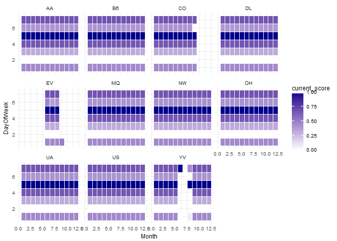

Data modeling with dplyr and SQL
================

En este ejemplo crearemos un modelo de regresión lineal para predecir el retraso de los aviones en función de una serie de características. Lo haremos a través de una base de datos con SQLite.

Inicializamos librerías:

``` r
list.of.packages <- c("dplyr","ggplot2", "scales", "tibble", "foreach", "dbplyr", "broom", "DBI", "lubridate")
new.packages <- list.of.packages[!(list.of.packages %in% installed.packages()[,"Package"])]
if(length(new.packages)) install.packages(new.packages)

# devtools::install_github("edgararuiz/tidypredict")
library(tidypredict)

library(ggplot2)
library(scales)
library(tibble)
library(dbplyr)
library(dplyr)
```

    ## 
    ## Attaching package: 'dplyr'

    ## The following objects are masked from 'package:dbplyr':
    ## 
    ##     ident, sql

    ## The following objects are masked from 'package:stats':
    ## 
    ##     filter, lag

    ## The following objects are masked from 'package:base':
    ## 
    ##     intersect, setdiff, setequal, union

Cargamos el dataset de vuelos y lo modificamos:

``` r
# Inicializo campo current_score a 0 y pongo un id a cada registro

flights_table <- readr::read_csv('data/flights/2008.csv', progress = FALSE) %>% 
  mutate(current_score = 0) %>%
  rowid_to_column("flight_id")
```

    ## Parsed with column specification:
    ## cols(
    ##   .default = col_integer(),
    ##   UniqueCarrier = col_character(),
    ##   TailNum = col_character(),
    ##   Origin = col_character(),
    ##   Dest = col_character(),
    ##   CancellationCode = col_character()
    ## )

    ## See spec(...) for full column specifications.

Trabajaremos como si de una base de datos se tratara:

``` r
# Let's simulate we are using a data base backend
library(DBI)
con <- dbConnect(RSQLite::SQLite(), path = ":memory:")  # Creamos la conexión en memoria
db_fligths <- copy_to(con,flights_table )  # Copiamos la tabla
rm(flights_table)  # Borramos la tabla anterior
```

Escribimos una query con `dplyr` para quedarnos con las columnas que nos interesan:

``` r
query <- db_fligths %>%
  mutate(DayOfWeek = as.character(DayOfWeek), 
         Month = as.character(Month)) %>% 
  select(DepDelay, Month, DayOfWeek, UniqueCarrier, Distance) 
```

Esta query se puede traducir a SQL con `dplyr`:

``` r
query %>% 
  show_query()
```

    ## <SQL>
    ## SELECT `DepDelay`, `Month`, `DayOfWeek`, `UniqueCarrier`, `Distance`
    ## FROM (SELECT `flight_id`, `Year`, CAST(`Month` AS TEXT) AS `Month`, `DayofMonth`, CAST(`DayOfWeek` AS TEXT) AS `DayOfWeek`, `DepTime`, `CRSDepTime`, `ArrTime`, `CRSArrTime`, `UniqueCarrier`, `FlightNum`, `TailNum`, `ActualElapsedTime`, `CRSElapsedTime`, `AirTime`, `ArrDelay`, `DepDelay`, `Origin`, `Dest`, `Distance`, `TaxiIn`, `TaxiOut`, `Cancelled`, `CancellationCode`, `Diverted`, `CarrierDelay`, `WeatherDelay`, `NASDelay`, `SecurityDelay`, `LateAircraftDelay`, `current_score`
    ## FROM `flights_table`)

Lanzamos la query sobre la tabla:

``` r
flights <- query %>%
  collect() 
```

Cogemos una muestra de 10.000 vuelos:

``` r
flights <- flights %>% sample_n(10000) 
```

Creamos un modelo de regresión lineal en el que explicamos el retraso en función del resto de variables:

``` r
model <- lm(DepDelay ~ ., data = flights)
summary(model)
```

    ## 
    ## Call:
    ## lm(formula = DepDelay ~ ., data = flights)
    ## 
    ## Residuals:
    ##    Min     1Q Median     3Q    Max 
    ## -36.11 -14.83  -9.28  -1.12 484.50 
    ## 
    ## Coefficients:
    ##                   Estimate Std. Error t value Pr(>|t|)    
    ## (Intercept)      1.033e+01  2.258e+00   4.574 4.85e-06 ***
    ## Month10         -9.315e+00  1.695e+00  -5.496 3.99e-08 ***
    ## Month11         -9.868e+00  1.684e+00  -5.859 4.82e-09 ***
    ## Month12          2.481e+00  1.696e+00   1.463  0.14340    
    ## Month2           3.312e-01  1.686e+00   0.196  0.84431    
    ## Month3          -1.615e+00  1.650e+00  -0.979  0.32762    
    ## Month4          -3.473e+00  1.654e+00  -2.099  0.03582 *  
    ## Month5          -6.648e+00  1.661e+00  -4.001 6.34e-05 ***
    ## Month6           2.152e+00  1.671e+00   1.288  0.19768    
    ## Month7          -3.659e+00  1.646e+00  -2.223  0.02625 *  
    ## Month8          -5.272e+00  1.645e+00  -3.206  0.00135 ** 
    ## Month9          -9.954e+00  1.677e+00  -5.936 3.02e-09 ***
    ## DayOfWeek2      -2.502e+00  1.250e+00  -2.002  0.04530 *  
    ## DayOfWeek3      -7.410e-01  1.244e+00  -0.595  0.55155    
    ## DayOfWeek4       1.166e+00  1.244e+00   0.938  0.34835    
    ## DayOfWeek5       3.050e+00  1.262e+00   2.416  0.01569 *  
    ## DayOfWeek6      -2.223e-01  1.317e+00  -0.169  0.86595    
    ## DayOfWeek7       1.219e+00  1.257e+00   0.970  0.33216    
    ## UniqueCarrierAA  2.606e+00  2.134e+00   1.221  0.22201    
    ## UniqueCarrierAQ -1.364e+01  1.285e+01  -1.061  0.28857    
    ## UniqueCarrierAS -2.490e+00  3.057e+00  -0.815  0.41525    
    ## UniqueCarrierB6  6.167e+00  2.709e+00   2.276  0.02286 *  
    ## UniqueCarrierCO  5.095e+00  2.432e+00   2.095  0.03623 *  
    ## UniqueCarrierDL  3.616e-01  2.211e+00   0.164  0.87013    
    ## UniqueCarrierEV  4.042e+00  2.378e+00   1.700  0.08912 .  
    ## UniqueCarrierF9 -5.046e+00  3.452e+00  -1.462  0.14381    
    ## UniqueCarrierFL  2.228e+00  2.429e+00   0.917  0.35906    
    ## UniqueCarrierHA -4.718e+00  4.251e+00  -1.110  0.26710    
    ## UniqueCarrierMQ  2.648e+00  2.186e+00   1.211  0.22583    
    ## UniqueCarrierNW  9.265e-03  2.301e+00   0.004  0.99679    
    ## UniqueCarrierOH  2.282e+00  2.691e+00   0.848  0.39646    
    ## UniqueCarrierOO  7.197e-01  2.104e+00   0.342  0.73228    
    ## UniqueCarrierUA  6.764e+00  2.228e+00   3.036  0.00241 ** 
    ## UniqueCarrierUS -1.372e+00  2.208e+00  -0.621  0.53431    
    ## UniqueCarrierWN  2.540e+00  1.916e+00   1.325  0.18506    
    ## UniqueCarrierXE  3.873e+00  2.284e+00   1.696  0.08999 .  
    ## UniqueCarrierYV  7.254e+00  2.526e+00   2.872  0.00409 ** 
    ## Distance         1.177e-03  6.705e-04   1.755  0.07921 .  
    ## ---
    ## Signif. codes:  0 '***' 0.001 '**' 0.01 '*' 0.05 '.' 0.1 ' ' 1
    ## 
    ## Residual standard error: 33.57 on 9777 degrees of freedom
    ##   (185 observations deleted due to missingness)
    ## Multiple R-squared:  0.02445,    Adjusted R-squared:  0.02076 
    ## F-statistic: 6.622 on 37 and 9777 DF,  p-value: < 2.2e-16

Con tidypredict obtenemos los valores predichos mediante una query en SQL:

``` r
tidypredict_sql(model, con = con)
```

    ## <SQL> 10.3265255919861 + (CASE WHEN (`Month` = '10') THEN (1.0) WHEN NOT(`Month` = '10') THEN (0.0) END) * (-9.31474493139323) + (CASE WHEN (`Month` = '11') THEN (1.0) WHEN NOT(`Month` = '11') THEN (0.0) END) * (-9.8678358162501) + (CASE WHEN (`Month` = '12') THEN (1.0) WHEN NOT(`Month` = '12') THEN (0.0) END) * (2.4814394672484) + (CASE WHEN (`Month` = '2') THEN (1.0) WHEN NOT(`Month` = '2') THEN (0.0) END) * (0.331169173002202) + (CASE WHEN (`Month` = '3') THEN (1.0) WHEN NOT(`Month` = '3') THEN (0.0) END) * (-1.61487410568948) + (CASE WHEN (`Month` = '4') THEN (1.0) WHEN NOT(`Month` = '4') THEN (0.0) END) * (-3.47270633767459) + (CASE WHEN (`Month` = '5') THEN (1.0) WHEN NOT(`Month` = '5') THEN (0.0) END) * (-6.64793607329342) + (CASE WHEN (`Month` = '6') THEN (1.0) WHEN NOT(`Month` = '6') THEN (0.0) END) * (2.15224111414812) + (CASE WHEN (`Month` = '7') THEN (1.0) WHEN NOT(`Month` = '7') THEN (0.0) END) * (-3.65860548127744) + (CASE WHEN (`Month` = '8') THEN (1.0) WHEN NOT(`Month` = '8') THEN (0.0) END) * (-5.27169294194216) + (CASE WHEN (`Month` = '9') THEN (1.0) WHEN NOT(`Month` = '9') THEN (0.0) END) * (-9.95370597710053) + (CASE WHEN (`DayOfWeek` = '2') THEN (1.0) WHEN NOT(`DayOfWeek` = '2') THEN (0.0) END) * (-2.50209017322661) + (CASE WHEN (`DayOfWeek` = '3') THEN (1.0) WHEN NOT(`DayOfWeek` = '3') THEN (0.0) END) * (-0.740996641804862) + (CASE WHEN (`DayOfWeek` = '4') THEN (1.0) WHEN NOT(`DayOfWeek` = '4') THEN (0.0) END) * (1.16649791643227) + (CASE WHEN (`DayOfWeek` = '5') THEN (1.0) WHEN NOT(`DayOfWeek` = '5') THEN (0.0) END) * (3.04981223791036) + (CASE WHEN (`DayOfWeek` = '6') THEN (1.0) WHEN NOT(`DayOfWeek` = '6') THEN (0.0) END) * (-0.222333501072236) + (CASE WHEN (`DayOfWeek` = '7') THEN (1.0) WHEN NOT(`DayOfWeek` = '7') THEN (0.0) END) * (1.21914238011508) + (CASE WHEN (`UniqueCarrier` = 'AA') THEN (1.0) WHEN NOT(`UniqueCarrier` = 'AA') THEN (0.0) END) * (2.60626998229671) + (CASE WHEN (`UniqueCarrier` = 'AQ') THEN (1.0) WHEN NOT(`UniqueCarrier` = 'AQ') THEN (0.0) END) * (-13.6396668184784) + (CASE WHEN (`UniqueCarrier` = 'AS') THEN (1.0) WHEN NOT(`UniqueCarrier` = 'AS') THEN (0.0) END) * (-2.49024364734545) + (CASE WHEN (`UniqueCarrier` = 'B6') THEN (1.0) WHEN NOT(`UniqueCarrier` = 'B6') THEN (0.0) END) * (6.16710897335611) + (CASE WHEN (`UniqueCarrier` = 'CO') THEN (1.0) WHEN NOT(`UniqueCarrier` = 'CO') THEN (0.0) END) * (5.09516465396698) + (CASE WHEN (`UniqueCarrier` = 'DL') THEN (1.0) WHEN NOT(`UniqueCarrier` = 'DL') THEN (0.0) END) * (0.361561785692948) + (CASE WHEN (`UniqueCarrier` = 'EV') THEN (1.0) WHEN NOT(`UniqueCarrier` = 'EV') THEN (0.0) END) * (4.04242277335982) + (CASE WHEN (`UniqueCarrier` = 'F9') THEN (1.0) WHEN NOT(`UniqueCarrier` = 'F9') THEN (0.0) END) * (-5.04636158230813) + (CASE WHEN (`UniqueCarrier` = 'FL') THEN (1.0) WHEN NOT(`UniqueCarrier` = 'FL') THEN (0.0) END) * (2.22804474476187) + (CASE WHEN (`UniqueCarrier` = 'HA') THEN (1.0) WHEN NOT(`UniqueCarrier` = 'HA') THEN (0.0) END) * (-4.71833167189124) + (CASE WHEN (`UniqueCarrier` = 'MQ') THEN (1.0) WHEN NOT(`UniqueCarrier` = 'MQ') THEN (0.0) END) * (2.64833998054401) + (CASE WHEN (`UniqueCarrier` = 'NW') THEN (1.0) WHEN NOT(`UniqueCarrier` = 'NW') THEN (0.0) END) * (0.00926510206118477) + (CASE WHEN (`UniqueCarrier` = 'OH') THEN (1.0) WHEN NOT(`UniqueCarrier` = 'OH') THEN (0.0) END) * (2.28178788929343) + (CASE WHEN (`UniqueCarrier` = 'OO') THEN (1.0) WHEN NOT(`UniqueCarrier` = 'OO') THEN (0.0) END) * (0.71971364938242) + (CASE WHEN (`UniqueCarrier` = 'UA') THEN (1.0) WHEN NOT(`UniqueCarrier` = 'UA') THEN (0.0) END) * (6.76447345518279) + (CASE WHEN (`UniqueCarrier` = 'US') THEN (1.0) WHEN NOT(`UniqueCarrier` = 'US') THEN (0.0) END) * (-1.37200904218305) + (CASE WHEN (`UniqueCarrier` = 'WN') THEN (1.0) WHEN NOT(`UniqueCarrier` = 'WN') THEN (0.0) END) * (2.54001596343228) + (CASE WHEN (`UniqueCarrier` = 'XE') THEN (1.0) WHEN NOT(`UniqueCarrier` = 'XE') THEN (0.0) END) * (3.87337976731032) + (CASE WHEN (`UniqueCarrier` = 'YV') THEN (1.0) WHEN NOT(`UniqueCarrier` = 'YV') THEN (0.0) END) * (7.25388581912536) + (`Distance`) * (0.00117704360915695)

Y calculamos los valores predichos mediante otra query:

``` r
update_statement <- build_sql("UPDATE flights_table SET current_score  = ", tidypredict_sql(model, con = con), con = con)
update_statement
```

    ## <SQL> UPDATE flights_table SET current_score  = 10.3265255919861 + (CASE WHEN (`Month` = '10') THEN (1.0) WHEN NOT(`Month` = '10') THEN (0.0) END) * (-9.31474493139323) + (CASE WHEN (`Month` = '11') THEN (1.0) WHEN NOT(`Month` = '11') THEN (0.0) END) * (-9.8678358162501) + (CASE WHEN (`Month` = '12') THEN (1.0) WHEN NOT(`Month` = '12') THEN (0.0) END) * (2.4814394672484) + (CASE WHEN (`Month` = '2') THEN (1.0) WHEN NOT(`Month` = '2') THEN (0.0) END) * (0.331169173002202) + (CASE WHEN (`Month` = '3') THEN (1.0) WHEN NOT(`Month` = '3') THEN (0.0) END) * (-1.61487410568948) + (CASE WHEN (`Month` = '4') THEN (1.0) WHEN NOT(`Month` = '4') THEN (0.0) END) * (-3.47270633767459) + (CASE WHEN (`Month` = '5') THEN (1.0) WHEN NOT(`Month` = '5') THEN (0.0) END) * (-6.64793607329342) + (CASE WHEN (`Month` = '6') THEN (1.0) WHEN NOT(`Month` = '6') THEN (0.0) END) * (2.15224111414812) + (CASE WHEN (`Month` = '7') THEN (1.0) WHEN NOT(`Month` = '7') THEN (0.0) END) * (-3.65860548127744) + (CASE WHEN (`Month` = '8') THEN (1.0) WHEN NOT(`Month` = '8') THEN (0.0) END) * (-5.27169294194216) + (CASE WHEN (`Month` = '9') THEN (1.0) WHEN NOT(`Month` = '9') THEN (0.0) END) * (-9.95370597710053) + (CASE WHEN (`DayOfWeek` = '2') THEN (1.0) WHEN NOT(`DayOfWeek` = '2') THEN (0.0) END) * (-2.50209017322661) + (CASE WHEN (`DayOfWeek` = '3') THEN (1.0) WHEN NOT(`DayOfWeek` = '3') THEN (0.0) END) * (-0.740996641804862) + (CASE WHEN (`DayOfWeek` = '4') THEN (1.0) WHEN NOT(`DayOfWeek` = '4') THEN (0.0) END) * (1.16649791643227) + (CASE WHEN (`DayOfWeek` = '5') THEN (1.0) WHEN NOT(`DayOfWeek` = '5') THEN (0.0) END) * (3.04981223791036) + (CASE WHEN (`DayOfWeek` = '6') THEN (1.0) WHEN NOT(`DayOfWeek` = '6') THEN (0.0) END) * (-0.222333501072236) + (CASE WHEN (`DayOfWeek` = '7') THEN (1.0) WHEN NOT(`DayOfWeek` = '7') THEN (0.0) END) * (1.21914238011508) + (CASE WHEN (`UniqueCarrier` = 'AA') THEN (1.0) WHEN NOT(`UniqueCarrier` = 'AA') THEN (0.0) END) * (2.60626998229671) + (CASE WHEN (`UniqueCarrier` = 'AQ') THEN (1.0) WHEN NOT(`UniqueCarrier` = 'AQ') THEN (0.0) END) * (-13.6396668184784) + (CASE WHEN (`UniqueCarrier` = 'AS') THEN (1.0) WHEN NOT(`UniqueCarrier` = 'AS') THEN (0.0) END) * (-2.49024364734545) + (CASE WHEN (`UniqueCarrier` = 'B6') THEN (1.0) WHEN NOT(`UniqueCarrier` = 'B6') THEN (0.0) END) * (6.16710897335611) + (CASE WHEN (`UniqueCarrier` = 'CO') THEN (1.0) WHEN NOT(`UniqueCarrier` = 'CO') THEN (0.0) END) * (5.09516465396698) + (CASE WHEN (`UniqueCarrier` = 'DL') THEN (1.0) WHEN NOT(`UniqueCarrier` = 'DL') THEN (0.0) END) * (0.361561785692948) + (CASE WHEN (`UniqueCarrier` = 'EV') THEN (1.0) WHEN NOT(`UniqueCarrier` = 'EV') THEN (0.0) END) * (4.04242277335982) + (CASE WHEN (`UniqueCarrier` = 'F9') THEN (1.0) WHEN NOT(`UniqueCarrier` = 'F9') THEN (0.0) END) * (-5.04636158230813) + (CASE WHEN (`UniqueCarrier` = 'FL') THEN (1.0) WHEN NOT(`UniqueCarrier` = 'FL') THEN (0.0) END) * (2.22804474476187) + (CASE WHEN (`UniqueCarrier` = 'HA') THEN (1.0) WHEN NOT(`UniqueCarrier` = 'HA') THEN (0.0) END) * (-4.71833167189124) + (CASE WHEN (`UniqueCarrier` = 'MQ') THEN (1.0) WHEN NOT(`UniqueCarrier` = 'MQ') THEN (0.0) END) * (2.64833998054401) + (CASE WHEN (`UniqueCarrier` = 'NW') THEN (1.0) WHEN NOT(`UniqueCarrier` = 'NW') THEN (0.0) END) * (0.00926510206118477) + (CASE WHEN (`UniqueCarrier` = 'OH') THEN (1.0) WHEN NOT(`UniqueCarrier` = 'OH') THEN (0.0) END) * (2.28178788929343) + (CASE WHEN (`UniqueCarrier` = 'OO') THEN (1.0) WHEN NOT(`UniqueCarrier` = 'OO') THEN (0.0) END) * (0.71971364938242) + (CASE WHEN (`UniqueCarrier` = 'UA') THEN (1.0) WHEN NOT(`UniqueCarrier` = 'UA') THEN (0.0) END) * (6.76447345518279) + (CASE WHEN (`UniqueCarrier` = 'US') THEN (1.0) WHEN NOT(`UniqueCarrier` = 'US') THEN (0.0) END) * (-1.37200904218305) + (CASE WHEN (`UniqueCarrier` = 'WN') THEN (1.0) WHEN NOT(`UniqueCarrier` = 'WN') THEN (0.0) END) * (2.54001596343228) + (CASE WHEN (`UniqueCarrier` = 'XE') THEN (1.0) WHEN NOT(`UniqueCarrier` = 'XE') THEN (0.0) END) * (3.87337976731032) + (CASE WHEN (`UniqueCarrier` = 'YV') THEN (1.0) WHEN NOT(`UniqueCarrier` = 'YV') THEN (0.0) END) * (7.25388581912536) + (`Distance`) * (0.00117704360915695)

``` r
dbSendQuery(con, update_statement)
```

    ## <SQLiteResult>
    ##   SQL  UPDATE flights_table SET current_score  = 10.3265255919861 + (CASE WHEN (`Month` = '10') THEN (1.0) WHEN NOT(`Month` = '10') THEN (0.0) END) * (-9.31474493139323) + (CASE WHEN (`Month` = '11') THEN (1.0) WHEN NOT(`Month` = '11') THEN (0.0) END) * (-9.8678358162501) + (CASE WHEN (`Month` = '12') THEN (1.0) WHEN NOT(`Month` = '12') THEN (0.0) END) * (2.4814394672484) + (CASE WHEN (`Month` = '2') THEN (1.0) WHEN NOT(`Month` = '2') THEN (0.0) END) * (0.331169173002202) + (CASE WHEN (`Month` = '3') THEN (1.0) WHEN NOT(`Month` = '3') THEN (0.0) END) * (-1.61487410568948) + (CASE WHEN (`Month` = '4') THEN (1.0) WHEN NOT(`Month` = '4') THEN (0.0) END) * (-3.47270633767459) + (CASE WHEN (`Month` = '5') THEN (1.0) WHEN NOT(`Month` = '5') THEN (0.0) END) * (-6.64793607329342) + (CASE WHEN (`Month` = '6') THEN (1.0) WHEN NOT(`Month` = '6') THEN (0.0) END) * (2.15224111414812) + (CASE WHEN (`Month` = '7') THEN (1.0) WHEN NOT(`Month` = '7') THEN (0.0) END) * (-3.65860548127744) + (CASE WHEN (`Month` = '8') THEN (1.0) WHEN NOT(`Month` = '8') THEN (0.0) END) * (-5.27169294194216) + (CASE WHEN (`Month` = '9') THEN (1.0) WHEN NOT(`Month` = '9') THEN (0.0) END) * (-9.95370597710053) + (CASE WHEN (`DayOfWeek` = '2') THEN (1.0) WHEN NOT(`DayOfWeek` = '2') THEN (0.0) END) * (-2.50209017322661) + (CASE WHEN (`DayOfWeek` = '3') THEN (1.0) WHEN NOT(`DayOfWeek` = '3') THEN (0.0) END) * (-0.740996641804862) + (CASE WHEN (`DayOfWeek` = '4') THEN (1.0) WHEN NOT(`DayOfWeek` = '4') THEN (0.0) END) * (1.16649791643227) + (CASE WHEN (`DayOfWeek` = '5') THEN (1.0) WHEN NOT(`DayOfWeek` = '5') THEN (0.0) END) * (3.04981223791036) + (CASE WHEN (`DayOfWeek` = '6') THEN (1.0) WHEN NOT(`DayOfWeek` = '6') THEN (0.0) END) * (-0.222333501072236) + (CASE WHEN (`DayOfWeek` = '7') THEN (1.0) WHEN NOT(`DayOfWeek` = '7') THEN (0.0) END) * (1.21914238011508) + (CASE WHEN (`UniqueCarrier` = 'AA') THEN (1.0) WHEN NOT(`UniqueCarrier` = 'AA') THEN (0.0) END) * (2.60626998229671) + (CASE WHEN (`UniqueCarrier` = 'AQ') THEN (1.0) WHEN NOT(`UniqueCarrier` = 'AQ') THEN (0.0) END) * (-13.6396668184784) + (CASE WHEN (`UniqueCarrier` = 'AS') THEN (1.0) WHEN NOT(`UniqueCarrier` = 'AS') THEN (0.0) END) * (-2.49024364734545) + (CASE WHEN (`UniqueCarrier` = 'B6') THEN (1.0) WHEN NOT(`UniqueCarrier` = 'B6') THEN (0.0) END) * (6.16710897335611) + (CASE WHEN (`UniqueCarrier` = 'CO') THEN (1.0) WHEN NOT(`UniqueCarrier` = 'CO') THEN (0.0) END) * (5.09516465396698) + (CASE WHEN (`UniqueCarrier` = 'DL') THEN (1.0) WHEN NOT(`UniqueCarrier` = 'DL') THEN (0.0) END) * (0.361561785692948) + (CASE WHEN (`UniqueCarrier` = 'EV') THEN (1.0) WHEN NOT(`UniqueCarrier` = 'EV') THEN (0.0) END) * (4.04242277335982) + (CASE WHEN (`UniqueCarrier` = 'F9') THEN (1.0) WHEN NOT(`UniqueCarrier` = 'F9') THEN (0.0) END) * (-5.04636158230813) + (CASE WHEN (`UniqueCarrier` = 'FL') THEN (1.0) WHEN NOT(`UniqueCarrier` = 'FL') THEN (0.0) END) * (2.22804474476187) + (CASE WHEN (`UniqueCarrier` = 'HA') THEN (1.0) WHEN NOT(`UniqueCarrier` = 'HA') THEN (0.0) END) * (-4.71833167189124) + (CASE WHEN (`UniqueCarrier` = 'MQ') THEN (1.0) WHEN NOT(`UniqueCarrier` = 'MQ') THEN (0.0) END) * (2.64833998054401) + (CASE WHEN (`UniqueCarrier` = 'NW') THEN (1.0) WHEN NOT(`UniqueCarrier` = 'NW') THEN (0.0) END) * (0.00926510206118477) + (CASE WHEN (`UniqueCarrier` = 'OH') THEN (1.0) WHEN NOT(`UniqueCarrier` = 'OH') THEN (0.0) END) * (2.28178788929343) + (CASE WHEN (`UniqueCarrier` = 'OO') THEN (1.0) WHEN NOT(`UniqueCarrier` = 'OO') THEN (0.0) END) * (0.71971364938242) + (CASE WHEN (`UniqueCarrier` = 'UA') THEN (1.0) WHEN NOT(`UniqueCarrier` = 'UA') THEN (0.0) END) * (6.76447345518279) + (CASE WHEN (`UniqueCarrier` = 'US') THEN (1.0) WHEN NOT(`UniqueCarrier` = 'US') THEN (0.0) END) * (-1.37200904218305) + (CASE WHEN (`UniqueCarrier` = 'WN') THEN (1.0) WHEN NOT(`UniqueCarrier` = 'WN') THEN (0.0) END) * (2.54001596343228) + (CASE WHEN (`UniqueCarrier` = 'XE') THEN (1.0) WHEN NOT(`UniqueCarrier` = 'XE') THEN (0.0) END) * (3.87337976731032) + (CASE WHEN (`UniqueCarrier` = 'YV') THEN (1.0) WHEN NOT(`UniqueCarrier` = 'YV') THEN (0.0) END) * (7.25388581912536) + (`Distance`) * (0.00117704360915695)
    ##   ROWS Fetched: 0 [complete]
    ##        Changed: 7009728

Obtenemos los resultados y representamos:

``` r
scores.df <- db_fligths %>%
  filter(Dest == 'JFK') %>% 
  select(UniqueCarrier, Month, UniqueCarrier, DayOfWeek, current_score) %>%
  group_by(UniqueCarrier, Month, DayOfWeek) %>% 
  summarise(current_score = mean(current_score)) %>% 
  arrange(-current_score) %>% 
  collect()
```

    ## Warning: Missing values are always removed in SQL.
    ## Use `AVG(x, na.rm = TRUE)` to silence this warning

    ## Warning: Closing open result set, pending rows

``` r
scores.df %>% 
  mutate(current_score = scales::rescale(current_score)) %>%
  ggplot(aes(Month, DayOfWeek)) + 
  facet_wrap(~UniqueCarrier) +
  geom_tile(aes(fill = current_score), colour = "white") + 
  scale_fill_gradient(low = "white", high = "darkblue") + 
  theme_minimal(base_size = 9)
```


