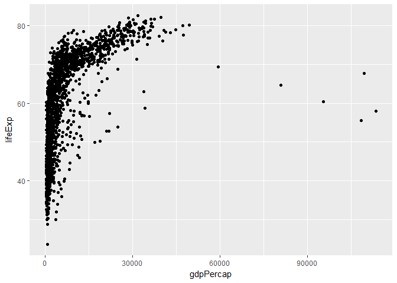
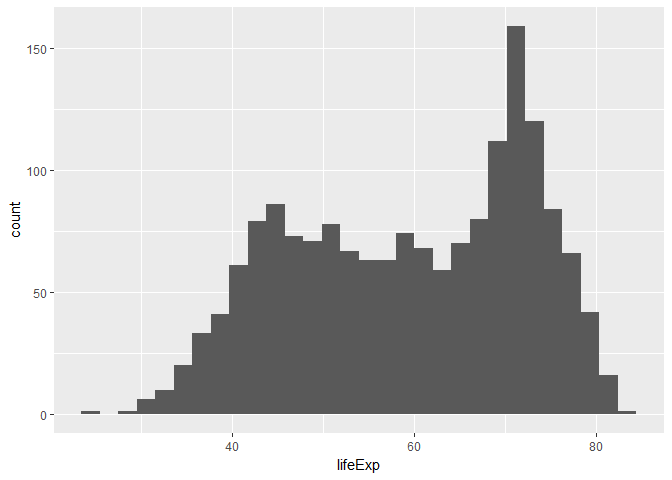

Visualization with ggplot2
================

Index
-----

1.  [El lenguaje ggplot](#el-lenguaje-ggplot)
2.  [Temas](#temas)
3.  [Etiquetas y leyenda](#etiquetas-y-leyenda)
4.  [Guardar gráficos](#guardar-gráficos)
5.  [ggpairs](#ggpairs)

El lenguaje ggplot
==================

Cheatsheet \# <https://www.rstudio.com/wp-content/uploads/2016/12/ggplot2-cheatsheet-2.1-Spanish.pdf>

``` r
library(ggplot2)
library(tidyverse)
```

    ## -- Attaching packages ---------------------------------------------------------------------------------------------------- tidyverse 1.2.1 --

    ## v tibble  1.4.2     v purrr   0.2.5
    ## v tidyr   0.8.1     v dplyr   0.7.6
    ## v readr   1.1.1     v stringr 1.3.1
    ## v tibble  1.4.2     v forcats 0.3.0

    ## -- Conflicts ------------------------------------------------------------------------------------------------------- tidyverse_conflicts() --
    ## x dplyr::filter() masks stats::filter()
    ## x dplyr::lag()    masks stats::lag()

``` r
ggplot()
```


``` r
(vector_y <- sample(10)) # Variable dependiente
```

    ##  [1]  8  3  2  6  1  7  9 10  5  4

``` r
(vector_x <- sample(10)) # Variable independiente
```

    ##  [1]  7  8  1  2 10  5  9  4  3  6

``` r
ggplot(mapping = aes(y = vector_y, x = vector_x))
```


``` r
ggplot(mapping = aes(y = vector_y, x = vector_x))  + geom_point()
```


Utilizaremos la base de datos `gapminder`:

``` r
library(gapminder)
```

``` r
ggplot(gapminder, aes(x = gdpPercap, y = lifeExp))
```


``` r
ggplot(gapminder, aes(x = gdpPercap, y = lifeExp)) + geom_point()
```



``` r
ggplot(gapminder, aes(x = gdpPercap, y = lifeExp)) + geom_point() + scale_x_log10()
```


``` r
ggplot(gapminder, aes(x = gdpPercap, y = lifeExp)) + geom_point() + scale_x_log10() + geom_point(aes(color=continent)) 
```


``` r
ggplot(gapminder, aes(x = gdpPercap, y = lifeExp)) + geom_point() + scale_x_log10() + geom_point(aes(color=continent)) + geom_smooth()
```

    ## `geom_smooth()` using method = 'gam'


``` r
ggplot(gapminder, aes(x = gdpPercap, y = lifeExp)) + geom_point() + scale_x_log10() + geom_point(aes(color=continent)) + geom_smooth(lwd=1, se=FALSE, method="lm", col="black")
```


``` r
ggplot(gapminder, aes(x = gdpPercap, y = lifeExp, color = continent))  + geom_point() + scale_x_log10()  + geom_smooth(se=F, lwd=1)
```

    ## `geom_smooth()` using method = 'loess'


``` r
gappminder_plot <- ggplot(gapminder) +
  aes(x = gdpPercap, y = lifeExp, colour = continent,
      size = pop, frame = year) +
  geom_point(alpha = 0.4) +
  scale_x_log10()
gappminder_plot
```


Histograma: distribución de una variable cuantitativa

``` r
ggplot(gapminder, aes(x = lifeExp)) +
  geom_histogram()
```

    ## `stat_bin()` using `bins = 30`. Pick better value with `binwidth`.



``` r
ggplot(gapminder, aes(x = lifeExp)) +
  geom_histogram(binwidth = 1)
```


``` r
#' Añadimos una nueva variable: continent
ggplot(gapminder, aes(x = lifeExp, fill = continent)) +
  geom_histogram()
```

    ## `stat_bin()` using `bins = 30`. Pick better value with `binwidth`.


Gráfico de frecuencias con líneas

``` r
ggplot(gapminder, aes(x = lifeExp, color = continent)) +
  geom_freqpoly()
```

    ## `stat_bin()` using `bins = 30`. Pick better value with `binwidth`.


Gráfico de densidad

``` r
ggplot(gapminder, aes(x = lifeExp)) + geom_density()
```


Gráfico de densidad con más de una variable

``` r
ggplot(gapminder, aes(x = lifeExp, color = continent)) + geom_density()
```


Alpha

``` r
ggplot(gapminder, aes(x = lifeExp, fill = continent)) +
  geom_density(alpha = 0.2)
```


Facetas

``` r
ggplot(gapminder, aes(x = lifeExp)) + geom_density() + facet_wrap(~ continent)
```


``` r
ggplot(gapminder,
       aes(x = lifeExp, fill = continent)) + geom_histogram() +
  facet_grid(continent ~ .)
```

    ## `stat_bin()` using `bins = 30`. Pick better value with `binwidth`.


Boxplot

``` r
# ojo: year no es un factor
ggplot(gapminder, aes(x = year, y = lifeExp)) + geom_boxplot()
```

    ## Warning: Continuous x aesthetic -- did you forget aes(group=...)?


``` r
# podemos solucionarlo
ggplot(gapminder, aes(x = year, y = lifeExp)) + geom_boxplot(aes(group = year))
```


Violinplot

``` r
ggplot(gapminder, aes(x = year, y = lifeExp)) +
  geom_violin(aes(group = year)) +
  geom_jitter(alpha = 1/4) +
  geom_smooth(se = FALSE)
```

    ## `geom_smooth()` using method = 'gam'


Strip plots: para una variable cualitativa y una cuantitativa

``` r
ggplot(gapminder, aes(x = continent, y = lifeExp)) + geom_point()
```


Geom\_jitter

``` r
ggplot(gapminder, aes(x = continent, y = lifeExp)) + geom_jitter()
```


``` r
ggplot(gapminder, aes(x = continent, y = lifeExp)) + 
  geom_jitter(position = position_jitter(width = 0.1, height = 0), alpha = 1/4)
```


Boxplot

``` r
ggplot(gapminder, aes(x = continent, y = lifeExp)) + geom_boxplot()
```


Raw data AND boxplots

``` r
ggplot(gapminder, aes(x = continent, y = lifeExp)) +
  geom_boxplot(outlier.colour = "hotpink") +
  geom_jitter(position = position_jitter(width = 0.1, height = 0), alpha = 1/4)
```


Superposición de información estadística

``` r
ggplot(gapminder, aes(x = continent, y = lifeExp)) + 
  geom_jitter(position = position_jitter(width = 0.1), alpha = 1/4) +
  stat_summary(fun.y = median, colour = "red", geom = "point", size = 5)
```


``` r
# podemos mejorarlo reordenando el eje
ggplot(gapminder, aes(reorder(x = continent, lifeExp), y = lifeExp)) + 
  geom_jitter(position = position_jitter(width = 0.1), alpha = 1/4) +
  stat_summary(fun.y = median, colour = "red", geom = "point", size = 5)
```


Temas
=====

``` r
gappminder_plot + theme_grey()

gappminder_plot + theme_bw()

gappminder_plot + theme_minimal()
```

Crear nuestros propios temas:

``` r
gappminder_plot + theme(panel.border=element_rect(color = 'white', fill = NA), 
                        panel.background = element_rect(color = 'white', fill = NA) )
```


``` r
gappminder_plot + theme_grey()  + theme_minimal() + theme(
  axis.title.x = element_text(size = 13), 
  text = element_text(family="Arial", colour="grey50", size=12),
  panel.grid.major.y = element_blank(),
  panel.grid.minor.y = element_blank(),  
  panel.grid.major.x = element_blank(),
  panel.grid.minor.x = element_blank()
)
```


Con `ggthemes`:

``` r
# install.packages("ggthemes")

library(ggthemes)

gappminder_plot + theme_excel() + scale_fill_excel()
```


``` r
gappminder_plot + theme_economist() + scale_fill_economist()
```


``` r
gappminder_plot + theme_wsj() + scale_fill_wsj(palette = "black_green")
```


``` r
(gappminder_plot <- gappminder_plot + theme_tufte() + scale_fill_tableau())
```


Etiquetas y leyenda
===================

``` r
(gappminder_plot <- gappminder_plot + ylab("Esperanza de vida") + xlab("PIB per cápita"))
```


``` r
gappminder_plot <- gappminder_plot + labs(title="Esperanza de vida y PIB per cápita", 
                                          subtitle= "Fuente: Gapminder", 
                                          caption = "Visualización: R + ggplot2")
gappminder_plot + theme(legend.position="bottom")
```


Guardar gráficos
================

``` r
ggsave("gapminder.pdf", gappminder_plot)
ggsave("gapminder.png", width = 6, height = 4)
```

ggpairs
=======

``` r
library(GGally)
```

    ## 
    ## Attaching package: 'GGally'

    ## The following object is masked from 'package:dplyr':
    ## 
    ##     nasa

``` r
gapminder %>% 
  filter(country %in% c("Spain", "Brazil", "Angola")) %>% 
  mutate(country = as.character(country)) %>% 
  ggpairs(mapping = aes(colour = country))
```

    ## `stat_bin()` using `bins = 30`. Pick better value with `binwidth`.

    ## `stat_bin()` using `bins = 30`. Pick better value with `binwidth`.
    ## `stat_bin()` using `bins = 30`. Pick better value with `binwidth`.
    ## `stat_bin()` using `bins = 30`. Pick better value with `binwidth`.
    ## `stat_bin()` using `bins = 30`. Pick better value with `binwidth`.
    ## `stat_bin()` using `bins = 30`. Pick better value with `binwidth`.
    ## `stat_bin()` using `bins = 30`. Pick better value with `binwidth`.
    ## `stat_bin()` using `bins = 30`. Pick better value with `binwidth`.


