Gráficos avanzados
================

Esta sección es una introducción a las ideas del libro *The Grammar of Graphics* de Leland Wilkinson (2005) tal y como vienen implementadas en el paquete `ggplot2` de Hadley Wickham (2009).

A continuación veremos los elementos principales de esta gramática y como nos permiten elaborar de manera sencilla representaciones visuales del comportamiento de una variable de interés a través de los distintos niveles de otras.

Como complemento podemos consultar esta Cheatsheet de ggplot:

<https://www.rstudio.com/wp-content/uploads/2015/03/ggplot2-cheatsheet.pdf>

Index
-----

1.  [Elementos de un gráfico en ggplot2](#elementos-de-un-gráfico-en-ggplot2)
2.  [El toque final](#el-toque-final)
3.  [Exportación de los gráficos](#exportación-de-los-gráficos)
4.  [Introducción a ggmap](#introducción-a-ggmap)
5.  [Extensión dinámica de los gráficos](#extensión-dinámica-de-los-gráficos)

``` r
library(tidyverse)
```

    ## -- Attaching packages ---------------------------------------------------------------------------------------- tidyverse 1.2.1 --

    ## v ggplot2 2.2.1     v purrr   0.2.5
    ## v tibble  1.4.2     v dplyr   0.7.5
    ## v tidyr   0.8.1     v stringr 1.3.1
    ## v readr   1.1.1     v forcats 0.3.0

    ## -- Conflicts ------------------------------------------------------------------------------------------- tidyverse_conflicts() --
    ## x dplyr::filter() masks stats::filter()
    ## x dplyr::lag()    masks stats::lag()

Cargamos los datos:

``` r
paro <- read_csv("data/paro.csv") #carga los datos
```

    ## Parsed with column specification:
    ## cols(
    ##   Año = col_integer(),
    ##   Trimestre = col_character(),
    ##   Tasa.paro = col_double(),
    ##   Sexo = col_character(),
    ##   Prov.id = col_character(),
    ##   Provincia = col_character()
    ## )

``` r
colnames(paro)
```

    ## [1] "Año"       "Trimestre" "Tasa.paro" "Sexo"      "Prov.id"   "Provincia"

El gráfico siguiente muestra la evolución de la tasa de paro según la provincia y el sexo, en el periodo 2011-2014.

``` r
ggplot(paro) +  # Siempre un dataframe
  aes(x = Año, y = Tasa.paro, col = Sexo) +  # Variables que representaremos y sus atributos (color, etc...)
  geom_point() + geom_smooth(alpha = 0.5, se = FALSE) +  #Puntos, rectas, histogramas...
  facet_wrap( ~ Provincia)   # Subgráficos
```

    ## `geom_smooth()` using method = 'loess'


Elementos de un gráfico en ggplot2
==================================

Esta expresión combina varios elementos que discutiremos con detalle más adelante:

-   **Datos**: siempre un “data.frame”
-   **Estéticas**: elementos representables gráficamente (la posición x e y, el color, la forma, …) en columnas del data.frame.
-   **Geometrías** (o capas): puntos, rectas, histogramas, densidades, etc. También se llaman capas porque pueden superponerse.
-   **Facetas**: parten un gráfico en sublienzos preservando las escalas (pequeños múltiplos)

Datos
-----

Uno de los elementos más importantes de un gráfico son los datos que se quieren representar. Una particularidad de `ggplot2` es que solo acepta un tipo de datos: `data.frames`.

Por otro lado, es preferible que los datos estén en un formato “largo” (long format), es decir, una columna para cada dimensión y una fila para cada observación. Para ilustrar esta idea, se considera la base de datos `VADeaths` que proporciona tasas de mortalidad (por 1000 personas/año) en Virginia (1940) por grupos socio-demográficos y de edad.

Antes de representar los datos, convertimos la base en un formato alargado.

``` r
temp <- VADeaths %>% as.tibble() %>% mutate(edad = row.names(VADeaths))
head(temp)
```

    ## # A tibble: 5 x 5
    ##   `Rural Male` `Rural Female` `Urban Male` `Urban Female` edad 
    ##          <dbl>          <dbl>        <dbl>          <dbl> <chr>
    ## 1         11.7           8.70         15.4           8.40 50-54
    ## 2         18.1          11.7          24.3          13.6  55-59
    ## 3         26.9          20.3          37.0          19.3  60-64
    ## 4         41.0          30.9          54.6          35.1  65-69
    ## 5         66.0          54.3          71.1          50.0  70-74

La queremos en formato largo, no ancho:

``` r
# Quiero que las columnas (ej. Urban Male) sean una característica de cada fila

mortalidad <- gather(temp,grupo,tasa,-edad)  # Con el -edad le digo que todas menos edad
head(mortalidad)
```

    ## # A tibble: 6 x 3
    ##   edad  grupo         tasa
    ##   <chr> <chr>        <dbl>
    ## 1 50-54 Rural Male   11.7 
    ## 2 55-59 Rural Male   18.1 
    ## 3 60-64 Rural Male   26.9 
    ## 4 65-69 Rural Male   41.0 
    ## 5 70-74 Rural Male   66.0 
    ## 6 50-54 Rural Female  8.70

Para graficar siempre voy a querer las tablas en formato largo.

``` r
p <- ggplot(mortalidad) 
p
```


De momento no tenemos nada, únicamente un lienzo vacío. El código anterior crea un objeto, `p` que viene a ser un proto-gráfico: contiene los datos que vamos a utilizar, los del conjunto de datos `mortalidad`. Obviamente, el código anterior es insuficiente para crear un gráfico: aún no hemos indicado qué queremos hacer con `mortalidad`.

Estéticas
---------

En un conjunto de datos hay columnas: edad, altura, ingresos, temperatura, etc. En un gráfico hay, en la terminología de `ggplot2`, *aesthetic*. Estéticas son, por ejemplo, la distancia horizontal o vertical, el color, la forma (de un punto), el tamaño (de un punto o el grosor de una línea), etc.

``` r
p <- p + aes(x = edad, y = tasa, colour = grupo)
```

se están añadiendo a `p` información sobre las estéticas que tiene que utilizar y qué variables de `mortalidad` tiene que utilizar:

-   La abscisa `x`, vendrá dada por el grupo de edad.
-   La ordenada `y`, por la tasa de mortalidad.
-   El color, por el grupo socio-demográfico.

Al `protográfico` se le han sumado las estéticas. En las secciones siguientes se le \`sumarán\`\` otros elementos adicionales. Lo importante es recordar cómo la suma es el signo que combina los elementos que componen el lenguaje de los gráficos.

De todos modos, es habitual combinar ambos pasos en una única expresión:

``` r
ggplot(mortalidad) +   # Lo del + es como las tuberías
  aes(x=edad, y=tasa, color=grupo)
```


Ahora hay algo más.

El objeto `p` resultante aún no es un gráfico ni se puede representar. Le faltan capas, que es el objeto de la siguiente sección. No obstante, se puede inspeccionar la relación (o mapeo) entre estéticas y columnas de los datos:

``` r
p <- ggplot(mortalidad) +   # Lo del + es como las tuberías
  aes(x=edad, y=tasa, color=grupo)

p$mapping
```

    ## * x      -> edad
    ## * y      -> tasa
    ## * colour -> grupo

¿Cuántas estéticas existen? Alrededor de una docena, aunque se utilizan, generalmente, menos:

-   `x` e `y`, coordenadas horizontal y vertical.
-   `colour`, para el color.
-   `size`, para el tamaño.
-   `shape`, que indica la forma de los puntos (cuadrados, triángulos, etc.) de los puntos o del trazo (continuo, punteado) de las líneas.
-   `alpha` para la transparencia: los valores más altos tendrían formas opacas y los más bajos, casi transparentes. También muy útil para el solapamiento de puntos.
-   `fill`, para el color de relleno de las formas sólidas (barras, etc.).

> **Nota** Hay que advertir que no todas las estéticas tienen la misma potencia en un gráfico. El ojo humano percibe fácilmente longitudes distintas. Pero tiene problemas para comparar áreas (que es lo que regula la estética size) o intensidades de color. Se recomienda usar las estéticas más potentes para representar las variables más importantes.

El siguiente paso es meter las **geometrías o capas** (puntos, líneas, etc...).

Capas (`geoms`)
---------------

Las capas (o `geoms` para `ggplot2`) son los verbos del lenguaje de los gráficos. Indican qué hacer con los datos y las estéticas elegidas, cómo representarlos en un lienzo:

``` r
ggplot(mortalidad) +  
  aes(x=edad, y=tasa, color=grupo) + 
  geom_point()  # Me pone puntos
```


Si al grupo quiero asociarle tamaño o forma en vez de color, lo cambio en las estéticas:

``` r
ggplot(mortalidad) +  
  aes(x=edad, y=tasa, shape=grupo) + 
  geom_point()  
```

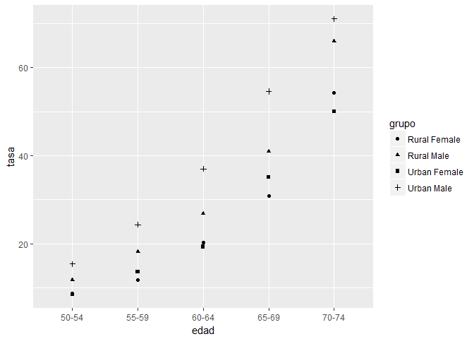

``` r
ggplot(mortalidad) +  
  aes(x=edad, y=tasa, size=grupo) + 
  geom_point() 
```

    ## Warning: Using size for a discrete variable is not advised.


Aunque esto no se ve muy bien, porque en variables categóricas el tamaño no va muy bien (el tamaño es "numérico").

Ahora, con líneas en vez de puntos:

``` r
ggplot(mortalidad) + 
  aes(x = edad, y = tasa, colour = grupo) + 
  geom_point() + geom_line()  # Geom_line me une los puntos
```

    ## geom_path: Each group consists of only one observation. Do you need to
    ## adjust the group aesthetic?

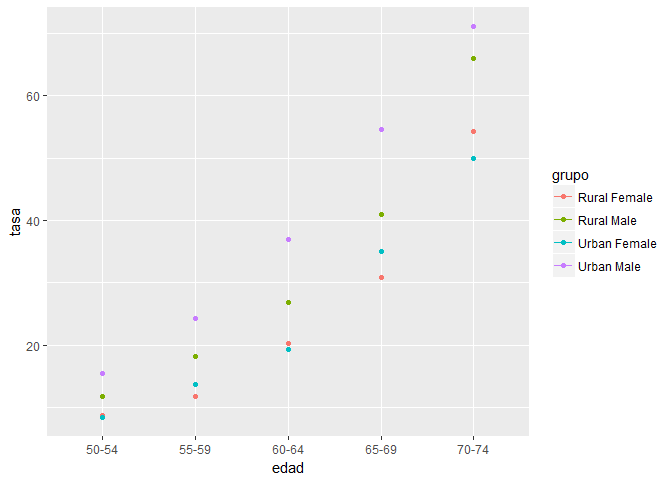

Una característica de las capas, y de ahí su nombre, es que pueden superponerse. Por ejemplo,

``` r
ggplot(mortalidad) + 
  aes(x = edad, y = tasa, linetype = grupo, group = grupo) + 
  geom_point() + geom_line()  # Geom_line me une los puntos
```

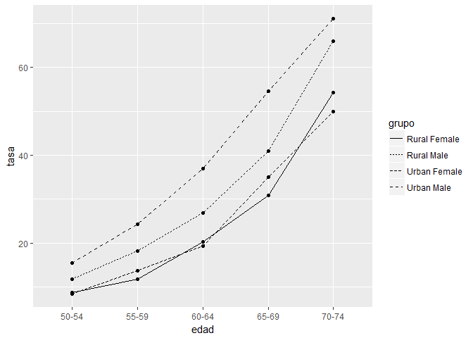

Se requiere la estética `group` para conectar los puntos de una linea cuando la variable en abscisa es un factor.

Existen muchos tipos de capas. Los más usuales son `geom_point`, `geom_line`, `geom_histogram`, `geom_bar` y `geom_boxplot` (ver la página <http://docs.ggplot2.org/current/>) para una lista actualizada.

Abajo una representación mediante un diagrama de barra de los datos anteriores:

``` r
ggplot(mortalidad) + 
  aes(x = edad, y = tasa, fill = grupo) + 
  geom_bar(stat = 'identity')  # Si no pongo esto me calcula frecuencias, y para este caso no quiero.
```


Sale el mismo problema de antes: como las barras no son iguales, es difícil comparar. Para evitar esto:

``` r
ggplot(mortalidad) + 
  aes(x = edad, y = tasa, fill = grupo) + 
  geom_bar(stat = 'identity', position = 'dodge')  
```

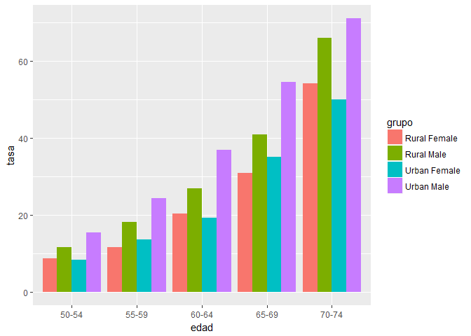

Ahora es más claro. Se ve que con la edad la tasa aumenta (obvio), pero vemos que dentro de cada grupo el Urban Male siempre suele ser el de más tasa.

> **Ejercicio**: Elaborar el siguiente gráfico sobre la evolución del paro en España. Utilizar la capa `geom_smooth` para suavizar la tendencia y la estética `linetype` para distintos tipos de curvas.

``` r
ggplot(paro) + 
  aes(x = Año, y = Tasa.paro, color = Trimestre, linetype = Sexo) + 
  geom_smooth(se = FALSE)
```

    ## `geom_smooth()` using method = 'loess'

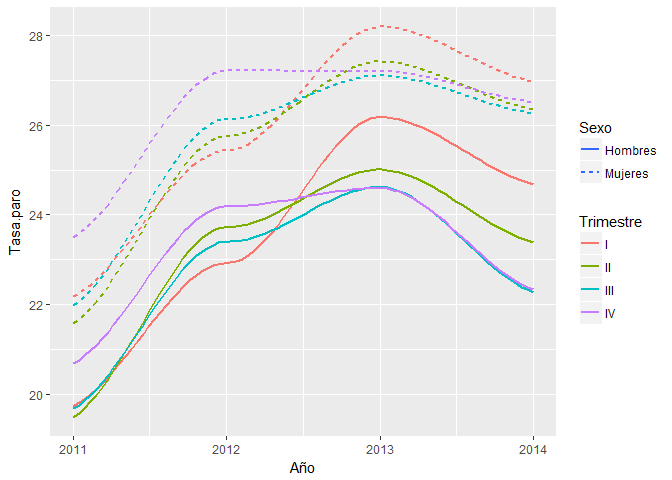

``` r
# Si pongo geom_line en vez de geom_smooth me va mal por la base de datos: por cada trimestre, sexo y año hay X valores (porque hay X provincias). Con el geom_smooth me ajusta al centro de todos los puntos que son las provincias. En el siguiente gráfico se ve.
```

``` r
ggplot(paro) + 
  aes(x = Año, y = Tasa.paro, color = Trimestre, linetype = Sexo) + 
  geom_smooth(se = FALSE) + geom_point()
```

    ## `geom_smooth()` using method = 'loess'


Facetas
-------

Las facetas permiten subdividir un gráfico y suele ser un recurso muy eficiente para describir el comportamiento de una variable en función de otra variable categórica. Así por ejemplo, con los datos de mortalidad,

``` r
ggplot(mortalidad, aes(x = edad, y = tasa)) +  # La línea de aes también se puede poner dentro del ggplot()
  geom_bar(stat="identity") +
  facet_grid(~grupo)
```


crea tres gráficos dispuestos horizontalmente que comparan la relación entre la anchura y la longitud del pétalo de las tres especies de iris. Una característica de estos gráficos, que es crítica para poder hacer comparaciones adecuadas, es que comparten ejes.

Los gráficos podrían disponerse verticalmente reemplazando `facet_grid(~grupo)` por `facet_grid(grupo~)` en el código anterior. Además, se puede subdividir el lienzo por dos (¡o más!) variables así:

``` r
ggplot(mortalidad, aes(x = edad, y = tasa, fill = edad)) +  # La línea de aes también se puede poner dentro del ggplot()
  geom_bar(stat="identity") +
  facet_wrap(~grupo)
```

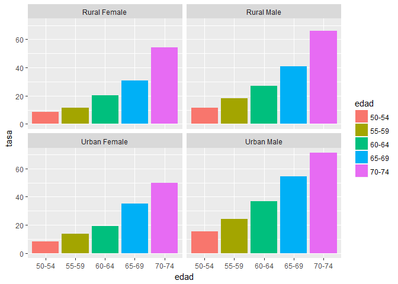

Dividimos la variable grupo:

``` r
mortalidad <- mortalidad %>% separate(grupo, c('area','sexo'), sep = " ")
```

``` r
head(mortalidad)
```

    ## # A tibble: 6 x 4
    ##   edad  area  sexo    tasa
    ##   <chr> <chr> <chr>  <dbl>
    ## 1 50-54 Rural Male   11.7 
    ## 2 55-59 Rural Male   18.1 
    ## 3 60-64 Rural Male   26.9 
    ## 4 65-69 Rural Male   41.0 
    ## 5 70-74 Rural Male   66.0 
    ## 6 50-54 Rural Female  8.70

``` r
ggplot(mortalidad, aes(x = edad, y = tasa, fill=sexo)) +  # La línea de aes también se puede poner dentro del ggplot()
  geom_bar(stat="identity", position = 'dodge') +
  facet_grid(sexo~area)
```


Podemos poner el valor de la tasa encima de la barra:

``` r
ggplot(mortalidad, aes(x = edad, y = tasa, fill=sexo, label = tasa)) +  # La línea de aes también se puede poner dentro del ggplot()
  geom_bar(stat="identity", position = 'dodge') +
  facet_grid(sexo~area) + geom_text()
```


Tenemos que ajustarlo

``` r
ggplot(mortalidad, aes(x = edad, y = tasa, fill=sexo, label = tasa)) +  # La línea de aes también se puede poner dentro del ggplot()
  geom_bar(stat="identity", position = 'dodge') +
  facet_grid(sexo~area) + geom_text(size = 4, nudge_y = 5)
```


> **Ejercicio** Elaborar los siguientes gráficos sobre la evolución del paro. Para el segundo gráfico, se puede filtrar la base original con el comando:

> paro.ZHT &lt;- paro %&gt;% filter(Provincia %in% c(“Zaragoza”, “Huesca”, “Teruel”))

``` r
paro.ZHT <- paro %>% filter(Provincia %in% c('Zaragoza', 'Huesca', 'Teruel'))
```

``` r
ggplot(paro) + 
  aes(x = Trimestre, y = Tasa.paro, color = Sexo, group = Trimestre) + 
  geom_boxplot() + 
  facet_grid(Sexo~Año)
```

 Ojo: con facet\_grid las escalas de todos los subgráficos son iguales. Cuando queramos que sean distintas también se puede.

``` r
ggplot(paro.ZHT) + 
  aes(x = Año, y = Tasa.paro, color = Sexo ) + 
  geom_line() + geom_point() +
  facet_grid(Provincia~Trimestre)
```


En caso de haber muchas categorías (p.e., todas las provincias), puede usarse la función `facet_wrap` para distribuir las subgráficas en una cuadrícula (ver gráfico a principio de la sección).

Cargamos base de datos sobre esperanza de vida:

``` r
require(gapminder)
```

    ## Loading required package: gapminder

``` r
gapminder <- gapminder
```

Esperanza de vida de acuerdo al PIB:

``` r
ggplot(gapminder) + 
  aes(x = gdpPercap, y = lifeExp, color = continent, size = pop) + 
  geom_point() + 
  facet_wrap(~year)  # Utilizamos wrap en vez de grid porque te lo organiza de mejor manera en este caso
```


Tenemos un atípico: lo quitamos porque no me deja ver bien.

``` r
gapminder2 <- gapminder %>%  filter(gdpPercap > 90000)  # Es kuwait
```

``` r
gapminder2 <- gapminder %>% filter(!country == 'Kuwait')
```

``` r
ggplot(gapminder2) + 
  aes(x = gdpPercap, y = lifeExp, color = continent, size = pop) + 
  geom_point() + 
  facet_wrap(~year)  
```


El toque final
==============

Etiquetas
---------

Las estéticas se pueden etiquetar con la función `labs`. Además, se le puede añadir un título al gráfico usando la función `ggtitle`. Por ejemplo, en el gráfico anterior se pueden re-etiquetar los ejes y la leyenda escribiendo

``` r
obesidad <- read_csv('data/obesidad.csv')  # cargamos tabla
```

    ## Parsed with column specification:
    ## cols(
    ##   renta = col_double(),
    ##   imc = col_double(),
    ##   region = col_character()
    ## )

``` r
p <-ggplot(obesidad,aes(x=renta,y=imc,color=region))+geom_smooth(method="lm")
p + ggtitle("Relación entre Indice de Masa Corporal (IMC) y renta") + 
        labs(x = "Renta (en miles de $ por año)", y = "IMC (kg/m2)", color = "Continente")
```

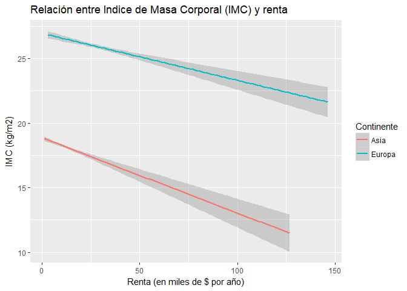

Esto es curioso porque si no diferencio por continente:

``` r
p <-ggplot(obesidad,aes(x=renta,y=imc))+geom_smooth(method="lm")
p + ggtitle("Relación entre Indice de Masa Corporal (IMC) y renta") + 
        labs(x = "Renta (en miles de $ por año)", y = "IMC (kg/m2)", color = "Continente")
```

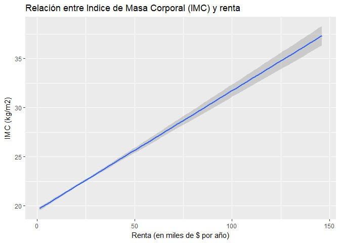

Escalas:
--------

Las escalas de las estéticas pueden ser modificadas para mejorar la claridad del gráfico.

``` r
p<-ggplot(obesidad,aes(x=renta,y=imc))+geom_point(size=.1)+geom_smooth(method="lm")
p 
```


Transformamos las escalas del eje x y del eje y.

``` r
p+scale_x_log10()+scale_y_continuous(breaks=seq(10,50,10),trans="log")
```


``` r
# lo de scale_x_log y lo otro con el trans='log' es poner ambas cosas en escala logarítmica.
```

Escalas de los colores:

``` r
ggplot(obesidad,aes(x=renta,y=imc,color=region))+geom_smooth(method="lm") + 
  geom_point(size=.1,alpha=.1)+
  scale_x_log10()+scale_y_continuous(breaks=seq(10,50,10),trans="log")+
  scale_color_manual("Continente",values=c("green4","red4"),limits=c("Europa","Asia"))
```


Volvemos al ejemplo de antes:

``` r
ggplot(mortalidad, aes(x = edad, y = tasa, fill=sexo, label = tasa)) +  # La línea de aes también se puede poner dentro del ggplot()
  geom_bar(stat="identity", position = 'dodge') +
  facet_grid(sexo~area) + geom_text(size = 4, nudge_y = 5)
```


Si pongo alpha:

``` r
ggplot(mortalidad, aes(x = edad, y = tasa, fill=sexo, alpha = area)) +  # La línea de aes también se puede poner dentro del ggplot()
  geom_bar(stat="identity", position = 'dodge') +
  facet_grid(sexo~area) 
```


Me transparenta demasiado lo de Rural.

``` r
ggplot(mortalidad, aes(x = edad, y = tasa, fill=sexo, alpha = area)) +  # La línea de aes también se puede poner dentro del ggplot()
  geom_bar(stat="identity", position = 'dodge') +
  facet_grid(sexo~area) + scale_alpha_manual(values = c(.35,.65), limits = c('Rural', 'Urban'))
```


Temas:
------

Los temas de `ggplot2` permiten modificar aspectos estéticos del gráfico que no tienen que ver con los datos en sí. Eso incluye los ejes, etiquetas, colores de fondo, el tamaño de los márgenes, etc. Cambiar el tema por defecto, puede ser útil cuando los gráficos tienen que adecuarse a una imagen corporativa o atenerse a algún criterio de publicación.

El tema que usa `ggplot2` por defecto es `theme_grey`. Al escribir `theme_grey()` en la consola de R, se muestran alrededor de cuarenta elementos modificables y sus atributos tal y como los define dicho tema.

¿Qué se puede hacer con los temas? Una primera opción es elegir otro. Por ejemplo, se puede reemplazar el habitual por otros disponibles en el paquete como `theme_bw` (o `theme_classic`) haciendo:

``` r
p + facet_grid(~region) + theme_bw()
```


``` r
p + facet_grid(~region) + theme_classic()
```


Es posible usar tanto los temas que incluye `ggplot2` por defecto como otros creados por la comunidad. Algunos, por ejemplo, tratan de imitar el estilo de publicaciones reconocidas como The Economist o similares. Algunos están recogidos en paquetes como, por ejemplo, `ggthemes`.

Exportación de los gráficos
===========================

Una vez creado un gráfico, es posible exportarlo en diversos formatos:

-   Imagen tipo bitmap (`jpeg`,`png`,`bmp`,`tiff`,…)
-   Imagen vectorial (`pdf`,`svg`,…)

La función `ggsave` guarda en un fichero el último gráfico generado con ggplot2. Lo hace, además, en el formato indicado en el nombre del fichero que se quiere generar. Así,

``` r
ggplot(gapminder2) + 
  aes(x = gdpPercap, y = lifeExp, color = continent, size = pop) + 
  geom_point() + 
  facet_wrap(~year)  
ggsave("prueba.pdf")
```

> **Nota** Las imágenes vectoriales tienen una resolución “infinita” y suelen ocupar poca memoria. Sin embargo, no todos los editores de texto admiten este tipo de formato.

Introducción a ggmap
====================

Es una extensión de `ggplot`. Al final añadimos una capa que es un mapa: para ello nos conectamos a una API.

-   Con `ggplot2` se puede también construir representaciones gráficas con información geográfica (puntos, segmentos, etc.): basta con que las estéticas `x` e `y` se correspondan con la longitud y la latitud de los datos.

-   Lo que permite hacer `ggmap` es, en esencia, añadir a los gráficos ya conocidos una capa cartográfica adicional. Para eso usa recursos disponibles en la web a través de APIs (de Google y otros).

Un ejemplo sencillo ilustra los usos de ggmap. En primer lugar, se carga (si se ha instalado previamente) el paquete:

``` r
library(ggmap)
```

Existen varios proveedores que proporcionan APIs de geolocalización. Uno de ellos es Google: dado el nombre más o menos normalizado de un lugar, la API de Google devuelve sus coordenadas. Este servicio tiene una versión gratuita que permite realizar un determinado número de consultas diarias (2500 actualmente); para usos más intensivos, es necesario adquirir una licencia.

También hay otros servicios como CaRtociudad, con el que no dependeremos de google y no nos dará problemas (lo vemos después).

La función `geocode` encapsula la consulta a dicha API y devuelve un objeto (un `data.frame`) que contiene las coordenadas del lugar de interés. Obtenemos las coordenadas de KSchool:

``` r
kschool <- geocode('avenida de Brasil 6, madrid, spain')
```

    ## Information from URL : http://maps.googleapis.com/maps/api/geocode/json?address=avenida%20de%20Brasil%206,%20madrid,%20spain&sensor=false

``` r
str(kschool)
```

    ## 'data.frame':    1 obs. of  2 variables:
    ##  $ lon: num -3.69
    ##  $ lat: num 40.5

La función `get_map` consulta otro servicio de información cartográfica (GoogleMaps en el ejemplo siguiente) y descarga un mapa (que es, esencialmente, una imagen *raster*).

Cargamos un mapa. Podemos cargarlo con el diseño que queramos:

``` r
mapa <- get_map(kschool, zoom = 16)
```

    ## Map from URL : http://maps.googleapis.com/maps/api/staticmap?center=40.454183,-3.693109&zoom=16&size=640x640&scale=2&maptype=terrain&language=en-EN&sensor=false

``` r
# mapa<- get_map(location = kschool,zoom = 16, source = "stamen", maptype = "watercolor")
# mapa<- get_map(location = kschool,zoom = 16, source = "stamen", maptype = "toner")
```

``` r
ggmap(mapa)
```


A partir de un lienzo "mapa" podemos representar información georeferenciada.

``` r
# Ponemos el mapa en blanco y negro:
mapa <- get_map(kschool, zoom = 16, color = 'bw')
```

    ## Map from URL : http://maps.googleapis.com/maps/api/staticmap?center=40.454183,-3.693109&zoom=16&size=640x640&scale=2&maptype=terrain&language=en-EN&sensor=false

``` r
ggmap(mapa)
```


Lo bueno es que todo lo que hicimos hasta ahora sigue valiendo.

``` r
terrazas <- read_csv('data/terrazas.csv')
```

    ## Parsed with column specification:
    ## cols(
    ##   lon = col_double(),
    ##   lat = col_double()
    ## )

``` r
# localización de los bares con terrazas de Madrid
# https://www.datanalytics.com/2017/03/02/todas-las-terrazas-de-madrid/
```

Añadimos a nuestro mapa una capa más: los puntos de las terrazas:

``` r
ggmap(mapa) + geom_point(data = terrazas, aes(x = lon, y = lat), color = 'orange3', size = 3) + 
  geom_point(data = kschool, aes(x = lon, y = lat), color = 'blue3', size = 4)
```

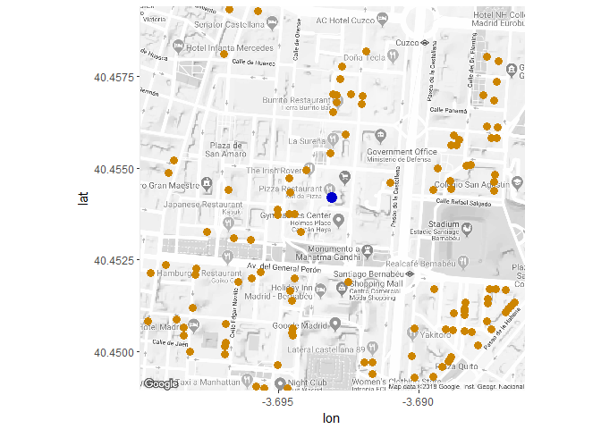

Como puede apreciarse, la sintaxis es similar a la de `ggplot2`. Una diferencia notables es que, ahora, los datos se pasan en la capa, es decir, en este caso, en la función `geom_point`.

Más ejemplos de mapas con puntos
--------------------------------

En los ejemplos que siguen se va a utilizar el conjunto de datos `crimes` que forma parte del paquete `ggmap` y que incluye información geolocalizada de crímenes cometidos en la ciudad de Houston. En realidad, solo consideraremos los crímenes *serios*. El tipo de mapas más simples son los que se limitan a representar puntos sobre una capa cartográfica.

``` r
crimes.houston <- crime %>% filter(!crime$offense %in% c("auto theft", "theft", "burglary"))

#houston<-geocode('houston')
houston<-c(lon=-95.3698,lat= 29.76043)
HoustonMap <- ggmap(get_map(houston, zoom = 14, color = "bw"))
```

    ## Map from URL : http://maps.googleapis.com/maps/api/staticmap?center=29.76043,-95.3698&zoom=14&size=640x640&scale=2&maptype=terrain&language=en-EN&sensor=false

``` r
HoustonMap +
  geom_point(aes(x = lon, y = lat, colour = offense), data = crimes.houston, size = 1)
```


> **Ejercicio** Los mecanismos conocidos de `ggplot2`, como las facetas, están disponibles en ggmap. Descomponer el anterior gráfico utilizando `facet_wrap` por tipo de crimen (ver gráfico siguiente). Hacer lo mismo con el día de la semana.

``` r
HoustonMap +
  geom_point(aes(x = lon, y = lat, colour = offense), data = crimes.houston, size = 1) + 
  facet_wrap(~offense)
```

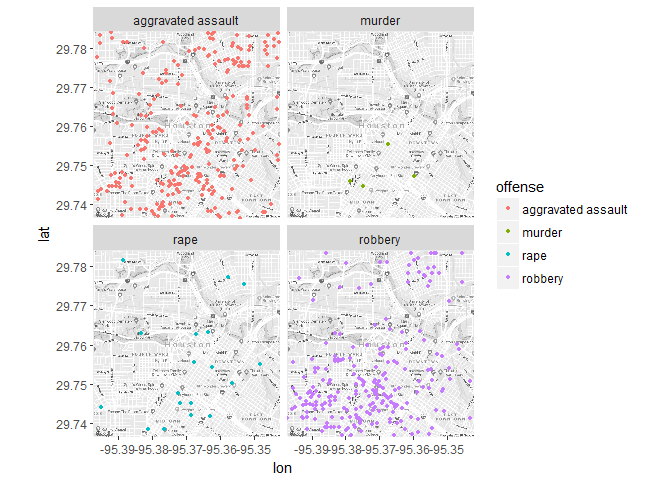

Con el día de la semana:

``` r
names(crimes.houston)
```

    ##  [1] "time"     "date"     "hour"     "premise"  "offense"  "beat"    
    ##  [7] "block"    "street"   "type"     "suffix"   "number"   "month"   
    ## [13] "day"      "location" "address"  "lon"      "lat"

``` r
HoustonMap +
  geom_point(aes(x = lon, y = lat, colour = offense), data = crimes.houston, size = 1) + 
  facet_grid(~day)
```

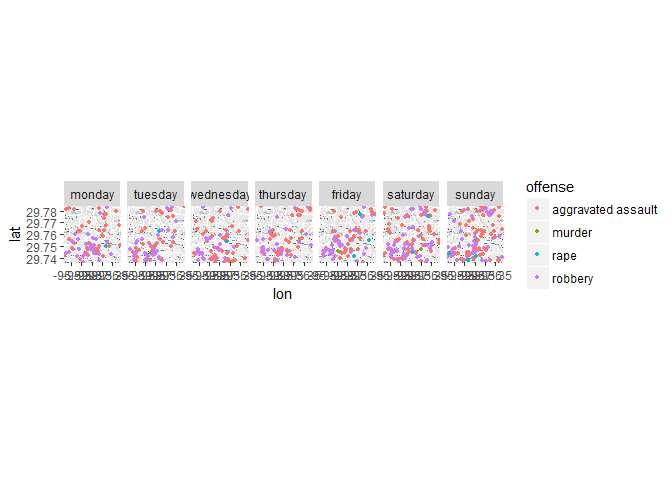

> **Ejercicio** Pintar las gasolineras en el mapa de España (o de una provincia o un municipio) utilizando el fichero `data/carburantes.csv`. Modificar el tamaño (o color) de los puntos en función de, por ejemplo, el precio de los carburantes.

Cargamos la tabla

``` r
carburantes <- read_delim("data/carburantes.csv", delim = ";")
```

    ## Parsed with column specification:
    ## cols(
    ##   .default = col_character(),
    ##   C.P. = col_integer(),
    ##   `Latitud (WGS84)` = col_number(),
    ##   `Precio Gasolina 95 Protección` = col_number(),
    ##   `Precio Nuevo Gasoleo A` = col_number(),
    ##   `Precio Biodiesel` = col_number(),
    ##   `Precio Bioetanol` = col_number(),
    ##   `Precio Gasolina  98` = col_number()
    ## )

    ## See spec(...) for full column specifications.

Formateamos campos:

``` r
carburantes2 <- carburantes %>% mutate(Longitud = as.numeric(sub(",", ".", `Longitud (WGS84)`, fixed = TRUE)),
                                       Latitud = as.numeric(sub(",", ".", `Latitud (WGS84)`, fixed = TRUE)),
                                       Latitud = Latitud / 1e6)
```

``` r
pozuelo <-c(lon=-3.807328,lat= 40.447489)
mapa <- get_map(location = pozuelo ,maptype = "terrain", source = "google", color = "bw",zoom = 13)
```

    ## Map from URL : http://maps.googleapis.com/maps/api/staticmap?center=40.447489,-3.807328&zoom=13&size=640x640&scale=2&maptype=terrain&language=en-EN&sensor=false

``` r
ggmap(mapa) + geom_point(aes(x = Longitud, y = Latitud, size = `Precio Gasolina 95 Protección`), 
                         data = carburantes2, 
                         colour = 'orange3',
                         alpha=.5)
```

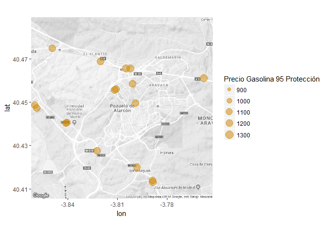

NOTA: para no tener que estar dependiendo de google, también hay un paquete con CartoCiudad

``` r
# library(devtools)
# install_github("rOpenSpain/caRtociudad")

library(caRtociudad)
```

``` r
my.address <- cartociudad_geocode("plaza de cascorro 11, 28005 madrid")
print(my.address)
```

    ##             id province   muni   type  address postalCode poblacion
    ## 1 280790006717   Madrid Madrid portal CASCORRO      28005    Madrid
    ##                                             geom tip_via      lat
    ## 1 POINT (-3.7070755652249914 40.409876677894765)   PLAZA 40.40988
    ##         lng portalNumber                        stateMsg state countryCode
    ## 1 -3.707076           11 Resultado exacto de la búsqueda     1         011

``` r
soria <- cartociudad_geocode("ayuntamiento soria")
soria_map <- get_cartociudad_map(c(soria$lat, soria$lng), 1)
```

    ## Warning: 'get_cartociudad_map' is deprecated.
    ## Use 'cartociudad_get_map' instead.
    ## See help("Deprecated")

``` r
ggmap::ggmap(soria_map)
```

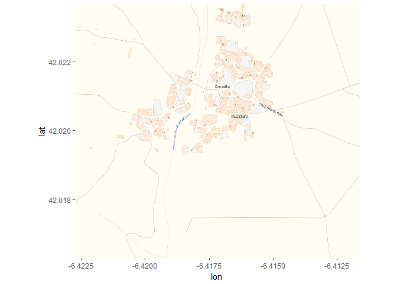

Esto no nos va a dar errores como google a veces.

Más allá de los puntos: densidades y poligonos
----------------------------------------------

Además de `geom_point`, también están disponibles otros tipos de capas de `ggplot2`, como `stat_bin2d`, que cuenta el número de eventos (aquí atracos) que suceden en regiones cuadradas de un tamaño predefinido. Se puede también utilizar `stat_density2d`, que representa densidades, para identificar las zonas de mayor criminalidad.

``` r
HoustonMap +
  stat_density2d(aes(x = lon, y = lat, alpha = ..level..),fill="red4",
                 size = 2, data = subset(crimes.houston,offense=="robbery"),
                 geom = "polygon")
```


``` r
# con ..level.. le especificamos que la transparencia me la determine la densidad de los puntos
```

``` r
HoustonMap +
  stat_bin2d(aes(x = lon, y = lat),fill="red4",
                 size = 2, data = subset(crimes.houston,offense=="robbery"))
```

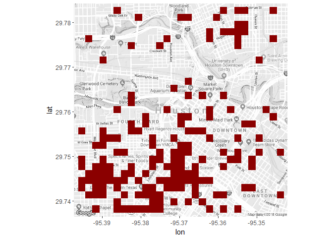

``` r
# Me crea una rejilla y me la va rellenando. Más flexible la anterior.
```

``` r
HoustonMap +
  stat_density2d(aes(x = lon, y = lat, alpha = ..level..,fill=offense),
                 size = 2, data = crimes.houston,
                 geom = "polygon") + 
  facet_wrap(~offense)
```


Por otra parte, la información estadística puede ser proporcionada de manera agregada en unidades espaciales (a nivel provincial, municipal, …), como para los datos del paro.

Ahora el problema cambia: tenemos, por ejemplo, polígonos que representan provincias, localidades... y tenemos la información a ese nivel.

Lo primero que se necesita para representar estar datos, es el conjunto de polígonos (o “shape”) que definen las secciones geográficas. Esta información se puede por ejemplo descargar desde el servidor `GADM` mediante el paquete `raster`:

``` r
# install.packages('raster')

require(raster)  
```

    ## Loading required package: raster

    ## Loading required package: sp

    ## 
    ## Attaching package: 'raster'

    ## The following object is masked from 'package:dplyr':
    ## 
    ##     select

    ## The following object is masked from 'package:tidyr':
    ## 
    ##     extract

``` r
shape <- getData("GADM", country= "Spain", level = 2) #mapa administrativo a nivel provincial. Si cambio level tengo las comunidades, municipios...
peninsula <- subset(shape,!NAME_1=="Islas Canarias") #mapa sin las islas canarias
peninsula 
```

    ## class       : SpatialPolygonsDataFrame 
    ## features    : 53 
    ## extent      : -9.301806, 4.328195, 35.17058, 43.79153  (xmin, xmax, ymin, ymax)
    ## coord. ref. : +proj=longlat +datum=WGS84 +no_defs +ellps=WGS84 +towgs84=0,0,0 
    ## variables   : 15
    ## names       : OBJECTID, ID_0, ISO, NAME_0, ID_1,           NAME_1, ID_2,   NAME_2,   HASC_2, CCN_2, CCA_2,          TYPE_2,       ENGTYPE_2, NL_NAME_2, VARNAME_2 
    ## min values  :        1,  215, ESP,  Spain,    1,        Andalucía,    1, A Coruña, ES.AN.AM,    NA,    01, Ciudad Autónoma, Autonomous City,          ,           
    ## max values  :       56,  215, ESP,  Spain,   18, Región de Murcia,   52, Zaragoza, ES.VC.VN,    NA,    52,       Provincia,        Province,          ,  València

Se puede representar este mapa mediante el comando `plot`:

``` r
plot(peninsula,col="red")
```


``` r
plot(peninsula,col="lightblue")
text(coordinates(peninsula), labels=peninsula$NAME_2,cex=.5)
```

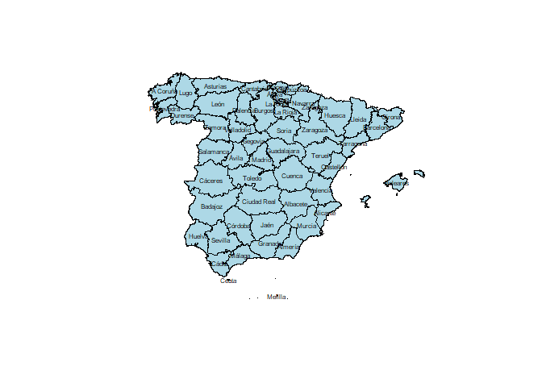

o utilizando el paquete `ggplot2`. Para ello conviene convertir el shape en un dataframe con fortify.

``` r
peninsula.df=fortify(peninsula,region="CCA_2") #convierte el shape en data.frame

ggplot() + geom_polygon(data = peninsula.df, aes(long, lat, group = group), 
                        fill="grey60",colour = "grey80", size = .1)+coord_quickmap()
```


``` r
# Y ahora en vez de puntos o líneas, tengo polígonos.
```

Para poder utilizar `fortify` necesitamos instalar primero el paquete `rgeos` y luego `maptools`.

``` r
# install.packages('rgeos')
# install.packages('maptools')
```

Ahora pintamos en el mapa los datos del paro (Mujeres, 2011, primer trimestre):

``` r
Paro <- paro %>% filter(Año==2011 & Trimestre=="I")
peninsula.paro=inner_join(peninsula.df,Paro,by=c("id"="Prov.id")) #juntamos las dos bases

ggplot() + 
  geom_polygon(data = peninsula.paro, aes(long, lat, group = group,fill=Tasa.paro), colour = "grey80", size = .1) + 
  facet_grid(~ Sexo) + scale_fill_gradient(low="aliceblue",high="steelblue4")+coord_quickmap()
```

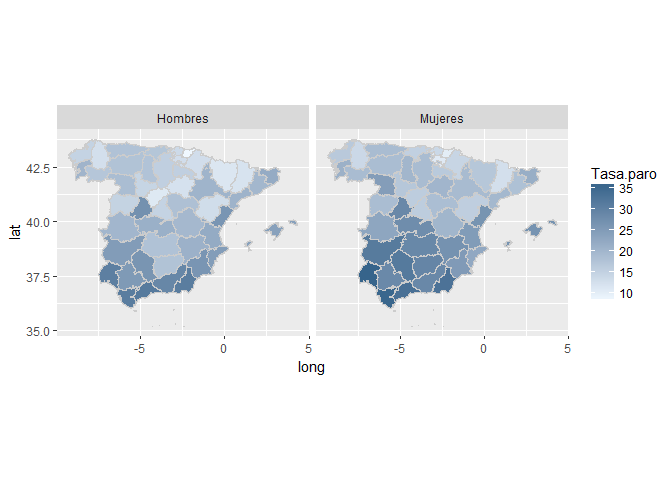

Podemos incluso dibujar este mapa, sobre un lienzo obtenido mediante get\_map:

``` r
centro <- c(lon=-3.70379,lat= 40.41678) #geocode("Madrid, Spain")
mapa <- get_map(centro, zoom = 6,maptype="toner-lite",source="stamen")
```

    ## Map from URL : http://maps.googleapis.com/maps/api/staticmap?center=40.41678,-3.70379&zoom=6&size=640x640&scale=2&maptype=terrain&sensor=false

    ## Map from URL : http://tile.stamen.com/toner-lite/6/30/22.png

    ## Map from URL : http://tile.stamen.com/toner-lite/6/31/22.png

    ## Map from URL : http://tile.stamen.com/toner-lite/6/32/22.png

    ## Map from URL : http://tile.stamen.com/toner-lite/6/30/23.png

    ## Map from URL : http://tile.stamen.com/toner-lite/6/31/23.png

    ## Map from URL : http://tile.stamen.com/toner-lite/6/32/23.png

    ## Map from URL : http://tile.stamen.com/toner-lite/6/30/24.png

    ## Map from URL : http://tile.stamen.com/toner-lite/6/31/24.png

    ## Map from URL : http://tile.stamen.com/toner-lite/6/32/24.png

    ## Map from URL : http://tile.stamen.com/toner-lite/6/30/25.png

    ## Map from URL : http://tile.stamen.com/toner-lite/6/31/25.png

    ## Map from URL : http://tile.stamen.com/toner-lite/6/32/25.png

``` r
mujeres=subset(peninsula.paro,Sexo="Mujeres")

ggmap(mapa) + geom_polygon(data = mujeres, aes(long, lat, group = group,fill=Tasa.paro),alpha=.5) +
scale_fill_gradient(low="aliceblue",high="steelblue4")
```


Extensión dinámica de los gráficos
==================================

Existen varios paquetes que permiten una visualización dinámica de los gráficos. Aquí veremos brevemente dos de ellos : `plotly` y `tmap`.

El primero permite con una única función (`ggplotly()`) convertir un gráfico elaborado con `ggplot` en un gráfico donde los ejes, el zoom, las etiquetas, etc., pueden ser modificados con el ratón:

``` r
# install.packages('plotly')
require(plotly)
p<-ggplot(paro, aes(x = Año, y = Tasa.paro, color=Sexo,label=Provincia)) +
  geom_jitter(alpha=.1) + geom_smooth(se=FALSE,method="lm") 
ggplotly(p,tooltip = c("label", "color"))  # en tooltip le indico con lo que quiero que interactúe el usuario

# Esto en el markdown da problemas, pero en un script va bien
```

Con `tmap` basado en el paquete `leaflet` se puede cambiar la resolución del lienzo:

``` r
# install.packages('tmap')  # tmap permite generar mapas cuya resolución va cambiando

# Hasta ahora el lienzo del mapa estaba fijo
```

``` r
require(tmap)
#vignette("tmap-nutshell")
paro.mujeres <- Paro %>% filter(Sexo=="Mujeres" & Trimestre=="I" & Año=="2011") 
peninsula@data=inner_join(peninsula@data,paro.mujeres,by=c("CCA_2"="Prov.id"))

tm_shape(peninsula) + tm_fill("Tasa.paro", style="quantile", palette="Reds",title="Tasa de paro",alpha=.8) +
    tm_borders("grey25", alpha=.5)
tmap_mode("view");last_map()    
#+tm_facets("Provincia")    ## Facetas por provincia            
```
