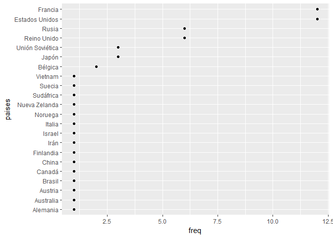
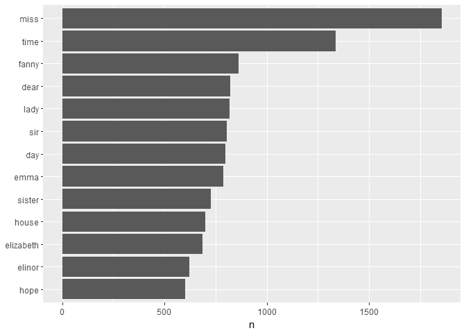
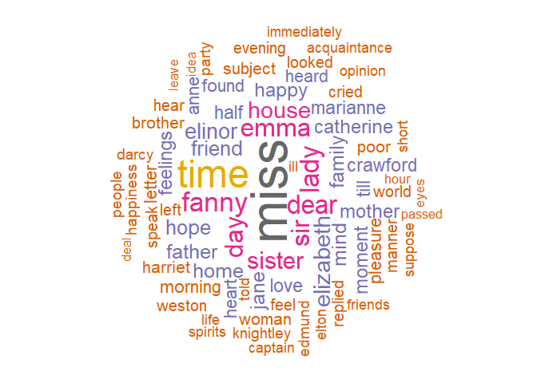
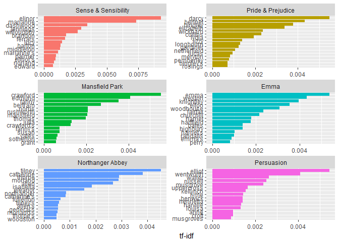

Text Mining
================

Este notebook contiene el trabajo realizado en clase. Para la explicación teórica ver apuntes pdf y html.

``` r
library(stringr)
```

Haremos un análisis de frecuencia de las palabras.

Manipulación y análisis básicos de texto
----------------------------------------

Veremos esto con R Base y con `stringr`.

-   Función `gsub`

``` r
# Sustituye el primer argumento por el segundo. Puedo meterle expresiones regulares
gsub("h", "H", c("hola", "búho"))
```

    ## [1] "Hola" "búHo"

``` r
# Sustituimos la primera h

gsub("^h", "H", c("hola", "búho"))
```

    ## [1] "Hola" "búho"

``` r
# stringr

str_replace("Búho", "h", "H")
```

    ## [1] "BúHo"

``` r
# Sustituir el final de una palabra por algo (por ejemplo, poner palabras en plural)

gsub("$","s", c("pera", "sandía", "plátano") )  # El $ es el final de una palabra
```

    ## [1] "peras"    "sandías"  "plátanos"

-   Función `grep`: me permite detectar patrones en textos

``` r
grep("a$", c("pera", "sandía", "plátano"))
```

    ## [1] 1 2

``` r
# Me dice en qué posiciones tengo cosas que terminan con a
```

``` r
# Si quiero extraer las que son:

grep("a$", c("pera", "sandía", "plátano"), value = TRUE)
```

    ## [1] "pera"   "sandía"

**Ejemplo**: todos los colores que terminan con blue:

``` r
colores <- head(colors(),10)
colores
```

    ##  [1] "white"         "aliceblue"     "antiquewhite"  "antiquewhite1"
    ##  [5] "antiquewhite2" "antiquewhite3" "antiquewhite4" "aquamarine"   
    ##  [9] "aquamarine1"   "aquamarine2"

``` r
grep("blue$", colores, value = TRUE)
```

    ## [1] "aliceblue"

\*Función `paste`:

``` r
paste("A", 1:6, sep = ",")
```

    ## [1] "A,1" "A,2" "A,3" "A,4" "A,5" "A,6"

``` r
paste("A", 1:6, collapse = ",")  # collapse es la separación
```

    ## [1] "A 1,A 2,A 3,A 4,A 5,A 6"

A continuación una aplicación de uso del paquete `stringr` donde se describe cómo se distribuyen las Medallas Fields (el “nobel” en matemáticas) entre los países, utilizando la información proporcionada por la wikipedia.

Empezamos extrayendo la tabla de interés desde la Wikipedia:

``` r
require(rvest)
```

    ## Loading required package: rvest

    ## Loading required package: xml2

``` r
mfield<-read_html("https://es.wikipedia.org/w/index.php?title=Medalla_Fields&oldid=103644843")
mfield %>% html_nodes("table") 
```

    ## {xml_nodeset (2)}
    ## [1] <table class="infobox" style="width:22.7em; line-height: 1.4em; text ...
    ## [2] <table class="wikitable" border="1"><tbody>\n<tr>\n<th>Año</th>\n<th ...

``` r
tabla <- mfield %>% html_nodes("table") %>% .[[2]] %>% html_table(header=TRUE)
knitr:::kable(tabla %>% head(5))
```

|   Año| Medallistas                                                             |
|-----:|:------------------------------------------------------------------------|
|  1936| Lars Ahlfors ( Finlandia), Universidad Harvard                          |
|  1936| Jesse Douglas ( Estados Unidos), Instituto Tecnológico de Massachusetts |
|  1950| Laurent Schwartz ( Francia), Universidad de Nancy                       |
|  1950| Atle Selberg (Noruega), Instituto de Estudios Avanzados de Princeton    |
|  1954| Kunihiko Kodaira ( Japón), Universidad de Princeton                     |

Los países están entre paréntesis. También hay un problema y es que algunos científicos tienen doble nacionalidad.

``` r
require(tidyverse)
```

    ## Loading required package: tidyverse

    ## -- Attaching packages -------------------------------------------------------------------------------------------------------------------------------------------- tidyverse 1.2.1 --

    ## v ggplot2 2.2.1     v readr   1.1.1
    ## v tibble  1.4.2     v purrr   0.2.5
    ## v tidyr   0.8.1     v dplyr   0.7.6
    ## v ggplot2 2.2.1     v forcats 0.3.0

    ## -- Conflicts ----------------------------------------------------------------------------------------------------------------------------------------------- tidyverse_conflicts() --
    ## x dplyr::filter()         masks stats::filter()
    ## x readr::guess_encoding() masks rvest::guess_encoding()
    ## x dplyr::lag()            masks stats::lag()
    ## x purrr::pluck()          masks rvest::pluck()

``` r
tmp <- tabla$Medallistas %>% str_extract("\\([^()]+\\)") #extrae contenido entre parentesis 
tmp <- substring(tmp,2,nchar(tmp)-1) 
paises<- tmp %>% str_split_fixed(" y ", 2) %>% str_trim() %>% c()  # Doble nacionalidad
```

Representación de distribución de medallas entre los países:

``` r
freq=c(table(paises))[-1] #el -1 es para quitar la frecuencia de ""
qplot(freq,reorder(names(freq),freq),ylab="paises")
```



Creación de un Corpus con tidytext
----------------------------------

El formato de texto `tidy` es básicamente una tabla con un **token** por fila. Este formato se presta muy bien a la minería de datos textuales.

### Tokenización con la función `unnest_tokens`

``` r
texto<-c("Eso es insultar al lector, es llamarle torpe","Es decirle: ¡fíjate, hombre, fíjate, que aquí hay intención!","Y por eso le recomendaba yo a un señor que escribiese sus artículos todo en bastardilla","Para que el público se diese cuenta de que eran intencionadísimos desde la primera palabra a la última.")
texto
```

    ## [1] "Eso es insultar al lector, es llamarle torpe"                                                           
    ## [2] "Es decirle: ¡fíjate, hombre, fíjate, que aquí hay intención!"                                           
    ## [3] "Y por eso le recomendaba yo a un señor que escribiese sus artículos todo en bastardilla"                
    ## [4] "Para que el público se diese cuenta de que eran intencionadísimos desde la primera palabra a la última."

Para analizar este tipo de información textual con tidytext, se le da un formato de tabla:

``` r
require(tidyverse)
texto_df <- data_frame(fila = 1:4, texto = texto)
texto_df
```

    ## # A tibble: 4 x 2
    ##    fila texto                                                             
    ##   <int> <chr>                                                             
    ## 1     1 Eso es insultar al lector, es llamarle torpe                      
    ## 2     2 Es decirle: ¡fíjate, hombre, fíjate, que aquí hay intención!      
    ## 3     3 Y por eso le recomendaba yo a un señor que escribiese sus artícul~
    ## 4     4 Para que el público se diese cuenta de que eran intencionadísimos~

Todavía esta tabla no permite un análisis del texto. No podemos filtrar las palabras o calcular sus frecuencias, puesto que cada fila se compone de varias palabras combinadas. Necesitamos transformarla de manera que un token por fila .

A menudo, el token es una secuencia de caracteres entre dos separadores. Un separador puede ser un “blanco”, una puntuación, un paréntesis, etc. Para segmentar el texto en tokens individuales y transformarlo en una estructura de datos utilizamos aquí la función `unnest_tokens` del paquete `tidytext`.

``` r
require(tidytext)
```

    ## Loading required package: tidytext

``` r
texto_df %>% unnest_tokens(palabra, texto)
```

    ## # A tibble: 51 x 2
    ##     fila palabra 
    ##    <int> <chr>   
    ##  1     1 eso     
    ##  2     1 es      
    ##  3     1 insultar
    ##  4     1 al      
    ##  5     1 lector  
    ##  6     1 es      
    ##  7     1 llamarle
    ##  8     1 torpe   
    ##  9     2 es      
    ## 10     2 decirle 
    ## # ... with 41 more rows

``` r
# Me separa todo y me lo pone por defecto en minúscula. También me conserva la fila en la que estaba.

# Los argumentos de la función se pueden cambiar (tema mayúsculas, etc...)
```

Por ejemplo: descomponer en grupos de dos palabras:

``` r
texto_df %>% unnest_tokens(palabra, texto, token = "ngrams", n = 2)
```

    ## # A tibble: 47 x 2
    ##     fila palabra       
    ##    <int> <chr>         
    ##  1     1 eso es        
    ##  2     1 es insultar   
    ##  3     1 insultar al   
    ##  4     1 al lector     
    ##  5     1 lector es     
    ##  6     1 es llamarle   
    ##  7     1 llamarle torpe
    ##  8     2 es decirle    
    ##  9     2 decirle fíjate
    ## 10     2 fíjate hombre 
    ## # ... with 37 more rows

### Tokenización de la obra de Jane Austen

``` r
require(janeaustenr)
```

    ## Loading required package: janeaustenr

``` r
libros <- austen_books() %>%
  group_by(book) %>%
  mutate(linenumber = row_number(),
         chapter = cumsum(str_detect(text, regex("^chapter [[:digit:]ivxlc]", ignore_case=TRUE)))) %>%
  ungroup()

# Agrupo por libro
# Creo un campo que es el número de línea y
# Otro en el que cada vez que me encuentro con algo del estilo de CHAPTER IV sumo 1 a la variable


head(libros)
```

    ## # A tibble: 6 x 4
    ##   text                  book                linenumber chapter
    ##   <chr>                 <fct>                    <int>   <int>
    ## 1 SENSE AND SENSIBILITY Sense & Sensibility          1       0
    ## 2 ""                    Sense & Sensibility          2       0
    ## 3 by Jane Austen        Sense & Sensibility          3       0
    ## 4 ""                    Sense & Sensibility          4       0
    ## 5 (1811)                Sense & Sensibility          5       0
    ## 6 ""                    Sense & Sensibility          6       0

``` r
tokens <- libros %>% unnest_tokens(word, text)
tokens
```

    ## # A tibble: 725,055 x 4
    ##    book                linenumber chapter word       
    ##    <fct>                    <int>   <int> <chr>      
    ##  1 Sense & Sensibility          1       0 sense      
    ##  2 Sense & Sensibility          1       0 and        
    ##  3 Sense & Sensibility          1       0 sensibility
    ##  4 Sense & Sensibility          3       0 by         
    ##  5 Sense & Sensibility          3       0 jane       
    ##  6 Sense & Sensibility          3       0 austen     
    ##  7 Sense & Sensibility          5       0 1811       
    ##  8 Sense & Sensibility         10       1 chapter    
    ##  9 Sense & Sensibility         10       1 1          
    ## 10 Sense & Sensibility         13       1 the        
    ## # ... with 725,045 more rows

Ahora ya tenemos lista la tabla. Vamos a analizar las frecuencias de las palabras, la cantidad de veces que se repiten.

Análisis de frecuencias de tokens
---------------------------------

Una opción es coger `stop_words`.

``` r
tokens <- tokens %>% anti_join(stop_words)
```

    ## Joining, by = "word"

``` r
head(stop_words)
```

    ## # A tibble: 6 x 2
    ##   word      lexicon
    ##   <chr>     <chr>  
    ## 1 a         SMART  
    ## 2 a's       SMART  
    ## 3 able      SMART  
    ## 4 about     SMART  
    ## 5 above     SMART  
    ## 6 according SMART

Para palabras en español:

``` r
require(stopwords)
```

    ## Loading required package: stopwords

``` r
# stopwords(language = "es")
```

La otra manera es aprovechando el concepto de corpus: las palabras que mejor caractericen a una novela serán las que sean muy frecuentes en esa novela y no tanto en el resto de novelas del corpus. Siempre que tengamos un corpus (entendiendo como corpus un conjunto de textos) conviene hacerlo aprovechándolo.

En primer lugar eliminamos las stop words.

``` r
freq <- tokens %>% count(word, sort = TRUE) 
```

``` r
require(ggplot2)
freq %>%
  filter(n > 600) %>%
  mutate(word = reorder(word, n)) %>%
  ggplot(aes(word, n)) +
  geom_col() +
  xlab(NULL) +
  coord_flip()
```



Nube de palabras:

``` r
require(wordcloud)
```

    ## Loading required package: wordcloud

    ## Loading required package: RColorBrewer

``` r
wordcloud(words = freq$word, freq = freq$n, min.freq = 300,
          max.words=100, random.order=FALSE, rot.per=0.35, 
          colors=brewer.pal(8, "Dark2"))
```



Esto representa las palabras que se repiten mucho en todo el corpus (es decir, en todas las novelas). Si quiero ver qué palabras se repiten mucho en CADA novela:

**Frecuencia inversa de documentos**: lo que habíamos comentado de utilizar la frecuencia del corpus:. Voy a asociar a cada palabra una medida de lo común que es dentro del corpus.

``` r
book_words <- austen_books() %>% unnest_tokens(word, text) %>%
  count(book, word, sort = TRUE) %>%
  ungroup()

freq_rel <- book_words %>% bind_tf_idf(word, book, n)
freq_rel
```

    ## # A tibble: 40,379 x 6
    ##    book              word      n     tf   idf tf_idf
    ##    <fct>             <chr> <int>  <dbl> <dbl>  <dbl>
    ##  1 Mansfield Park    the    6206 0.0387    0.     0.
    ##  2 Mansfield Park    to     5475 0.0341    0.     0.
    ##  3 Mansfield Park    and    5438 0.0339    0.     0.
    ##  4 Emma              to     5239 0.0325    0.     0.
    ##  5 Emma              the    5201 0.0323    0.     0.
    ##  6 Emma              and    4896 0.0304    0.     0.
    ##  7 Mansfield Park    of     4778 0.0298    0.     0.
    ##  8 Pride & Prejudice the    4331 0.0354    0.     0.
    ##  9 Emma              of     4291 0.0267    0.     0.
    ## 10 Pride & Prejudice to     4162 0.0341    0.     0.
    ## # ... with 40,369 more rows

``` r
freq_rel %>% arrange(desc(tf_idf))
```

    ## # A tibble: 40,379 x 6
    ##    book                word          n      tf   idf  tf_idf
    ##    <fct>               <chr>     <int>   <dbl> <dbl>   <dbl>
    ##  1 Sense & Sensibility elinor      623 0.00519  1.79 0.00931
    ##  2 Sense & Sensibility marianne    492 0.00410  1.79 0.00735
    ##  3 Mansfield Park      crawford    493 0.00307  1.79 0.00551
    ##  4 Pride & Prejudice   darcy       373 0.00305  1.79 0.00547
    ##  5 Persuasion          elliot      254 0.00304  1.79 0.00544
    ##  6 Emma                emma        786 0.00488  1.10 0.00536
    ##  7 Northanger Abbey    tilney      196 0.00252  1.79 0.00452
    ##  8 Emma                weston      389 0.00242  1.79 0.00433
    ##  9 Pride & Prejudice   bennet      294 0.00241  1.79 0.00431
    ## 10 Persuasion          wentworth   191 0.00228  1.79 0.00409
    ## # ... with 40,369 more rows

Para cada palabra, un idf de 0 me dice que está en todas las novelas. El tf me dice la frecuencia de cada palabra en el corpus.

La medida tf-idf mide hasta que punto una palabra caracteriza un documento dado dentro de una colección (o corpus) al cual pertenece dicho documento.

``` r
freq_rel %>% arrange(desc(tf_idf)) %>%
  mutate(word = factor(word, levels = rev(unique(word)))) %>% 
  group_by(book) %>% 
  top_n(15) %>% 
  ungroup() %>%
  ggplot(aes(word, tf_idf, fill = book)) +
  geom_col(show.legend = FALSE) +
  labs(x = NULL, y = "tf-idf") +
  facet_wrap(~book, ncol = 2, scales = "free") +
  coord_flip()
```

    ## Selecting by tf_idf



Lo que quería es caracterizar las novelas (es decir, diferenciarlas) en base a sus palabras. Para ello, quiero ver en cada novela las que más se repiten, siempre que se repitan poco en las otras. Por eso utilizamos el tf.idf.

Vemos que son todo nombres. Tiene sentido, pero no nos dejan ver de qué habla el libro.

Una opción sería quitarlos a mano. Otra sería, a la hora de tokenizar, no poner todo en minúsculas y quitar las palabras con mayúscula (así nos quitamos los nombres). Nos quitaremos otras muchas palabras, pero en un corpus grande no será demasiado error.
