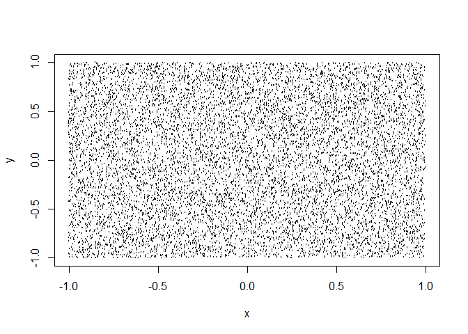
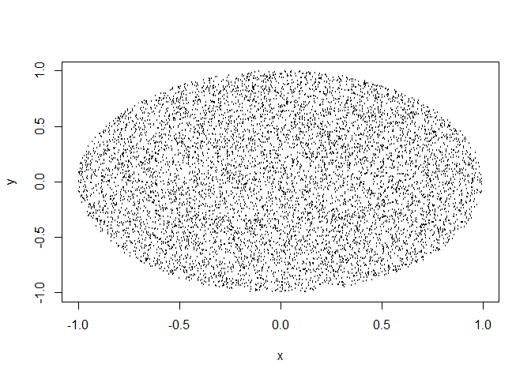

Introducción al muestreo y la inferencia
================

Imaginemos que queremos hallar el área de un círculo pero no sabemos nada de matemáticas. Una cosa que podemos hacer es coger un cuadrado (el área de un cuadrado es mucho más intuitiva) con un círculo inscrito y tirar pelotas que entren dentro. Las que entren dentro del círculo las cuento. Esa proporción de las que entran entre las totales serán el área de un círculo.

Vamos a programar este experimento para comprobarlo:

Definimos un cuadrado y el lanzamiento de 10.000 pelotas:

``` r
N <- 10000

x <- runif(N, -1, 1)  # 10000 valores entre -1 y 1 con una distribución uniforme.

y <- runif(N, -1, 1)

plot(x,y, cex = .1)
```



La ecuación de un círculo de radio 1 es x2 + y2 &lt;= 1. Pintamos sobre el gráfico anterior aquellas pelotas que hayan entrado en el círculo:

``` r
c <- (x^2 + y^2 <= 1)
plot(x, y, cex = .1, col = c) # Pintamos todos los puntos que cumplen esa condición
```



``` r
head(c)  # c es un vector de TRUE y FALSE
```

    ## [1]  TRUE  TRUE  TRUE  TRUE  TRUE FALSE

Calculamos qué proporción con respecto al total ha entrado en el círculo:

``` r
mean(c)  # El 78% de los puntos están dentro
```

    ## [1] 0.7799

Si multiplico eso \* 4 (es la superficie del cuadrado), me dará el número de puntos en el cuadrado.

``` r
mean(c) * 4  
```

    ## [1] 3.1196

Sabemos que el área de un círculo de radio 1 es *π**R*<sup>2</sup> = *π*. Hemos obtenido una buena aproximación del área.

Esto es un buen ejemplo de lo que es la inferencia: mediante una muestra de 10.000 lanzamientos podemos aproximar la realidad que queremos explicar.

Intuitivamente, a mayor N mejor precisión tendremos. No obstante, esto no es lineal (lo veremos). De hecho, es función de $\\sqrt{N}$.
