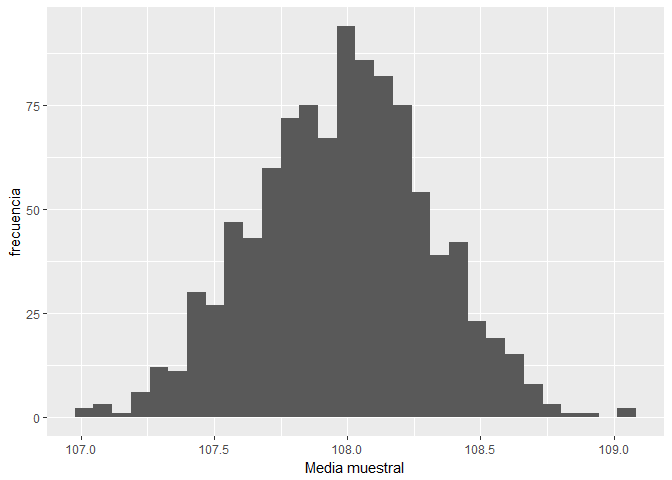

Inferencia
================

Index
-----

1.  [Estimación de la media poblacional](#estimación-de-la-media-poblacional)
2.  [Determinación del tamaño muestral](#determinación-del-tamaño-muestral)
3.  [Contrastes de Hipótesis](#contrastes-de-hipótesis)

Este notebook complementa a la teoría de las presentaciones sobre **inferencia**.

> Inicialización

``` r
library(ggplot2)
```

Estimación de la media poblacional
==================================

``` r
NN=1e6
poblacion=rnorm(NN,108,5)  #distribución de la altura de niñas de 5 años en la población

nn=250 #tamaño muestral
```

Estimación puntual
------------------

``` r
muestra=sample(poblacion,nn) #muestreo simple
mean(muestra) #media muestral de la altura
```

    ## [1] 108.23

``` r
mean(muestra<100) #proporción muestral de niñas con un altura inferior a 1 metro
```

    ## [1] 0.064

Distribución de la media muestral (TCL)
---------------------------------------

``` r
K=1000 #Número de muestras 
medias=replicate(K,mean(sample(poblacion,nn))) 
qplot(medias,ylab="frecuencia",xlab="Media muestral") 
```

    ## `stat_bin()` using `bins = 30`. Pick better value with `binwidth`.



``` r
# Media y std de la media muestral
mean(medias)
```

    ## [1] 107.9813

``` r
sd(medias)
```

    ## [1] 0.3267912

Estimación por intervalos
-------------------------

``` r
t.test(muestra) #intervalo de confianza
```

    ## 
    ##  One Sample t-test
    ## 
    ## data:  muestra
    ## t = 307.6, df = 249, p-value < 2.2e-16
    ## alternative hypothesis: true mean is not equal to 0
    ## 95 percent confidence interval:
    ##  107.537 108.923
    ## sample estimates:
    ## mean of x 
    ##    108.23

``` r
t.test((muestra<100)) #intervalo de confianza para la proporción
```

    ## 
    ##  One Sample t-test
    ## 
    ## data:  (muestra < 100)
    ## t = 4.1262, df = 249, p-value = 5.032e-05
    ## alternative hypothesis: true mean is not equal to 0
    ## 95 percent confidence interval:
    ##  0.03345133 0.09454867
    ## sample estimates:
    ## mean of x 
    ##     0.064

Determinación del tamaño muestral
=================================

``` r
e=.5 #margen de error
alfa=.05 # (1-alfa) es el nivel de confianza
sigma=6 # acotamos la desviación tipica
z=qnorm(1-alfa/2) #cuantil de la normal

nn=ceiling(z^2/e^2*sigma^2) #tamaño muestral requerido
muestra1=sample(poblacion,nn) #muestreo simple
intervalo=t.test(muestra1)$conf.int
intervalo
```

    ## [1] 107.3731 108.1993
    ## attr(,"conf.level")
    ## [1] 0.95

``` r
diff(intervalo)/2 #semi-longitud del interval: margen de error 
```

    ## [1] 0.4131187

Contrastes de hipótesis
=======================

``` r
NN=1e6
poblacion=rnorm(NN,325,10) #distribución del contenido de las botellas de coca-cola

nn=50 #tamaño muestral
muestra2=sample(poblacion,nn) #muestreo simple
```

Contraste unilateral
--------------------

``` r
t.test(muestra2,alternative="less",mu=330)
```

    ## 
    ##  One Sample t-test
    ## 
    ## data:  muestra2
    ## t = -4.111, df = 49, p-value = 7.485e-05
    ## alternative hypothesis: true mean is less than 330
    ## 95 percent confidence interval:
    ##      -Inf 326.3501
    ## sample estimates:
    ## mean of x 
    ##  323.8364

Contraste bilateral
-------------------

``` r
t.test(muestra2,mu=330)
```

    ## 
    ##  One Sample t-test
    ## 
    ## data:  muestra2
    ## t = -4.111, df = 49, p-value = 0.0001497
    ## alternative hypothesis: true mean is not equal to 330
    ## 95 percent confidence interval:
    ##  320.8235 326.8494
    ## sample estimates:
    ## mean of x 
    ##  323.8364

Comparación de medias
---------------------

``` r
poblacionA=rnorm(NN,15,10);poblacionB=rnorm(NN,20,10) 
nA=nB=nn #tamaños muestrales
muestraA=sample(poblacionA,nA) 
muestraB=sample(poblacionB,nB) 
t.test(muestraA,muestraB,var.equal = TRUE)
```

    ## 
    ##  Two Sample t-test
    ## 
    ## data:  muestraA and muestraB
    ## t = -2.6552, df = 98, p-value = 0.00925
    ## alternative hypothesis: true difference in means is not equal to 0
    ## 95 percent confidence interval:
    ##  -8.683389 -1.255384
    ## sample estimates:
    ## mean of x mean of y 
    ##  15.01188  19.98126

Para más contrastes de hipótesis consultar libro Bioestadística.

> **Ejercicio**
>
> Construir intervalos de confianza

``` r
# Esto no lo vamos a hacer nunca (con el t.test nos sale), pero para entender está bien

# Intervalo de confianza para la media muestral

# Construimos una función que obtenga para una población, la media y desv típica de una muestra
resumen <- function() {
  muestra <- sample(poblacion, nn)
  c(media = mean(muestra), ds = sd(muestra))
  
}

res <- replicate(K, resumen())
res <- data.frame(t(res))

# Ahora tengo una fila para cada muestra
res$linf <- res$media - ((1.96*res$ds)/sqrt(nn))
res$lsup <- res$media + ((1.96*res$ds)/sqrt(nn))

# Ahora tengo el intervalo de confianza de cada muestra
# De acuerdo a la teoría, el 95% de esos intervalos tienen que contener la media poblacional (108)

res$acierto <- (res$linf < 108 & 108 < res$lsup)
mean(res$acierto) 
```

    ## [1] 0

``` r
# Esto no sale clavado porque sólo saldrá clavado si utilizo la sd poblacional, no la sd muestral.

res$linft <- res$media - qt(.975, nn-1)*res$ds/sqrt(nn)
res$lsupt <- res$media + qt(.975, nn-1)*res$ds/sqrt(nn)
res$aciertot <- (res$linft <108 & 108 < res$lsupt)
mean(res$aciertot)
```

    ## [1] 0
