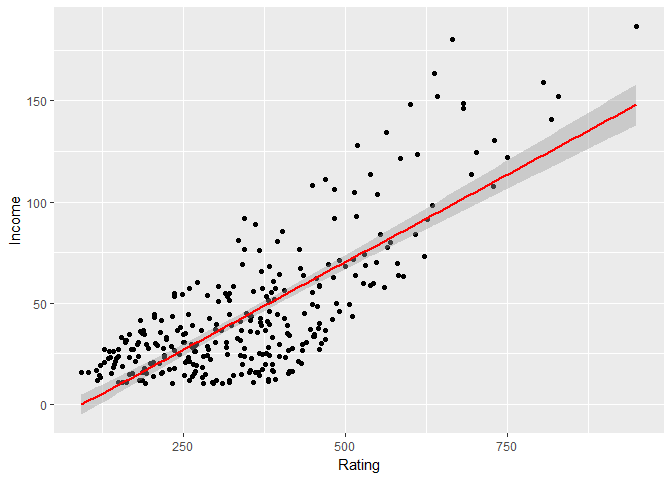

Introducción a la Modelización Estadística
================

Bloque de inicialización de librerías
-------------------------------------

``` r
if(!require("ggplot2")){
  install.packages("ggplot2")
  library("ggplot2")
}
```

    ## Loading required package: ggplot2

``` r
if (!require("gap")){
  install.packages("gap")
  library(gap)
}
```

    ## Loading required package: gap

    ## gap version 1.1-22

PARTE 1: INTRODUCCIÓN A LA REGRESIÓN LINEAL
===========================================

Bloque de carga de datos
------------------------

``` r
creditos=read.csv("data/creditos.csv",stringsAsFactors = FALSE)
```

Bloque de revisión basica del dataset
-------------------------------------

``` r
str(creditos)
```

    ## 'data.frame':    300 obs. of  10 variables:
    ##  $ Income   : num  14.9 106 104.6 148.9 55.9 ...
    ##  $ Rating   : int  283 483 514 681 357 569 259 512 266 491 ...
    ##  $ Products : int  2 3 4 3 2 4 2 2 5 3 ...
    ##  $ Age      : int  34 82 71 36 68 77 37 87 66 41 ...
    ##  $ Education: int  11 15 11 11 16 10 12 9 13 19 ...
    ##  $ Gender   : chr  " Male" "Female" " Male" "Female" ...
    ##  $ Mortgage : chr  "No" "Yes" "No" "No" ...
    ##  $ Married  : chr  "Yes" "Yes" "No" "No" ...
    ##  $ Ethnicity: chr  "Caucasian" "Asian" "Asian" "Asian" ...
    ##  $ Balance  : int  333 903 580 964 331 1151 203 872 279 1350 ...

``` r
head(creditos)
```

    ##    Income Rating Products Age Education Gender Mortgage Married Ethnicity
    ## 1  14.891    283        2  34        11   Male       No     Yes Caucasian
    ## 2 106.025    483        3  82        15 Female      Yes     Yes     Asian
    ## 3 104.593    514        4  71        11   Male       No      No     Asian
    ## 4 148.924    681        3  36        11 Female       No      No     Asian
    ## 5  55.882    357        2  68        16   Male       No     Yes Caucasian
    ## 6  80.180    569        4  77        10   Male       No      No Caucasian
    ##   Balance
    ## 1     333
    ## 2     903
    ## 3     580
    ## 4     964
    ## 5     331
    ## 6    1151

``` r
summary(creditos)
```

    ##      Income           Rating         Products          Age       
    ##  Min.   : 10.35   Min.   : 93.0   Min.   :1.000   Min.   :24.00  
    ##  1st Qu.: 21.03   1st Qu.:235.0   1st Qu.:2.000   1st Qu.:41.00  
    ##  Median : 33.12   Median :339.0   Median :3.000   Median :55.00  
    ##  Mean   : 44.05   Mean   :348.1   Mean   :3.027   Mean   :54.98  
    ##  3rd Qu.: 55.98   3rd Qu.:433.0   3rd Qu.:4.000   3rd Qu.:69.00  
    ##  Max.   :186.63   Max.   :949.0   Max.   :8.000   Max.   :91.00  
    ##    Education        Gender            Mortgage           Married         
    ##  Min.   : 5.00   Length:300         Length:300         Length:300        
    ##  1st Qu.:11.00   Class :character   Class :character   Class :character  
    ##  Median :14.00   Mode  :character   Mode  :character   Mode  :character  
    ##  Mean   :13.39                                                           
    ##  3rd Qu.:16.00                                                           
    ##  Max.   :20.00                                                           
    ##   Ethnicity            Balance       
    ##  Length:300         Min.   :   0.00  
    ##  Class :character   1st Qu.:  15.75  
    ##  Mode  :character   Median : 433.50  
    ##                     Mean   : 502.69  
    ##                     3rd Qu.: 857.75  
    ##                     Max.   :1809.00

Bloque de tratamiento de variables
----------------------------------

``` r
creditos$Gender=as.factor(creditos$Gender)
creditos$Mortgage=as.factor(creditos$Mortgage)
creditos$Married=as.factor(creditos$Married)
creditos$Ethnicity=as.factor(creditos$Ethnicity)
summary(creditos)
```

    ##      Income           Rating         Products          Age       
    ##  Min.   : 10.35   Min.   : 93.0   Min.   :1.000   Min.   :24.00  
    ##  1st Qu.: 21.03   1st Qu.:235.0   1st Qu.:2.000   1st Qu.:41.00  
    ##  Median : 33.12   Median :339.0   Median :3.000   Median :55.00  
    ##  Mean   : 44.05   Mean   :348.1   Mean   :3.027   Mean   :54.98  
    ##  3rd Qu.: 55.98   3rd Qu.:433.0   3rd Qu.:4.000   3rd Qu.:69.00  
    ##  Max.   :186.63   Max.   :949.0   Max.   :8.000   Max.   :91.00  
    ##    Education        Gender    Mortgage  Married              Ethnicity  
    ##  Min.   : 5.00    Male :132   No :268   No :117   African American: 78  
    ##  1st Qu.:11.00   Female:168   Yes: 32   Yes:183   Asian           : 81  
    ##  Median :14.00                                    Caucasian       :141  
    ##  Mean   :13.39                                                          
    ##  3rd Qu.:16.00                                                          
    ##  Max.   :20.00                                                          
    ##     Balance       
    ##  Min.   :   0.00  
    ##  1st Qu.:  15.75  
    ##  Median : 433.50  
    ##  Mean   : 502.69  
    ##  3rd Qu.: 857.75  
    ##  Max.   :1809.00

Bloque de test de diferencia de medias mediante regresion lineal
----------------------------------------------------------------

Una hipótesis que me puedo plantear es: ¿el income depende del sexo?

-   H0: media salario hombres = media salario mujeres
-   H1: distintos

``` r
t.test(Income ~ Gender, data = creditos)
```

    ## 
    ##  Welch Two Sample t-test
    ## 
    ## data:  Income by Gender
    ## t = 0.3395, df = 284.51, p-value = 0.7345
    ## alternative hypothesis: true difference in means is not equal to 0
    ## 95 percent confidence interval:
    ##  -6.405656  9.075923
    ## sample estimates:
    ##  mean in group  Male mean in group Female 
    ##             44.80207             43.46693

p &gt; alpha =&gt; no rechazo H0. No hay diferencia significativa.

La regresión lineal es la evolución de un contraste de hipótesis. Aceptar H0 es lo mismo que que el coeficiente del sexo en la regresión sea 0 mediante un modelo lineal.

``` r
modeloT=lm(Income ~ Gender, data = creditos)
summary(modeloT)
```

    ## 
    ## Call:
    ## lm(formula = Income ~ Gender, data = creditos)
    ## 
    ## Residuals:
    ##    Min     1Q Median     3Q    Max 
    ## -34.45 -22.49 -11.33  11.99 143.17 
    ## 
    ## Coefficients:
    ##              Estimate Std. Error t value Pr(>|t|)    
    ## (Intercept)    44.802      2.952  15.178   <2e-16 ***
    ## GenderFemale   -1.335      3.944  -0.338    0.735    
    ## ---
    ## Signif. codes:  0 '***' 0.001 '**' 0.01 '*' 0.05 '.' 0.1 ' ' 1
    ## 
    ## Residual standard error: 33.91 on 298 degrees of freedom
    ## Multiple R-squared:  0.0003843,  Adjusted R-squared:  -0.00297 
    ## F-statistic: 0.1146 on 1 and 298 DF,  p-value: 0.7352

Y vemos que el p-valor del sexo es el mismo que el del contraste de hipótesis.

La fórmula es y = 44.802 - 1.3\*mujer.

Hay diferencias pero no son significativas (el t no se cumple). Su media es -1.335, pero su desviación es 3.944 (mucho mayor, puede ser + o -)

Para calcular intervalos de confianza: thumb rule -&gt; si al Estimate le sumo: \* 1 std: 68% \* 2 std: 95% \* 3 std: 99%

**Moraleja**: la regresión no es sólo la fórmula, y hablemos siempre de intervalos de confianza y no de valores puntuales. Hay que tener en cuenta toda la salida, que nos da mucha información

Bloque de regresion lineal individual
-------------------------------------

``` r
modeloInd1=lm(Income ~ Rating, data = creditos)
summary(modeloInd1)
```

    ## 
    ## Call:
    ## lm(formula = Income ~ Rating, data = creditos)
    ## 
    ## Residuals:
    ##    Min     1Q Median     3Q    Max 
    ## -40.05 -15.74  -0.80  14.14  81.48 
    ## 
    ## Coefficients:
    ##               Estimate Std. Error t value Pr(>|t|)    
    ## (Intercept) -16.200514   3.139692   -5.16 4.52e-07 ***
    ## Rating        0.173088   0.008278   20.91  < 2e-16 ***
    ## ---
    ## Signif. codes:  0 '***' 0.001 '**' 0.01 '*' 0.05 '.' 0.1 ' ' 1
    ## 
    ## Residual standard error: 21.59 on 298 degrees of freedom
    ## Multiple R-squared:  0.5947, Adjusted R-squared:  0.5933 
    ## F-statistic: 437.3 on 1 and 298 DF,  p-value: < 2.2e-16

Tiene un R2 que parece muy bajo. Entonces digo que el rating no influye en el ingreso? NO: me está diciendo que calculo un 57% de la varianza de los ingresos con el rating. Me dice que hay otras variables que explican los ingresos, pero no me dice que el rating sea malo. De hecho, viendo el t test es bueno.

Habría que calcular el intervalo (porque lo puntual no me vale), y siempre teniendo en cuenta que los intervalos son a una confianza.

Bloque de representación gráfica
--------------------------------

``` r
ggplot(creditos, aes(x = Rating, y = Income)) + geom_point() + 
  geom_smooth(method = "lm", se=TRUE, color="red", formula = y ~ x)
```



¿Qué nos parece? Podría parecer que la recta no se ajusta bien, pero es que es imposible!! Para un rating de 250 hay muchos valores de income, por lo que NUNCA con la misma fórmula podré obtener varios valores de income para un valor de rating.

Sin embargo sí que se ve que más o menos, para los rating de 250, la recta está en la media.

Esto es lo que se busca con la regresión -&gt; **GENERALIZAR**. No podemos acertar siempre porque no se puede, por definición, no porque el modelo sea malo. El modelo, por definición, no puede pasar por todos los puntos.

Bloque de regresion lineal otras variables
------------------------------------------

``` r
modeloInd2=lm(Income ~ Products, data = creditos)
summary(modeloInd2)
```

    ## 
    ## Call:
    ## lm(formula = Income ~ Products, data = creditos)
    ## 
    ## Residuals:
    ##    Min     1Q Median     3Q    Max 
    ## -36.86 -22.28 -10.90  12.55 143.32 
    ## 
    ## Coefficients:
    ##             Estimate Std. Error t value Pr(>|t|)    
    ## (Intercept)  41.8640     4.8091   8.705   <2e-16 ***
    ## Products      0.7237     1.4513   0.499    0.618    
    ## ---
    ## Signif. codes:  0 '***' 0.001 '**' 0.01 '*' 0.05 '.' 0.1 ' ' 1
    ## 
    ## Residual standard error: 33.91 on 298 degrees of freedom
    ## Multiple R-squared:  0.0008337,  Adjusted R-squared:  -0.002519 
    ## F-statistic: 0.2487 on 1 and 298 DF,  p-value: 0.6184

No es intuitivo income en función de productos, si no al revés. Pero esque esto es correlación, no causa-efecto.

Nos quitamos de la cabeza causa-efecto, la correlación es simétrica. Para ver la relación entre variables (que es lo que yo quiero ver), no me hace falta causa-efecto.

Viendo el t-test, la conclusión que sacamos es que con NUESTROS DATOS, no podemos concluir que hay un efecto entre productos e ingreso. Podría pasar que con otros datos sí saliera significativo. Con muchos datos hay cosas que pueden salir significativas, y hay que tener cuidado con eso.

``` r
modeloInd3=lm(Income ~ Age, data = creditos)
summary(modeloInd3)
```

    ## 
    ## Call:
    ## lm(formula = Income ~ Age, data = creditos)
    ## 
    ## Residuals:
    ##    Min     1Q Median     3Q    Max 
    ## -37.58 -23.34 -10.35  10.45 145.97 
    ## 
    ## Coefficients:
    ##             Estimate Std. Error t value Pr(>|t|)    
    ## (Intercept)  30.7310     6.5135   4.718 3.67e-06 ***
    ## Age           0.2423     0.1131   2.143   0.0329 *  
    ## ---
    ## Signif. codes:  0 '***' 0.001 '**' 0.01 '*' 0.05 '.' 0.1 ' ' 1
    ## 
    ## Residual standard error: 33.66 on 298 degrees of freedom
    ## Multiple R-squared:  0.01518,    Adjusted R-squared:  0.01187 
    ## F-statistic: 4.593 on 1 and 298 DF,  p-value: 0.03291

Ahora con esto vemos que el p-valor está ahí ahí. Y ¿por qué el 0.05? Es por convención. Hace dos años la ASA dijo que era un error fijarse en el 0.05.

Detectaron lo siguiente: con un nivel de confianza del 95%, de cada 20 experimentos, 1 te va a salir significativo. Por tanto, si repito el experimento 20 veces, o lo hacen 20 personas distintas, 1 por azar va a salir significativo, y eso se publica.

<https://www.amstat.org/asa/files/pdfs/P-ValueStatement.pdf>

Hay que tener cuidado con el 95%: de cada 20 preguntas que me haga con datos, 1 la voy a responder por azar. Si a los datos les estrujas, al final sale lo que quieras.

**Moraleja**: a no ser que las conclusiones sean MUY claras, o tenga otros datos para contrastar, cuidado.

``` r
modeloInd4=lm(Income ~ Education, data = creditos)
summary(modeloInd4)
```

    ## 
    ## Call:
    ## lm(formula = Income ~ Education, data = creditos)
    ## 
    ## Residuals:
    ##    Min     1Q Median     3Q    Max 
    ## -38.65 -22.54 -11.81  12.12 143.05 
    ## 
    ## Coefficients:
    ##             Estimate Std. Error t value Pr(>|t|)    
    ## (Intercept)  54.5197     8.7430   6.236 1.54e-09 ***
    ## Education    -0.7814     0.6363  -1.228     0.22    
    ## ---
    ## Signif. codes:  0 '***' 0.001 '**' 0.01 '*' 0.05 '.' 0.1 ' ' 1
    ## 
    ## Residual standard error: 33.83 on 298 degrees of freedom
    ## Multiple R-squared:  0.005035,   Adjusted R-squared:  0.001696 
    ## F-statistic: 1.508 on 1 and 298 DF,  p-value: 0.2204

Sale que el ingreso no depende de la educación. Por qué? Porque está relacionado con la edad: las personas de más edad son las que más salario tienen, y además hay un sesgo porque antes se estudiaba menos.

``` r
modeloInd5=lm(Income ~ Gender, data = creditos)
summary(modeloInd5)
```

    ## 
    ## Call:
    ## lm(formula = Income ~ Gender, data = creditos)
    ## 
    ## Residuals:
    ##    Min     1Q Median     3Q    Max 
    ## -34.45 -22.49 -11.33  11.99 143.17 
    ## 
    ## Coefficients:
    ##              Estimate Std. Error t value Pr(>|t|)    
    ## (Intercept)    44.802      2.952  15.178   <2e-16 ***
    ## GenderFemale   -1.335      3.944  -0.338    0.735    
    ## ---
    ## Signif. codes:  0 '***' 0.001 '**' 0.01 '*' 0.05 '.' 0.1 ' ' 1
    ## 
    ## Residual standard error: 33.91 on 298 degrees of freedom
    ## Multiple R-squared:  0.0003843,  Adjusted R-squared:  -0.00297 
    ## F-statistic: 0.1146 on 1 and 298 DF,  p-value: 0.7352

``` r
modeloInd6=lm(Income ~ Mortgage, data = creditos)
summary(modeloInd6)
```

    ## 
    ## Call:
    ## lm(formula = Income ~ Mortgage, data = creditos)
    ## 
    ## Residuals:
    ##    Min     1Q Median     3Q    Max 
    ## -38.64 -22.94 -10.58  12.06 143.20 
    ## 
    ## Coefficients:
    ##             Estimate Std. Error t value Pr(>|t|)    
    ## (Intercept)   43.432      2.069  20.991   <2e-16 ***
    ## MortgageYes    5.833      6.335   0.921    0.358    
    ## ---
    ## Signif. codes:  0 '***' 0.001 '**' 0.01 '*' 0.05 '.' 0.1 ' ' 1
    ## 
    ## Residual standard error: 33.87 on 298 degrees of freedom
    ## Multiple R-squared:  0.002837,   Adjusted R-squared:  -0.0005095 
    ## F-statistic: 0.8477 on 1 and 298 DF,  p-value: 0.3579

``` r
modeloInd7=lm(Income ~ Married, data = creditos)
summary(modeloInd7)
```

    ## 
    ## Call:
    ## lm(formula = Income ~ Married, data = creditos)
    ## 
    ## Residuals:
    ##    Min     1Q Median     3Q    Max 
    ## -34.76 -22.74 -10.78  11.93 141.53 
    ## 
    ## Coefficients:
    ##             Estimate Std. Error t value Pr(>|t|)    
    ## (Intercept)   42.404      3.134  13.533   <2e-16 ***
    ## MarriedYes     2.705      4.012   0.674    0.501    
    ## ---
    ## Signif. codes:  0 '***' 0.001 '**' 0.01 '*' 0.05 '.' 0.1 ' ' 1
    ## 
    ## Residual standard error: 33.89 on 298 degrees of freedom
    ## Multiple R-squared:  0.001523,   Adjusted R-squared:  -0.001828 
    ## F-statistic: 0.4545 on 1 and 298 DF,  p-value: 0.5007

``` r
modeloInd8=lm(Income ~ Ethnicity, data = creditos)
summary(modeloInd8)
```

    ## 
    ## Call:
    ## lm(formula = Income ~ Ethnicity, data = creditos)
    ## 
    ## Residuals:
    ##    Min     1Q Median     3Q    Max 
    ## -36.14 -22.87 -11.75  12.21 139.99 
    ## 
    ## Coefficients:
    ##                    Estimate Std. Error t value Pr(>|t|)    
    ## (Intercept)          46.641      3.843  12.136   <2e-16 ***
    ## EthnicityAsian       -3.557      5.384  -0.661    0.509    
    ## EthnicityCaucasian   -3.461      4.790  -0.723    0.471    
    ## ---
    ## Signif. codes:  0 '***' 0.001 '**' 0.01 '*' 0.05 '.' 0.1 ' ' 1
    ## 
    ## Residual standard error: 33.94 on 297 degrees of freedom
    ## Multiple R-squared:  0.002059,   Adjusted R-squared:  -0.004661 
    ## F-statistic: 0.3064 on 2 and 297 DF,  p-value: 0.7363

``` r
modeloInd9=lm(Income ~ Balance, data = creditos)
summary(modeloInd9)
```

    ## 
    ## Call:
    ## lm(formula = Income ~ Balance, data = creditos)
    ## 
    ## Residuals:
    ##     Min      1Q  Median      3Q     Max 
    ## -57.246 -17.986  -5.543   9.792 119.167 
    ## 
    ## Coefficients:
    ##              Estimate Std. Error t value Pr(>|t|)    
    ## (Intercept) 28.295463   2.596872  10.896  < 2e-16 ***
    ## Balance      0.031349   0.003788   8.277  4.3e-15 ***
    ## ---
    ## Signif. codes:  0 '***' 0.001 '**' 0.01 '*' 0.05 '.' 0.1 ' ' 1
    ## 
    ## Residual standard error: 30.59 on 298 degrees of freedom
    ## Multiple R-squared:  0.1869, Adjusted R-squared:  0.1842 
    ## F-statistic:  68.5 on 1 and 298 DF,  p-value: 4.3e-15

Bloque de regresion lineal multiple
-----------------------------------

``` r
modeloGlobal=lm(Income ~ ., data = creditos)
summary(modeloGlobal)
```

    ## 
    ## Call:
    ## lm(formula = Income ~ ., data = creditos)
    ## 
    ## Residuals:
    ##     Min      1Q  Median      3Q     Max 
    ## -19.484  -7.151  -2.572   5.736  33.034 
    ## 
    ## Coefficients:
    ##                      Estimate Std. Error t value Pr(>|t|)    
    ## (Intercept)        -55.765554   4.614857 -12.084   <2e-16 ***
    ## Rating               0.414226   0.009515  43.533   <2e-16 ***
    ## Products             0.194289   0.480488   0.404    0.686    
    ## Age                 -0.020811   0.038354  -0.543    0.588    
    ## Education           -0.114133   0.210614  -0.542    0.588    
    ## GenderFemale        -1.042506   1.296913  -0.804    0.422    
    ## MortgageYes         39.923786   2.455449  16.259   <2e-16 ***
    ## MarriedYes          -1.028593   1.337745  -0.769    0.443    
    ## EthnicityAsian       1.740019   1.782636   0.976    0.330    
    ## EthnicityCaucasian   0.291304   1.571722   0.185    0.853    
    ## Balance             -0.091405   0.003220 -28.386   <2e-16 ***
    ## ---
    ## Signif. codes:  0 '***' 0.001 '**' 0.01 '*' 0.05 '.' 0.1 ' ' 1
    ## 
    ## Residual standard error: 11.08 on 289 degrees of freedom
    ## Multiple R-squared:  0.8965, Adjusted R-squared:  0.893 
    ## F-statistic: 250.4 on 10 and 289 DF,  p-value: < 2.2e-16

Vemos que el coeficiente de las mortgages es muy alto (el promedio de income era 44 y esto me dice que tener hipoteca me dobla el income) -&gt; puede indicar multicolinealidad.

Bloque de comparacion de modelos
--------------------------------

``` r
anova(modeloInd1,modeloGlobal)
```

    ## Analysis of Variance Table
    ## 
    ## Model 1: Income ~ Rating
    ## Model 2: Income ~ Rating + Products + Age + Education + Gender + Mortgage + 
    ##     Married + Ethnicity + Balance
    ##   Res.Df    RSS Df Sum of Sq      F    Pr(>F)    
    ## 1    298 138964                                  
    ## 2    289  35476  9    103488 93.673 < 2.2e-16 ***
    ## ---
    ## Signif. codes:  0 '***' 0.001 '**' 0.01 '*' 0.05 '.' 0.1 ' ' 1

Bloque de análisis del modelo
-----------------------------

``` r
modeloFinal=lm(Income ~ Rating+Mortgage+Balance, data = creditos)
summary(modeloFinal)
```

    ## 
    ## Call:
    ## lm(formula = Income ~ Rating + Mortgage + Balance, data = creditos)
    ## 
    ## Residuals:
    ##     Min      1Q  Median      3Q     Max 
    ## -20.263  -7.425  -2.544   6.158  32.580 
    ## 
    ## Coefficients:
    ##               Estimate Std. Error t value Pr(>|t|)    
    ## (Intercept) -58.178638   2.153774  -27.01   <2e-16 ***
    ## Rating        0.412810   0.009254   44.61   <2e-16 ***
    ## MortgageYes  39.811486   2.408393   16.53   <2e-16 ***
    ## Balance      -0.090950   0.003122  -29.13   <2e-16 ***
    ## ---
    ## Signif. codes:  0 '***' 0.001 '**' 0.01 '*' 0.05 '.' 0.1 ' ' 1
    ## 
    ## Residual standard error: 11 on 296 degrees of freedom
    ## Multiple R-squared:  0.8955, Adjusted R-squared:  0.8944 
    ## F-statistic: 845.1 on 3 and 296 DF,  p-value: < 2.2e-16

``` r
plot(modeloFinal$residuals)
```


``` r
hist(modeloFinal$residuals)
```


Parece que no son normales. Pero con estos datos no voy a conseguirlo. Pues, o tiro los datos, o me conformo con esto que es lo mejor de lo posible.

``` r
qqnorm(modeloFinal$residuals); qqline(modeloFinal$residuals,col=2)
```


``` r
confint(modeloFinal,level=0.95)
```

    ##                    2.5 %       97.5 %
    ## (Intercept) -62.41728868 -53.93998677
    ## Rating        0.39459856   0.43102128
    ## MortgageYes  35.07174280  44.55122908
    ## Balance      -0.09709433  -0.08480642

La correlación de los residuos y las variables independientes tiene que ser 0 (exogeneidad débil)

``` r
cor(modeloFinal$residuals,creditos$Rating)
```

    ## [1] -1.106537e-16

``` r
cor(modeloFinal$residuals,creditos$Balance)
```

    ## [1] -1.971824e-17

Como habíamos dicho, ya sólo por usar MCO eso tiene que ser 0.

``` r
boxplot(modeloFinal$residuals~creditos$Mortgage)
```


``` r
aggregate(modeloFinal$residuals~creditos$Mortgage,FUN=mean)
```

    ##   creditos$Mortgage modeloFinal$residuals
    ## 1                No          8.785921e-17
    ## 2               Yes         -3.989864e-16

``` r
shapiro.test(modeloFinal$residual)  # Test de normalidad
```

    ## 
    ##  Shapiro-Wilk normality test
    ## 
    ## data:  modeloFinal$residual
    ## W = 0.94999, p-value = 1.396e-08

``` r
anova(modeloFinal,modeloGlobal)  
```

    ## Analysis of Variance Table
    ## 
    ## Model 1: Income ~ Rating + Mortgage + Balance
    ## Model 2: Income ~ Rating + Products + Age + Education + Gender + Mortgage + 
    ##     Married + Ethnicity + Balance
    ##   Res.Df   RSS Df Sum of Sq      F Pr(>F)
    ## 1    296 35847                           
    ## 2    289 35476  7     370.7 0.4314 0.8822

Esto me compara mi modelo con el modelo completo. Nos dice que NO hay diferencias significativas entre ambos modelos. ¿Con cuál me quedo? Con el más simple.

Bloque de analisis de variable Balance
--------------------------------------

``` r
modeloBalance=lm(Balance ~ ., data = creditos)  # Balance en función del resto de variables.
summary(modeloBalance)
```

    ## 
    ## Call:
    ## lm(formula = Balance ~ ., data = creditos)
    ## 
    ## Residuals:
    ##     Min      1Q  Median      3Q     Max 
    ## -196.28  -83.07  -12.69   63.88  310.43 
    ## 
    ## Coefficients:
    ##                      Estimate Std. Error t value Pr(>|t|)    
    ## (Intercept)        -542.32300   42.50152 -12.760   <2e-16 ***
    ## Income               -8.05229    0.28367 -28.386   <2e-16 ***
    ## Rating                4.03048    0.06378  63.189   <2e-16 ***
    ## Products              5.86109    4.49787   1.303   0.1936    
    ## Age                  -0.77749    0.35725  -2.176   0.0303 *  
    ## Education            -1.41408    1.97605  -0.716   0.4748    
    ## GenderFemale         -5.91052   12.18127  -0.485   0.6279    
    ## MortgageYes         425.89676   19.73226  21.584   <2e-16 ***
    ## MarriedYes          -10.20768   12.55437  -0.813   0.4168    
    ## EthnicityAsian       13.03881   16.74156   0.779   0.4367    
    ## EthnicityCaucasian    2.56574   14.75205   0.174   0.8620    
    ## ---
    ## Signif. codes:  0 '***' 0.001 '**' 0.01 '*' 0.05 '.' 0.1 ' ' 1
    ## 
    ## Residual standard error: 104 on 289 degrees of freedom
    ## Multiple R-squared:  0.9521, Adjusted R-squared:  0.9504 
    ## F-statistic: 574.1 on 10 and 289 DF,  p-value: < 2.2e-16

Vemos que el income es negativo. ¿A más balance tiene menos income? ¿Qué sentido tiene?

**Ceteris paribus**: el truco está en el rating. Ese -8.05 es a igualdad de rating. Es decir, a igualdad de rating, a menos income más balance -&gt; claro, si el rating es igual y tengo más ingresos, es porque tengo que tener menos balance.

Ojo con el ceteris páribus! Como hay colinealidad, cuidado.

Bloque de modelado (stepwise) backward
--------------------------------------

Para elegir el mejor modelo (es decir, con qué variables me sale el mejor modelo ):

``` r
ModelAutoBackward=step(modeloBalance,direction="backward",trace=1)
```

    ## Start:  AIC=2797.37
    ## Balance ~ Income + Rating + Products + Age + Education + Gender + 
    ##     Mortgage + Married + Ethnicity
    ## 
    ##             Df Sum of Sq      RSS    AIC
    ## - Ethnicity  2      7766  3132979 2794.1
    ## - Gender     1      2546  3127759 2795.6
    ## - Education  1      5538  3130751 2795.9
    ## - Married    1      7149  3132362 2796.1
    ## - Products   1     18362  3143575 2797.1
    ## <none>                    3125213 2797.4
    ## - Age        1     51218  3176431 2800.2
    ## - Mortgage   1   5037751  8162964 3083.4
    ## - Income     1   8713718 11838931 3194.9
    ## - Rating     1  43178259 46303472 3604.1
    ## 
    ## Step:  AIC=2794.11
    ## Balance ~ Income + Rating + Products + Age + Education + Gender + 
    ##     Mortgage + Married
    ## 
    ##             Df Sum of Sq      RSS    AIC
    ## - Gender     1      2766  3135745 2792.4
    ## - Education  1      5433  3138413 2792.6
    ## - Married    1      5448  3138428 2792.6
    ## - Products   1     18681  3151661 2793.9
    ## <none>                    3132979 2794.1
    ## - Age        1     53341  3186321 2797.2
    ## - Mortgage   1   5085003  8217982 3081.4
    ## - Income     1   8707017 11839996 3191.0
    ## - Rating     1  43367667 46500646 3601.4
    ## 
    ## Step:  AIC=2792.38
    ## Balance ~ Income + Rating + Products + Age + Education + Mortgage + 
    ##     Married
    ## 
    ##             Df Sum of Sq      RSS    AIC
    ## - Education  1      5395  3141140 2790.9
    ## - Married    1      5487  3141232 2790.9
    ## - Products   1     19263  3155008 2792.2
    ## <none>                    3135745 2792.4
    ## - Age        1     54888  3190633 2795.6
    ## - Mortgage   1   5107141  8242886 3080.3
    ## - Income     1   8710835 11846580 3189.1
    ## - Rating     1  43392839 46528584 3599.5
    ## 
    ## Step:  AIC=2790.89
    ## Balance ~ Income + Rating + Products + Age + Mortgage + Married
    ## 
    ##            Df Sum of Sq      RSS    AIC
    ## - Married   1      5754  3146894 2789.4
    ## - Products  1     18716  3159856 2790.7
    ## <none>                   3141140 2790.9
    ## - Age       1     53602  3194742 2794.0
    ## - Mortgage  1   5106930  8248070 3078.5
    ## - Income    1   8715537 11856677 3187.4
    ## - Rating    1  43676032 46817172 3599.4
    ## 
    ## Step:  AIC=2789.44
    ## Balance ~ Income + Rating + Products + Age + Mortgage
    ## 
    ##            Df Sum of Sq      RSS    AIC
    ## - Products  1     18957  3165851 2789.2
    ## <none>                   3146894 2789.4
    ## - Age       1     50682  3197576 2792.2
    ## - Mortgage  1   5171401  8318295 3079.1
    ## - Income    1   8714213 11861107 3185.5
    ## - Rating    1  43736206 46883100 3597.8
    ## 
    ## Step:  AIC=2789.24
    ## Balance ~ Income + Rating + Age + Mortgage
    ## 
    ##            Df Sum of Sq      RSS    AIC
    ## <none>                   3165851 2789.2
    ## - Age       1     47099  3212949 2791.7
    ## - Mortgage  1   5174191  8340042 3077.8
    ## - Income    1   8834453 12000304 3187.0
    ## - Rating    1  44604502 47770352 3601.4

``` r
summary(ModelAutoBackward)
```

    ## 
    ## Call:
    ## lm(formula = Balance ~ Income + Rating + Age + Mortgage, data = creditos)
    ## 
    ## Residuals:
    ##      Min       1Q   Median       3Q      Max 
    ## -198.400  -85.419   -6.922   60.237  304.484 
    ## 
    ## Coefficients:
    ##               Estimate Std. Error t value Pr(>|t|)    
    ## (Intercept) -551.94937   25.11052 -21.981   <2e-16 ***
    ## Income        -8.06708    0.28116 -28.692   <2e-16 ***
    ## Rating         4.03629    0.06261  64.470   <2e-16 ***
    ## Age           -0.73768    0.35213  -2.095    0.037 *  
    ## MortgageYes  426.44348   19.42113  21.958   <2e-16 ***
    ## ---
    ## Signif. codes:  0 '***' 0.001 '**' 0.01 '*' 0.05 '.' 0.1 ' ' 1
    ## 
    ## Residual standard error: 103.6 on 295 degrees of freedom
    ## Multiple R-squared:  0.9514, Adjusted R-squared:  0.9508 
    ## F-statistic:  1445 on 4 and 295 DF,  p-value: < 2.2e-16

Empieza con el modelo entero, mide su AIC, y va quitando variables, va analizando todas las combinaciones y al final se queda con el mejor.

``` r
ModelAutoStepwise=step(modeloBalance,direction="both",trace=1)  # backward y stepwise
```

    ## Start:  AIC=2797.37
    ## Balance ~ Income + Rating + Products + Age + Education + Gender + 
    ##     Mortgage + Married + Ethnicity
    ## 
    ##             Df Sum of Sq      RSS    AIC
    ## - Ethnicity  2      7766  3132979 2794.1
    ## - Gender     1      2546  3127759 2795.6
    ## - Education  1      5538  3130751 2795.9
    ## - Married    1      7149  3132362 2796.1
    ## - Products   1     18362  3143575 2797.1
    ## <none>                    3125213 2797.4
    ## - Age        1     51218  3176431 2800.2
    ## - Mortgage   1   5037751  8162964 3083.4
    ## - Income     1   8713718 11838931 3194.9
    ## - Rating     1  43178259 46303472 3604.1
    ## 
    ## Step:  AIC=2794.11
    ## Balance ~ Income + Rating + Products + Age + Education + Gender + 
    ##     Mortgage + Married
    ## 
    ##             Df Sum of Sq      RSS    AIC
    ## - Gender     1      2766  3135745 2792.4
    ## - Education  1      5433  3138413 2792.6
    ## - Married    1      5448  3138428 2792.6
    ## - Products   1     18681  3151661 2793.9
    ## <none>                    3132979 2794.1
    ## - Age        1     53341  3186321 2797.2
    ## + Ethnicity  2      7766  3125213 2797.4
    ## - Mortgage   1   5085003  8217982 3081.4
    ## - Income     1   8707017 11839996 3191.0
    ## - Rating     1  43367667 46500646 3601.4
    ## 
    ## Step:  AIC=2792.38
    ## Balance ~ Income + Rating + Products + Age + Education + Mortgage + 
    ##     Married
    ## 
    ##             Df Sum of Sq      RSS    AIC
    ## - Education  1      5395  3141140 2790.9
    ## - Married    1      5487  3141232 2790.9
    ## - Products   1     19263  3155008 2792.2
    ## <none>                    3135745 2792.4
    ## + Gender     1      2766  3132979 2794.1
    ## - Age        1     54888  3190633 2795.6
    ## + Ethnicity  2      7986  3127759 2795.6
    ## - Mortgage   1   5107141  8242886 3080.3
    ## - Income     1   8710835 11846580 3189.1
    ## - Rating     1  43392839 46528584 3599.5
    ## 
    ## Step:  AIC=2790.89
    ## Balance ~ Income + Rating + Products + Age + Mortgage + Married
    ## 
    ##             Df Sum of Sq      RSS    AIC
    ## - Married    1      5754  3146894 2789.4
    ## - Products   1     18716  3159856 2790.7
    ## <none>                    3141140 2790.9
    ## + Education  1      5395  3135745 2792.4
    ## + Gender     1      2727  3138413 2792.6
    ## - Age        1     53602  3194742 2794.0
    ## + Ethnicity  2      7882  3133258 2794.1
    ## - Mortgage   1   5106930  8248070 3078.5
    ## - Income     1   8715537 11856677 3187.4
    ## - Rating     1  43676032 46817172 3599.4
    ## 
    ## Step:  AIC=2789.44
    ## Balance ~ Income + Rating + Products + Age + Mortgage
    ## 
    ##             Df Sum of Sq      RSS    AIC
    ## - Products   1     18957  3165851 2789.2
    ## <none>                    3146894 2789.4
    ## + Married    1      5754  3141140 2790.9
    ## + Education  1      5661  3141232 2790.9
    ## + Gender     1      2766  3144128 2791.2
    ## - Age        1     50682  3197576 2792.2
    ## + Ethnicity  2      6106  3140788 2792.9
    ## - Mortgage   1   5171401  8318295 3079.1
    ## - Income     1   8714213 11861107 3185.5
    ## - Rating     1  43736206 46883100 3597.8
    ## 
    ## Step:  AIC=2789.24
    ## Balance ~ Income + Rating + Age + Mortgage
    ## 
    ##             Df Sum of Sq      RSS    AIC
    ## <none>                    3165851 2789.2
    ## + Products   1     18957  3146894 2789.4
    ## + Married    1      5995  3159856 2790.7
    ## + Education  1      5103  3160748 2790.8
    ## + Gender     1      3346  3162505 2790.9
    ## - Age        1     47099  3212949 2791.7
    ## + Ethnicity  2      6393  3159458 2792.6
    ## - Mortgage   1   5174191  8340042 3077.8
    ## - Income     1   8834453 12000304 3187.0
    ## - Rating     1  44604502 47770352 3601.4

``` r
summary(ModelAutoStepwise)
```

    ## 
    ## Call:
    ## lm(formula = Balance ~ Income + Rating + Age + Mortgage, data = creditos)
    ## 
    ## Residuals:
    ##      Min       1Q   Median       3Q      Max 
    ## -198.400  -85.419   -6.922   60.237  304.484 
    ## 
    ## Coefficients:
    ##               Estimate Std. Error t value Pr(>|t|)    
    ## (Intercept) -551.94937   25.11052 -21.981   <2e-16 ***
    ## Income        -8.06708    0.28116 -28.692   <2e-16 ***
    ## Rating         4.03629    0.06261  64.470   <2e-16 ***
    ## Age           -0.73768    0.35213  -2.095    0.037 *  
    ## MortgageYes  426.44348   19.42113  21.958   <2e-16 ***
    ## ---
    ## Signif. codes:  0 '***' 0.001 '**' 0.01 '*' 0.05 '.' 0.1 ' ' 1
    ## 
    ## Residual standard error: 103.6 on 295 degrees of freedom
    ## Multiple R-squared:  0.9514, Adjusted R-squared:  0.9508 
    ## F-statistic:  1445 on 4 and 295 DF,  p-value: < 2.2e-16

``` r
anova(ModelAutoBackward,modeloBalance)
```

    ## Analysis of Variance Table
    ## 
    ## Model 1: Balance ~ Income + Rating + Age + Mortgage
    ## Model 2: Balance ~ Income + Rating + Products + Age + Education + Gender + 
    ##     Mortgage + Married + Ethnicity
    ##   Res.Df     RSS Df Sum of Sq      F Pr(>F)
    ## 1    295 3165851                           
    ## 2    289 3125213  6     40638 0.6263 0.7092

``` r
anova(ModelAutoStepwise,modeloBalance)
```

    ## Analysis of Variance Table
    ## 
    ## Model 1: Balance ~ Income + Rating + Age + Mortgage
    ## Model 2: Balance ~ Income + Rating + Products + Age + Education + Gender + 
    ##     Mortgage + Married + Ethnicity
    ##   Res.Df     RSS Df Sum of Sq      F Pr(>F)
    ## 1    295 3165851                           
    ## 2    289 3125213  6     40638 0.6263 0.7092

PARTE 2: REGRESIÓN MÚLTIPLE: APLICACIONES AL ESTUDIO DE LA OFERTA Y LA DEMANDA
==============================================================================

Bloque de carga de datos
------------------------

``` r
Ventas=read.csv2("data/ventas.csv",stringsAsFactors = FALSE)
```

Bloque de revisión basica del dataset
-------------------------------------

``` r
str(Ventas)
```

    ## 'data.frame':    2190 obs. of  4 variables:
    ##  $ Fecha   : chr  "2014-01-06" "2014-02-28" "2014-01-03" "2013-08-11" ...
    ##  $ Producto: chr  "A0143" "A0143" "A0143" "A0143" ...
    ##  $ Precio  : num  4.39 4.42 4.4 4.34 7.7 4.3 7.61 7.84 4.34 4.67 ...
    ##  $ Cantidad: int  2334 2174 2367 2032 1241 2460 1795 1869 1926 2089 ...

``` r
head(Ventas)
```

    ##        Fecha Producto Precio Cantidad
    ## 1 2014-01-06    A0143   4.39     2334
    ## 2 2014-02-28    A0143   4.42     2174
    ## 3 2014-01-03    A0143   4.40     2367
    ## 4 2013-08-11    A0143   4.34     2032
    ## 5 2014-05-01    A0351   7.70     1241
    ## 6 2013-04-03    A0143   4.30     2460

``` r
summary(Ventas)
```

    ##     Fecha             Producto             Precio         Cantidad   
    ##  Length:2190        Length:2190        Min.   :4.250   Min.   : 985  
    ##  Class :character   Class :character   1st Qu.:4.460   1st Qu.:1327  
    ##  Mode  :character   Mode  :character   Median :6.020   Median :1768  
    ##                                        Mean   :6.107   Mean   :1767  
    ##                                        3rd Qu.:7.750   3rd Qu.:2176  
    ##                                        Max.   :8.120   Max.   :2712

Bloque de formateo de variables
-------------------------------

``` r
Ventas$Fecha=as.Date(Ventas$Fecha)
Ventas$Producto=as.factor(Ventas$Producto)

str(Ventas)
```

    ## 'data.frame':    2190 obs. of  4 variables:
    ##  $ Fecha   : Date, format: "2014-01-06" "2014-02-28" ...
    ##  $ Producto: Factor w/ 2 levels "A0143","A0351": 1 1 1 1 2 1 2 2 1 1 ...
    ##  $ Precio  : num  4.39 4.42 4.4 4.34 7.7 4.3 7.61 7.84 4.34 4.67 ...
    ##  $ Cantidad: int  2334 2174 2367 2032 1241 2460 1795 1869 1926 2089 ...

``` r
head(Ventas)
```

    ##        Fecha Producto Precio Cantidad
    ## 1 2014-01-06    A0143   4.39     2334
    ## 2 2014-02-28    A0143   4.42     2174
    ## 3 2014-01-03    A0143   4.40     2367
    ## 4 2013-08-11    A0143   4.34     2032
    ## 5 2014-05-01    A0351   7.70     1241
    ## 6 2013-04-03    A0143   4.30     2460

``` r
summary(Ventas)
```

    ##      Fecha             Producto        Precio         Cantidad   
    ##  Min.   :2013-01-01   A0143:1095   Min.   :4.250   Min.   : 985  
    ##  1st Qu.:2013-10-01   A0351:1095   1st Qu.:4.460   1st Qu.:1327  
    ##  Median :2014-07-02                Median :6.020   Median :1768  
    ##  Mean   :2014-07-02                Mean   :6.107   Mean   :1767  
    ##  3rd Qu.:2015-04-01                3rd Qu.:7.750   3rd Qu.:2176  
    ##  Max.   :2015-12-31                Max.   :8.120   Max.   :2712

Bloque de Estimación de ventas en función al precio
---------------------------------------------------

``` r
modelo1=lm(Cantidad~Precio,data=Ventas)
summary(modelo1)
```

    ## 
    ## Call:
    ## lm(formula = Cantidad ~ Precio, data = Ventas)
    ## 
    ## Residuals:
    ##    Min     1Q Median     3Q    Max 
    ## -560.1 -127.6  -14.7  123.9  629.8 
    ## 
    ## Coefficients:
    ##             Estimate Std. Error t value Pr(>|t|)    
    ## (Intercept) 3304.878     15.778   209.5   <2e-16 ***
    ## Precio      -251.793      2.494  -101.0   <2e-16 ***
    ## ---
    ## Signif. codes:  0 '***' 0.001 '**' 0.01 '*' 0.05 '.' 0.1 ' ' 1
    ## 
    ## Residual standard error: 192.5 on 2188 degrees of freedom
    ## Multiple R-squared:  0.8233, Adjusted R-squared:  0.8232 
    ## F-statistic: 1.019e+04 on 1 and 2188 DF,  p-value: < 2.2e-16

Ojo: el t-test me dice si el coeficiente es distinto de cero o igual a 0. No nos dice si ese valor es estadísticamente significativo de por sí. Eso se mira con el error estándar.

``` r
plot(modelo1$residuals)
```


``` r
smoothScatter(modelo1$residuals)
```


``` r
hist(modelo1$residuals)
```


``` r
qqnorm(modelo1$residuals); qqline(modelo1$residuals,col=2)
```


``` r
confint(modelo1,level=0.95)
```

    ##                 2.5 %    97.5 %
    ## (Intercept) 3273.9370 3335.8191
    ## Precio      -256.6844 -246.9025

El modelo está OK. Sin embargo, no parece intuitivo que la relación sea una recta (precios negativos, etc...).

Hagamos transformaciones:

Bloque de Estimación de semielasticidad de las ventas con respecto al precio
----------------------------------------------------------------------------

``` r
modelo2=lm(log(Cantidad)~Precio,data=Ventas)
summary(modelo2)
```

    ## 
    ## Call:
    ## lm(formula = log(Cantidad) ~ Precio, data = Ventas)
    ## 
    ## Residuals:
    ##      Min       1Q   Median       3Q      Max 
    ## -0.29401 -0.07436 -0.00100  0.07040  0.38825 
    ## 
    ## Coefficients:
    ##              Estimate Std. Error t value Pr(>|t|)    
    ## (Intercept)  8.337983   0.009377  889.19   <2e-16 ***
    ## Precio      -0.146695   0.001482  -98.97   <2e-16 ***
    ## ---
    ## Signif. codes:  0 '***' 0.001 '**' 0.01 '*' 0.05 '.' 0.1 ' ' 1
    ## 
    ## Residual standard error: 0.1144 on 2188 degrees of freedom
    ## Multiple R-squared:  0.8174, Adjusted R-squared:  0.8173 
    ## F-statistic:  9795 on 1 and 2188 DF,  p-value: < 2.2e-16

``` r
plot(modelo2$residuals)
```


``` r
smoothScatter(modelo2$residuals)
```


``` r
hist(modelo2$residuals)
```


``` r
qqnorm(modelo2$residuals); qqline(modelo2$residuals,col=2)
```


``` r
confint(modelo2,level=0.95)
```

    ##                  2.5 %     97.5 %
    ## (Intercept)  8.3195943  8.3563720
    ## Precio      -0.1496023 -0.1437887

Bloque de Estimación de elasticidad de las ventas con respecto al precio
------------------------------------------------------------------------

``` r
modelo3=lm(log(Cantidad)~log(Precio),data=Ventas)
summary(modelo3)
```

    ## 
    ## Call:
    ## lm(formula = log(Cantidad) ~ log(Precio), data = Ventas)
    ## 
    ## Residuals:
    ##      Min       1Q   Median       3Q      Max 
    ## -0.28733 -0.07510  0.00175  0.06862  0.39368 
    ## 
    ## Coefficients:
    ##              Estimate Std. Error t value Pr(>|t|)    
    ## (Intercept)  8.992031   0.015805  568.95   <2e-16 ***
    ## log(Precio) -0.874867   0.008814  -99.26   <2e-16 ***
    ## ---
    ## Signif. codes:  0 '***' 0.001 '**' 0.01 '*' 0.05 '.' 0.1 ' ' 1
    ## 
    ## Residual standard error: 0.1142 on 2188 degrees of freedom
    ## Multiple R-squared:  0.8183, Adjusted R-squared:  0.8182 
    ## F-statistic:  9852 on 1 and 2188 DF,  p-value: < 2.2e-16

``` r
plot(modelo3$residuals)
```


``` r
hist(modelo3$residuals)
```


``` r
qqnorm(modelo3$residuals); qqline(modelo3$residuals,col=2)
```


``` r
confint(modelo3,level=0.95)
```

    ##                  2.5 %     97.5 %
    ## (Intercept)  8.9610375  9.0230252
    ## log(Precio) -0.8921511 -0.8575819

PARTE 3: REGRESIÓN LINEAL MULTIPLE: ESTUDIO DE CAMBIOS ESTRUCTURALES
====================================================================

Antes, en el modelo de Precio frente a Cantidad, nos salía un R2 de 82%.

Bloque de análisis gráfico por tipo producto
--------------------------------------------

``` r
plot(Ventas$Precio,Ventas$Cantidad)  # Vemos que el ajuste es una mierda
abline(modelo1,col=2)
```


Esto ha pasado por que hay dos subpoblaciones que no debería estimar de forma conjunta. Intentaremos hacer un modelo para cada población y ver si tienen la misma estructura con el test de Chow

``` r
plot(modelo1$residuals,col=Ventas$Producto)
```


``` r
plot(modelo2$residuals,col=Ventas$Producto)
```


``` r
plot(modelo3$residuals,col=Ventas$Producto)
```


Bloque de análisis de estructuras por producto
----------------------------------------------

``` r
modelo1_A0143=lm(Cantidad~Precio,data=Ventas[Ventas$Producto=="A0143",])  # Modelo sólo para un producto
modelo1_A0351=lm(Cantidad~Precio,data=Ventas[Ventas$Producto=="A0351",])

plot(Ventas$Precio,Ventas$Cantidad)
abline(modelo1,col="red",lty = "dashed")
abline(modelo1_A0143,col="blue")
abline(modelo1_A0351,col="green")
```


``` r
summary(modelo1)
```

    ## 
    ## Call:
    ## lm(formula = Cantidad ~ Precio, data = Ventas)
    ## 
    ## Residuals:
    ##    Min     1Q Median     3Q    Max 
    ## -560.1 -127.6  -14.7  123.9  629.8 
    ## 
    ## Coefficients:
    ##             Estimate Std. Error t value Pr(>|t|)    
    ## (Intercept) 3304.878     15.778   209.5   <2e-16 ***
    ## Precio      -251.793      2.494  -101.0   <2e-16 ***
    ## ---
    ## Signif. codes:  0 '***' 0.001 '**' 0.01 '*' 0.05 '.' 0.1 ' ' 1
    ## 
    ## Residual standard error: 192.5 on 2188 degrees of freedom
    ## Multiple R-squared:  0.8233, Adjusted R-squared:  0.8232 
    ## F-statistic: 1.019e+04 on 1 and 2188 DF,  p-value: < 2.2e-16

``` r
summary(modelo1_A0143)
```

    ## 
    ## Call:
    ## lm(formula = Cantidad ~ Precio, data = Ventas[Ventas$Producto == 
    ##     "A0143", ])
    ## 
    ## Residuals:
    ##     Min      1Q  Median      3Q     Max 
    ## -457.39  -93.52   20.19  106.48  456.52 
    ## 
    ## Coefficients:
    ##             Estimate Std. Error t value Pr(>|t|)    
    ## (Intercept)  7264.56     203.50   35.70   <2e-16 ***
    ## Precio      -1139.53      45.55  -25.02   <2e-16 ***
    ## ---
    ## Signif. codes:  0 '***' 0.001 '**' 0.01 '*' 0.05 '.' 0.1 ' ' 1
    ## 
    ## Residual standard error: 172.9 on 1093 degrees of freedom
    ## Multiple R-squared:  0.3641, Adjusted R-squared:  0.3635 
    ## F-statistic: 625.8 on 1 and 1093 DF,  p-value: < 2.2e-16

``` r
summary(modelo1_A0351)
```

    ## 
    ## Call:
    ## lm(formula = Cantidad ~ Precio, data = Ventas[Ventas$Producto == 
    ##     "A0351", ])
    ## 
    ## Residuals:
    ##     Min      1Q  Median      3Q     Max 
    ## -335.33 -135.41  -43.97  109.90  611.41 
    ## 
    ## Coefficients:
    ##             Estimate Std. Error t value Pr(>|t|)    
    ## (Intercept)  4020.22     214.78   18.72   <2e-16 ***
    ## Precio       -343.50      27.71  -12.40   <2e-16 ***
    ## ---
    ## Signif. codes:  0 '***' 0.001 '**' 0.01 '*' 0.05 '.' 0.1 ' ' 1
    ## 
    ## Residual standard error: 183.1 on 1093 degrees of freedom
    ## Multiple R-squared:  0.1233, Adjusted R-squared:  0.1225 
    ## F-statistic: 153.7 on 1 and 1093 DF,  p-value: < 2.2e-16

Mirando los R2, vemos que es contraintuitivo totalmente. Al hacer la regresión azul sólo con los datos de la izquierda en vez de con todos sale el R2 mucho más bajo. Habría que seguir indagando.

Tampoco podemos decir que ese R2 sea malo (habrá que comparar con otro modelo con ese mismo conjunto de datos).

Bloque de contraste de Chow de diferencias estructurales
--------------------------------------------------------

¿Hay diferencia estructural entre un producto y otro?

``` r
chow.test(Ventas$Cantidad[Ventas$Producto=="A0143"],Ventas$Precio[Ventas$Producto=="A0143"],Ventas$Cantidad[Ventas$Producto=="A0351"],Ventas$Precio[Ventas$Producto=="A0351"])
```

    ##      F value        d.f.1        d.f.2      P value 
    ## 1.855441e+02 2.000000e+00 2.186000e+03 3.728767e-75

Rechazamos la hipótesis de la igualdad de los modelos.

En R este test no nos da mucha info porque si hay varias variables, no me da info de por dónde varía la cosa.

Hay otra manera de hacerlo:

``` r
modelo1_Chow=lm(Cantidad~Precio*Producto,data=Ventas)

summary(modelo1)
```

    ## 
    ## Call:
    ## lm(formula = Cantidad ~ Precio, data = Ventas)
    ## 
    ## Residuals:
    ##    Min     1Q Median     3Q    Max 
    ## -560.1 -127.6  -14.7  123.9  629.8 
    ## 
    ## Coefficients:
    ##             Estimate Std. Error t value Pr(>|t|)    
    ## (Intercept) 3304.878     15.778   209.5   <2e-16 ***
    ## Precio      -251.793      2.494  -101.0   <2e-16 ***
    ## ---
    ## Signif. codes:  0 '***' 0.001 '**' 0.01 '*' 0.05 '.' 0.1 ' ' 1
    ## 
    ## Residual standard error: 192.5 on 2188 degrees of freedom
    ## Multiple R-squared:  0.8233, Adjusted R-squared:  0.8232 
    ## F-statistic: 1.019e+04 on 1 and 2188 DF,  p-value: < 2.2e-16

``` r
summary(modelo1_Chow)
```

    ## 
    ## Call:
    ## lm(formula = Cantidad ~ Precio * Producto, data = Ventas)
    ## 
    ## Residuals:
    ##     Min      1Q  Median      3Q     Max 
    ## -457.39 -118.21   -5.42  108.76  611.41 
    ## 
    ## Coefficients:
    ##                      Estimate Std. Error t value Pr(>|t|)    
    ## (Intercept)           7264.56     209.59   34.66   <2e-16 ***
    ## Precio               -1139.53      46.92  -24.29   <2e-16 ***
    ## ProductoA0351        -3244.34     295.90  -10.96   <2e-16 ***
    ## Precio:ProductoA0351   796.03      54.11   14.71   <2e-16 ***
    ## ---
    ## Signif. codes:  0 '***' 0.001 '**' 0.01 '*' 0.05 '.' 0.1 ' ' 1
    ## 
    ## Residual standard error: 178.1 on 2186 degrees of freedom
    ## Multiple R-squared:  0.8489, Adjusted R-squared:  0.8487 
    ## F-statistic:  4094 on 3 and 2186 DF,  p-value: < 2.2e-16

``` r
plot(modelo1$residuals,col=Ventas$Producto)
```


``` r
plot(modelo1_Chow$residuals,col=Ventas$Producto)
```


``` r
plot(Ventas$Precio,Ventas$Cantidad)
abline(modelo1,col="red",lty = "dashed")
abline(a=7264.56,b=-1139.53,col="blue")
abline(a=7264.56-3244.34,b=-1139.53+796.03,col="green")
```


``` r
anova(modelo1,modelo1_Chow)
```

    ## Analysis of Variance Table
    ## 
    ## Model 1: Cantidad ~ Precio
    ## Model 2: Cantidad ~ Precio * Producto
    ##   Res.Df      RSS Df Sum of Sq      F    Pr(>F)    
    ## 1   2188 81117536                                  
    ## 2   2186 69345647  2  11771890 185.54 < 2.2e-16 ***
    ## ---
    ## Signif. codes:  0 '***' 0.001 '**' 0.01 '*' 0.05 '.' 0.1 ' ' 1

Viene bien analizar posibles subpoblaciones en los modelos.

PARTE 4: REGRESIÓN MULTIPLE: OUTLIERS Y LA FALTA DE ROBUSTEZ
============================================================

Bloque de creación de datos simulados
-------------------------------------

``` r
x=c(1,2,3,4,5,6,7,8,9,10)
y=3*x+2+rnorm(length(x),0,1)
Datos=data.frame(x,y)
modelolm=lm(y~x, data=Datos)
summary(modelolm)
```

    ## 
    ## Call:
    ## lm(formula = y ~ x, data = Datos)
    ## 
    ## Residuals:
    ##      Min       1Q   Median       3Q      Max 
    ## -1.12173 -0.50616  0.02847  0.34207  1.13353 
    ## 
    ## Coefficients:
    ##             Estimate Std. Error t value Pr(>|t|)    
    ## (Intercept)  2.21639    0.49355   4.491  0.00203 ** 
    ## x            3.00242    0.07954  37.746 2.66e-10 ***
    ## ---
    ## Signif. codes:  0 '***' 0.001 '**' 0.01 '*' 0.05 '.' 0.1 ' ' 1
    ## 
    ## Residual standard error: 0.7225 on 8 degrees of freedom
    ## Multiple R-squared:  0.9944, Adjusted R-squared:  0.9937 
    ## F-statistic:  1425 on 1 and 8 DF,  p-value: 2.664e-10

Vemos que el modelo ha encontrado el patrón más o menos

Metemos outliers:

``` r
xOut=c(x,15)
yOut=c(y,300)
DatosOut=data.frame(xOut,yOut)
modelolmOut=lm(yOut~xOut,data=DatosOut)
summary(modelolmOut)
```

    ## 
    ## Call:
    ## lm(formula = yOut ~ xOut, data = DatosOut)
    ## 
    ## Residuals:
    ##     Min      1Q  Median      3Q     Max 
    ## -71.887 -38.060  -6.009  28.033 115.202 
    ## 
    ## Coefficients:
    ##             Estimate Std. Error t value Pr(>|t|)   
    ## (Intercept)  -59.225     33.022  -1.793  0.10648   
    ## xOut          16.268      4.434   3.669  0.00517 **
    ## ---
    ## Signif. codes:  0 '***' 0.001 '**' 0.01 '*' 0.05 '.' 0.1 ' ' 1
    ## 
    ## Residual standard error: 56.88 on 9 degrees of freedom
    ## Multiple R-squared:  0.5993, Adjusted R-squared:  0.5547 
    ## F-statistic: 13.46 on 1 and 9 DF,  p-value: 0.005166

Bloque de representación gráfica
--------------------------------

``` r
plot(xOut,yOut)
abline(modelolm,col="blue")
abline(modelolmOut,col="red")
abline(a=modelolm$coefficients[1],b=modelolm$coefficients[2],col="blue")
abline(a=modelolmOut$coefficients[1],b=modelolmOut$coefficients[2],col="red")
```


Un solo outlier me jode la regresión. La estadística clásica busca eliminar estos outliers, pero... Qué es un outlier? Qué no?

Vamos a hacer una regresión robusta:

``` r
library(MASS)
modelorlm=lm(y~x, data=Datos)
modelorlmOut=lm(y~x, data=DatosOut)

plot(xOut,yOut)
abline(modelolm,col="blue")
abline(modelolmOut,col="red")
abline(modelorlm,col="green")
abline(modelorlmOut,col="brown")
```


Ha entendido que hay outliers y ya lo hace solo, de forma sistematizada y científica por nosotros.

Regresión sin outliers:

``` r
ggplot(Datos, aes(x = x, y = y)) + geom_point() + 
  geom_smooth(method = "lm", se=TRUE, color="red", formula = y ~ x)
```


Regresión con outliers:

``` r
ggplot(DatosOut, aes(x = xOut, y = yOut)) + geom_point() + 
  geom_smooth(method = "lm", se=TRUE, color="red", formula = y ~ x)
```


