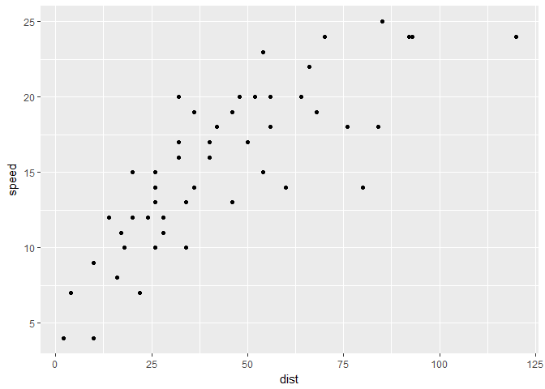
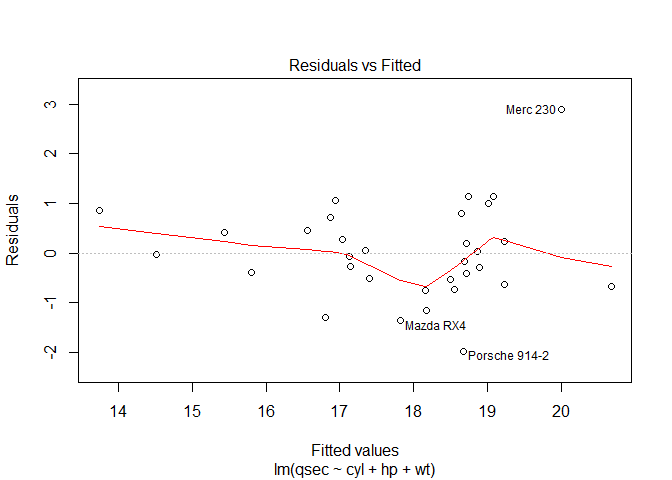
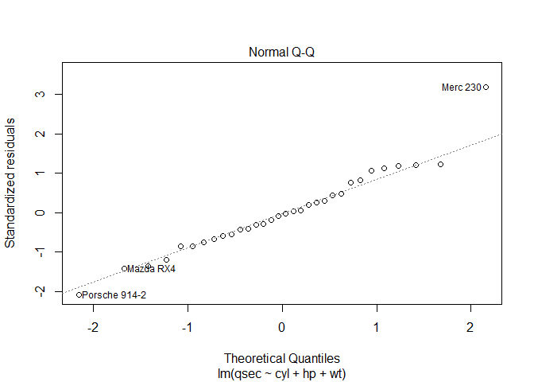
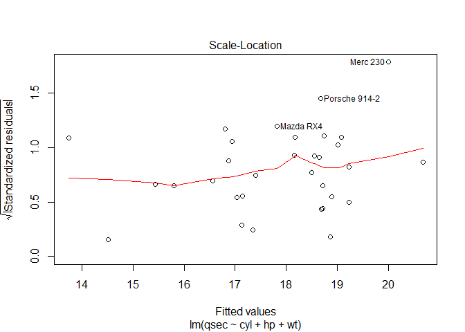
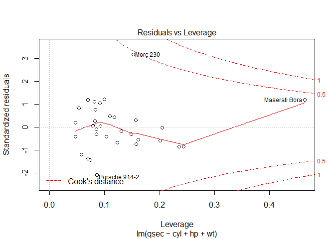
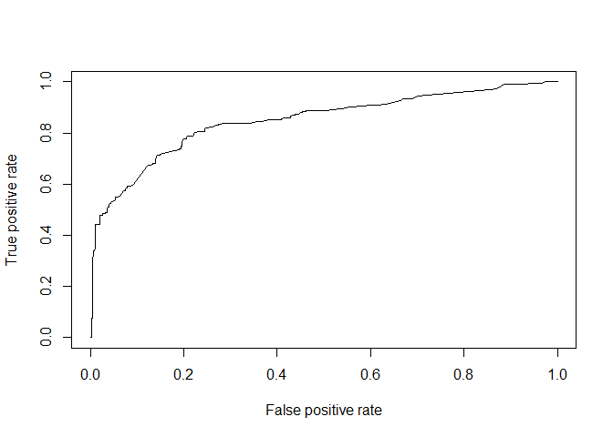

Modelos Lineales Generalizados 1 (AV)
================

Repaso Regresión Lineal
=======================

``` r
# Cargamos la tabla cars
View(cars)

# Creamos el modelo 1
lmcars <- lm(speed~dist, cars)

# Vemos los valores predichos
lmcars$fitted.values
```

    ##         1         2         3         4         5         6         7 
    ##  8.615041  9.939581  8.946176 11.926392 10.932987  9.939581 11.264122 
    ##         8         9        10        11        12        13        14 
    ## 12.588663 13.913203 11.098554 12.919798 10.601852 11.595257 12.257527 
    ##        15        16        17        18        19        20        21 
    ## 12.919798 12.588663 13.913203 13.913203 15.900014 12.588663 14.244338 
    ##        22        23        24        25        26        27        28 
    ## 18.217960 21.529312 11.595257 12.588663 17.224555 13.582068 14.906609 
    ##        29        30        31        32        33        34        35 
    ## 13.582068 14.906609 16.562284 15.237744 17.555690 20.867041 22.191582 
    ##        36        37        38        39        40        41        42 
    ## 14.244338 15.900014 19.542501 13.582068 16.231149 16.893420 17.555690 
    ##        43        44        45        46        47        48        49 
    ## 18.880230 19.211366 17.224555 19.873636 23.516123 23.681690 28.152015 
    ##        50 
    ## 22.357149

``` r
# Graficamos los puntos
require(ggplot2)
```

    ## Loading required package: ggplot2

``` r
ggplot(cars) + 
  aes(x = dist, y = speed) + 
  geom_point()
```



``` r
# Vemos los residuos
lmcars$residuals
```

    ##           1           2           3           4           5           6 
    ## -4.61504079 -5.93958139 -1.94617594 -4.92639228 -2.93298684 -0.93958139 
    ##           7           8           9          10          11          12 
    ## -1.26412199 -2.58866258 -3.91320318 -0.09855441 -1.91979773  1.39814831 
    ##          13          14          15          16          17          18 
    ##  0.40474287 -0.25752743 -0.91979773  0.41133742 -0.91320318 -0.91320318 
    ##          19          20          21          22          23          24 
    ## -2.90001408  1.41133742 -0.24433833 -4.21796012 -7.52931161  3.40474287 
    ##          25          26          27          28          29          30 
    ##  2.41133742 -2.22455467  2.41793197  1.09339137  3.41793197  2.09339137 
    ##          31          32          33          34          35          36 
    ##  0.43771563  2.76225622  0.44431018 -2.86704131 -4.19158191  4.75566167 
    ##          37          38          39          40          41          42 
    ##  3.09998592 -0.54250072  6.41793197  3.76885078  3.10658048  2.44431018 
    ##          43          44          45          46          47          48 
    ##  1.11976958  2.78863443  5.77544533  4.12636413  0.48387749  0.31830992 
    ##          49          50 
    ## -4.15201460  2.64285051

``` r
# Resumen de los residuos
summary(lmcars$residuals)
```

    ##    Min. 1st Qu.  Median    Mean 3rd Qu.    Max. 
    ## -7.5293 -2.1550  0.3615  0.0000  2.4377  6.4179

``` r
# Coeficientes del modelo
lmcars$coefficients
```

    ## (Intercept)        dist 
    ##   8.2839056   0.1655676

``` r
# Modelo 2
mtcars <- mtcars

lmmtcars <- lm(qsec ~ cyl + hp + wt, data = mtcars)

summary(lmmtcars)
```

    ## 
    ## Call:
    ## lm(formula = qsec ~ cyl + hp + wt, data = mtcars)
    ## 
    ## Residuals:
    ##      Min       1Q   Median       3Q      Max 
    ## -1.98267 -0.54986 -0.04903  0.52045  2.89743 
    ## 
    ## Coefficients:
    ##              Estimate Std. Error t value Pr(>|t|)    
    ## (Intercept) 19.768791   0.703685  28.093  < 2e-16 ***
    ## cyl         -0.582570   0.216956  -2.685 0.012044 *  
    ## hp          -0.018812   0.004677  -4.022 0.000396 ***
    ## wt           1.381334   0.291646   4.736  5.7e-05 ***
    ## ---
    ## Signif. codes:  0 '***' 0.001 '**' 0.01 '*' 0.05 '.' 0.1 ' ' 1
    ## 
    ## Residual standard error: 0.9891 on 28 degrees of freedom
    ## Multiple R-squared:  0.7233, Adjusted R-squared:  0.6936 
    ## F-statistic:  24.4 on 3 and 28 DF,  p-value: 5.76e-08

``` r
plot(lmmtcars)
```



Evaluación del modelo
---------------------

Una vez hecho el modelo, es importante ver si el modelo se ha entrenado bien, si es fiable. Hay que tener en mente que los modelos parten de asunciones (ejemplo -&gt; normalidad).

Si yo hago plot(modelo), me salen 4 gráficos:

-   Residuos contra fitted: me dice si los errores y las estimaciones correlacionan =&gt; algo va mal. O tengo colinealidad, o algo va mal. Por ejemplo, si yo tengo que cuando los coches van lentosubestimo siempre la predicción y cuando van rápido lo sobreestimo, eso está mal. El error debería ser igual para todas las observaciones.
-   QQPLOT: si todos los cuantiles me coinciden, es porque mi distribución es común a una normal. Es decir que mis RESIDUOS son normales.
-   Residuos estandarizados (normalizado) frente a valores predichos. Se debería distribuir sin patrones y te señala los outliers.
-   Leverage: es un número que intenta decirte si un sólo dato es influyente. Entendiendo por influyente que influencia mucho al modelo. Por ejemplo, un valor atípico muy lejos de mi línea cambiaría bastante mi línea. Si no hay puntos que están fuera de las líneas de puntos estamos OK.

Variables dummy
---------------

Al crear variables dummy siempre hay una referencia (que es la que no se mete en el modelo), y al final si yo hago un modelo y veo un coeficiente de -1.5 en la variable dummy, eso hay que mirarlo como en referencia al valor referencia.

Vamos a convertir una variable cuantitativa en una cualitativa:

``` r
summary(mtcars$mpg)
```

    ##    Min. 1st Qu.  Median    Mean 3rd Qu.    Max. 
    ##   10.40   15.43   19.20   20.09   22.80   33.90

``` r
mtcars$mpg_cualitativa <- as.factor((mtcars$mpg < 15) + (mtcars$mpg < 22))
```

Ahora los de más de 22 serán un 2, los de entre medias un 1, y los de debajo de 15 0. Hagamos un modelo con esta variable:

``` r
lmmtcars_cualitativo <- lm(qsec ~ mpg_cualitativa + hp, data = mtcars)
summary(lmmtcars_cualitativo)
```

    ## 
    ## Call:
    ## lm(formula = qsec ~ mpg_cualitativa + hp, data = mtcars)
    ## 
    ## Residuals:
    ##     Min      1Q  Median      3Q     Max 
    ## -2.1240 -0.7446  0.0540  0.6070  4.1617 
    ## 
    ## Coefficients:
    ##                   Estimate Std. Error t value Pr(>|t|)    
    ## (Intercept)      20.772641   0.580084  35.810  < 2e-16 ***
    ## mpg_cualitativa1  0.107371   0.661792   0.162 0.872280    
    ## mpg_cualitativa2  1.003663   1.036800   0.968 0.341313    
    ## hp               -0.021414   0.004966  -4.312 0.000181 ***
    ## ---
    ## Signif. codes:  0 '***' 0.001 '**' 0.01 '*' 0.05 '.' 0.1 ' ' 1
    ## 
    ## Residual standard error: 1.294 on 28 degrees of freedom
    ## Multiple R-squared:  0.5264, Adjusted R-squared:  0.4757 
    ## F-statistic: 10.38 on 3 and 28 DF,  p-value: 9.23e-05

Vemos que se han quedado `mpg_cualitativa1` y `mpg_cualitativa2`. La de referencia es `mpg_cualitativa0`.

Ese 0.10 se interpreta como que si eres del grupo 1, tu valor promedio de qsec se eleva en 0.10 con respecto al grupo de REFERENCIA (tener 0).

Esto a veces causa problemas para interpretar un modelo estadística: por ejemplo, si tengo clases que son equipos de fútbol, no es tan intuitivo coger uno de referencia. Hay maneras de fijar la referencia.

Regresión logística
===================

La regresión logística se usa un montón. Va muy bien. Si tienes una red neuronal, quitas la última capa y le metes una logística.

``` r
library(titanic)

View(Titanic)
head(titanic_train)
```

    ##   PassengerId Survived Pclass
    ## 1           1        0      3
    ## 2           2        1      1
    ## 3           3        1      3
    ## 4           4        1      1
    ## 5           5        0      3
    ## 6           6        0      3
    ##                                                  Name    Sex Age SibSp
    ## 1                             Braund, Mr. Owen Harris   male  22     1
    ## 2 Cumings, Mrs. John Bradley (Florence Briggs Thayer) female  38     1
    ## 3                              Heikkinen, Miss. Laina female  26     0
    ## 4        Futrelle, Mrs. Jacques Heath (Lily May Peel) female  35     1
    ## 5                            Allen, Mr. William Henry   male  35     0
    ## 6                                    Moran, Mr. James   male  NA     0
    ##   Parch           Ticket    Fare Cabin Embarked
    ## 1     0        A/5 21171  7.2500              S
    ## 2     0         PC 17599 71.2833   C85        C
    ## 3     0 STON/O2. 3101282  7.9250              S
    ## 4     0           113803 53.1000  C123        S
    ## 5     0           373450  8.0500              S
    ## 6     0           330877  8.4583              Q

``` r
titanic0 <- glm(Survived ~ Age, data = titanic_train)
summary(titanic0)
```

    ## 
    ## Call:
    ## glm(formula = Survived ~ Age, data = titanic_train)
    ## 
    ## Deviance Residuals: 
    ##     Min       1Q   Median       3Q      Max  
    ## -0.4811  -0.4158  -0.3662   0.5789   0.7252  
    ## 
    ## Coefficients:
    ##              Estimate Std. Error t value Pr(>|t|)    
    ## (Intercept)  0.483753   0.041788  11.576   <2e-16 ***
    ## Age         -0.002613   0.001264  -2.067   0.0391 *  
    ## ---
    ## Signif. codes:  0 '***' 0.001 '**' 0.01 '*' 0.05 '.' 0.1 ' ' 1
    ## 
    ## (Dispersion parameter for gaussian family taken to be 0.2404297)
    ## 
    ##     Null deviance: 172.21  on 713  degrees of freedom
    ## Residual deviance: 171.19  on 712  degrees of freedom
    ##   (177 observations deleted due to missingness)
    ## AIC: 1012.6
    ## 
    ## Number of Fisher Scoring iterations: 2

Este modelo está mal, porque si nos fijamos en `titanic0$family`, por defecto la función de enlace es lineal. Está MAL. La variable no sigue una distribución normal, por lo que no puedes usar esa función de enlace. Tampoco estoy puteado si mi variable no sigue una normal -&gt; puedo transformar la variable (logaritmo, raíz, etc...).

``` r
titanic0$family
```

    ## 
    ## Family: gaussian 
    ## Link function: identity

En el help, vemos que hay muchas funciones de enlace en función de la distribución (gamma, etc.). Al final la manera es plotear el histograma de la variable y si veo que se parece a una gamma, lo hago con una gamma. También se puede hacer qqplot y cosas del estilo con la distribución que sea.

``` r
titanic1 <- glm(Survived ~ Age, data = titanic_train, family = binomial(link="identity"))  # Esto no va a funcionar bien

summary(titanic1)
```

    ## 
    ## Call:
    ## glm(formula = Survived ~ Age, family = binomial(link = "identity"), 
    ##     data = titanic_train)
    ## 
    ## Deviance Residuals: 
    ##     Min       1Q   Median       3Q      Max  
    ## -1.1436  -1.0370  -0.9566   1.3154   1.6015  
    ## 
    ## Coefficients:
    ##              Estimate Std. Error z value Pr(>|z|)    
    ## (Intercept)  0.482563   0.041815  11.540   <2e-16 ***
    ## Age         -0.002565   0.001246  -2.059   0.0395 *  
    ## ---
    ## Signif. codes:  0 '***' 0.001 '**' 0.01 '*' 0.05 '.' 0.1 ' ' 1
    ## 
    ## (Dispersion parameter for binomial family taken to be 1)
    ## 
    ##     Null deviance: 964.52  on 713  degrees of freedom
    ## Residual deviance: 960.32  on 712  degrees of freedom
    ##   (177 observations deleted due to missingness)
    ## AIC: 964.32
    ## 
    ## Number of Fisher Scoring iterations: 3

Interpretemos: esto me dice que si tengo 0 años, la probabilidad de sobrevivir es el intercepto. Si tengo un año, empieza a disminuir. Si sigo sumando años, disminuye más. Pero esto no es una relación lineal. Sin embargo, como he puesto una función de enlace lineal (identidad), se ve que es muy plana, porque yo tengo muchos puntos en 0 y en 1 pero no entre medias, por lo que al ajustar una recta lo ajusta mal.

Otra cosa aquí: el valor de referencia serían 0 años, lo que no tiene mucho sentido. Lo que se suele hacer es normalizar y hacer que la referencia sean, por ejemplo, 30 años, de manera que ahora mi 0 son 30 en vez de 0 años, lo que tiene más sentido.

``` r
titanic2 <- glm(Survived ~ Age, data = titanic_train, family = binomial(link="logit"))  

summary(titanic1)
```

    ## 
    ## Call:
    ## glm(formula = Survived ~ Age, family = binomial(link = "identity"), 
    ##     data = titanic_train)
    ## 
    ## Deviance Residuals: 
    ##     Min       1Q   Median       3Q      Max  
    ## -1.1436  -1.0370  -0.9566   1.3154   1.6015  
    ## 
    ## Coefficients:
    ##              Estimate Std. Error z value Pr(>|z|)    
    ## (Intercept)  0.482563   0.041815  11.540   <2e-16 ***
    ## Age         -0.002565   0.001246  -2.059   0.0395 *  
    ## ---
    ## Signif. codes:  0 '***' 0.001 '**' 0.01 '*' 0.05 '.' 0.1 ' ' 1
    ## 
    ## (Dispersion parameter for binomial family taken to be 1)
    ## 
    ##     Null deviance: 964.52  on 713  degrees of freedom
    ## Residual deviance: 960.32  on 712  degrees of freedom
    ##   (177 observations deleted due to missingness)
    ## AIC: 964.32
    ## 
    ## Number of Fisher Scoring iterations: 3

``` r
summary(titanic2)
```

    ## 
    ## Call:
    ## glm(formula = Survived ~ Age, family = binomial(link = "logit"), 
    ##     data = titanic_train)
    ## 
    ## Deviance Residuals: 
    ##     Min       1Q   Median       3Q      Max  
    ## -1.1488  -1.0361  -0.9544   1.3159   1.5908  
    ## 
    ## Coefficients:
    ##             Estimate Std. Error z value Pr(>|z|)  
    ## (Intercept) -0.05672    0.17358  -0.327   0.7438  
    ## Age         -0.01096    0.00533  -2.057   0.0397 *
    ## ---
    ## Signif. codes:  0 '***' 0.001 '**' 0.01 '*' 0.05 '.' 0.1 ' ' 1
    ## 
    ## (Dispersion parameter for binomial family taken to be 1)
    ## 
    ##     Null deviance: 964.52  on 713  degrees of freedom
    ## Residual deviance: 960.23  on 712  degrees of freedom
    ##   (177 observations deleted due to missingness)
    ## AIC: 964.23
    ## 
    ## Number of Fisher Scoring iterations: 4

Qué significa el número de los coeficientes exactamente: es la variación en el odds ratio del grupo-evento age-survived.

``` r
titanic3 <- glm(Survived ~ Age + Pclass + Sex, data = titanic_train, family = binomial(link="identity"))  
```

Esto da un error porque al poner más variables, la relación lineal es tan mala que ni siquiera la línea converge. Ojo, esto es con identity, que no lo usaremos.

``` r
titanic2 <- glm(Survived ~ Age + Pclass + Sex, data = titanic_train, family = binomial(link="logit"))  

summary(titanic2)
```

    ## 
    ## Call:
    ## glm(formula = Survived ~ Age + Pclass + Sex, family = binomial(link = "logit"), 
    ##     data = titanic_train)
    ## 
    ## Deviance Residuals: 
    ##     Min       1Q   Median       3Q      Max  
    ## -2.7270  -0.6799  -0.3947   0.6483   2.4668  
    ## 
    ## Coefficients:
    ##              Estimate Std. Error z value Pr(>|z|)    
    ## (Intercept)  5.056006   0.502128  10.069  < 2e-16 ***
    ## Age         -0.036929   0.007628  -4.841 1.29e-06 ***
    ## Pclass      -1.288545   0.139259  -9.253  < 2e-16 ***
    ## Sexmale     -2.522131   0.207283 -12.168  < 2e-16 ***
    ## ---
    ## Signif. codes:  0 '***' 0.001 '**' 0.01 '*' 0.05 '.' 0.1 ' ' 1
    ## 
    ## (Dispersion parameter for binomial family taken to be 1)
    ## 
    ##     Null deviance: 964.52  on 713  degrees of freedom
    ## Residual deviance: 647.29  on 710  degrees of freedom
    ##   (177 observations deleted due to missingness)
    ## AIC: 655.29
    ## 
    ## Number of Fisher Scoring iterations: 5

Como la clase no me la ha hecho como un factor (y debería porque es lo que tiene sentido), lo hacemos:

``` r
titanic2 <- glm(Survived ~ Age + as.factor(Pclass) + Sex, data = titanic_train, family = binomial(link="logit"))  
summary(titanic2)
```

    ## 
    ## Call:
    ## glm(formula = Survived ~ Age + as.factor(Pclass) + Sex, family = binomial(link = "logit"), 
    ##     data = titanic_train)
    ## 
    ## Deviance Residuals: 
    ##     Min       1Q   Median       3Q      Max  
    ## -2.7303  -0.6780  -0.3953   0.6485   2.4657  
    ## 
    ## Coefficients:
    ##                     Estimate Std. Error z value Pr(>|z|)    
    ## (Intercept)         3.777013   0.401123   9.416  < 2e-16 ***
    ## Age                -0.036985   0.007656  -4.831 1.36e-06 ***
    ## as.factor(Pclass)2 -1.309799   0.278066  -4.710 2.47e-06 ***
    ## as.factor(Pclass)3 -2.580625   0.281442  -9.169  < 2e-16 ***
    ## Sexmale            -2.522781   0.207391 -12.164  < 2e-16 ***
    ## ---
    ## Signif. codes:  0 '***' 0.001 '**' 0.01 '*' 0.05 '.' 0.1 ' ' 1
    ## 
    ## (Dispersion parameter for binomial family taken to be 1)
    ## 
    ##     Null deviance: 964.52  on 713  degrees of freedom
    ## Residual deviance: 647.28  on 709  degrees of freedom
    ##   (177 observations deleted due to missingness)
    ## AIC: 657.28
    ## 
    ## Number of Fisher Scoring iterations: 5

El 2.52 dice que si eres hombre tienes menos 2.5 veces de odd ratio.

Ojo: debajo de la regresión logística hay un supuesto muy fuerte: tiene que haber aditividad. Ejemplo: los rectángulos: la relación de la superficie de un rectángulo con su altura y anchura no es aditiva: es el producto. Puede ser muy alto o no, pero su superficie depende totalmente del ancho. En la vida real no suele haber aditividad, pero si pones un modelo te puede hacer un buen papel.

La regresión logística nos da, con el elemento 3 (pesos), una serie de números entre 0 y 1

El siguiente paso es: **¿dónde pongo el corte?**:

Evaluación del error
--------------------

``` r
misPredicciones <- (titanic2$fitted.values > 0.5)*1  # Estas serían mis predicciones si corto en 0.5

titanic_train$Survived  # Habría que hacerlo con el test pero pasamos de ese detalle.
```

    ##   [1] 0 1 1 1 0 0 0 0 1 1 1 1 0 0 0 1 0 1 0 1 0 1 1 1 0 1 0 0 1 0 0 1 1 0 0
    ##  [36] 0 1 0 0 1 0 0 0 1 1 0 0 1 0 0 0 0 1 1 0 1 1 0 1 0 0 1 0 0 0 1 1 0 1 0
    ##  [71] 0 0 0 0 1 0 0 0 1 1 0 1 1 0 1 1 0 0 1 0 0 0 0 0 0 0 0 1 1 0 0 0 0 0 0
    ## [106] 0 1 1 0 1 0 0 0 0 0 0 0 0 0 0 0 0 0 1 0 1 0 1 1 0 0 0 0 1 0 0 1 0 0 0
    ## [141] 0 1 1 0 0 0 1 0 0 0 0 1 0 0 0 0 1 0 0 0 0 1 0 0 0 1 1 0 0 0 0 0 1 0 0
    ## [176] 0 0 0 0 0 0 0 0 1 1 0 1 1 0 0 1 0 1 1 1 1 0 0 1 0 0 0 0 0 1 0 0 1 1 1
    ## [211] 0 1 0 0 0 1 1 0 1 0 1 0 0 0 1 0 1 0 0 0 1 0 0 1 0 0 0 1 0 0 0 1 0 0 0
    ## [246] 0 0 1 1 0 0 0 0 0 0 1 1 1 1 1 0 1 0 0 0 0 0 1 1 1 0 1 1 0 1 1 0 0 0 1
    ## [281] 0 0 0 1 0 0 1 0 1 1 1 1 0 0 0 0 0 0 1 1 1 1 0 1 0 1 1 1 0 1 1 1 0 0 0
    ## [316] 1 1 0 1 1 0 0 1 1 0 1 0 1 1 1 1 0 0 0 1 0 0 1 1 0 1 1 0 0 0 1 1 1 1 0
    ## [351] 0 0 0 0 0 0 1 0 1 1 0 0 0 0 0 0 1 1 1 1 1 0 0 0 0 1 1 0 0 0 1 1 0 1 0
    ## [386] 0 0 1 0 1 1 1 0 1 1 0 0 0 0 1 1 0 0 0 0 0 0 1 0 0 0 0 1 0 1 0 1 1 0 0
    ## [421] 0 0 0 0 0 0 1 1 0 1 1 1 1 0 0 1 0 1 0 0 1 0 0 1 1 1 1 1 1 1 0 0 0 1 0
    ## [456] 1 0 1 1 0 1 0 0 0 0 0 0 0 0 1 0 0 1 1 0 0 0 0 0 1 0 0 0 1 1 0 1 0 0 1
    ## [491] 0 0 0 0 0 0 1 0 0 0 0 0 0 0 1 0 1 1 0 1 1 0 1 1 0 0 1 0 1 0 1 0 0 1 0
    ## [526] 0 1 0 0 0 1 0 0 1 0 1 0 1 0 1 1 0 0 1 0 0 1 1 0 1 1 0 0 1 1 0 1 0 1 1
    ## [561] 0 0 0 0 0 0 0 0 0 1 1 1 1 1 0 0 1 1 0 1 1 1 0 0 0 1 0 1 0 0 0 1 0 0 0
    ## [596] 0 1 0 0 1 1 0 0 0 1 0 0 1 1 1 0 0 1 0 0 1 0 0 1 0 0 1 1 0 0 0 0 1 0 0
    ## [631] 1 0 1 0 0 1 0 0 0 0 0 1 0 1 1 1 0 1 0 1 0 1 0 1 0 0 0 0 0 0 1 0 0 0 1
    ## [666] 0 0 0 0 1 1 0 0 1 0 0 0 1 0 1 0 1 0 0 0 0 0 0 0 1 1 1 1 0 0 0 0 1 0 0
    ## [701] 1 1 0 0 0 0 1 1 1 1 1 0 1 0 0 0 1 1 0 0 1 0 0 0 1 0 1 1 0 0 1 0 0 0 0
    ## [736] 0 0 1 0 0 1 0 1 0 1 0 0 1 0 0 1 1 0 0 1 1 0 0 0 1 0 0 1 1 0 1 0 0 0 0
    ## [771] 0 0 0 0 1 0 0 1 0 1 1 1 0 0 0 0 1 0 1 0 0 0 0 0 0 0 1 1 0 0 0 1 1 1 1
    ## [806] 0 0 0 0 1 0 0 0 0 0 0 0 0 0 0 1 1 0 1 0 0 0 1 1 1 1 1 0 0 0 1 0 0 1 1
    ## [841] 0 0 1 0 0 0 0 0 0 1 0 0 0 1 0 1 1 1 1 0 0 0 1 0 0 1 1 0 0 1 0 1 0 0 1
    ## [876] 1 0 0 0 1 1 0 0 0 0 0 0 1 0 1 0

``` r
misPredicciones == titanic_train$Survived  # Miro cuántas he acertado: TRUE
```

``` r
mean((misPredicciones*1) == titanic_train$Survived) # 0.52
```

    ## Warning in (misPredicciones * 1) == titanic_train$Survived: longitud de
    ## objeto mayor no es múltiplo de la longitud de uno menor

    ## [1] 0.5241302

``` r
# Si hago la media con cada corte, me dará un valor de acierto.
```

Imaginemos dos distribuciones (1 y 0) y un punto de corte: depende de donde yo ponga el corte, tendré:

-   Si lo pongo muy a la izquierda, tendré mucho error de un tipo y muy poco del otro.

Depende del error que yo quiera cometer, pongo el corte en un punto o en otro.

**Ejemplo**: una prueba médica:

Puede haber dos tipos de errores: \* Que esté enfermo y no lo detecte \* Que no lo esté y me lo detecte

-   Sensibilidad: no se le pasa ni una, pero puede tener muchos falsos positivos. Si pongo un modelo muy sensible, no va a pasar ni uno que tenga la enfermedad sin detectársela. Pero me va a pasar que habrá mucha gente que no la tenga y les salga positivo.

-   Especificidad: no quiero falsos positivos. Entonces saltará mucho menos, seré menos sensible, pero me evitaré falsos positivos.

Al final es decidir si quiero muchos falsos positivos o pocos. Depende de si lo que yo puedo tolerar es que haya muchos falsos positivos o no.

Cómo decido dónde pongo el corte? **Curva ROC**:

``` r
# Obtengo los fitted values

titanic_train$Age[is.na(titanic_train$Age)] <- mean(titanic_train$Age, na.rm=T)

titanic2 <- glm(Survived ~ Age + as.factor(Pclass) + Sex, data = titanic_train, family = binomial(link="logit"))

p <- titanic2$fitted.values  # primera manera

p <- predict(titanic2, type="response")  # segunda manera
# si aquí no le pongo el response, me devuelve la y del estimador lineal. La g es la variable respuesta, porlo que le digo que es g(y)
```

``` r
library(ROCR)
```

    ## Loading required package: gplots

    ## 
    ## Attaching package: 'gplots'

    ## The following object is masked from 'package:stats':
    ## 
    ##     lowess

``` r
titanic_prediction <- prediction(p, titanic_train$Survived)
```

Hay muchos estadísticos para medir la precisión, pero todos están basados en una matriz de confusión. Depende de lo que sumes y dividas sale un número u otro. Dos muy importantes son el TPR (True positive rate) y FPR (False Positive rate) Pero hay muchas más.

``` r
# Curva ROC
plot(performance(titanic_prediction, measure = "tpr", x.measure='fpr'))
```



El mejor modelo será aquel en el que yo tenga muy pocos falsos positivos y muchos true positivos (que es sensible pero no demasiado y me da miles de falsos positivos).

``` r
performance(titanic_prediction, measure="auc")
```

    ## An object of class "performance"
    ## Slot "x.name":
    ## [1] "None"
    ## 
    ## Slot "y.name":
    ## [1] "Area under the ROC curve"
    ## 
    ## Slot "alpha.name":
    ## [1] "none"
    ## 
    ## Slot "x.values":
    ## list()
    ## 
    ## Slot "y.values":
    ## [[1]]
    ## [1] 0.8479399
    ## 
    ## 
    ## Slot "alpha.values":
    ## list()

Un AUC de 0.5 es un modelo aleatorio.

Un AUC por debajo de 0.5 es un modelo bueno pero predice al revés. Lo cambias y listo.

### Elección del valor de corte

Para elegir el valor de corte, depende:

``` r
# Por ejemplo digo que no quiero más de un 20% de FPR
k <- performance(titanic_prediction, measure = "tpr", x.measure='fpr')
l <- k@x.values[[1]]  # la arroba es porque k es un objeto especial que tiene slots. Para acceder a los slots es con la @

max(which(l < 0.20))
```

    ## [1] 153

``` r
k@alpha.values[[1]][153]  # Este sería el punto de corte
```

    ## [1] 0.4365077
