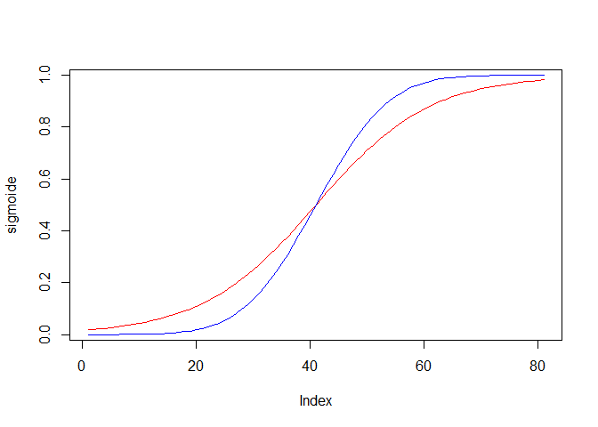
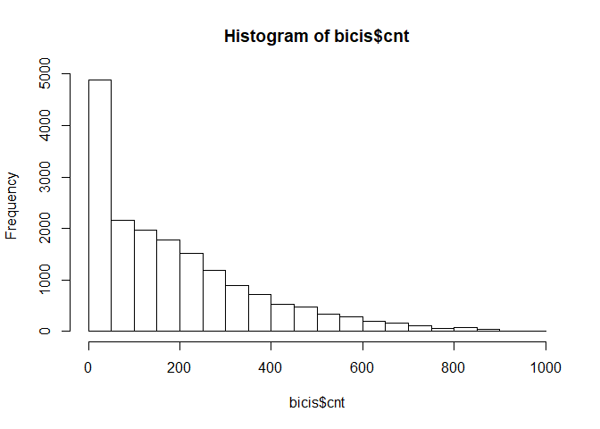
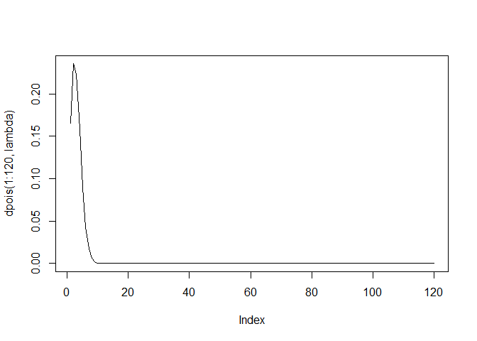
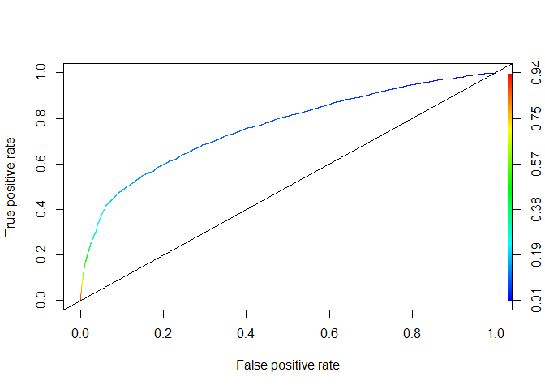

Modelos Lineales Generalizados 2 (AP)
================

Bloque de inicializacion de librerias
-------------------------------------

``` r
if(!require("plyr")){
  install.packages("plyr")
  library("plyr")
}
```

    ## Loading required package: plyr

``` r
if(!require("caTools")){
  install.packages("caTools")
  library("caTools")
}
```

    ## Loading required package: caTools

``` r
if(!require("ROCR")){
  install.packages("ROCR")
  library("ROCR")
}
```

    ## Loading required package: ROCR

    ## Loading required package: gplots

    ## 
    ## Attaching package: 'gplots'

    ## The following object is masked from 'package:stats':
    ## 
    ##     lowess

``` r
# setwd("~/modelos_lineales_generalizados")
```

PARTE 1: REGRESION BINOMIAL LOGIT/LOGISTICA
===========================================

Bloque de carga de datos
------------------------

``` r
bank=read.csv2("data/bank-full.csv")
##### datos extraidos de https://archive.ics.uci.edu/ml/datasets/bank+Marketing
```

Bloque de revisión basica del dataset
-------------------------------------

``` r
str(bank)
```

    ## 'data.frame':    45211 obs. of  17 variables:
    ##  $ age      : int  58 44 33 47 33 35 28 42 58 43 ...
    ##  $ job      : Factor w/ 12 levels "admin.","blue-collar",..: 5 10 3 2 12 5 5 3 6 10 ...
    ##  $ marital  : Factor w/ 3 levels "divorced","married",..: 2 3 2 2 3 2 3 1 2 3 ...
    ##  $ education: Factor w/ 4 levels "primary","secondary",..: 3 2 2 4 4 3 3 3 1 2 ...
    ##  $ default  : Factor w/ 2 levels "no","yes": 1 1 1 1 1 1 1 2 1 1 ...
    ##  $ balance  : int  2143 29 2 1506 1 231 447 2 121 593 ...
    ##  $ housing  : Factor w/ 2 levels "no","yes": 2 2 2 2 1 2 2 2 2 2 ...
    ##  $ loan     : Factor w/ 2 levels "no","yes": 1 1 2 1 1 1 2 1 1 1 ...
    ##  $ contact  : Factor w/ 3 levels "cellular","telephone",..: 3 3 3 3 3 3 3 3 3 3 ...
    ##  $ day      : int  5 5 5 5 5 5 5 5 5 5 ...
    ##  $ month    : Factor w/ 12 levels "apr","aug","dec",..: 9 9 9 9 9 9 9 9 9 9 ...
    ##  $ duration : int  261 151 76 92 198 139 217 380 50 55 ...
    ##  $ campaign : int  1 1 1 1 1 1 1 1 1 1 ...
    ##  $ pdays    : int  -1 -1 -1 -1 -1 -1 -1 -1 -1 -1 ...
    ##  $ previous : int  0 0 0 0 0 0 0 0 0 0 ...
    ##  $ poutcome : Factor w/ 4 levels "failure","other",..: 4 4 4 4 4 4 4 4 4 4 ...
    ##  $ y        : Factor w/ 2 levels "no","yes": 1 1 1 1 1 1 1 1 1 1 ...

``` r
head(bank)
```

    ##   age          job marital education default balance housing loan contact
    ## 1  58   management married  tertiary      no    2143     yes   no unknown
    ## 2  44   technician  single secondary      no      29     yes   no unknown
    ## 3  33 entrepreneur married secondary      no       2     yes  yes unknown
    ## 4  47  blue-collar married   unknown      no    1506     yes   no unknown
    ## 5  33      unknown  single   unknown      no       1      no   no unknown
    ## 6  35   management married  tertiary      no     231     yes   no unknown
    ##   day month duration campaign pdays previous poutcome  y
    ## 1   5   may      261        1    -1        0  unknown no
    ## 2   5   may      151        1    -1        0  unknown no
    ## 3   5   may       76        1    -1        0  unknown no
    ## 4   5   may       92        1    -1        0  unknown no
    ## 5   5   may      198        1    -1        0  unknown no
    ## 6   5   may      139        1    -1        0  unknown no

``` r
summary(bank)
```

    ##       age                 job           marital          education    
    ##  Min.   :18.00   blue-collar:9732   divorced: 5207   primary  : 6851  
    ##  1st Qu.:33.00   management :9458   married :27214   secondary:23202  
    ##  Median :39.00   technician :7597   single  :12790   tertiary :13301  
    ##  Mean   :40.94   admin.     :5171                    unknown  : 1857  
    ##  3rd Qu.:48.00   services   :4154                                     
    ##  Max.   :95.00   retired    :2264                                     
    ##                  (Other)    :6835                                     
    ##  default        balance       housing      loan            contact     
    ##  no :44396   Min.   : -8019   no :20081   no :37967   cellular :29285  
    ##  yes:  815   1st Qu.:    72   yes:25130   yes: 7244   telephone: 2906  
    ##              Median :   448                           unknown  :13020  
    ##              Mean   :  1362                                            
    ##              3rd Qu.:  1428                                            
    ##              Max.   :102127                                            
    ##                                                                        
    ##       day            month          duration         campaign     
    ##  Min.   : 1.00   may    :13766   Min.   :   0.0   Min.   : 1.000  
    ##  1st Qu.: 8.00   jul    : 6895   1st Qu.: 103.0   1st Qu.: 1.000  
    ##  Median :16.00   aug    : 6247   Median : 180.0   Median : 2.000  
    ##  Mean   :15.81   jun    : 5341   Mean   : 258.2   Mean   : 2.764  
    ##  3rd Qu.:21.00   nov    : 3970   3rd Qu.: 319.0   3rd Qu.: 3.000  
    ##  Max.   :31.00   apr    : 2932   Max.   :4918.0   Max.   :63.000  
    ##                  (Other): 6060                                    
    ##      pdays          previous           poutcome       y        
    ##  Min.   : -1.0   Min.   :  0.0000   failure: 4901   no :39922  
    ##  1st Qu.: -1.0   1st Qu.:  0.0000   other  : 1840   yes: 5289  
    ##  Median : -1.0   Median :  0.0000   success: 1511              
    ##  Mean   : 40.2   Mean   :  0.5803   unknown:36959              
    ##  3rd Qu.: -1.0   3rd Qu.:  0.0000                              
    ##  Max.   :871.0   Max.   :275.0000                              
    ## 

Bloque de formateo de variables
-------------------------------

``` r
bank$day=as.factor(bank$day)
bank$campaign=as.factor(bank$campaign)
bank$IndPrevio=as.factor(as.numeric(bank$pdays!=-1))

str(bank)
```

    ## 'data.frame':    45211 obs. of  18 variables:
    ##  $ age      : int  58 44 33 47 33 35 28 42 58 43 ...
    ##  $ job      : Factor w/ 12 levels "admin.","blue-collar",..: 5 10 3 2 12 5 5 3 6 10 ...
    ##  $ marital  : Factor w/ 3 levels "divorced","married",..: 2 3 2 2 3 2 3 1 2 3 ...
    ##  $ education: Factor w/ 4 levels "primary","secondary",..: 3 2 2 4 4 3 3 3 1 2 ...
    ##  $ default  : Factor w/ 2 levels "no","yes": 1 1 1 1 1 1 1 2 1 1 ...
    ##  $ balance  : int  2143 29 2 1506 1 231 447 2 121 593 ...
    ##  $ housing  : Factor w/ 2 levels "no","yes": 2 2 2 2 1 2 2 2 2 2 ...
    ##  $ loan     : Factor w/ 2 levels "no","yes": 1 1 2 1 1 1 2 1 1 1 ...
    ##  $ contact  : Factor w/ 3 levels "cellular","telephone",..: 3 3 3 3 3 3 3 3 3 3 ...
    ##  $ day      : Factor w/ 31 levels "1","2","3","4",..: 5 5 5 5 5 5 5 5 5 5 ...
    ##  $ month    : Factor w/ 12 levels "apr","aug","dec",..: 9 9 9 9 9 9 9 9 9 9 ...
    ##  $ duration : int  261 151 76 92 198 139 217 380 50 55 ...
    ##  $ campaign : Factor w/ 48 levels "1","2","3","4",..: 1 1 1 1 1 1 1 1 1 1 ...
    ##  $ pdays    : int  -1 -1 -1 -1 -1 -1 -1 -1 -1 -1 ...
    ##  $ previous : int  0 0 0 0 0 0 0 0 0 0 ...
    ##  $ poutcome : Factor w/ 4 levels "failure","other",..: 4 4 4 4 4 4 4 4 4 4 ...
    ##  $ y        : Factor w/ 2 levels "no","yes": 1 1 1 1 1 1 1 1 1 1 ...
    ##  $ IndPrevio: Factor w/ 2 levels "0","1": 1 1 1 1 1 1 1 1 1 1 ...

``` r
head(bank)
```

    ##   age          job marital education default balance housing loan contact
    ## 1  58   management married  tertiary      no    2143     yes   no unknown
    ## 2  44   technician  single secondary      no      29     yes   no unknown
    ## 3  33 entrepreneur married secondary      no       2     yes  yes unknown
    ## 4  47  blue-collar married   unknown      no    1506     yes   no unknown
    ## 5  33      unknown  single   unknown      no       1      no   no unknown
    ## 6  35   management married  tertiary      no     231     yes   no unknown
    ##   day month duration campaign pdays previous poutcome  y IndPrevio
    ## 1   5   may      261        1    -1        0  unknown no         0
    ## 2   5   may      151        1    -1        0  unknown no         0
    ## 3   5   may       76        1    -1        0  unknown no         0
    ## 4   5   may       92        1    -1        0  unknown no         0
    ## 5   5   may      198        1    -1        0  unknown no         0
    ## 6   5   may      139        1    -1        0  unknown no         0

``` r
summary(bank)
```

    ##       age                 job           marital          education    
    ##  Min.   :18.00   blue-collar:9732   divorced: 5207   primary  : 6851  
    ##  1st Qu.:33.00   management :9458   married :27214   secondary:23202  
    ##  Median :39.00   technician :7597   single  :12790   tertiary :13301  
    ##  Mean   :40.94   admin.     :5171                    unknown  : 1857  
    ##  3rd Qu.:48.00   services   :4154                                     
    ##  Max.   :95.00   retired    :2264                                     
    ##                  (Other)    :6835                                     
    ##  default        balance       housing      loan            contact     
    ##  no :44396   Min.   : -8019   no :20081   no :37967   cellular :29285  
    ##  yes:  815   1st Qu.:    72   yes:25130   yes: 7244   telephone: 2906  
    ##              Median :   448                           unknown  :13020  
    ##              Mean   :  1362                                            
    ##              3rd Qu.:  1428                                            
    ##              Max.   :102127                                            
    ##                                                                        
    ##       day            month          duration         campaign    
    ##  20     : 2752   may    :13766   Min.   :   0.0   1      :17544  
    ##  18     : 2308   jul    : 6895   1st Qu.: 103.0   2      :12505  
    ##  21     : 2026   aug    : 6247   Median : 180.0   3      : 5521  
    ##  17     : 1939   jun    : 5341   Mean   : 258.2   4      : 3522  
    ##  6      : 1932   nov    : 3970   3rd Qu.: 319.0   5      : 1764  
    ##  5      : 1910   apr    : 2932   Max.   :4918.0   6      : 1291  
    ##  (Other):32344   (Other): 6060                    (Other): 3064  
    ##      pdays          previous           poutcome       y         IndPrevio
    ##  Min.   : -1.0   Min.   :  0.0000   failure: 4901   no :39922   0:36954  
    ##  1st Qu.: -1.0   1st Qu.:  0.0000   other  : 1840   yes: 5289   1: 8257  
    ##  Median : -1.0   Median :  0.0000   success: 1511                        
    ##  Mean   : 40.2   Mean   :  0.5803   unknown:36959                        
    ##  3rd Qu.: -1.0   3rd Qu.:  0.0000                                        
    ##  Max.   :871.0   Max.   :275.0000                                        
    ## 

Bloque de modelo de regresión logistica
---------------------------------------

``` r
modeloLogit=glm(y~job+marital+education+default+balance+housing+loan+contact+month+poutcome, data=bank,family=binomial(link="logit"))
summary(modeloLogit)
```

    ## 
    ## Call:
    ## glm(formula = y ~ job + marital + education + default + balance + 
    ##     housing + loan + contact + month + poutcome, family = binomial(link = "logit"), 
    ##     data = bank)
    ## 
    ## Deviance Residuals: 
    ##     Min       1Q   Median       3Q      Max  
    ## -2.3429  -0.4762  -0.3823  -0.2487   2.9771  
    ## 
    ## Coefficients:
    ##                      Estimate Std. Error z value Pr(>|z|)    
    ## (Intercept)        -1.268e+00  1.068e-01 -11.872  < 2e-16 ***
    ## jobblue-collar     -1.253e-01  6.490e-02  -1.931 0.053471 .  
    ## jobentrepreneur    -1.967e-01  1.112e-01  -1.769 0.076953 .  
    ## jobhousemaid       -2.849e-01  1.197e-01  -2.381 0.017270 *  
    ## jobmanagement      -5.305e-02  6.566e-02  -0.808 0.419082    
    ## jobretired          4.538e-01  7.798e-02   5.820 5.90e-09 ***
    ## jobself-employed   -9.552e-02  9.917e-02  -0.963 0.335483    
    ## jobservices        -8.396e-02  7.450e-02  -1.127 0.259714    
    ## jobstudent          3.309e-01  9.773e-02   3.386 0.000710 ***
    ## jobtechnician      -6.585e-02  6.188e-02  -1.064 0.287233    
    ## jobunemployed       1.262e-01  9.770e-02   1.292 0.196280    
    ## jobunknown         -1.978e-01  2.077e-01  -0.952 0.341032    
    ## maritalmarried     -2.106e-01  5.161e-02  -4.081 4.49e-05 ***
    ## maritalsingle       8.151e-02  5.556e-02   1.467 0.142387    
    ## educationsecondary  1.508e-01  5.654e-02   2.667 0.007659 ** 
    ## educationtertiary   3.116e-01  6.575e-02   4.740 2.14e-06 ***
    ## educationunknown    1.990e-01  9.244e-02   2.153 0.031319 *  
    ## defaultyes         -1.329e-01  1.470e-01  -0.904 0.366006    
    ## balance             1.703e-05  4.463e-06   3.816 0.000136 ***
    ## housingyes         -5.398e-01  3.813e-02 -14.157  < 2e-16 ***
    ## loanyes            -3.969e-01  5.312e-02  -7.472 7.91e-14 ***
    ## contacttelephone   -2.883e-01  6.408e-02  -4.499 6.83e-06 ***
    ## contactunknown     -1.346e+00  6.339e-02 -21.228  < 2e-16 ***
    ## monthaug           -9.711e-01  6.848e-02 -14.181  < 2e-16 ***
    ## monthdec            5.651e-01  1.621e-01   3.485 0.000491 ***
    ## monthfeb           -4.419e-01  7.506e-02  -5.887 3.93e-09 ***
    ## monthjan           -1.071e+00  1.063e-01 -10.077  < 2e-16 ***
    ## monthjul           -7.875e-01  6.773e-02 -11.627  < 2e-16 ***
    ## monthjun            1.052e-01  8.094e-02   1.300 0.193738    
    ## monthmar            1.063e+00  1.103e-01   9.639  < 2e-16 ***
    ## monthmay           -5.021e-01  6.345e-02  -7.913 2.52e-15 ***
    ## monthnov           -8.507e-01  7.457e-02 -11.409  < 2e-16 ***
    ## monthoct            6.755e-01  9.781e-02   6.907 4.96e-12 ***
    ## monthsep            6.544e-01  1.075e-01   6.089 1.13e-09 ***
    ## poutcomeother       2.516e-01  7.967e-02   3.159 0.001586 ** 
    ## poutcomesuccess     2.264e+00  7.346e-02  30.813  < 2e-16 ***
    ## poutcomeunknown     3.486e-02  5.156e-02   0.676 0.498980    
    ## ---
    ## Signif. codes:  0 '***' 0.001 '**' 0.01 '*' 0.05 '.' 0.1 ' ' 1
    ## 
    ## (Dispersion parameter for binomial family taken to be 1)
    ## 
    ##     Null deviance: 32631  on 45210  degrees of freedom
    ## Residual deviance: 27282  on 45174  degrees of freedom
    ## AIC: 27356
    ## 
    ## Number of Fisher Scoring iterations: 6

Bloque de selección de variables
--------------------------------

``` r
modeloLogitFinal=step(modeloLogit,direction="both",trace=1)
```

    ## Start:  AIC=27356.01
    ## y ~ job + marital + education + default + balance + housing + 
    ##     loan + contact + month + poutcome
    ## 
    ##             Df Deviance   AIC
    ## - default    1    27283 27355
    ## <none>            27282 27356
    ## - balance    1    27296 27368
    ## - education  3    27306 27374
    ## - loan       1    27342 27414
    ## - marital    2    27347 27417
    ## - job       11    27381 27433
    ## - housing    1    27485 27557
    ## - contact    2    27777 27847
    ## - month     11    28281 28333
    ## - poutcome   3    28671 28739
    ## 
    ## Step:  AIC=27354.85
    ## y ~ job + marital + education + balance + housing + loan + contact + 
    ##     month + poutcome
    ## 
    ##             Df Deviance   AIC
    ## <none>            27283 27355
    ## + default    1    27282 27356
    ## - balance    1    27297 27367
    ## - education  3    27307 27373
    ## - loan       1    27344 27414
    ## - marital    2    27348 27416
    ## - job       11    27382 27432
    ## - housing    1    27486 27556
    ## - contact    2    27778 27846
    ## - month     11    28284 28334
    ## - poutcome   3    28673 28739

``` r
summary(modeloLogitFinal)
```

    ## 
    ## Call:
    ## glm(formula = y ~ job + marital + education + balance + housing + 
    ##     loan + contact + month + poutcome, family = binomial(link = "logit"), 
    ##     data = bank)
    ## 
    ## Deviance Residuals: 
    ##     Min       1Q   Median       3Q      Max  
    ## -2.3435  -0.4758  -0.3826  -0.2487   2.9787  
    ## 
    ## Coefficients:
    ##                      Estimate Std. Error z value Pr(>|z|)    
    ## (Intercept)        -1.268e+00  1.068e-01 -11.876  < 2e-16 ***
    ## jobblue-collar     -1.263e-01  6.489e-02  -1.946 0.051672 .  
    ## jobentrepreneur    -1.996e-01  1.112e-01  -1.795 0.072614 .  
    ## jobhousemaid       -2.856e-01  1.196e-01  -2.387 0.016998 *  
    ## jobmanagement      -5.413e-02  6.565e-02  -0.825 0.409619    
    ## jobretired          4.534e-01  7.798e-02   5.814 6.08e-09 ***
    ## jobself-employed   -9.669e-02  9.916e-02  -0.975 0.329508    
    ## jobservices        -8.428e-02  7.449e-02  -1.131 0.257897    
    ## jobstudent          3.313e-01  9.773e-02   3.390 0.000699 ***
    ## jobtechnician      -6.637e-02  6.188e-02  -1.073 0.283431    
    ## jobunemployed       1.251e-01  9.768e-02   1.281 0.200284    
    ## jobunknown         -1.977e-01  2.077e-01  -0.952 0.341155    
    ## maritalmarried     -2.098e-01  5.160e-02  -4.065 4.80e-05 ***
    ## maritalsingle       8.184e-02  5.556e-02   1.473 0.140740    
    ## educationsecondary  1.506e-01  5.653e-02   2.664 0.007726 ** 
    ## educationtertiary   3.122e-01  6.574e-02   4.749 2.05e-06 ***
    ## educationunknown    1.992e-01  9.243e-02   2.155 0.031198 *  
    ## balance             1.722e-05  4.457e-06   3.863 0.000112 ***
    ## housingyes         -5.394e-01  3.812e-02 -14.150  < 2e-16 ***
    ## loanyes            -4.002e-01  5.302e-02  -7.548 4.43e-14 ***
    ## contacttelephone   -2.876e-01  6.408e-02  -4.488 7.18e-06 ***
    ## contactunknown     -1.347e+00  6.339e-02 -21.244  < 2e-16 ***
    ## monthaug           -9.723e-01  6.847e-02 -14.200  < 2e-16 ***
    ## monthdec            5.650e-01  1.621e-01   3.485 0.000492 ***
    ## monthfeb           -4.427e-01  7.506e-02  -5.898 3.69e-09 ***
    ## monthjan           -1.072e+00  1.063e-01 -10.085  < 2e-16 ***
    ## monthjul           -7.897e-01  6.769e-02 -11.666  < 2e-16 ***
    ## monthjun            1.048e-01  8.094e-02   1.294 0.195529    
    ## monthmar            1.063e+00  1.103e-01   9.640  < 2e-16 ***
    ## monthmay           -5.030e-01  6.345e-02  -7.927 2.24e-15 ***
    ## monthnov           -8.527e-01  7.454e-02 -11.439  < 2e-16 ***
    ## monthoct            6.756e-01  9.781e-02   6.907 4.95e-12 ***
    ## monthsep            6.543e-01  1.075e-01   6.087 1.15e-09 ***
    ## poutcomeother       2.515e-01  7.967e-02   3.157 0.001595 ** 
    ## poutcomesuccess     2.264e+00  7.346e-02  30.821  < 2e-16 ***
    ## poutcomeunknown     3.421e-02  5.156e-02   0.664 0.506989    
    ## ---
    ## Signif. codes:  0 '***' 0.001 '**' 0.01 '*' 0.05 '.' 0.1 ' ' 1
    ## 
    ## (Dispersion parameter for binomial family taken to be 1)
    ## 
    ##     Null deviance: 32631  on 45210  degrees of freedom
    ## Residual deviance: 27283  on 45175  degrees of freedom
    ## AIC: 27355
    ## 
    ## Number of Fisher Scoring iterations: 6

``` r
anova(modeloLogitFinal,modeloLogit)
```

    ## Analysis of Deviance Table
    ## 
    ## Model 1: y ~ job + marital + education + balance + housing + loan + contact + 
    ##     month + poutcome
    ## Model 2: y ~ job + marital + education + default + balance + housing + 
    ##     loan + contact + month + poutcome
    ##   Resid. Df Resid. Dev Df Deviance
    ## 1     45175      27283            
    ## 2     45174      27282  1  0.84631

Bloque de interpretación de coeficientes
----------------------------------------

Ver <https://www.datanalytics.com/2015/07/06/una-interpretacion-rapida-y-sucia-de-los-coeficientes-de-la-regresion-logistica/>

``` r
coef(modeloLogitFinal)
```

    ##        (Intercept)     jobblue-collar    jobentrepreneur 
    ##      -1.267947e+00      -1.262692e-01      -1.995611e-01 
    ##       jobhousemaid      jobmanagement         jobretired 
    ##      -2.855668e-01      -5.413244e-02       4.534263e-01 
    ##   jobself-employed        jobservices         jobstudent 
    ##      -9.669209e-02      -8.428184e-02       3.313351e-01 
    ##      jobtechnician      jobunemployed         jobunknown 
    ##      -6.637135e-02       1.251087e-01      -1.977169e-01 
    ##     maritalmarried      maritalsingle educationsecondary 
    ##      -2.097693e-01       8.183596e-02       1.505967e-01 
    ##  educationtertiary   educationunknown            balance 
    ##       3.121900e-01       1.991514e-01       1.721971e-05 
    ##         housingyes            loanyes   contacttelephone 
    ##      -5.394463e-01      -4.001582e-01      -2.876028e-01 
    ##     contactunknown           monthaug           monthdec 
    ##      -1.346577e+00      -9.722720e-01       5.650346e-01 
    ##           monthfeb           monthjan           monthjul 
    ##      -4.426666e-01      -1.071667e+00      -7.897098e-01 
    ##           monthjun           monthmar           monthmay 
    ##       1.047737e-01       1.063459e+00      -5.029585e-01 
    ##           monthnov           monthoct           monthsep 
    ##      -8.526500e-01       6.756053e-01       6.542601e-01 
    ##      poutcomeother    poutcomesuccess    poutcomeunknown 
    ##       2.515018e-01       2.264128e+00       3.420893e-02

``` r
exp(coef(modeloLogitFinal))
```

    ##        (Intercept)     jobblue-collar    jobentrepreneur 
    ##          0.2814088          0.8813776          0.8190901 
    ##       jobhousemaid      jobmanagement         jobretired 
    ##          0.7515881          0.9473066          1.5736949 
    ##   jobself-employed        jobservices         jobstudent 
    ##          0.9078355          0.9191722          1.3928265 
    ##      jobtechnician      jobunemployed         jobunknown 
    ##          0.9357833          1.1332717          0.8206022 
    ##     maritalmarried      maritalsingle educationsecondary 
    ##          0.8107713          1.0852778          1.1625277 
    ##  educationtertiary   educationunknown            balance 
    ##          1.3664143          1.2203667          1.0000172 
    ##         housingyes            loanyes   contacttelephone 
    ##          0.5830710          0.6702140          0.7500595 
    ##     contactunknown           monthaug           monthdec 
    ##          0.2601290          0.3782228          1.7595086 
    ##           monthfeb           monthjan           monthjul 
    ##          0.6423213          0.3424371          0.4539765 
    ##           monthjun           monthmar           monthmay 
    ##          1.1104593          2.8963736          0.6047389 
    ##           monthnov           monthoct           monthsep 
    ##          0.4262838          1.9652221          1.9237187 
    ##      poutcomeother    poutcomesuccess    poutcomeunknown 
    ##          1.2859552          9.6227300          1.0348008

``` r
exp(cbind(coef(modeloLogitFinal), confint(modeloLogitFinal,level=0.95)))  
```

    ## Waiting for profiling to be done...

    ##                                  2.5 %     97.5 %
    ## (Intercept)        0.2814088 0.2280854  0.3466324
    ## jobblue-collar     0.8813776 0.7762049  1.0010703
    ## jobentrepreneur    0.8190901 0.6563224  1.0150567
    ## jobhousemaid       0.7515881 0.5919817  0.9465596
    ## jobmanagement      0.9473066 0.8331853  1.0777416
    ## jobretired         1.5736949 1.3503156  1.8332064
    ## jobself-employed   0.9078355 0.7459163  1.1004507
    ## jobservices        0.9191722 0.7938256  1.0631101
    ## jobstudent         1.3928265 1.1490045  1.6855521
    ## jobtechnician      0.9357833 0.8290740  1.0566905
    ## jobunemployed      1.1332717 0.9340943  1.3700976
    ## jobunknown         0.8206022 0.5375258  1.2158352
    ## maritalmarried     0.8107713 0.7332600  0.8976792
    ## maritalsingle      1.0852778 0.9738191  1.2107928
    ## educationsecondary 1.1625277 1.0411947  1.2995397
    ## educationtertiary  1.3664143 1.2017081  1.5550058
    ## educationunknown   1.2203667 1.0168008  1.4609631
    ## balance            1.0000172 1.0000084  1.0000259
    ## housingyes         0.5830710 0.5410419  0.6282533
    ## loanyes            0.6702140 0.6034597  0.7428857
    ## contacttelephone   0.7500595 0.6606852  0.8493788
    ## contactunknown     0.2601290 0.2295910  0.2943594
    ## monthaug           0.3782228 0.3307512  0.4325951
    ## monthdec           1.7595086 1.2781293  2.4146165
    ## monthfeb           0.6423213 0.5542515  0.7438980
    ## monthjan           0.3424371 0.2772166  0.4205611
    ## monthjul           0.4539765 0.3975921  0.5184344
    ## monthjun           1.1104593 0.9475235  1.3013849
    ## monthmar           2.8963736 2.3331927  3.5960513
    ## monthmay           0.6047389 0.5341640  0.6850186
    ## monthnov           0.4262838 0.3681748  0.4931470
    ## monthoct           1.9652221 1.6218215  2.3798977
    ## monthsep           1.9237187 1.5576824  2.3741227
    ## poutcomeother      1.2859552 1.0990878  1.5020930
    ## poutcomesuccess    9.6227300 8.3372544 11.1197620
    ## poutcomeunknown    1.0348008 0.9358883  1.1455254

¿Qué significa el coeficiente en una regresión logística exactamente? Tiene que ver con las odds: \* Un 0.9 de probabilidad es lo mismo que decir 9/1 (o 9). Un 0.50 es una odds de 1. Las odds van que si tengo 0.9, resto 1-0.9 y me da 0.1, y me dice cuántas veces es más grande 0.9 sobre 0.1. En odds la referencia es el 0.5, el 1.

El coeficiente es el aumento/disminución en el odds ratio.

Hay que tener en cuenta el valor referencia en las variables categóricas.

Bloque de modificación de caso base
-----------------------------------

``` r
bank$job=relevel(bank$job,ref="housemaid")
bank$marital=relevel(bank$marital,ref="married")
bank$housing=relevel(bank$housing,ref="yes")
bank$loan=relevel(bank$loan,ref="yes")
bank$contact=relevel(bank$contact,ref="unknown")
bank$month=relevel(bank$month,ref="jan")

modeloLogit=glm(y~job+marital+education+default+balance+housing+loan+contact+month+poutcome, data=bank,family=binomial(link="logit"))
summary(modeloLogit)
```

    ## 
    ## Call:
    ## glm(formula = y ~ job + marital + education + default + balance + 
    ##     housing + loan + contact + month + poutcome, family = binomial(link = "logit"), 
    ##     data = bank)
    ## 
    ## Deviance Residuals: 
    ##     Min       1Q   Median       3Q      Max  
    ## -2.3429  -0.4762  -0.3823  -0.2487   2.9771  
    ## 
    ## Coefficients:
    ##                      Estimate Std. Error z value Pr(>|z|)    
    ## (Intercept)        -5.116e+00  1.739e-01 -29.422  < 2e-16 ***
    ## jobadmin.           2.849e-01  1.197e-01   2.381 0.017270 *  
    ## jobblue-collar      1.595e-01  1.161e-01   1.375 0.169194    
    ## jobentrepreneur     8.819e-02  1.477e-01   0.597 0.550523    
    ## jobmanagement       2.318e-01  1.174e-01   1.974 0.048358 *  
    ## jobretired          7.387e-01  1.217e-01   6.070 1.28e-09 ***
    ## jobself-employed    1.894e-01  1.392e-01   1.361 0.173619    
    ## jobservices         2.009e-01  1.244e-01   1.615 0.106405    
    ## jobstudent          6.158e-01  1.395e-01   4.415 1.01e-05 ***
    ## jobtechnician       2.190e-01  1.169e-01   1.873 0.061007 .  
    ## jobunemployed       4.111e-01  1.377e-01   2.985 0.002839 ** 
    ## jobunknown          8.712e-02  2.283e-01   0.382 0.702765    
    ## maritaldivorced     2.106e-01  5.161e-02   4.081 4.49e-05 ***
    ## maritalsingle       2.921e-01  3.754e-02   7.782 7.12e-15 ***
    ## educationsecondary  1.508e-01  5.654e-02   2.667 0.007659 ** 
    ## educationtertiary   3.116e-01  6.575e-02   4.740 2.14e-06 ***
    ## educationunknown    1.990e-01  9.244e-02   2.153 0.031319 *  
    ## defaultyes         -1.329e-01  1.470e-01  -0.904 0.366006    
    ## balance             1.703e-05  4.463e-06   3.816 0.000136 ***
    ## housingno           5.398e-01  3.813e-02  14.157  < 2e-16 ***
    ## loanno              3.969e-01  5.312e-02   7.472 7.91e-14 ***
    ## contactcellular     1.346e+00  6.339e-02  21.228  < 2e-16 ***
    ## contacttelephone    1.057e+00  8.598e-02  12.296  < 2e-16 ***
    ## monthapr            1.071e+00  1.063e-01  10.077  < 2e-16 ***
    ## monthaug            9.966e-02  1.032e-01   0.965 0.334436    
    ## monthdec            1.636e+00  1.796e-01   9.107  < 2e-16 ***
    ## monthfeb            6.289e-01  1.083e-01   5.808 6.31e-09 ***
    ## monthjul            2.833e-01  1.038e-01   2.730 0.006340 ** 
    ## monthjun            1.176e+00  1.123e-01  10.474  < 2e-16 ***
    ## monthmar            2.134e+00  1.351e-01  15.795  < 2e-16 ***
    ## monthmay            5.687e-01  1.030e-01   5.520 3.38e-08 ***
    ## monthnov            2.201e-01  1.088e-01   2.023 0.043117 *  
    ## monthoct            1.746e+00  1.249e-01  13.983  < 2e-16 ***
    ## monthsep            1.725e+00  1.325e-01  13.022  < 2e-16 ***
    ## poutcomeother       2.516e-01  7.967e-02   3.159 0.001586 ** 
    ## poutcomesuccess     2.264e+00  7.346e-02  30.813  < 2e-16 ***
    ## poutcomeunknown     3.486e-02  5.156e-02   0.676 0.498980    
    ## ---
    ## Signif. codes:  0 '***' 0.001 '**' 0.01 '*' 0.05 '.' 0.1 ' ' 1
    ## 
    ## (Dispersion parameter for binomial family taken to be 1)
    ## 
    ##     Null deviance: 32631  on 45210  degrees of freedom
    ## Residual deviance: 27282  on 45174  degrees of freedom
    ## AIC: 27356
    ## 
    ## Number of Fisher Scoring iterations: 6

``` r
modeloLogitFinal=step(modeloLogit,direction="both",trace=0)
summary(modeloLogitFinal)
```

    ## 
    ## Call:
    ## glm(formula = y ~ job + marital + education + balance + housing + 
    ##     loan + contact + month + poutcome, family = binomial(link = "logit"), 
    ##     data = bank)
    ## 
    ## Deviance Residuals: 
    ##     Min       1Q   Median       3Q      Max  
    ## -2.3435  -0.4758  -0.3826  -0.2487   2.9787  
    ## 
    ## Coefficients:
    ##                      Estimate Std. Error z value Pr(>|z|)    
    ## (Intercept)        -5.121e+00  1.738e-01 -29.463  < 2e-16 ***
    ## jobadmin.           2.856e-01  1.196e-01   2.387 0.016998 *  
    ## jobblue-collar      1.593e-01  1.161e-01   1.373 0.169857    
    ## jobentrepreneur     8.601e-02  1.477e-01   0.582 0.560406    
    ## jobmanagement       2.314e-01  1.174e-01   1.971 0.048731 *  
    ## jobretired          7.390e-01  1.217e-01   6.073 1.26e-09 ***
    ## jobself-employed    1.889e-01  1.392e-01   1.357 0.174707    
    ## jobservices         2.013e-01  1.244e-01   1.618 0.105751    
    ## jobstudent          6.169e-01  1.395e-01   4.423 9.72e-06 ***
    ## jobtechnician       2.192e-01  1.169e-01   1.875 0.060802 .  
    ## jobunemployed       4.107e-01  1.377e-01   2.982 0.002868 ** 
    ## jobunknown          8.785e-02  2.283e-01   0.385 0.700398    
    ## maritaldivorced     2.098e-01  5.160e-02   4.065 4.80e-05 ***
    ## maritalsingle       2.916e-01  3.753e-02   7.770 7.87e-15 ***
    ## educationsecondary  1.506e-01  5.653e-02   2.664 0.007726 ** 
    ## educationtertiary   3.122e-01  6.574e-02   4.749 2.05e-06 ***
    ## educationunknown    1.992e-01  9.243e-02   2.155 0.031198 *  
    ## balance             1.722e-05  4.457e-06   3.863 0.000112 ***
    ## housingno           5.394e-01  3.812e-02  14.150  < 2e-16 ***
    ## loanno              4.002e-01  5.302e-02   7.548 4.43e-14 ***
    ## contactcellular     1.347e+00  6.339e-02  21.244  < 2e-16 ***
    ## contacttelephone    1.059e+00  8.597e-02  12.318  < 2e-16 ***
    ## monthapr            1.072e+00  1.063e-01  10.085  < 2e-16 ***
    ## monthaug            9.940e-02  1.033e-01   0.963 0.335720    
    ## monthdec            1.637e+00  1.796e-01   9.111  < 2e-16 ***
    ## monthfeb            6.290e-01  1.083e-01   5.809 6.27e-09 ***
    ## monthjul            2.820e-01  1.038e-01   2.717 0.006593 ** 
    ## monthjun            1.176e+00  1.123e-01  10.478  < 2e-16 ***
    ## monthmar            2.135e+00  1.351e-01  15.802  < 2e-16 ***
    ## monthmay            5.687e-01  1.030e-01   5.520 3.38e-08 ***
    ## monthnov            2.190e-01  1.088e-01   2.013 0.044125 *  
    ## monthoct            1.747e+00  1.249e-01  13.990  < 2e-16 ***
    ## monthsep            1.726e+00  1.325e-01  13.027  < 2e-16 ***
    ## poutcomeother       2.515e-01  7.967e-02   3.157 0.001595 ** 
    ## poutcomesuccess     2.264e+00  7.346e-02  30.821  < 2e-16 ***
    ## poutcomeunknown     3.421e-02  5.156e-02   0.664 0.506989    
    ## ---
    ## Signif. codes:  0 '***' 0.001 '**' 0.01 '*' 0.05 '.' 0.1 ' ' 1
    ## 
    ## (Dispersion parameter for binomial family taken to be 1)
    ## 
    ##     Null deviance: 32631  on 45210  degrees of freedom
    ## Residual deviance: 27283  on 45175  degrees of freedom
    ## AIC: 27355
    ## 
    ## Number of Fisher Scoring iterations: 6

``` r
coef(modeloLogitFinal)
```

    ##        (Intercept)          jobadmin.     jobblue-collar 
    ##      -5.121132e+00       2.855668e-01       1.592976e-01 
    ##    jobentrepreneur      jobmanagement         jobretired 
    ##       8.600567e-02       2.314344e-01       7.389931e-01 
    ##   jobself-employed        jobservices         jobstudent 
    ##       1.888747e-01       2.012850e-01       6.169019e-01 
    ##      jobtechnician      jobunemployed         jobunknown 
    ##       2.191955e-01       4.106755e-01       8.784995e-02 
    ##    maritaldivorced      maritalsingle educationsecondary 
    ##       2.097693e-01       2.916052e-01       1.505967e-01 
    ##  educationtertiary   educationunknown            balance 
    ##       3.121900e-01       1.991514e-01       1.721971e-05 
    ##          housingno             loanno    contactcellular 
    ##       5.394463e-01       4.001582e-01       1.346577e+00 
    ##   contacttelephone           monthapr           monthaug 
    ##       1.058975e+00       1.071667e+00       9.939531e-02 
    ##           monthdec           monthfeb           monthjul 
    ##       1.636702e+00       6.290007e-01       2.819574e-01 
    ##           monthjun           monthmar           monthmay 
    ##       1.176441e+00       2.135127e+00       5.687088e-01 
    ##           monthnov           monthoct           monthsep 
    ##       2.190172e-01       1.747273e+00       1.725927e+00 
    ##      poutcomeother    poutcomesuccess    poutcomeunknown 
    ##       2.515018e-01       2.264128e+00       3.420893e-02

``` r
exp(coef(modeloLogitFinal))
```

    ##        (Intercept)          jobadmin.     jobblue-collar 
    ##        0.005969261        1.330515952        1.172686899 
    ##    jobentrepreneur      jobmanagement         jobretired 
    ##        1.089812503        1.260406588        2.093826156 
    ##   jobself-employed        jobservices         jobstudent 
    ##        1.207889612        1.222973217        1.853177877 
    ##      jobtechnician      jobunemployed         jobunknown 
    ##        1.245074609        1.507836045        1.091824279 
    ##    maritaldivorced      maritalsingle educationsecondary 
    ##        1.233393439        1.338574483        1.162527707 
    ##  educationtertiary   educationunknown            balance 
    ##        1.366414293        1.220366690        1.000017220 
    ##          housingno             loanno    contactcellular 
    ##        1.715057048        1.492060790        3.844245828 
    ##   contacttelephone           monthapr           monthaug 
    ##        2.883412972        2.920244290        1.104502830 
    ##           monthdec           monthfeb           monthjul 
    ##        5.138195036        1.875735208        1.325722293 
    ##           monthjun           monthmar           monthmay 
    ##        3.242812372        8.458118457        1.765985366 
    ##           monthnov           monthoct           monthsep 
    ##        1.244852723        5.738928715        5.617728546 
    ##      poutcomeother    poutcomesuccess    poutcomeunknown 
    ##        1.285955156        9.622730011        1.034800781

``` r
exp(cbind(coef(modeloLogitFinal), confint(modeloLogitFinal,level=0.95))) 
```

    ## Waiting for profiling to be done...

    ##                                      2.5 %       97.5 %
    ## (Intercept)        0.005969261 0.004230225  0.008362617
    ## jobadmin.          1.330515952 1.056457550  1.689241512
    ## jobblue-collar     1.172686899 0.938048894  1.478922378
    ## jobentrepreneur    1.089812503 0.816181457  1.457135735
    ## jobmanagement      1.260406588 1.005426290  1.593683537
    ## jobretired         2.093826156 1.655510309  2.668464501
    ## jobself-employed   1.207889612 0.921148632  1.590106451
    ## jobservices        1.222973217 0.961518421  1.566593944
    ## jobstudent         1.853177877 1.413293705  2.442334951
    ## jobtechnician      1.245074609 0.994208171  1.572734616
    ## jobunemployed      1.507836045 1.153332226  1.979793167
    ## jobunknown         1.091824279 0.689329185  1.690530325
    ## maritaldivorced    1.233393439 1.113983649  1.363772716
    ## maritalsingle      1.338574483 1.243498281  1.440597063
    ## educationsecondary 1.162527707 1.041194734  1.299539745
    ## educationtertiary  1.366414293 1.201708108  1.555005781
    ## educationunknown   1.220366690 1.016800794  1.460963104
    ## balance            1.000017220 1.000008395  1.000025885
    ## housingno          1.715057048 1.591714654  1.848285785
    ## loanno             1.492060790 1.346102182  1.657111447
    ## contactcellular    3.844245828 3.397207325  4.355571267
    ## contacttelephone   2.883412972 2.435229213  3.411347156
    ## monthapr           2.920244290 2.377775630  3.607287136
    ## monthaug           1.104502830 0.904822593  1.356572915
    ## monthdec           5.138195036 3.611490041  7.306839550
    ## monthfeb           1.875735208 1.520853831  2.325542408
    ## monthjul           1.325722293 1.084888681  1.629955882
    ## monthjun           3.242812372 2.608629232  4.051825794
    ## monthmar           8.458118457 6.501593140 11.044251329
    ## monthmay           1.765985366 1.447510512  2.168227614
    ## monthnov           1.244852723 1.008208752  1.544882098
    ## monthoct           5.738928715 4.500868247  7.345333841
    ## monthsep           5.617728546 4.339471990  7.296039142
    ## poutcomeother      1.285955156 1.099087812  1.502093005
    ## poutcomesuccess    9.622730011 8.337254404 11.119762043
    ## poutcomeunknown    1.034800781 0.935888317  1.145525427

PARTE 2: REGRESION BINOMIAL PROBIT
==================================

Bloque de modelo de regresión probit
------------------------------------

``` r
modeloProbit=glm(y~job+marital+education+default+balance+housing+loan+contact+month+poutcome, data=bank,family=binomial(link="probit"))
summary(modeloProbit)
```

    ## 
    ## Call:
    ## glm(formula = y ~ job + marital + education + default + balance + 
    ##     housing + loan + contact + month + poutcome, family = binomial(link = "probit"), 
    ##     data = bank)
    ## 
    ## Deviance Residuals: 
    ##     Min       1Q   Median       3Q      Max  
    ## -2.3690  -0.4792  -0.3836  -0.2513   3.0684  
    ## 
    ## Coefficients:
    ##                      Estimate Std. Error z value Pr(>|z|)    
    ## (Intercept)        -2.730e+00  8.849e-02 -30.852  < 2e-16 ***
    ## jobadmin.           1.537e-01  6.107e-02   2.517  0.01183 *  
    ## jobblue-collar      9.598e-02  5.859e-02   1.638  0.10136    
    ## jobentrepreneur     5.517e-02  7.451e-02   0.740  0.45905    
    ## jobmanagement       1.179e-01  6.001e-02   1.964  0.04949 *  
    ## jobretired          4.033e-01  6.318e-02   6.384 1.73e-10 ***
    ## jobself-employed    1.010e-01  7.141e-02   1.415  0.15709    
    ## jobservices         1.049e-01  6.313e-02   1.662  0.09648 .  
    ## jobstudent          3.523e-01  7.433e-02   4.740 2.14e-06 ***
    ## jobtechnician       1.146e-01  5.952e-02   1.925  0.05427 .  
    ## jobunemployed       2.202e-01  7.162e-02   3.075  0.00211 ** 
    ## jobunknown          3.243e-02  1.190e-01   0.273  0.78521    
    ## maritaldivorced     1.136e-01  2.693e-02   4.220 2.44e-05 ***
    ## maritalsingle       1.615e-01  1.971e-02   8.193 2.54e-16 ***
    ## educationsecondary  7.190e-02  2.869e-02   2.506  0.01222 *  
    ## educationtertiary   1.613e-01  3.406e-02   4.735 2.19e-06 ***
    ## educationunknown    9.669e-02  4.843e-02   1.996  0.04588 *  
    ## defaultyes         -6.124e-02  7.134e-02  -0.858  0.39068    
    ## balance             1.047e-05  2.456e-06   4.265 2.00e-05 ***
    ## housingno           2.705e-01  1.984e-02  13.636  < 2e-16 ***
    ## loanno              1.943e-01  2.618e-02   7.422 1.15e-13 ***
    ## contactcellular     6.339e-01  3.094e-02  20.486  < 2e-16 ***
    ## contacttelephone    4.788e-01  4.374e-02  10.945  < 2e-16 ***
    ## monthapr            5.711e-01  5.601e-02  10.195  < 2e-16 ***
    ## monthaug            6.286e-02  5.357e-02   1.173  0.24064    
    ## monthdec            9.295e-01  1.037e-01   8.965  < 2e-16 ***
    ## monthfeb            3.409e-01  5.690e-02   5.992 2.08e-09 ***
    ## monthjul            1.595e-01  5.359e-02   2.977  0.00291 ** 
    ## monthjun            5.855e-01  5.850e-02  10.009  < 2e-16 ***
    ## monthmar            1.233e+00  7.680e-02  16.059  < 2e-16 ***
    ## monthmay            3.126e-01  5.333e-02   5.861 4.61e-09 ***
    ## monthnov            1.256e-01  5.623e-02   2.234  0.02551 *  
    ## monthoct            1.003e+00  6.921e-02  14.486  < 2e-16 ***
    ## monthsep            9.857e-01  7.407e-02  13.308  < 2e-16 ***
    ## poutcomeother       1.377e-01  4.343e-02   3.171  0.00152 ** 
    ## poutcomesuccess     1.334e+00  4.225e-02  31.574  < 2e-16 ***
    ## poutcomeunknown     1.695e-02  2.756e-02   0.615  0.53843    
    ## ---
    ## Signif. codes:  0 '***' 0.001 '**' 0.01 '*' 0.05 '.' 0.1 ' ' 1
    ## 
    ## (Dispersion parameter for binomial family taken to be 1)
    ## 
    ##     Null deviance: 32631  on 45210  degrees of freedom
    ## Residual deviance: 27309  on 45174  degrees of freedom
    ## AIC: 27383
    ## 
    ## Number of Fisher Scoring iterations: 6

Bloque de diferencias entre la función link del logit y el probit
-----------------------------------------------------------------

``` r
X=seq(from=-4,to=4,by=0.1)
sigmoide=1/(1+exp(-X))
cumulative<-pnorm(X, 0, 1)
plot(sigmoide,type="l",col="red")
lines(cumulative,col="blue")
```



Bloque de selección de variables
--------------------------------

``` r
modeloProbitFinal=step(modeloProbit,direction="both",trace=1)
```

    ## Start:  AIC=27382.67
    ## y ~ job + marital + education + default + balance + housing + 
    ##     loan + contact + month + poutcome
    ## 
    ##             Df Deviance   AIC
    ## - default    1    27309 27381
    ## <none>            27309 27383
    ## - balance    1    27326 27398
    ## - education  3    27333 27401
    ## - loan       1    27366 27438
    ## - marital    2    27381 27451
    ## - job       11    27411 27463
    ## - housing    1    27497 27569
    ## - contact    2    27771 27841
    ## - month     11    28309 28361
    ## - poutcome   3    28726 28794
    ## 
    ## Step:  AIC=27381.42
    ## y ~ job + marital + education + balance + housing + loan + contact + 
    ##     month + poutcome
    ## 
    ##             Df Deviance   AIC
    ## <none>            27309 27381
    ## + default    1    27309 27383
    ## - balance    1    27327 27397
    ## - education  3    27334 27400
    ## - loan       1    27368 27438
    ## - marital    2    27381 27449
    ## - job       11    27412 27462
    ## - housing    1    27497 27567
    ## - contact    2    27772 27840
    ## - month     11    28311 28361
    ## - poutcome   3    28728 28794

``` r
summary(modeloProbitFinal)
```

    ## 
    ## Call:
    ## glm(formula = y ~ job + marital + education + balance + housing + 
    ##     loan + contact + month + poutcome, family = binomial(link = "probit"), 
    ##     data = bank)
    ## 
    ## Deviance Residuals: 
    ##     Min       1Q   Median       3Q      Max  
    ## -2.3694  -0.4793  -0.3836  -0.2512   3.0700  
    ## 
    ## Coefficients:
    ##                      Estimate Std. Error z value Pr(>|z|)    
    ## (Intercept)        -2.732e+00  8.846e-02 -30.887  < 2e-16 ***
    ## jobadmin.           1.541e-01  6.107e-02   2.523  0.01162 *  
    ## jobblue-collar      9.580e-02  5.858e-02   1.635  0.10199    
    ## jobentrepreneur     5.388e-02  7.451e-02   0.723  0.46956    
    ## jobmanagement       1.177e-01  6.001e-02   1.961  0.04985 *  
    ## jobretired          4.035e-01  6.318e-02   6.387 1.70e-10 ***
    ## jobself-employed    1.008e-01  7.141e-02   1.411  0.15826    
    ## jobservices         1.051e-01  6.312e-02   1.665  0.09586 .  
    ## jobstudent          3.530e-01  7.433e-02   4.749 2.05e-06 ***
    ## jobtechnician       1.146e-01  5.952e-02   1.926  0.05414 .  
    ## jobunemployed       2.200e-01  7.161e-02   3.072  0.00213 ** 
    ## jobunknown          3.289e-02  1.190e-01   0.276  0.78222    
    ## maritaldivorced     1.132e-01  2.693e-02   4.203 2.63e-05 ***
    ## maritalsingle       1.611e-01  1.970e-02   8.178 2.89e-16 ***
    ## educationsecondary  7.177e-02  2.869e-02   2.502  0.01236 *  
    ## educationtertiary   1.615e-01  3.406e-02   4.742 2.11e-06 ***
    ## educationunknown    9.651e-02  4.843e-02   1.993  0.04627 *  
    ## balance             1.058e-05  2.452e-06   4.315 1.60e-05 ***
    ## housingno           2.704e-01  1.984e-02  13.630  < 2e-16 ***
    ## loanno              1.957e-01  2.612e-02   7.492 6.78e-14 ***
    ## contactcellular     6.343e-01  3.094e-02  20.501  < 2e-16 ***
    ## contacttelephone    4.796e-01  4.374e-02  10.966  < 2e-16 ***
    ## monthapr            5.715e-01  5.602e-02  10.202  < 2e-16 ***
    ## monthaug            6.287e-02  5.357e-02   1.174  0.24059    
    ## monthdec            9.300e-01  1.037e-01   8.970  < 2e-16 ***
    ## monthfeb            3.412e-01  5.691e-02   5.995 2.04e-09 ***
    ## monthjul            1.590e-01  5.359e-02   2.967  0.00301 ** 
    ## monthjun            5.856e-01  5.850e-02  10.010  < 2e-16 ***
    ## monthmar            1.234e+00  7.681e-02  16.066  < 2e-16 ***
    ## monthmay            3.128e-01  5.334e-02   5.864 4.52e-09 ***
    ## monthnov            1.253e-01  5.623e-02   2.228  0.02588 *  
    ## monthoct            1.003e+00  6.922e-02  14.493  < 2e-16 ***
    ## monthsep            9.861e-01  7.407e-02  13.313  < 2e-16 ***
    ## poutcomeother       1.376e-01  4.343e-02   3.169  0.00153 ** 
    ## poutcomesuccess     1.334e+00  4.225e-02  31.579  < 2e-16 ***
    ## poutcomeunknown     1.661e-02  2.756e-02   0.603  0.54675    
    ## ---
    ## Signif. codes:  0 '***' 0.001 '**' 0.01 '*' 0.05 '.' 0.1 ' ' 1
    ## 
    ## (Dispersion parameter for binomial family taken to be 1)
    ## 
    ##     Null deviance: 32631  on 45210  degrees of freedom
    ## Residual deviance: 27309  on 45175  degrees of freedom
    ## AIC: 27381
    ## 
    ## Number of Fisher Scoring iterations: 6

``` r
anova(modeloProbitFinal,modeloProbit)
```

    ## Analysis of Deviance Table
    ## 
    ## Model 1: y ~ job + marital + education + balance + housing + loan + contact + 
    ##     month + poutcome
    ## Model 2: y ~ job + marital + education + default + balance + housing + 
    ##     loan + contact + month + poutcome
    ##   Resid. Df Resid. Dev Df Deviance
    ## 1     45175      27309            
    ## 2     45174      27309  1  0.75105

PARTE 3: REGRESION POISSON
==========================

Bloque de carga de datos
------------------------

``` r
bicis=read.csv("data/hour.csv")
##### datos extraidos de https://archive.ics.uci.edu/ml/datasets/Bike+Sharing+Dataset
```

Bloque de revisión basica del dataset
-------------------------------------

``` r
str(bicis)
```

    ## 'data.frame':    17379 obs. of  17 variables:
    ##  $ instant   : int  1 2 3 4 5 6 7 8 9 10 ...
    ##  $ dteday    : Factor w/ 731 levels "2011-01-01","2011-01-02",..: 1 1 1 1 1 1 1 1 1 1 ...
    ##  $ season    : int  1 1 1 1 1 1 1 1 1 1 ...
    ##  $ yr        : int  0 0 0 0 0 0 0 0 0 0 ...
    ##  $ mnth      : int  1 1 1 1 1 1 1 1 1 1 ...
    ##  $ hr        : int  0 1 2 3 4 5 6 7 8 9 ...
    ##  $ holiday   : int  0 0 0 0 0 0 0 0 0 0 ...
    ##  $ weekday   : int  6 6 6 6 6 6 6 6 6 6 ...
    ##  $ workingday: int  0 0 0 0 0 0 0 0 0 0 ...
    ##  $ weathersit: int  1 1 1 1 1 2 1 1 1 1 ...
    ##  $ temp      : num  0.24 0.22 0.22 0.24 0.24 0.24 0.22 0.2 0.24 0.32 ...
    ##  $ atemp     : num  0.288 0.273 0.273 0.288 0.288 ...
    ##  $ hum       : num  0.81 0.8 0.8 0.75 0.75 0.75 0.8 0.86 0.75 0.76 ...
    ##  $ windspeed : num  0 0 0 0 0 0.0896 0 0 0 0 ...
    ##  $ casual    : int  3 8 5 3 0 0 2 1 1 8 ...
    ##  $ registered: int  13 32 27 10 1 1 0 2 7 6 ...
    ##  $ cnt       : int  16 40 32 13 1 1 2 3 8 14 ...

``` r
head(bicis)
```

    ##   instant     dteday season yr mnth hr holiday weekday workingday
    ## 1       1 2011-01-01      1  0    1  0       0       6          0
    ## 2       2 2011-01-01      1  0    1  1       0       6          0
    ## 3       3 2011-01-01      1  0    1  2       0       6          0
    ## 4       4 2011-01-01      1  0    1  3       0       6          0
    ## 5       5 2011-01-01      1  0    1  4       0       6          0
    ## 6       6 2011-01-01      1  0    1  5       0       6          0
    ##   weathersit temp  atemp  hum windspeed casual registered cnt
    ## 1          1 0.24 0.2879 0.81    0.0000      3         13  16
    ## 2          1 0.22 0.2727 0.80    0.0000      8         32  40
    ## 3          1 0.22 0.2727 0.80    0.0000      5         27  32
    ## 4          1 0.24 0.2879 0.75    0.0000      3         10  13
    ## 5          1 0.24 0.2879 0.75    0.0000      0          1   1
    ## 6          2 0.24 0.2576 0.75    0.0896      0          1   1

``` r
summary(bicis)
```

    ##     instant             dteday          season            yr        
    ##  Min.   :    1   2011-01-01:   24   Min.   :1.000   Min.   :0.0000  
    ##  1st Qu.: 4346   2011-01-08:   24   1st Qu.:2.000   1st Qu.:0.0000  
    ##  Median : 8690   2011-01-09:   24   Median :3.000   Median :1.0000  
    ##  Mean   : 8690   2011-01-10:   24   Mean   :2.502   Mean   :0.5026  
    ##  3rd Qu.:13034   2011-01-13:   24   3rd Qu.:3.000   3rd Qu.:1.0000  
    ##  Max.   :17379   2011-01-15:   24   Max.   :4.000   Max.   :1.0000  
    ##                  (Other)   :17235                                   
    ##       mnth              hr           holiday           weekday     
    ##  Min.   : 1.000   Min.   : 0.00   Min.   :0.00000   Min.   :0.000  
    ##  1st Qu.: 4.000   1st Qu.: 6.00   1st Qu.:0.00000   1st Qu.:1.000  
    ##  Median : 7.000   Median :12.00   Median :0.00000   Median :3.000  
    ##  Mean   : 6.538   Mean   :11.55   Mean   :0.02877   Mean   :3.004  
    ##  3rd Qu.:10.000   3rd Qu.:18.00   3rd Qu.:0.00000   3rd Qu.:5.000  
    ##  Max.   :12.000   Max.   :23.00   Max.   :1.00000   Max.   :6.000  
    ##                                                                    
    ##    workingday       weathersit         temp           atemp       
    ##  Min.   :0.0000   Min.   :1.000   Min.   :0.020   Min.   :0.0000  
    ##  1st Qu.:0.0000   1st Qu.:1.000   1st Qu.:0.340   1st Qu.:0.3333  
    ##  Median :1.0000   Median :1.000   Median :0.500   Median :0.4848  
    ##  Mean   :0.6827   Mean   :1.425   Mean   :0.497   Mean   :0.4758  
    ##  3rd Qu.:1.0000   3rd Qu.:2.000   3rd Qu.:0.660   3rd Qu.:0.6212  
    ##  Max.   :1.0000   Max.   :4.000   Max.   :1.000   Max.   :1.0000  
    ##                                                                   
    ##       hum           windspeed          casual         registered   
    ##  Min.   :0.0000   Min.   :0.0000   Min.   :  0.00   Min.   :  0.0  
    ##  1st Qu.:0.4800   1st Qu.:0.1045   1st Qu.:  4.00   1st Qu.: 34.0  
    ##  Median :0.6300   Median :0.1940   Median : 17.00   Median :115.0  
    ##  Mean   :0.6272   Mean   :0.1901   Mean   : 35.68   Mean   :153.8  
    ##  3rd Qu.:0.7800   3rd Qu.:0.2537   3rd Qu.: 48.00   3rd Qu.:220.0  
    ##  Max.   :1.0000   Max.   :0.8507   Max.   :367.00   Max.   :886.0  
    ##                                                                    
    ##       cnt       
    ##  Min.   :  1.0  
    ##  1st Qu.: 40.0  
    ##  Median :142.0  
    ##  Mean   :189.5  
    ##  3rd Qu.:281.0  
    ##  Max.   :977.0  
    ## 

Bloque de modelos de regresión poisson
--------------------------------------

``` r
hist(bicis$cnt)
```



``` r
mean(bicis$cnt)
```

    ## [1] 189.4631

``` r
sd(bicis$cnt)
```

    ## [1] 181.3876

``` r
modeloPoisson=glm(cnt~.-instant-dteday, family=poisson(link = "log"),data=bicis)
summary(modeloPoisson)
```

    ## 
    ## Call:
    ## glm(formula = cnt ~ . - instant - dteday, family = poisson(link = "log"), 
    ##     data = bicis)
    ## 
    ## Deviance Residuals: 
    ##      Min        1Q    Median        3Q       Max  
    ## -30.6559   -5.3063    0.1048    3.2112   13.0868  
    ## 
    ## Coefficients:
    ##               Estimate Std. Error z value Pr(>|z|)    
    ## (Intercept)  3.860e+00  4.099e-03 941.819  < 2e-16 ***
    ## season       3.693e-02  1.137e-03  32.481  < 2e-16 ***
    ## yr          -6.712e-03  1.264e-03  -5.309 1.10e-07 ***
    ## mnth        -1.080e-03  3.723e-04  -2.900  0.00373 ** 
    ## hr           2.495e-02  1.060e-04 235.356  < 2e-16 ***
    ## holiday     -6.833e-03  3.761e-03  -1.817  0.06927 .  
    ## weekday      2.554e-03  2.827e-04   9.036  < 2e-16 ***
    ## workingday   1.002e-02  1.670e-03   6.001 1.96e-09 ***
    ## weathersit   4.843e-03  1.072e-03   4.516 6.30e-06 ***
    ## temp        -3.614e-01  1.718e-02 -21.038  < 2e-16 ***
    ## atemp        7.214e-01  1.958e-02  36.851  < 2e-16 ***
    ## hum         -1.788e-01  3.816e-03 -46.843  < 2e-16 ***
    ## windspeed    5.386e-02  4.872e-03  11.055  < 2e-16 ***
    ## casual       3.738e-03  1.255e-05 297.895  < 2e-16 ***
    ## registered   3.160e-03  3.428e-06 921.951  < 2e-16 ***
    ## ---
    ## Signif. codes:  0 '***' 0.001 '**' 0.01 '*' 0.05 '.' 0.1 ' ' 1
    ## 
    ## (Dispersion parameter for poisson family taken to be 1)
    ## 
    ##     Null deviance: 2891591  on 17378  degrees of freedom
    ## Residual deviance:  529521  on 17364  degrees of freedom
    ## AIC: 640452
    ## 
    ## Number of Fisher Scoring iterations: 5

Bloque de formateo de variables
-------------------------------

``` r
bicis$season=as.factor(bicis$season)
bicis$yr=as.factor(bicis$yr)
bicis$mnth=as.factor(bicis$mnth)
bicis$hr=as.factor(bicis$hr)
bicis$holiday=as.factor(bicis$holiday)
bicis$weekday=as.factor(bicis$weekday)
bicis$workingday=as.factor(bicis$workingday)
bicis$weathersit=as.factor(bicis$weathersit)
```

Bloque de modelo de regresión poisson
-------------------------------------

``` r
modeloPoisson=glm(cnt~.-instant-dteday, family=poisson(link = "log"),data=bicis)
summary(modeloPoisson)
```

    ## 
    ## Call:
    ## glm(formula = cnt ~ . - instant - dteday, family = poisson(link = "log"), 
    ##     data = bicis)
    ## 
    ## Deviance Residuals: 
    ##      Min        1Q    Median        3Q       Max  
    ## -18.4128   -2.6121   -0.1279    1.9730   14.7428  
    ## 
    ## Coefficients: (1 not defined because of singularities)
    ##               Estimate Std. Error  z value Pr(>|z|)    
    ## (Intercept)  3.441e+00  6.836e-03  503.310  < 2e-16 ***
    ## season2      1.048e-01  3.720e-03   28.180  < 2e-16 ***
    ## season3      1.606e-01  4.259e-03   37.697  < 2e-16 ***
    ## season4      2.298e-01  4.169e-03   55.123  < 2e-16 ***
    ## yr1          8.251e-02  1.365e-03   60.444  < 2e-16 ***
    ## mnth2        8.652e-02  3.777e-03   22.909  < 2e-16 ***
    ## mnth3        9.616e-02  3.957e-03   24.301  < 2e-16 ***
    ## mnth4        8.231e-02  5.273e-03   15.610  < 2e-16 ***
    ## mnth5        1.036e-01  5.509e-03   18.807  < 2e-16 ***
    ## mnth6        6.576e-02  5.610e-03   11.722  < 2e-16 ***
    ## mnth7        3.222e-03  6.104e-03    0.528 0.597599    
    ## mnth8        7.157e-03  5.958e-03    1.201 0.229697    
    ## mnth9       -1.393e-02  5.507e-03   -2.530 0.011402 *  
    ## mnth10      -2.049e-02  5.485e-03   -3.736 0.000187 ***
    ## mnth11       2.762e-02  5.367e-03    5.146 2.66e-07 ***
    ## mnth12       1.373e-02  4.759e-03    2.886 0.003907 ** 
    ## hr1         -4.154e-01  8.183e-03  -50.761  < 2e-16 ***
    ## hr2         -7.613e-01  9.314e-03  -81.736  < 2e-16 ***
    ## hr3         -1.399e+00  1.216e-02 -114.993  < 2e-16 ***
    ## hr4         -1.993e+00  1.586e-02 -125.650  < 2e-16 ***
    ## hr5         -8.849e-01  9.788e-03  -90.409  < 2e-16 ***
    ## hr6          2.979e-01  6.622e-03   44.988  < 2e-16 ***
    ## hr7          8.687e-01  5.788e-03  150.104  < 2e-16 ***
    ## hr8          8.948e-01  5.864e-03  152.609  < 2e-16 ***
    ## hr9          9.288e-01  5.704e-03  162.826  < 2e-16 ***
    ## hr10         7.892e-01  5.838e-03  135.179  < 2e-16 ***
    ## hr11         8.379e-01  5.779e-03  145.000  < 2e-16 ***
    ## hr12         8.878e-01  5.745e-03  154.526  < 2e-16 ***
    ## hr13         8.767e-01  5.774e-03  151.831  < 2e-16 ***
    ## hr14         8.572e-01  5.816e-03  147.375  < 2e-16 ***
    ## hr15         8.786e-01  5.799e-03  151.504  < 2e-16 ***
    ## hr16         9.379e-01  5.726e-03  163.807  < 2e-16 ***
    ## hr17         8.252e-01  5.898e-03  139.920  < 2e-16 ***
    ## hr18         8.559e-01  5.845e-03  146.430  < 2e-16 ***
    ## hr19         9.416e-01  5.673e-03  165.967  < 2e-16 ***
    ## hr20         9.013e-01  5.709e-03  157.885  < 2e-16 ***
    ## hr21         8.033e-01  5.825e-03  137.893  < 2e-16 ***
    ## hr22         6.593e-01  6.015e-03  109.607  < 2e-16 ***
    ## hr23         3.920e-01  6.421e-03   61.047  < 2e-16 ***
    ## holiday1    -3.675e-02  3.907e-03   -9.407  < 2e-16 ***
    ## weekday1    -7.345e-03  2.464e-03   -2.981 0.002878 ** 
    ## weekday2    -1.065e-02  2.441e-03   -4.364 1.28e-05 ***
    ## weekday3    -1.666e-02  2.459e-03   -6.775 1.25e-11 ***
    ## weekday4    -3.634e-03  2.427e-03   -1.497 0.134321    
    ## weekday5     3.894e-02  2.309e-03   16.860  < 2e-16 ***
    ## weekday6     9.163e-03  2.104e-03    4.356 1.33e-05 ***
    ## workingday1         NA         NA       NA       NA    
    ## weathersit2 -4.634e-03  1.426e-03   -3.250 0.001154 ** 
    ## weathersit3 -2.116e-01  2.883e-03  -73.415  < 2e-16 ***
    ## weathersit4 -1.218e-01  6.707e-02   -1.816 0.069442 .  
    ## temp        -3.325e-02  1.878e-02   -1.771 0.076565 .  
    ## atemp        4.779e-01  1.956e-02   24.432  < 2e-16 ***
    ## hum          9.002e-04  4.199e-03    0.214 0.830265    
    ## windspeed   -4.473e-02  4.926e-03   -9.081  < 2e-16 ***
    ## casual       2.805e-03  1.517e-05  184.926  < 2e-16 ***
    ## registered   2.599e-03  5.773e-06  450.162  < 2e-16 ***
    ## ---
    ## Signif. codes:  0 '***' 0.001 '**' 0.01 '*' 0.05 '.' 0.1 ' ' 1
    ## 
    ## (Dispersion parameter for poisson family taken to be 1)
    ## 
    ##     Null deviance: 2891591  on 17378  degrees of freedom
    ## Residual deviance:  220933  on 17324  degrees of freedom
    ## AIC: 331943
    ## 
    ## Number of Fisher Scoring iterations: 5

Bloque de selección automática de variables
-------------------------------------------

``` r
modeloPoissonFinal=step(modeloPoisson,direction="both",trace=1)
```

    ## Start:  AIC=331943.4
    ## cnt ~ (instant + dteday + season + yr + mnth + hr + holiday + 
    ##     weekday + workingday + weathersit + temp + atemp + hum + 
    ##     windspeed + casual + registered) - instant - dteday
    ## 
    ## 
    ## Step:  AIC=331943.4
    ## cnt ~ season + yr + mnth + hr + holiday + weekday + weathersit + 
    ##     temp + atemp + hum + windspeed + casual + registered
    ## 
    ##              Df Deviance    AIC
    ## - hum         1   220933 331941
    ## <none>            220933 331943
    ## - temp        1   220936 331945
    ## - windspeed   1   221015 332024
    ## - holiday     1   221022 332031
    ## - atemp       1   221550 332559
    ## - weekday     6   221860 332859
    ## - mnth       11   222884 333873
    ## - season      3   224051 335056
    ## - yr          1   224585 335594
    ## - weathersit  3   226874 337878
    ## - casual      1   254066 365075
    ## - registered  1   429178 540187
    ## - hr         23   569507 680472
    ## 
    ## Step:  AIC=331941.4
    ## cnt ~ season + yr + mnth + hr + holiday + weekday + weathersit + 
    ##     temp + atemp + windspeed + casual + registered
    ## 
    ##              Df Deviance    AIC
    ## <none>            220933 331941
    ## - temp        1   220936 331943
    ## + hum         1   220933 331943
    ## - windspeed   1   221018 332025
    ## - holiday     1   221022 332029
    ## - atemp       1   221560 332567
    ## - weekday     6   221861 332858
    ## - mnth       11   222893 333880
    ## - season      3   224053 335056
    ## - yr          1   224601 335607
    ## - weathersit  3   227589 338592
    ## - casual      1   254431 365438
    ## - registered  1   429194 540201
    ## - hr         23   575518 686481

``` r
anova(modeloPoisson,modeloPoissonFinal)
```

    ## Analysis of Deviance Table
    ## 
    ## Model 1: cnt ~ (instant + dteday + season + yr + mnth + hr + holiday + 
    ##     weekday + workingday + weathersit + temp + atemp + hum + 
    ##     windspeed + casual + registered) - instant - dteday
    ## Model 2: cnt ~ season + yr + mnth + hr + holiday + weekday + weathersit + 
    ##     temp + atemp + windspeed + casual + registered
    ##   Resid. Df Resid. Dev Df  Deviance
    ## 1     17324     220933             
    ## 2     17325     220933 -1 -0.045951

Bloque de interpretación de coeficientes
----------------------------------------

``` r
coef(modeloPoissonFinal)
```

    ##  (Intercept)      season2      season3      season4          yr1 
    ##  3.441108402  0.104893046  0.160581565  0.229813867  0.082494259 
    ##        mnth2        mnth3        mnth4        mnth5        mnth6 
    ##  0.086497277  0.096160469  0.082243619  0.103626473  0.065708188 
    ##        mnth7        mnth8        mnth9       mnth10       mnth11 
    ##  0.003203392  0.007172073 -0.013871741 -0.020441726  0.027622632 
    ##       mnth12          hr1          hr2          hr3          hr4 
    ##  0.013782622 -0.415352324 -0.761275947 -1.398820714 -1.992702435 
    ##          hr5          hr6          hr7          hr8          hr9 
    ## -0.884882999  0.297955195  0.868778938  0.894857474  0.928814402 
    ##         hr10         hr11         hr12         hr13         hr14 
    ##  0.789154532  0.837824488  0.887678351  0.876556450  0.857044536 
    ##         hr15         hr16         hr17         hr18         hr19 
    ##  0.878484856  0.937762201  0.825071574  0.855833971  0.941511182 
    ##         hr20         hr21         hr22         hr23     holiday1 
    ##  0.901282258  0.803240774  0.659229824  0.391981066 -0.036732937 
    ##     weekday1     weekday2     weekday3     weekday4     weekday5 
    ## -0.007372748 -0.010683546 -0.016693891 -0.003678364  0.038891386 
    ##     weekday6  weathersit2  weathersit3  weathersit4         temp 
    ##  0.009147728 -0.004528132 -0.211414290 -0.121395736 -0.033656514 
    ##        atemp    windspeed       casual   registered 
    ##  0.478356784 -0.044904583  0.002804704  0.002598658

``` r
exp(coef(modeloPoissonFinal))
```

    ## (Intercept)     season2     season3     season4         yr1       mnth2 
    ##  31.2215450   1.1105918   1.1741935   1.2583658   1.0859924   1.0903484 
    ##       mnth3       mnth4       mnth5       mnth6       mnth7       mnth8 
    ##   1.1009357   1.0857203   1.1091861   1.0679150   1.0032085   1.0071979 
    ##       mnth9      mnth10      mnth11      mnth12         hr1         hr2 
    ##   0.9862240   0.9797658   1.0280077   1.0138780   0.6601077   0.4670701 
    ##         hr3         hr4         hr5         hr6         hr7         hr8 
    ##   0.2468879   0.1363265   0.4127625   1.3471014   2.3839981   2.4469870 
    ##         hr9        hr10        hr11        hr12        hr13        hr14 
    ##   2.5315060   2.2015343   2.3113332   2.4294827   2.4026119   2.3561868 
    ##        hr15        hr16        hr17        hr18        hr19        hr20 
    ##   2.4072496   2.5542591   2.2820441   2.3533362   2.5638529   2.4627590 
    ##        hr21        hr22        hr23    holiday1    weekday1    weekday2 
    ##   2.2327651   1.9333028   1.4799097   0.9639335   0.9926544   0.9893733 
    ##    weekday3    weekday4    weekday5    weekday6 weathersit2 weathersit3 
    ##   0.9834447   0.9963284   1.0396576   1.0091897   0.9954821   0.8094387 
    ## weathersit4        temp       atemp   windspeed      casual  registered 
    ##   0.8856834   0.9669036   1.6134210   0.9560887   1.0028086   1.0026020

Bloque de selección de variables
--------------------------------

``` r
modeloPoisson=glm(cnt~.-instant-dteday-casual-registered, family=poisson(link = "log"),data=bicis)
summary(modeloPoisson)
```

    ## 
    ## Call:
    ## glm(formula = cnt ~ . - instant - dteday - casual - registered, 
    ##     family = poisson(link = "log"), data = bicis)
    ## 
    ## Deviance Residuals: 
    ##      Min        1Q    Median        3Q       Max  
    ## -24.9615   -3.7666   -0.8567    3.0347   22.3749  
    ## 
    ## Coefficients: (1 not defined because of singularities)
    ##              Estimate Std. Error  z value Pr(>|z|)    
    ## (Intercept)  2.917336   0.006790  429.640  < 2e-16 ***
    ## season2      0.274076   0.003680   74.487  < 2e-16 ***
    ## season3      0.267228   0.004211   63.457  < 2e-16 ***
    ## season4      0.457991   0.004081  112.212  < 2e-16 ***
    ## yr1          0.468566   0.001151  407.080  < 2e-16 ***
    ## mnth2        0.113516   0.003776   30.060  < 2e-16 ***
    ## mnth3        0.223665   0.003937   56.817  < 2e-16 ***
    ## mnth4        0.181289   0.005235   34.629  < 2e-16 ***
    ## mnth5        0.244655   0.005477   44.668  < 2e-16 ***
    ## mnth6        0.196362   0.005585   35.158  < 2e-16 ***
    ## mnth7        0.098808   0.006064   16.294  < 2e-16 ***
    ## mnth8        0.195102   0.005898   33.078  < 2e-16 ***
    ## mnth9        0.270869   0.005427   49.914  < 2e-16 ***
    ## mnth10       0.187711   0.005395   34.794  < 2e-16 ***
    ## mnth11       0.061117   0.005303   11.524  < 2e-16 ***
    ## mnth12       0.045360   0.004676    9.700  < 2e-16 ***
    ## hr1         -0.466697   0.008182  -57.038  < 2e-16 ***
    ## hr2         -0.839682   0.009313  -90.160  < 2e-16 ***
    ## hr3         -1.507858   0.012163 -123.967  < 2e-16 ***
    ## hr4         -2.110448   0.015858 -133.084  < 2e-16 ***
    ## hr5         -0.956562   0.009787  -97.738  < 2e-16 ***
    ## hr6          0.400501   0.006619   60.509  < 2e-16 ***
    ## hr7          1.422874   0.005666  251.117  < 2e-16 ***
    ## hr8          1.916567   0.005423  353.411  < 2e-16 ***
    ## hr9          1.391883   0.005648  246.429  < 2e-16 ***
    ## hr10         1.123194   0.005806  193.438  < 2e-16 ***
    ## hr11         1.269596   0.005717  222.071  < 2e-16 ***
    ## hr12         1.447484   0.005642  256.544  < 2e-16 ***
    ## hr13         1.427091   0.005663  251.991  < 2e-16 ***
    ## hr14         1.364773   0.005707  239.121  < 2e-16 ***
    ## hr15         1.405023   0.005693  246.794  < 2e-16 ***
    ## hr16         1.628120   0.005593  291.123  < 2e-16 ***
    ## hr17         2.036233   0.005445  373.972  < 2e-16 ***
    ## hr18         1.970299   0.005443  362.018  < 2e-16 ***
    ## hr19         1.674864   0.005518  303.540  < 2e-16 ***
    ## hr20         1.377556   0.005648  243.882  < 2e-16 ***
    ## hr21         1.121995   0.005800  193.434  < 2e-16 ***
    ## hr22         0.864956   0.006005  144.039  < 2e-16 ***
    ## hr23         0.483910   0.006419   75.382  < 2e-16 ***
    ## holiday1    -0.160979   0.003797  -42.398  < 2e-16 ***
    ## weekday1     0.051206   0.002167   23.626  < 2e-16 ***
    ## weekday2     0.060927   0.002103   28.971  < 2e-16 ***
    ## weekday3     0.066408   0.002103   31.582  < 2e-16 ***
    ## weekday4     0.067338   0.002089   32.228  < 2e-16 ***
    ## weekday5     0.093581   0.002089   44.798  < 2e-16 ***
    ## weekday6     0.079608   0.002091   38.063  < 2e-16 ***
    ## workingday1        NA         NA       NA       NA    
    ## weathersit2 -0.064256   0.001422  -45.175  < 2e-16 ***
    ## weathersit3 -0.492963   0.002864 -172.124  < 2e-16 ***
    ## weathersit4 -0.469206   0.067067   -6.996 2.63e-12 ***
    ## temp         0.164396   0.019469    8.444  < 2e-16 ***
    ## atemp        0.946850   0.020326   46.584  < 2e-16 ***
    ## hum         -0.205716   0.004129  -49.824  < 2e-16 ***
    ## windspeed   -0.109958   0.004869  -22.581  < 2e-16 ***
    ## ---
    ## Signif. codes:  0 '***' 0.001 '**' 0.01 '*' 0.05 '.' 0.1 ' ' 1
    ## 
    ## (Dispersion parameter for poisson family taken to be 1)
    ## 
    ##     Null deviance: 2891591  on 17378  degrees of freedom
    ## Residual deviance:  572011  on 17326  degrees of freedom
    ## AIC: 683018
    ## 
    ## Number of Fisher Scoring iterations: 5

``` r
modeloPoissonFinal=step(modeloPoisson,direction="both",trace=1)
```

    ## Start:  AIC=683018.1
    ## cnt ~ (instant + dteday + season + yr + mnth + hr + holiday + 
    ##     weekday + workingday + weathersit + temp + atemp + hum + 
    ##     windspeed + casual + registered) - instant - dteday - casual - 
    ##     registered
    ## 
    ## 
    ## Step:  AIC=683018.1
    ## cnt ~ season + yr + mnth + hr + holiday + weekday + weathersit + 
    ##     temp + atemp + hum + windspeed
    ## 
    ##              Df Deviance     AIC
    ## <none>            572011  683018
    ## - temp        1   572082  683087
    ## - windspeed   1   572522  683527
    ## - holiday     1   573886  684891
    ## - atemp       1   574322  685327
    ## - weekday     6   574413  685408
    ## - hum         1   574496  685501
    ## - mnth       11   584819  695804
    ## - season      3   587160  698161
    ## - weathersit  3   604754  715755
    ## - yr          1   742500  853505
    ## - hr         23  1843605 1954566

``` r
anova(modeloPoisson,modeloPoissonFinal)
```

    ## Analysis of Deviance Table
    ## 
    ## Model 1: cnt ~ (instant + dteday + season + yr + mnth + hr + holiday + 
    ##     weekday + workingday + weathersit + temp + atemp + hum + 
    ##     windspeed + casual + registered) - instant - dteday - casual - 
    ##     registered
    ## Model 2: cnt ~ season + yr + mnth + hr + holiday + weekday + weathersit + 
    ##     temp + atemp + hum + windspeed
    ##   Resid. Df Resid. Dev Df Deviance
    ## 1     17326     572011            
    ## 2     17326     572011  0        0

Bloque de cálculo de predicciones
---------------------------------

``` r
bicis$prediccion=predict(modeloPoissonFinal,type="response")
```

Bloque de representación de distribución
----------------------------------------

``` r
Caso=5 #35,
bicis[Caso,]
```

    ##   instant     dteday season yr mnth hr holiday weekday workingday
    ## 5       5 2011-01-01      1  0    1  4       0       6          0
    ##   weathersit temp  atemp  hum windspeed casual registered cnt prediccion
    ## 5          1 0.24 0.2879 0.75         0      0          1   1   2.841302

``` r
lambda=bicis$prediccion[Caso]
lambda
```

    ## [1] 2.841302

``` r
plot(dpois(1:120,lambda), type="l")
```



``` r
round(dpois(1:120,lambda),4)*100
```

    ##   [1] 16.58 23.55 22.31 15.85  9.00  4.26  1.73  0.61  0.19  0.06  0.01
    ##  [12]  0.00  0.00  0.00  0.00  0.00  0.00  0.00  0.00  0.00  0.00  0.00
    ##  [23]  0.00  0.00  0.00  0.00  0.00  0.00  0.00  0.00  0.00  0.00  0.00
    ##  [34]  0.00  0.00  0.00  0.00  0.00  0.00  0.00  0.00  0.00  0.00  0.00
    ##  [45]  0.00  0.00  0.00  0.00  0.00  0.00  0.00  0.00  0.00  0.00  0.00
    ##  [56]  0.00  0.00  0.00  0.00  0.00  0.00  0.00  0.00  0.00  0.00  0.00
    ##  [67]  0.00  0.00  0.00  0.00  0.00  0.00  0.00  0.00  0.00  0.00  0.00
    ##  [78]  0.00  0.00  0.00  0.00  0.00  0.00  0.00  0.00  0.00  0.00  0.00
    ##  [89]  0.00  0.00  0.00  0.00  0.00  0.00  0.00  0.00  0.00  0.00  0.00
    ## [100]  0.00  0.00  0.00  0.00  0.00  0.00  0.00  0.00  0.00  0.00  0.00
    ## [111]  0.00  0.00  0.00  0.00  0.00  0.00  0.00  0.00  0.00  0.00

PARTE 4: REGRESION LOGISTICA: MODELO PREDICTIVO
===============================================

Bloque de creación de conjuntos de entrenamiento y test
-------------------------------------------------------

``` r
set.seed(1234)
SAMPLE = sample.split(bank$y, SplitRatio = .75)
bankTrain = subset(bank, SAMPLE == TRUE)
bankTest = subset(bank, SAMPLE == FALSE)
```

Bloque de modelos de regresión lineal generalizados
---------------------------------------------------

``` r
modeloLogitTrain=glm(y~job+marital+education+default+balance+housing+loan+contact+month+poutcome, data=bankTrain,family=binomial(link="logit"))
summary(modeloLogitTrain)
```

    ## 
    ## Call:
    ## glm(formula = y ~ job + marital + education + default + balance + 
    ##     housing + loan + contact + month + poutcome, family = binomial(link = "logit"), 
    ##     data = bankTrain)
    ## 
    ## Deviance Residuals: 
    ##     Min       1Q   Median       3Q      Max  
    ## -2.3157  -0.4795  -0.3844  -0.2510   2.9826  
    ## 
    ## Coefficients:
    ##                      Estimate Std. Error z value Pr(>|z|)    
    ## (Intercept)        -5.148e+00  2.029e-01 -25.373  < 2e-16 ***
    ## jobadmin.           2.862e-01  1.405e-01   2.036 0.041712 *  
    ## jobblue-collar      1.734e-01  1.366e-01   1.270 0.204257    
    ## jobentrepreneur     8.132e-02  1.732e-01   0.470 0.638688    
    ## jobmanagement       2.367e-01  1.380e-01   1.716 0.086221 .  
    ## jobretired          8.105e-01  1.425e-01   5.689 1.28e-08 ***
    ## jobself-employed    3.187e-01  1.603e-01   1.988 0.046860 *  
    ## jobservices         2.235e-01  1.458e-01   1.533 0.125321    
    ## jobstudent          6.220e-01  1.629e-01   3.817 0.000135 ***
    ## jobtechnician       2.213e-01  1.373e-01   1.612 0.106969    
    ## jobunemployed       4.308e-01  1.599e-01   2.695 0.007048 ** 
    ## jobunknown          1.536e-01  2.685e-01   0.572 0.567293    
    ## maritaldivorced     2.070e-01  5.937e-02   3.486 0.000491 ***
    ## maritalsingle       2.937e-01  4.328e-02   6.786 1.15e-11 ***
    ## educationsecondary  2.288e-01  6.594e-02   3.471 0.000519 ***
    ## educationtertiary   3.856e-01  7.623e-02   5.058 4.23e-07 ***
    ## educationunknown    1.859e-01  1.082e-01   1.718 0.085856 .  
    ## defaultyes         -2.640e-01  1.804e-01  -1.463 0.143401    
    ## balance             1.993e-05  5.153e-06   3.868 0.000110 ***
    ## housingno           5.358e-01  4.392e-02  12.200  < 2e-16 ***
    ## loanno              4.113e-01  6.125e-02   6.715 1.88e-11 ***
    ## contactcellular     1.288e+00  7.296e-02  17.650  < 2e-16 ***
    ## contacttelephone    1.011e+00  9.933e-02  10.178  < 2e-16 ***
    ## monthapr            1.057e+00  1.228e-01   8.606  < 2e-16 ***
    ## monthaug            1.428e-01  1.190e-01   1.200 0.230240    
    ## monthdec            1.593e+00  2.050e-01   7.768 7.99e-15 ***
    ## monthfeb            6.706e-01  1.245e-01   5.385 7.22e-08 ***
    ## monthjul            3.376e-01  1.196e-01   2.822 0.004773 ** 
    ## monthjun            1.167e+00  1.296e-01   9.003  < 2e-16 ***
    ## monthmar            2.026e+00  1.567e-01  12.930  < 2e-16 ***
    ## monthmay            5.351e-01  1.191e-01   4.493 7.01e-06 ***
    ## monthnov            2.731e-01  1.248e-01   2.188 0.028668 *  
    ## monthoct            1.718e+00  1.441e-01  11.922  < 2e-16 ***
    ## monthsep            1.615e+00  1.547e-01  10.443  < 2e-16 ***
    ## poutcomeother       2.347e-01  9.289e-02   2.527 0.011513 *  
    ## poutcomesuccess     2.245e+00  8.457e-02  26.550  < 2e-16 ***
    ## poutcomeunknown     1.645e-02  5.955e-02   0.276 0.782332    
    ## ---
    ## Signif. codes:  0 '***' 0.001 '**' 0.01 '*' 0.05 '.' 0.1 ' ' 1
    ## 
    ## (Dispersion parameter for binomial family taken to be 1)
    ## 
    ##     Null deviance: 24474  on 33908  degrees of freedom
    ## Residual deviance: 20568  on 33872  degrees of freedom
    ## AIC: 20642
    ## 
    ## Number of Fisher Scoring iterations: 6

Bloque de evaluación de los modelos
-----------------------------------

``` r
bankTrain$prediccion=predict(modeloLogitTrain,type="response")
Predauxiliar= prediction(bankTrain$prediccion, bankTrain$y, label.ordering = NULL)
auc.tmp = performance(Predauxiliar, "auc");
aucModeloLogittrain = as.numeric(auc.tmp@y.values)
aucModeloLogittrain
```

    ## [1] 0.7625494

``` r
CurvaRocModeloLogitTrain <- performance(Predauxiliar,"tpr","fpr")
plot(CurvaRocModeloLogitTrain,colorize=TRUE)
abline(a=0,b=1)
```



``` r
## Indice de GINI
GINItrain=2*aucModeloLogittrain-1

bankTest$prediccion=predict(modeloLogitTrain, newdata=bankTest,type="response")
Predauxiliar = prediction(bankTest$prediccion, bankTest$y, label.ordering = NULL)
auc.tmp = performance(Predauxiliar, "auc");
aucModeloLogittest = as.numeric(auc.tmp@y.values)
aucModeloLogittest
```

    ## [1] 0.7676789

``` r
CurvaRocModeloLogitTest <- performance(Predauxiliar,"tpr","fpr")
plot(CurvaRocModeloLogitTest,colorize=TRUE)
abline(a=0,b=1)
```


``` r
## Indice de GINI
GINItest=2*aucModeloLogittest-1
GINItest
```

    ## [1] 0.5353578

``` r
## Capacidad del Modelo
mean(as.numeric(bankTest$y)-1)
```

    ## [1] 0.1169704

``` r
aggregate(bankTest$prediccion~bankTest$y,FUN=mean)
```

    ##   bankTest$y bankTest$prediccion
    ## 1         no          0.09751655
    ## 2        yes          0.27174307
