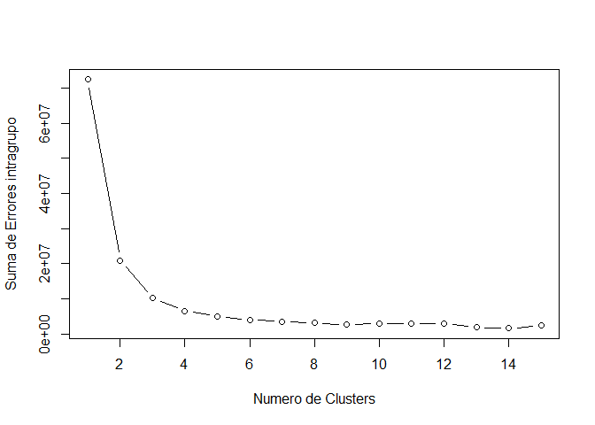
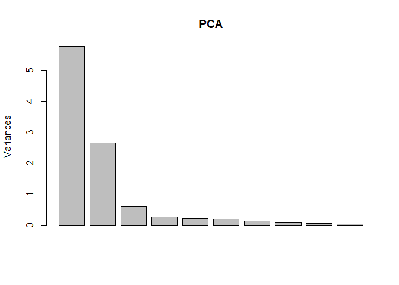
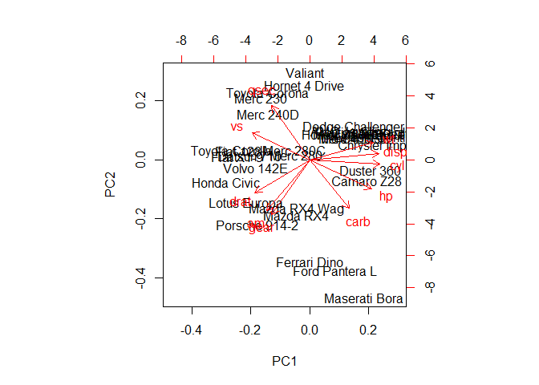
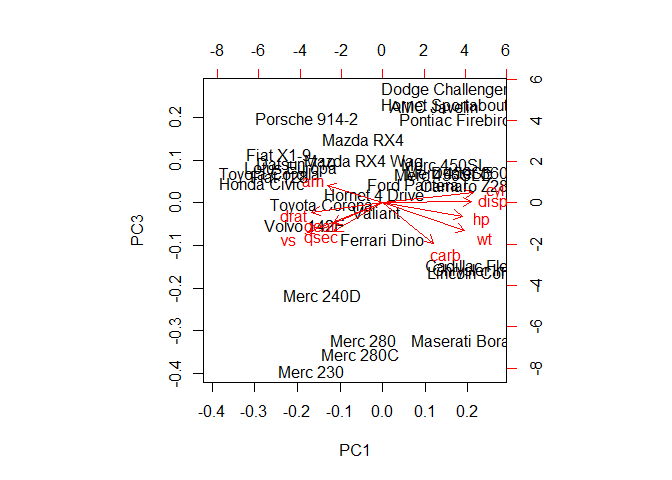
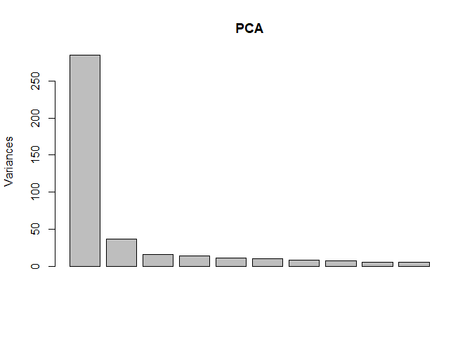
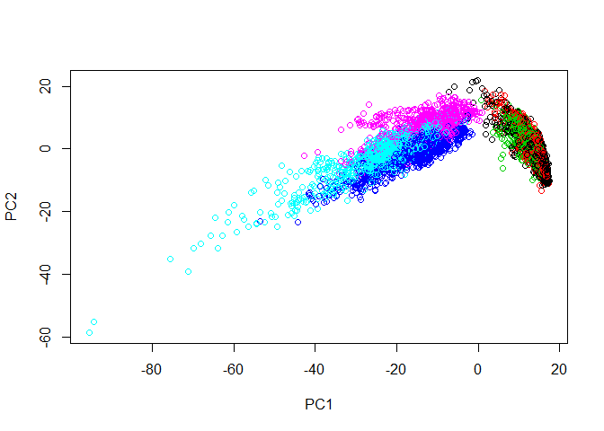

Aprendizaje No Supervisado
================

Bloque de inicializacion de librerias
-------------------------------------

``` r
if(!require("dummies")){
  install.packages("dummies")
  library("dummies")
}
```

    ## Loading required package: dummies

    ## dummies-1.5.6 provided by Decision Patterns

``` r
# setwd("D:/Documentos, Trabajos y Demás/Formación/Kschool/201807 Clase VIII Master Data Science/5 Aprendizaje no Supervisado")

# indicar el directorio de trabajo
# setwd("C:/....")
```

PARTE 1: CLUSTERING JERARQUICO: NETFLIX MOVIELENS
=================================================

Bloque de carga de datos
------------------------

``` r
movies = read.table("data/movies.txt",header=TRUE, sep="|",quote="\"")
```

Bloque de analisis preliminar del dataset
-----------------------------------------

``` r
str(movies)
```

    ## 'data.frame':    1664 obs. of  20 variables:
    ##  $ Title      : Factor w/ 1664 levels "'Til There Was You (1997)",..: 1525 618 555 594 344 1318 1545 111 391 1240 ...
    ##  $ Unknown    : int  0 0 0 0 0 0 0 0 0 0 ...
    ##  $ Action     : int  0 1 0 1 0 0 0 0 0 0 ...
    ##  $ Adventure  : int  0 1 0 0 0 0 0 0 0 0 ...
    ##  $ Animation  : int  1 0 0 0 0 0 0 0 0 0 ...
    ##  $ Childrens  : int  1 0 0 0 0 0 0 1 0 0 ...
    ##  $ Comedy     : int  1 0 0 1 0 0 0 1 0 0 ...
    ##  $ Crime      : int  0 0 0 0 1 0 0 0 0 0 ...
    ##  $ Documentary: int  0 0 0 0 0 0 0 0 0 0 ...
    ##  $ Drama      : int  0 0 0 1 1 1 1 1 1 1 ...
    ##  $ Fantasy    : int  0 0 0 0 0 0 0 0 0 0 ...
    ##  $ FilmNoir   : int  0 0 0 0 0 0 0 0 0 0 ...
    ##  $ Horror     : int  0 0 0 0 0 0 0 0 0 0 ...
    ##  $ Musical    : int  0 0 0 0 0 0 0 0 0 0 ...
    ##  $ Mystery    : int  0 0 0 0 0 0 0 0 0 0 ...
    ##  $ Romance    : int  0 0 0 0 0 0 0 0 0 0 ...
    ##  $ SciFi      : int  0 0 0 0 0 0 1 0 0 0 ...
    ##  $ Thriller   : int  0 1 1 0 1 0 0 0 0 0 ...
    ##  $ War        : int  0 0 0 0 0 0 0 0 0 1 ...
    ##  $ Western    : int  0 0 0 0 0 0 0 0 0 0 ...

``` r
head(movies)
```

    ##                                                  Title Unknown Action
    ## 1                                     Toy Story (1995)       0      0
    ## 2                                     GoldenEye (1995)       0      1
    ## 3                                    Four Rooms (1995)       0      0
    ## 4                                    Get Shorty (1995)       0      1
    ## 5                                       Copycat (1995)       0      0
    ## 6 Shanghai Triad (Yao a yao yao dao waipo qiao) (1995)       0      0
    ##   Adventure Animation Childrens Comedy Crime Documentary Drama Fantasy
    ## 1         0         1         1      1     0           0     0       0
    ## 2         1         0         0      0     0           0     0       0
    ## 3         0         0         0      0     0           0     0       0
    ## 4         0         0         0      1     0           0     1       0
    ## 5         0         0         0      0     1           0     1       0
    ## 6         0         0         0      0     0           0     1       0
    ##   FilmNoir Horror Musical Mystery Romance SciFi Thriller War Western
    ## 1        0      0       0       0       0     0        0   0       0
    ## 2        0      0       0       0       0     0        1   0       0
    ## 3        0      0       0       0       0     0        1   0       0
    ## 4        0      0       0       0       0     0        0   0       0
    ## 5        0      0       0       0       0     0        1   0       0
    ## 6        0      0       0       0       0     0        0   0       0

``` r
tail(movies)
```

    ##                                          Title Unknown Action Adventure
    ## 1659                   War at Home, The (1996)       0      0         0
    ## 1660                      Sweet Nothing (1995)       0      0         0
    ## 1661                         Mat' i syn (1997)       0      0         0
    ## 1662                          B. Monkey (1998)       0      0         0
    ## 1663                       You So Crazy (1994)       0      0         0
    ## 1664 Scream of Stone (Schrei aus Stein) (1991)       0      0         0
    ##      Animation Childrens Comedy Crime Documentary Drama Fantasy FilmNoir
    ## 1659         0         0      0     0           0     1       0        0
    ## 1660         0         0      0     0           0     1       0        0
    ## 1661         0         0      0     0           0     1       0        0
    ## 1662         0         0      0     0           0     0       0        0
    ## 1663         0         0      1     0           0     0       0        0
    ## 1664         0         0      0     0           0     1       0        0
    ##      Horror Musical Mystery Romance SciFi Thriller War Western
    ## 1659      0       0       0       0     0        0   0       0
    ## 1660      0       0       0       0     0        0   0       0
    ## 1661      0       0       0       0     0        0   0       0
    ## 1662      0       0       0       1     0        1   0       0
    ## 1663      0       0       0       0     0        0   0       0
    ## 1664      0       0       0       0     0        0   0       0

``` r
table(movies$Comedy)  # Número de comedias
```

    ## 
    ##    0    1 
    ## 1162  502

``` r
table(movies$Western)
```

    ## 
    ##    0    1 
    ## 1637   27

``` r
table(movies$Romance, movies$Drama)  # Muchos dramas que no son romance o que sí, romances que no son drama y 801 que no son ni romance ni drama. 
```

    ##    
    ##       0   1
    ##   0 801 619
    ##   1 147  97

``` r
# Hay muchas mezclas y posibilidades.
```

Lo que yo quiero es agrupar películas en base a algo más a alto nivel que el género tal y como viene en la tabla. Al final lo más razonable es que un usuario tenga, por ejemplo, 6 elecciones, no 30. Y en qué 6 categorías divido? Pues seguro que voy a estar sesgado por mis gustos.

Para estas cosas viene bien el aprendizaje supervisado, tengo una idea de lo que quiero obtener y agrupo.

Bloque de calculo de distancias
-------------------------------

Lo primero que hacemos es calcular las distancias. Esto es un paso previo que hay que hacer.

No escalamos ni normalizamos porque son todo ceros y unos, pero siempre hay que tenerlo en cuenta cuando usemos distancias.

``` r
distances = dist(movies[2:20], method = "euclidean")
```

Bloque de clustering jerarquico
-------------------------------

``` r
# Calculamos los clusters. Es muy rápido, pero tener en cuenta que no escala bien.
clusterMovies = hclust(distances, method = "ward.D")  # método completo.

dev.off()
```

    ## null device 
    ##           1

``` r
plot(clusterMovies)  # No se ve nada.

rect.hclust(clusterMovies, k=2, border="yellow")
rect.hclust(clusterMovies, k=3, border="blue")
rect.hclust(clusterMovies, k=4, border="green")

NumCluster=6

rect.hclust(clusterMovies, k=NumCluster, border="red")

movies$clusterGroups = cutree(clusterMovies, k = NumCluster)
```

Imaginemos que agrupo en 6. ¿Y qué nombre le doy a los grupos?

Lo importante aquí es ENTENDER qué hay en cada grupo.

Bloque de analisis de clusters
------------------------------

``` r
table(movies$clusterGroups)
```

    ## 
    ##   1   2   3   4   5   6 
    ## 407 417 370 209 196  65

``` r
tapply(movies$Action, movies$clusterGroups, mean)  # Vamos a ver de cada grupo, cuántas hay de acción
```

    ##          1          2          3          4          5          6 
    ## 0.13022113 0.43884892 0.00000000 0.00000000 0.06632653 0.00000000

``` r
tapply(movies$Adventure, movies$clusterGroups, mean)
```

    ##         1         2         3         4         5         6 
    ## 0.1351351 0.1870504 0.0000000 0.0000000 0.0000000 0.0000000

``` r
tapply(movies$Animation, movies$clusterGroups, mean)
```

    ##           1           2           3           4           5           6 
    ## 0.098280098 0.004796163 0.000000000 0.000000000 0.000000000 0.000000000

``` r
tapply(movies$Childrens, movies$clusterGroups, mean)
```

    ##           1           2           3           4           5           6 
    ## 0.287469287 0.007194245 0.000000000 0.000000000 0.000000000 0.000000000

``` r
tapply(movies$Comedy, movies$clusterGroups, mean)
```

    ##         1         2         3         4         5         6 
    ## 0.2923833 0.0647482 0.0000000 1.0000000 0.4183673 1.0000000

``` r
tapply(movies$Crime, movies$clusterGroups, mean)
```

    ##          1          2          3          4          5          6 
    ## 0.02457002 0.21822542 0.00000000 0.00000000 0.03061224 0.00000000

``` r
tapply(movies$Documentary, movies$clusterGroups, mean)
```

    ##         1         2         3         4         5         6 
    ## 0.1228501 0.0000000 0.0000000 0.0000000 0.0000000 0.0000000

``` r
tapply(movies$Drama, movies$clusterGroups, mean)
```

    ##         1         2         3         4         5         6 
    ## 0.2235872 0.2517986 1.0000000 0.0000000 0.4336735 1.0000000

``` r
aggregate(.~clusterGroups,FUN=mean, data=movies)
```

    ##   clusterGroups    Title     Unknown     Action Adventure   Animation
    ## 1             1 787.3022 0.004914005 0.13022113 0.1351351 0.098280098
    ## 2             2 816.3573 0.000000000 0.43884892 0.1870504 0.004796163
    ## 3             3 861.6838 0.000000000 0.00000000 0.0000000 0.000000000
    ## 4             4 782.7847 0.000000000 0.00000000 0.0000000 0.000000000
    ## 5             5 922.7398 0.000000000 0.06632653 0.0000000 0.000000000
    ## 6             6 940.6923 0.000000000 0.00000000 0.0000000 0.000000000
    ##     Childrens    Comedy      Crime Documentary     Drama     Fantasy
    ## 1 0.287469287 0.2923833 0.02457002   0.1228501 0.2235872 0.051597052
    ## 2 0.007194245 0.0647482 0.21822542   0.0000000 0.2517986 0.002398082
    ## 3 0.000000000 0.0000000 0.00000000   0.0000000 1.0000000 0.000000000
    ## 4 0.000000000 1.0000000 0.00000000   0.0000000 0.0000000 0.000000000
    ## 5 0.000000000 0.4183673 0.03061224   0.0000000 0.4336735 0.000000000
    ## 6 0.000000000 1.0000000 0.00000000   0.0000000 1.0000000 0.000000000
    ##      FilmNoir     Horror   Musical   Mystery    Romance      SciFi
    ## 1 0.000000000 0.16707617 0.1375921 0.0000000 0.07616708 0.05405405
    ## 2 0.055155875 0.04796163 0.0000000 0.1438849 0.04076739 0.18705036
    ## 3 0.000000000 0.00000000 0.0000000 0.0000000 0.00000000 0.00000000
    ## 4 0.000000000 0.00000000 0.0000000 0.0000000 0.00000000 0.00000000
    ## 5 0.005102041 0.01020408 0.0000000 0.0000000 1.00000000 0.00000000
    ## 6 0.000000000 0.00000000 0.0000000 0.0000000 0.00000000 0.00000000
    ##     Thriller         War    Western
    ## 1 0.05405405 0.167076167 0.06633907
    ## 2 0.49880096 0.007194245 0.00000000
    ## 3 0.00000000 0.000000000 0.00000000
    ## 4 0.00000000 0.000000000 0.00000000
    ## 5 0.09183673 0.000000000 0.00000000
    ## 6 0.00000000 0.000000000 0.00000000

Si lo hacemos con 2 grupos, vemos que:

-   Podemos ver que el primer grupo tiene un 0,19(19%) de accion, 0,10 de aventura, etc...
-   Vemos que en el grupo 2 es todo drama, y el otro grupo es el resto.

Si lo hacemos con 4, vemos: \* El grupo 1 tiene un poco de todo. \* El grupo 2 tiene drama \* El grupo 3 tiene comedias que pueden tener un punto dramático \* El grupo 4 tiene romances que tienen algo de comedia en ellos, y algo de drama en ellos.

Si lo hacemos con 6: \* 1. Otros \* 2. alta tensión \* 3. dramón \* 4. comedia \* 5. ...

NO hay un clustering que sea mejor, sino el que nos sirva.

Bloque de ejemplo
-----------------

``` r
subset(movies, Title=="Men in Black (1997)")  # vemos en la columna clusterGroups que es del cluster 2.
```

    ##                   Title Unknown Action Adventure Animation Childrens
    ## 257 Men in Black (1997)       0      1         1         0         0
    ##     Comedy Crime Documentary Drama Fantasy FilmNoir Horror Musical Mystery
    ## 257      1     0           0     0       0        0      0       0       0
    ##     Romance SciFi Thriller War Western clusterGroups
    ## 257       0     1        0   0       0             2

``` r
cluster2 = subset(movies, movies$clusterGroups==2)  # sacamos las películas del cluster 2

cluster2$Title[1:10]  # vemos que las del cluster 2 son parecidas en concepto a la de men in black.
```

    ##  [1] GoldenEye (1995)           Four Rooms (1995)         
    ##  [3] Copycat (1995)             Seven (Se7en) (1995)      
    ##  [5] Usual Suspects, The (1995) From Dusk Till Dawn (1996)
    ##  [7] Taxi Driver (1976)         Rumble in the Bronx (1995)
    ##  [9] Bad Boys (1995)            Apollo 13 (1995)          
    ## 1664 Levels: 'Til There Was You (1997) ... Zeus and Roxanne (1997)

Si ahora yo meto una película nueva, dónde la asigno? Analíticamente, no puedo. Ese es el problema del clustering jerárquico: va muy bien, pero no puedo asignar nuevos puntos de una manera analítica (mediante una función)

PARTE 2: CLUSTERING kMEANS
==========================

Bloque de carga de Datos
------------------------

``` r
creditos=read.csv("data/creditos.csv",stringsAsFactors = FALSE)
```

Bloque de revisión basica del dataset
-------------------------------------

``` r
str(creditos)
```

    ## 'data.frame':    300 obs. of  10 variables:
    ##  $ Income   : num  14.9 106 104.6 148.9 55.9 ...
    ##  $ Rating   : int  283 483 514 681 357 569 259 512 266 491 ...
    ##  $ Products : int  2 3 4 3 2 4 2 2 5 3 ...
    ##  $ Age      : int  34 82 71 36 68 77 37 87 66 41 ...
    ##  $ Education: int  11 15 11 11 16 10 12 9 13 19 ...
    ##  $ Gender   : chr  " Male" "Female" " Male" "Female" ...
    ##  $ Mortgage : chr  "No" "Yes" "No" "No" ...
    ##  $ Married  : chr  "Yes" "Yes" "No" "No" ...
    ##  $ Ethnicity: chr  "Caucasian" "Asian" "Asian" "Asian" ...
    ##  $ Balance  : int  333 903 580 964 331 1151 203 872 279 1350 ...

``` r
head(creditos)
```

    ##    Income Rating Products Age Education Gender Mortgage Married Ethnicity
    ## 1  14.891    283        2  34        11   Male       No     Yes Caucasian
    ## 2 106.025    483        3  82        15 Female      Yes     Yes     Asian
    ## 3 104.593    514        4  71        11   Male       No      No     Asian
    ## 4 148.924    681        3  36        11 Female       No      No     Asian
    ## 5  55.882    357        2  68        16   Male       No     Yes Caucasian
    ## 6  80.180    569        4  77        10   Male       No      No Caucasian
    ##   Balance
    ## 1     333
    ## 2     903
    ## 3     580
    ## 4     964
    ## 5     331
    ## 6    1151

``` r
summary(creditos)
```

    ##      Income           Rating         Products          Age       
    ##  Min.   : 10.35   Min.   : 93.0   Min.   :1.000   Min.   :24.00  
    ##  1st Qu.: 21.03   1st Qu.:235.0   1st Qu.:2.000   1st Qu.:41.00  
    ##  Median : 33.12   Median :339.0   Median :3.000   Median :55.00  
    ##  Mean   : 44.05   Mean   :348.1   Mean   :3.027   Mean   :54.98  
    ##  3rd Qu.: 55.98   3rd Qu.:433.0   3rd Qu.:4.000   3rd Qu.:69.00  
    ##  Max.   :186.63   Max.   :949.0   Max.   :8.000   Max.   :91.00  
    ##    Education        Gender            Mortgage           Married         
    ##  Min.   : 5.00   Length:300         Length:300         Length:300        
    ##  1st Qu.:11.00   Class :character   Class :character   Class :character  
    ##  Median :14.00   Mode  :character   Mode  :character   Mode  :character  
    ##  Mean   :13.39                                                           
    ##  3rd Qu.:16.00                                                           
    ##  Max.   :20.00                                                           
    ##   Ethnicity            Balance       
    ##  Length:300         Min.   :   0.00  
    ##  Class :character   1st Qu.:  15.75  
    ##  Mode  :character   Median : 433.50  
    ##                     Mean   : 502.69  
    ##                     3rd Qu.: 857.75  
    ##                     Max.   :1809.00

Yo me podría plantear ¿cómo son mis clientes? Podríamos segmentar clientes por cómo sean y ofrecerles cosas que les interesen más.

Bloque de tratamiento de variables
----------------------------------

``` r
creditosNumericos=dummy.data.frame(creditos, dummy.class="character" )  # En vez de transformarlas en factores, las transformamos en dummies directamente.
summary(creditosNumericos)
```

    ##      Income           Rating         Products          Age       
    ##  Min.   : 10.35   Min.   : 93.0   Min.   :1.000   Min.   :24.00  
    ##  1st Qu.: 21.03   1st Qu.:235.0   1st Qu.:2.000   1st Qu.:41.00  
    ##  Median : 33.12   Median :339.0   Median :3.000   Median :55.00  
    ##  Mean   : 44.05   Mean   :348.1   Mean   :3.027   Mean   :54.98  
    ##  3rd Qu.: 55.98   3rd Qu.:433.0   3rd Qu.:4.000   3rd Qu.:69.00  
    ##  Max.   :186.63   Max.   :949.0   Max.   :8.000   Max.   :91.00  
    ##    Education      Gender Male    GenderFemale    MortgageNo    
    ##  Min.   : 5.00   Min.   :0.00   Min.   :0.00   Min.   :0.0000  
    ##  1st Qu.:11.00   1st Qu.:0.00   1st Qu.:0.00   1st Qu.:1.0000  
    ##  Median :14.00   Median :0.00   Median :1.00   Median :1.0000  
    ##  Mean   :13.39   Mean   :0.44   Mean   :0.56   Mean   :0.8933  
    ##  3rd Qu.:16.00   3rd Qu.:1.00   3rd Qu.:1.00   3rd Qu.:1.0000  
    ##  Max.   :20.00   Max.   :1.00   Max.   :1.00   Max.   :1.0000  
    ##   MortgageYes       MarriedNo      MarriedYes   EthnicityAfrican American
    ##  Min.   :0.0000   Min.   :0.00   Min.   :0.00   Min.   :0.00             
    ##  1st Qu.:0.0000   1st Qu.:0.00   1st Qu.:0.00   1st Qu.:0.00             
    ##  Median :0.0000   Median :0.00   Median :1.00   Median :0.00             
    ##  Mean   :0.1067   Mean   :0.39   Mean   :0.61   Mean   :0.26             
    ##  3rd Qu.:0.0000   3rd Qu.:1.00   3rd Qu.:1.00   3rd Qu.:1.00             
    ##  Max.   :1.0000   Max.   :1.00   Max.   :1.00   Max.   :1.00             
    ##  EthnicityAsian EthnicityCaucasian    Balance       
    ##  Min.   :0.00   Min.   :0.00       Min.   :   0.00  
    ##  1st Qu.:0.00   1st Qu.:0.00       1st Qu.:  15.75  
    ##  Median :0.00   Median :0.00       Median : 433.50  
    ##  Mean   :0.27   Mean   :0.47       Mean   : 502.69  
    ##  3rd Qu.:1.00   3rd Qu.:1.00       3rd Qu.: 857.75  
    ##  Max.   :1.00   Max.   :1.00       Max.   :1809.00

Bloque de Segmentación mediante Modelo RFM 12M
----------------------------------------------

``` r
# Ojo: siempre que trabajemos con distancias (KMeans) es que tendremos que escalar. Normalmente se normaliza (- media entre std)
creditosScaled=scale(creditosNumericos)

NUM_CLUSTERS=5
set.seed(1234)
Modelo=kmeans(creditosScaled,NUM_CLUSTERS)

creditos$Segmentos=Modelo$cluster
creditosNumericos$Segmentos=Modelo$cluster

table(creditosNumericos$Segmentos)
```

    ## 
    ##  1  2  3  4  5 
    ## 90 45 77 56 32

``` r
aggregate(creditosNumericos, by = list(creditosNumericos$Segmentos), mean)
```

    ##   Group.1   Income   Rating Products      Age Education Gender Male
    ## 1       1 45.63159 363.8111 2.877778 54.97778  13.65556      0.0000
    ## 2       2 45.92989 340.1333 3.000000 57.00000  13.66667      1.0000
    ## 3       3 43.40770 347.8442 3.194805 52.09091  13.06494      1.0000
    ## 4       4 37.92414 322.5536 3.053571 58.19643  12.89286      0.0000
    ## 5       5 49.26516 360.5938 3.031250 53.50000  13.93750      0.3125
    ##   GenderFemale MortgageNo MortgageYes MarriedNo MarriedYes
    ## 1       1.0000          1           0       0.0        1.0
    ## 2       0.0000          1           0       1.0        0.0
    ## 3       0.0000          1           0       0.0        1.0
    ## 4       1.0000          1           0       1.0        0.0
    ## 5       0.6875          0           1       0.5        0.5
    ##   EthnicityAfrican American EthnicityAsian EthnicityCaucasian  Balance
    ## 1                 0.2000000      0.3111111          0.4888889 506.7778
    ## 2                 0.2444444      0.2666667          0.4888889 417.4222
    ## 3                 0.2467532      0.2987013          0.4545455 457.4675
    ## 4                 0.3928571      0.1250000          0.4821429 403.7321
    ## 5                 0.2500000      0.3437500          0.4062500 893.0625
    ##   Segmentos
    ## 1         1
    ## 2         2
    ## 3         3
    ## 4         4
    ## 5         5

-   Con 2 grupos separa en mujeres casadas asiáticas y hombres solteros. Ya tenemos dos perfiles (el perfil siempre es una simplificación, no va nunca a ser exacto). Esto ya nos da algo de info:
-   Con 3 grupos: mujeres casadas, hombres casados y no casados.
-   Con 4 grupos: casados sin hipoteca, solteros sin hipoteca hombres, mujeres casadas sin hipoteca, con hipoteca.

Además también puedo ver variables que, a parte de diferenciar grupos, pueden describirlos: veo que el grupo 3 tiene más income.

Bloque de Metodo de seleccion de numero de clusters (Elbow Method)
------------------------------------------------------------------

``` r
Intra <- (nrow(creditosNumericos)-1)*sum(apply(creditosNumericos,2,var))  # errores intragrupo (distancia con respecto al centroide)
for (i in 2:15) Intra[i] <- sum(kmeans(creditosNumericos, centers=i)$withinss)
plot(1:15, Intra, type="b", xlab="Numero de Clusters", ylab="Suma de Errores intragrupo")
```



Esto me dice que a cuantos más clusters haga, menor error tengo. El K que hay que elegir es el codo: el punto a partir del cual añadir un cluster no me mejora demasiado el error, mientras que se me mete complejidad de cálculo.

PARTE 3: PCA: REDUCCIÓN DE DIMENSIONALIDAD.
===========================================

Bloque de carga de datos
------------------------

``` r
coches=mtcars # Base de datos ejemplo en R
```

Bloque de revisión basica del dataset
-------------------------------------

``` r
str(coches)
```

    ## 'data.frame':    32 obs. of  11 variables:
    ##  $ mpg : num  21 21 22.8 21.4 18.7 18.1 14.3 24.4 22.8 19.2 ...
    ##  $ cyl : num  6 6 4 6 8 6 8 4 4 6 ...
    ##  $ disp: num  160 160 108 258 360 ...
    ##  $ hp  : num  110 110 93 110 175 105 245 62 95 123 ...
    ##  $ drat: num  3.9 3.9 3.85 3.08 3.15 2.76 3.21 3.69 3.92 3.92 ...
    ##  $ wt  : num  2.62 2.88 2.32 3.21 3.44 ...
    ##  $ qsec: num  16.5 17 18.6 19.4 17 ...
    ##  $ vs  : num  0 0 1 1 0 1 0 1 1 1 ...
    ##  $ am  : num  1 1 1 0 0 0 0 0 0 0 ...
    ##  $ gear: num  4 4 4 3 3 3 3 4 4 4 ...
    ##  $ carb: num  4 4 1 1 2 1 4 2 2 4 ...

``` r
head(coches)
```

    ##                    mpg cyl disp  hp drat    wt  qsec vs am gear carb
    ## Mazda RX4         21.0   6  160 110 3.90 2.620 16.46  0  1    4    4
    ## Mazda RX4 Wag     21.0   6  160 110 3.90 2.875 17.02  0  1    4    4
    ## Datsun 710        22.8   4  108  93 3.85 2.320 18.61  1  1    4    1
    ## Hornet 4 Drive    21.4   6  258 110 3.08 3.215 19.44  1  0    3    1
    ## Hornet Sportabout 18.7   8  360 175 3.15 3.440 17.02  0  0    3    2
    ## Valiant           18.1   6  225 105 2.76 3.460 20.22  1  0    3    1

``` r
summary(coches)
```

    ##       mpg             cyl             disp             hp       
    ##  Min.   :10.40   Min.   :4.000   Min.   : 71.1   Min.   : 52.0  
    ##  1st Qu.:15.43   1st Qu.:4.000   1st Qu.:120.8   1st Qu.: 96.5  
    ##  Median :19.20   Median :6.000   Median :196.3   Median :123.0  
    ##  Mean   :20.09   Mean   :6.188   Mean   :230.7   Mean   :146.7  
    ##  3rd Qu.:22.80   3rd Qu.:8.000   3rd Qu.:326.0   3rd Qu.:180.0  
    ##  Max.   :33.90   Max.   :8.000   Max.   :472.0   Max.   :335.0  
    ##       drat             wt             qsec             vs        
    ##  Min.   :2.760   Min.   :1.513   Min.   :14.50   Min.   :0.0000  
    ##  1st Qu.:3.080   1st Qu.:2.581   1st Qu.:16.89   1st Qu.:0.0000  
    ##  Median :3.695   Median :3.325   Median :17.71   Median :0.0000  
    ##  Mean   :3.597   Mean   :3.217   Mean   :17.85   Mean   :0.4375  
    ##  3rd Qu.:3.920   3rd Qu.:3.610   3rd Qu.:18.90   3rd Qu.:1.0000  
    ##  Max.   :4.930   Max.   :5.424   Max.   :22.90   Max.   :1.0000  
    ##        am              gear            carb      
    ##  Min.   :0.0000   Min.   :3.000   Min.   :1.000  
    ##  1st Qu.:0.0000   1st Qu.:3.000   1st Qu.:2.000  
    ##  Median :0.0000   Median :4.000   Median :2.000  
    ##  Mean   :0.4062   Mean   :3.688   Mean   :2.812  
    ##  3rd Qu.:1.0000   3rd Qu.:4.000   3rd Qu.:4.000  
    ##  Max.   :1.0000   Max.   :5.000   Max.   :8.000

Bloque de modelo lineal
-----------------------

``` r
modelo_bruto=lm(mpg~.,data=coches)
summary(modelo_bruto)
```

    ## 
    ## Call:
    ## lm(formula = mpg ~ ., data = coches)
    ## 
    ## Residuals:
    ##     Min      1Q  Median      3Q     Max 
    ## -3.4506 -1.6044 -0.1196  1.2193  4.6271 
    ## 
    ## Coefficients:
    ##             Estimate Std. Error t value Pr(>|t|)  
    ## (Intercept) 12.30337   18.71788   0.657   0.5181  
    ## cyl         -0.11144    1.04502  -0.107   0.9161  
    ## disp         0.01334    0.01786   0.747   0.4635  
    ## hp          -0.02148    0.02177  -0.987   0.3350  
    ## drat         0.78711    1.63537   0.481   0.6353  
    ## wt          -3.71530    1.89441  -1.961   0.0633 .
    ## qsec         0.82104    0.73084   1.123   0.2739  
    ## vs           0.31776    2.10451   0.151   0.8814  
    ## am           2.52023    2.05665   1.225   0.2340  
    ## gear         0.65541    1.49326   0.439   0.6652  
    ## carb        -0.19942    0.82875  -0.241   0.8122  
    ## ---
    ## Signif. codes:  0 '***' 0.001 '**' 0.01 '*' 0.05 '.' 0.1 ' ' 1
    ## 
    ## Residual standard error: 2.65 on 21 degrees of freedom
    ## Multiple R-squared:  0.869,  Adjusted R-squared:  0.8066 
    ## F-statistic: 13.93 on 10 and 21 DF,  p-value: 3.793e-07

``` r
cor(coches)  # Mucha multicolinealidad
```

    ##             mpg        cyl       disp         hp        drat         wt
    ## mpg   1.0000000 -0.8521620 -0.8475514 -0.7761684  0.68117191 -0.8676594
    ## cyl  -0.8521620  1.0000000  0.9020329  0.8324475 -0.69993811  0.7824958
    ## disp -0.8475514  0.9020329  1.0000000  0.7909486 -0.71021393  0.8879799
    ## hp   -0.7761684  0.8324475  0.7909486  1.0000000 -0.44875912  0.6587479
    ## drat  0.6811719 -0.6999381 -0.7102139 -0.4487591  1.00000000 -0.7124406
    ## wt   -0.8676594  0.7824958  0.8879799  0.6587479 -0.71244065  1.0000000
    ## qsec  0.4186840 -0.5912421 -0.4336979 -0.7082234  0.09120476 -0.1747159
    ## vs    0.6640389 -0.8108118 -0.7104159 -0.7230967  0.44027846 -0.5549157
    ## am    0.5998324 -0.5226070 -0.5912270 -0.2432043  0.71271113 -0.6924953
    ## gear  0.4802848 -0.4926866 -0.5555692 -0.1257043  0.69961013 -0.5832870
    ## carb -0.5509251  0.5269883  0.3949769  0.7498125 -0.09078980  0.4276059
    ##             qsec         vs          am       gear        carb
    ## mpg   0.41868403  0.6640389  0.59983243  0.4802848 -0.55092507
    ## cyl  -0.59124207 -0.8108118 -0.52260705 -0.4926866  0.52698829
    ## disp -0.43369788 -0.7104159 -0.59122704 -0.5555692  0.39497686
    ## hp   -0.70822339 -0.7230967 -0.24320426 -0.1257043  0.74981247
    ## drat  0.09120476  0.4402785  0.71271113  0.6996101 -0.09078980
    ## wt   -0.17471588 -0.5549157 -0.69249526 -0.5832870  0.42760594
    ## qsec  1.00000000  0.7445354 -0.22986086 -0.2126822 -0.65624923
    ## vs    0.74453544  1.0000000  0.16834512  0.2060233 -0.56960714
    ## am   -0.22986086  0.1683451  1.00000000  0.7940588  0.05753435
    ## gear -0.21268223  0.2060233  0.79405876  1.0000000  0.27407284
    ## carb -0.65624923 -0.5696071  0.05753435  0.2740728  1.00000000

Bloque de modelos univariables
------------------------------

``` r
modelo1=lm(mpg~cyl,data=coches)
summary(modelo1)
```

    ## 
    ## Call:
    ## lm(formula = mpg ~ cyl, data = coches)
    ## 
    ## Residuals:
    ##     Min      1Q  Median      3Q     Max 
    ## -4.9814 -2.1185  0.2217  1.0717  7.5186 
    ## 
    ## Coefficients:
    ##             Estimate Std. Error t value Pr(>|t|)    
    ## (Intercept)  37.8846     2.0738   18.27  < 2e-16 ***
    ## cyl          -2.8758     0.3224   -8.92 6.11e-10 ***
    ## ---
    ## Signif. codes:  0 '***' 0.001 '**' 0.01 '*' 0.05 '.' 0.1 ' ' 1
    ## 
    ## Residual standard error: 3.206 on 30 degrees of freedom
    ## Multiple R-squared:  0.7262, Adjusted R-squared:  0.7171 
    ## F-statistic: 79.56 on 1 and 30 DF,  p-value: 6.113e-10

``` r
modelo2=lm(mpg~disp,data=coches)
summary(modelo2)
```

    ## 
    ## Call:
    ## lm(formula = mpg ~ disp, data = coches)
    ## 
    ## Residuals:
    ##     Min      1Q  Median      3Q     Max 
    ## -4.8922 -2.2022 -0.9631  1.6272  7.2305 
    ## 
    ## Coefficients:
    ##              Estimate Std. Error t value Pr(>|t|)    
    ## (Intercept) 29.599855   1.229720  24.070  < 2e-16 ***
    ## disp        -0.041215   0.004712  -8.747 9.38e-10 ***
    ## ---
    ## Signif. codes:  0 '***' 0.001 '**' 0.01 '*' 0.05 '.' 0.1 ' ' 1
    ## 
    ## Residual standard error: 3.251 on 30 degrees of freedom
    ## Multiple R-squared:  0.7183, Adjusted R-squared:  0.709 
    ## F-statistic: 76.51 on 1 and 30 DF,  p-value: 9.38e-10

``` r
modelo3=lm(mpg~hp,data=coches)
summary(modelo3)
```

    ## 
    ## Call:
    ## lm(formula = mpg ~ hp, data = coches)
    ## 
    ## Residuals:
    ##     Min      1Q  Median      3Q     Max 
    ## -5.7121 -2.1122 -0.8854  1.5819  8.2360 
    ## 
    ## Coefficients:
    ##             Estimate Std. Error t value Pr(>|t|)    
    ## (Intercept) 30.09886    1.63392  18.421  < 2e-16 ***
    ## hp          -0.06823    0.01012  -6.742 1.79e-07 ***
    ## ---
    ## Signif. codes:  0 '***' 0.001 '**' 0.01 '*' 0.05 '.' 0.1 ' ' 1
    ## 
    ## Residual standard error: 3.863 on 30 degrees of freedom
    ## Multiple R-squared:  0.6024, Adjusted R-squared:  0.5892 
    ## F-statistic: 45.46 on 1 and 30 DF,  p-value: 1.788e-07

``` r
modelo4=lm(mpg~drat,data=coches)
summary(modelo4)
```

    ## 
    ## Call:
    ## lm(formula = mpg ~ drat, data = coches)
    ## 
    ## Residuals:
    ##     Min      1Q  Median      3Q     Max 
    ## -9.0775 -2.6803 -0.2095  2.2976  9.0225 
    ## 
    ## Coefficients:
    ##             Estimate Std. Error t value Pr(>|t|)    
    ## (Intercept)   -7.525      5.477  -1.374     0.18    
    ## drat           7.678      1.507   5.096 1.78e-05 ***
    ## ---
    ## Signif. codes:  0 '***' 0.001 '**' 0.01 '*' 0.05 '.' 0.1 ' ' 1
    ## 
    ## Residual standard error: 4.485 on 30 degrees of freedom
    ## Multiple R-squared:  0.464,  Adjusted R-squared:  0.4461 
    ## F-statistic: 25.97 on 1 and 30 DF,  p-value: 1.776e-05

``` r
modelo5=lm(mpg~wt,data=coches)
summary(modelo5)
```

    ## 
    ## Call:
    ## lm(formula = mpg ~ wt, data = coches)
    ## 
    ## Residuals:
    ##     Min      1Q  Median      3Q     Max 
    ## -4.5432 -2.3647 -0.1252  1.4096  6.8727 
    ## 
    ## Coefficients:
    ##             Estimate Std. Error t value Pr(>|t|)    
    ## (Intercept)  37.2851     1.8776  19.858  < 2e-16 ***
    ## wt           -5.3445     0.5591  -9.559 1.29e-10 ***
    ## ---
    ## Signif. codes:  0 '***' 0.001 '**' 0.01 '*' 0.05 '.' 0.1 ' ' 1
    ## 
    ## Residual standard error: 3.046 on 30 degrees of freedom
    ## Multiple R-squared:  0.7528, Adjusted R-squared:  0.7446 
    ## F-statistic: 91.38 on 1 and 30 DF,  p-value: 1.294e-10

``` r
modelo6=lm(mpg~qsec,data=coches)
summary(modelo6)
```

    ## 
    ## Call:
    ## lm(formula = mpg ~ qsec, data = coches)
    ## 
    ## Residuals:
    ##     Min      1Q  Median      3Q     Max 
    ## -9.8760 -3.4539 -0.7203  2.2774 11.6491 
    ## 
    ## Coefficients:
    ##             Estimate Std. Error t value Pr(>|t|)  
    ## (Intercept)  -5.1140    10.0295  -0.510   0.6139  
    ## qsec          1.4121     0.5592   2.525   0.0171 *
    ## ---
    ## Signif. codes:  0 '***' 0.001 '**' 0.01 '*' 0.05 '.' 0.1 ' ' 1
    ## 
    ## Residual standard error: 5.564 on 30 degrees of freedom
    ## Multiple R-squared:  0.1753, Adjusted R-squared:  0.1478 
    ## F-statistic: 6.377 on 1 and 30 DF,  p-value: 0.01708

``` r
modelo7=lm(mpg~vs,data=coches)
summary(modelo7)
```

    ## 
    ## Call:
    ## lm(formula = mpg ~ vs, data = coches)
    ## 
    ## Residuals:
    ##    Min     1Q Median     3Q    Max 
    ## -6.757 -3.082 -1.267  2.828  9.383 
    ## 
    ## Coefficients:
    ##             Estimate Std. Error t value Pr(>|t|)    
    ## (Intercept)   16.617      1.080  15.390 8.85e-16 ***
    ## vs             7.940      1.632   4.864 3.42e-05 ***
    ## ---
    ## Signif. codes:  0 '***' 0.001 '**' 0.01 '*' 0.05 '.' 0.1 ' ' 1
    ## 
    ## Residual standard error: 4.581 on 30 degrees of freedom
    ## Multiple R-squared:  0.4409, Adjusted R-squared:  0.4223 
    ## F-statistic: 23.66 on 1 and 30 DF,  p-value: 3.416e-05

``` r
modelo8=lm(mpg~am,data=coches)
summary(modelo8)
```

    ## 
    ## Call:
    ## lm(formula = mpg ~ am, data = coches)
    ## 
    ## Residuals:
    ##     Min      1Q  Median      3Q     Max 
    ## -9.3923 -3.0923 -0.2974  3.2439  9.5077 
    ## 
    ## Coefficients:
    ##             Estimate Std. Error t value Pr(>|t|)    
    ## (Intercept)   17.147      1.125  15.247 1.13e-15 ***
    ## am             7.245      1.764   4.106 0.000285 ***
    ## ---
    ## Signif. codes:  0 '***' 0.001 '**' 0.01 '*' 0.05 '.' 0.1 ' ' 1
    ## 
    ## Residual standard error: 4.902 on 30 degrees of freedom
    ## Multiple R-squared:  0.3598, Adjusted R-squared:  0.3385 
    ## F-statistic: 16.86 on 1 and 30 DF,  p-value: 0.000285

``` r
modelo9=lm(mpg~gear,data=coches)
summary(modelo9)
```

    ## 
    ## Call:
    ## lm(formula = mpg ~ gear, data = coches)
    ## 
    ## Residuals:
    ##     Min      1Q  Median      3Q     Max 
    ## -10.240  -2.793  -0.205   2.126  12.583 
    ## 
    ## Coefficients:
    ##             Estimate Std. Error t value Pr(>|t|)   
    ## (Intercept)    5.623      4.916   1.144   0.2618   
    ## gear           3.923      1.308   2.999   0.0054 **
    ## ---
    ## Signif. codes:  0 '***' 0.001 '**' 0.01 '*' 0.05 '.' 0.1 ' ' 1
    ## 
    ## Residual standard error: 5.374 on 30 degrees of freedom
    ## Multiple R-squared:  0.2307, Adjusted R-squared:  0.205 
    ## F-statistic: 8.995 on 1 and 30 DF,  p-value: 0.005401

``` r
modelo10=lm(mpg~carb,data=coches)
summary(modelo10)
```

    ## 
    ## Call:
    ## lm(formula = mpg ~ carb, data = coches)
    ## 
    ## Residuals:
    ##    Min     1Q Median     3Q    Max 
    ## -7.250 -3.316 -1.433  3.384 10.083 
    ## 
    ## Coefficients:
    ##             Estimate Std. Error t value Pr(>|t|)    
    ## (Intercept)  25.8723     1.8368  14.085 9.22e-15 ***
    ## carb         -2.0557     0.5685  -3.616  0.00108 ** 
    ## ---
    ## Signif. codes:  0 '***' 0.001 '**' 0.01 '*' 0.05 '.' 0.1 ' ' 1
    ## 
    ## Residual standard error: 5.113 on 30 degrees of freedom
    ## Multiple R-squared:  0.3035, Adjusted R-squared:  0.2803 
    ## F-statistic: 13.07 on 1 and 30 DF,  p-value: 0.001084

``` r
cor(coches)
```

    ##             mpg        cyl       disp         hp        drat         wt
    ## mpg   1.0000000 -0.8521620 -0.8475514 -0.7761684  0.68117191 -0.8676594
    ## cyl  -0.8521620  1.0000000  0.9020329  0.8324475 -0.69993811  0.7824958
    ## disp -0.8475514  0.9020329  1.0000000  0.7909486 -0.71021393  0.8879799
    ## hp   -0.7761684  0.8324475  0.7909486  1.0000000 -0.44875912  0.6587479
    ## drat  0.6811719 -0.6999381 -0.7102139 -0.4487591  1.00000000 -0.7124406
    ## wt   -0.8676594  0.7824958  0.8879799  0.6587479 -0.71244065  1.0000000
    ## qsec  0.4186840 -0.5912421 -0.4336979 -0.7082234  0.09120476 -0.1747159
    ## vs    0.6640389 -0.8108118 -0.7104159 -0.7230967  0.44027846 -0.5549157
    ## am    0.5998324 -0.5226070 -0.5912270 -0.2432043  0.71271113 -0.6924953
    ## gear  0.4802848 -0.4926866 -0.5555692 -0.1257043  0.69961013 -0.5832870
    ## carb -0.5509251  0.5269883  0.3949769  0.7498125 -0.09078980  0.4276059
    ##             qsec         vs          am       gear        carb
    ## mpg   0.41868403  0.6640389  0.59983243  0.4802848 -0.55092507
    ## cyl  -0.59124207 -0.8108118 -0.52260705 -0.4926866  0.52698829
    ## disp -0.43369788 -0.7104159 -0.59122704 -0.5555692  0.39497686
    ## hp   -0.70822339 -0.7230967 -0.24320426 -0.1257043  0.74981247
    ## drat  0.09120476  0.4402785  0.71271113  0.6996101 -0.09078980
    ## wt   -0.17471588 -0.5549157 -0.69249526 -0.5832870  0.42760594
    ## qsec  1.00000000  0.7445354 -0.22986086 -0.2126822 -0.65624923
    ## vs    0.74453544  1.0000000  0.16834512  0.2060233 -0.56960714
    ## am   -0.22986086  0.1683451  1.00000000  0.7940588  0.05753435
    ## gear -0.21268223  0.2060233  0.79405876  1.0000000  0.27407284
    ## carb -0.65624923 -0.5696071  0.05753435  0.2740728  1.00000000

Una a una todas son significativas, pero al poner todas juntas hay mucha correlación, multicolinealidad, y hay problemas.

Vemos un R2 alto y sin embargo ninguna significativa.

Bloque de Ejercicio
-------------------

¿Qué modelo de regresión lineal realizarías?

``` r
# Este sería teóricamente el mejor modelo
modelo = step(modelo_bruto,direction = "both", trace = 1)
```

    ## Start:  AIC=70.9
    ## mpg ~ cyl + disp + hp + drat + wt + qsec + vs + am + gear + carb
    ## 
    ##        Df Sum of Sq    RSS    AIC
    ## - cyl   1    0.0799 147.57 68.915
    ## - vs    1    0.1601 147.66 68.932
    ## - carb  1    0.4067 147.90 68.986
    ## - gear  1    1.3531 148.85 69.190
    ## - drat  1    1.6270 149.12 69.249
    ## - disp  1    3.9167 151.41 69.736
    ## - hp    1    6.8399 154.33 70.348
    ## - qsec  1    8.8641 156.36 70.765
    ## <none>              147.49 70.898
    ## - am    1   10.5467 158.04 71.108
    ## - wt    1   27.0144 174.51 74.280
    ## 
    ## Step:  AIC=68.92
    ## mpg ~ disp + hp + drat + wt + qsec + vs + am + gear + carb
    ## 
    ##        Df Sum of Sq    RSS    AIC
    ## - vs    1    0.2685 147.84 66.973
    ## - carb  1    0.5201 148.09 67.028
    ## - gear  1    1.8211 149.40 67.308
    ## - drat  1    1.9826 149.56 67.342
    ## - disp  1    3.9009 151.47 67.750
    ## - hp    1    7.3632 154.94 68.473
    ## <none>              147.57 68.915
    ## - qsec  1   10.0933 157.67 69.032
    ## - am    1   11.8359 159.41 69.384
    ## + cyl   1    0.0799 147.49 70.898
    ## - wt    1   27.0280 174.60 72.297
    ## 
    ## Step:  AIC=66.97
    ## mpg ~ disp + hp + drat + wt + qsec + am + gear + carb
    ## 
    ##        Df Sum of Sq    RSS    AIC
    ## - carb  1    0.6855 148.53 65.121
    ## - gear  1    2.1437 149.99 65.434
    ## - drat  1    2.2139 150.06 65.449
    ## - disp  1    3.6467 151.49 65.753
    ## - hp    1    7.1060 154.95 66.475
    ## <none>              147.84 66.973
    ## - am    1   11.5694 159.41 67.384
    ## - qsec  1   15.6830 163.53 68.200
    ## + vs    1    0.2685 147.57 68.915
    ## + cyl   1    0.1883 147.66 68.932
    ## - wt    1   27.3799 175.22 70.410
    ## 
    ## Step:  AIC=65.12
    ## mpg ~ disp + hp + drat + wt + qsec + am + gear
    ## 
    ##        Df Sum of Sq    RSS    AIC
    ## - gear  1     1.565 150.09 63.457
    ## - drat  1     1.932 150.46 63.535
    ## <none>              148.53 65.121
    ## - disp  1    10.110 158.64 65.229
    ## - am    1    12.323 160.85 65.672
    ## - hp    1    14.826 163.35 66.166
    ## + carb  1     0.685 147.84 66.973
    ## + vs    1     0.434 148.09 67.028
    ## + cyl   1     0.414 148.11 67.032
    ## - qsec  1    26.408 174.94 68.358
    ## - wt    1    69.127 217.66 75.350
    ## 
    ## Step:  AIC=63.46
    ## mpg ~ disp + hp + drat + wt + qsec + am
    ## 
    ##        Df Sum of Sq    RSS    AIC
    ## - drat  1     3.345 153.44 62.162
    ## - disp  1     8.545 158.64 63.229
    ## <none>              150.09 63.457
    ## - hp    1    13.285 163.38 64.171
    ## + gear  1     1.565 148.53 65.121
    ## + cyl   1     1.003 149.09 65.242
    ## + vs    1     0.645 149.45 65.319
    ## + carb  1     0.107 149.99 65.434
    ## - am    1    20.036 170.13 65.466
    ## - qsec  1    25.574 175.67 66.491
    ## - wt    1    67.572 217.66 73.351
    ## 
    ## Step:  AIC=62.16
    ## mpg ~ disp + hp + wt + qsec + am
    ## 
    ##        Df Sum of Sq    RSS    AIC
    ## - disp  1     6.629 160.07 61.515
    ## <none>              153.44 62.162
    ## - hp    1    12.572 166.01 62.682
    ## + drat  1     3.345 150.09 63.457
    ## + gear  1     2.977 150.46 63.535
    ## + cyl   1     2.447 150.99 63.648
    ## + vs    1     1.121 152.32 63.927
    ## + carb  1     0.011 153.43 64.160
    ## - qsec  1    26.470 179.91 65.255
    ## - am    1    32.198 185.63 66.258
    ## - wt    1    69.043 222.48 72.051
    ## 
    ## Step:  AIC=61.52
    ## mpg ~ hp + wt + qsec + am
    ## 
    ##        Df Sum of Sq    RSS    AIC
    ## - hp    1     9.219 169.29 61.307
    ## <none>              160.07 61.515
    ## + disp  1     6.629 153.44 62.162
    ## + carb  1     3.227 156.84 62.864
    ## + drat  1     1.428 158.64 63.229
    ## - qsec  1    20.225 180.29 63.323
    ## + cyl   1     0.249 159.82 63.465
    ## + vs    1     0.249 159.82 63.466
    ## + gear  1     0.171 159.90 63.481
    ## - am    1    25.993 186.06 64.331
    ## - wt    1    78.494 238.56 72.284
    ## 
    ## Step:  AIC=61.31
    ## mpg ~ wt + qsec + am
    ## 
    ##        Df Sum of Sq    RSS    AIC
    ## <none>              169.29 61.307
    ## + hp    1     9.219 160.07 61.515
    ## + carb  1     8.036 161.25 61.751
    ## + disp  1     3.276 166.01 62.682
    ## + cyl   1     1.501 167.78 63.022
    ## + drat  1     1.400 167.89 63.042
    ## + gear  1     0.123 169.16 63.284
    ## + vs    1     0.000 169.29 63.307
    ## - am    1    26.178 195.46 63.908
    ## - qsec  1   109.034 278.32 75.217
    ## - wt    1   183.347 352.63 82.790

``` r
summary(modelo)
```

    ## 
    ## Call:
    ## lm(formula = mpg ~ wt + qsec + am, data = coches)
    ## 
    ## Residuals:
    ##     Min      1Q  Median      3Q     Max 
    ## -3.4811 -1.5555 -0.7257  1.4110  4.6610 
    ## 
    ## Coefficients:
    ##             Estimate Std. Error t value Pr(>|t|)    
    ## (Intercept)   9.6178     6.9596   1.382 0.177915    
    ## wt           -3.9165     0.7112  -5.507 6.95e-06 ***
    ## qsec          1.2259     0.2887   4.247 0.000216 ***
    ## am            2.9358     1.4109   2.081 0.046716 *  
    ## ---
    ## Signif. codes:  0 '***' 0.001 '**' 0.01 '*' 0.05 '.' 0.1 ' ' 1
    ## 
    ## Residual standard error: 2.459 on 28 degrees of freedom
    ## Multiple R-squared:  0.8497, Adjusted R-squared:  0.8336 
    ## F-statistic: 52.75 on 3 and 28 DF,  p-value: 1.21e-11

``` r
# Vamos a hacer PCA a ver qué pasa
```

Bloque de Analisis de Componentes Principales
---------------------------------------------

``` r
PCA<-prcomp(coches[,-c(1)],scale. = TRUE)  # todas menos la independiente

summary(PCA)
```

    ## Importance of components:
    ##                          PC1   PC2     PC3     PC4     PC5     PC6     PC7
    ## Standard deviation     2.400 1.628 0.77280 0.51914 0.47143 0.45839 0.36458
    ## Proportion of Variance 0.576 0.265 0.05972 0.02695 0.02223 0.02101 0.01329
    ## Cumulative Proportion  0.576 0.841 0.90071 0.92766 0.94988 0.97089 0.98419
    ##                            PC8     PC9    PC10
    ## Standard deviation     0.28405 0.23163 0.15426
    ## Proportion of Variance 0.00807 0.00537 0.00238
    ## Cumulative Proportion  0.99226 0.99762 1.00000

Me da las varianzas y la proporción de la varianza.

Puedo quedarme sólo con 4? Sí. Pero también por 10: reducción de la dimensionalidad no es sólo para quitar variables, sino que por ejemplo PCA es para obtener variables incorreladas.

``` r
plot(PCA)
```



Cuántas quito? pues DEPENDE: de lo que yo pueda asumir, del negocio. Si puedo asumir perder un 15%, perfecto.

Como en este problema lo que pasaba es la multicolinealidad, no voy a quitar ninguna.

Bloque de ortogonalidad de componentes principales
--------------------------------------------------

``` r
cor(coches)
```

    ##             mpg        cyl       disp         hp        drat         wt
    ## mpg   1.0000000 -0.8521620 -0.8475514 -0.7761684  0.68117191 -0.8676594
    ## cyl  -0.8521620  1.0000000  0.9020329  0.8324475 -0.69993811  0.7824958
    ## disp -0.8475514  0.9020329  1.0000000  0.7909486 -0.71021393  0.8879799
    ## hp   -0.7761684  0.8324475  0.7909486  1.0000000 -0.44875912  0.6587479
    ## drat  0.6811719 -0.6999381 -0.7102139 -0.4487591  1.00000000 -0.7124406
    ## wt   -0.8676594  0.7824958  0.8879799  0.6587479 -0.71244065  1.0000000
    ## qsec  0.4186840 -0.5912421 -0.4336979 -0.7082234  0.09120476 -0.1747159
    ## vs    0.6640389 -0.8108118 -0.7104159 -0.7230967  0.44027846 -0.5549157
    ## am    0.5998324 -0.5226070 -0.5912270 -0.2432043  0.71271113 -0.6924953
    ## gear  0.4802848 -0.4926866 -0.5555692 -0.1257043  0.69961013 -0.5832870
    ## carb -0.5509251  0.5269883  0.3949769  0.7498125 -0.09078980  0.4276059
    ##             qsec         vs          am       gear        carb
    ## mpg   0.41868403  0.6640389  0.59983243  0.4802848 -0.55092507
    ## cyl  -0.59124207 -0.8108118 -0.52260705 -0.4926866  0.52698829
    ## disp -0.43369788 -0.7104159 -0.59122704 -0.5555692  0.39497686
    ## hp   -0.70822339 -0.7230967 -0.24320426 -0.1257043  0.74981247
    ## drat  0.09120476  0.4402785  0.71271113  0.6996101 -0.09078980
    ## wt   -0.17471588 -0.5549157 -0.69249526 -0.5832870  0.42760594
    ## qsec  1.00000000  0.7445354 -0.22986086 -0.2126822 -0.65624923
    ## vs    0.74453544  1.0000000  0.16834512  0.2060233 -0.56960714
    ## am   -0.22986086  0.1683451  1.00000000  0.7940588  0.05753435
    ## gear -0.21268223  0.2060233  0.79405876  1.0000000  0.27407284
    ## carb -0.65624923 -0.5696071  0.05753435  0.2740728  1.00000000

``` r
cor(PCA$x)  # son todas incorreladas por definición
```

    ##                PC1           PC2           PC3           PC4           PC5
    ## PC1   1.000000e+00 -2.544490e-16  1.826075e-17 -8.330372e-16  2.509327e-17
    ## PC2  -2.544490e-16  1.000000e+00  7.980562e-15 -1.129933e-16  3.692315e-16
    ## PC3   1.826075e-17  7.980562e-15  1.000000e+00  8.817254e-15  1.553566e-16
    ## PC4  -8.330372e-16 -1.129933e-16  8.817254e-15  1.000000e+00  3.783995e-17
    ## PC5   2.509327e-17  3.692315e-16  1.553566e-16  3.783995e-17  1.000000e+00
    ## PC6   3.111787e-16 -1.118565e-15 -4.559446e-17  6.427334e-17  1.173579e-15
    ## PC7  -4.546144e-16 -1.062585e-15  3.993714e-16 -1.961455e-16  2.071477e-16
    ## PC8  -2.478405e-16 -8.938522e-17  2.453315e-16 -2.095923e-16  2.677759e-16
    ## PC9  -2.041491e-15  4.367063e-16 -2.312290e-16  5.545969e-17 -1.695734e-15
    ## PC10 -8.563883e-16 -1.615339e-15  6.661562e-16  1.881681e-15 -3.478463e-16
    ##                PC6           PC7           PC8           PC9          PC10
    ## PC1   3.111787e-16 -4.546144e-16 -2.478405e-16 -2.041491e-15 -8.563883e-16
    ## PC2  -1.118565e-15 -1.062585e-15 -8.938522e-17  4.367063e-16 -1.615339e-15
    ## PC3  -4.559446e-17  3.993714e-16  2.453315e-16 -2.312290e-16  6.661562e-16
    ## PC4   6.427334e-17 -1.961455e-16 -2.095923e-16  5.545969e-17  1.881681e-15
    ## PC5   1.173579e-15  2.071477e-16  2.677759e-16 -1.695734e-15 -3.478463e-16
    ## PC6   1.000000e+00  1.817051e-17 -2.980670e-16  8.344126e-16 -1.287778e-15
    ## PC7   1.817051e-17  1.000000e+00  1.023987e-15 -6.148825e-16 -5.182027e-16
    ## PC8  -2.980670e-16  1.023987e-15  1.000000e+00 -5.755196e-16  7.215789e-16
    ## PC9   8.344126e-16 -6.148825e-16 -5.755196e-16  1.000000e+00 -7.476960e-16
    ## PC10 -1.287778e-15 -5.182027e-16  7.215789e-16 -7.476960e-16  1.000000e+00

Bloque de representacion grafica mediante componentes principales
-----------------------------------------------------------------

``` r
biplot(PCA)
```



``` r
PCA$rotation
```

    ##             PC1         PC2         PC3           PC4         PC5
    ## cyl   0.4029711 -0.03901479  0.13874360 -8.040022e-05  0.06148048
    ## disp  0.3959243  0.05393117  0.01633491 -2.646304e-01  0.33851109
    ## hp    0.3543255 -0.24496137 -0.18225874  6.000387e-02  0.52828704
    ## drat -0.3155948 -0.27847781 -0.13057734 -8.528509e-01  0.10299748
    ## wt    0.3668004  0.14675805 -0.38579961 -2.527210e-01 -0.14410292
    ## qsec -0.2198982  0.46066271 -0.40307004 -7.174202e-02 -0.21341845
    ## vs   -0.3333571  0.22751987 -0.41252247  2.119502e-01  0.62369179
    ## am   -0.2474991 -0.43201042  0.23493804  3.190779e-02  0.04930286
    ## gear -0.2214375 -0.46516217 -0.27929375  2.623809e-01  0.02039816
    ## carb  0.2267080 -0.41169300 -0.56172255  1.233534e-01 -0.36576403
    ##              PC6         PC7         PC8          PC9          PC10
    ## cyl  -0.18206407 -0.04257067  0.07041306 -0.863268748  0.1670687388
    ## disp  0.35738419  0.19767431 -0.14361684 -0.020039738 -0.6838300858
    ## hp   -0.03269674 -0.08503414  0.58708325  0.291428365  0.2462606844
    ## drat -0.23386885  0.03226657  0.04010725 -0.086765162  0.0544414772
    ## wt    0.43201764 -0.03368560 -0.36605124  0.075971836  0.5318885631
    ## qsec  0.29265169 -0.03797611  0.59621869 -0.244573292 -0.1545795278
    ## vs   -0.11710663 -0.23387904 -0.36246041 -0.182200371 -0.0055443849
    ## am    0.60874338 -0.54631997  0.02588771 -0.154149509 -0.0003995261
    ## gear  0.24560902  0.69429321 -0.01069942 -0.198369367  0.0741152014
    ## carb -0.25782743 -0.33623769 -0.08067483  0.003086198 -0.3585136181

Esto lo que me permite saber es cómo he construido la variable PCA1 = 0.40cyl + 0.39disp. Lo que pasa es que esto son transformaciones lineales algebraicas para buscar ortogonalidad, pero no tienen interpretabilidad.

Cuando prediga nuevos puntos, tendré que calcular primero todas las PCAs.

Bloque de creacion de variables componentes principales
-------------------------------------------------------

``` r
coches$PCA1=PCA$x[,1]
coches$PCA2=PCA$x[,2]
coches$PCA3=PCA$x[,3]
```

Bloque de regresion lineal con componentes principales
------------------------------------------------------

``` r
modelo_PCA=lm(mpg~PCA1,data=coches)
summary(modelo_PCA)
```

    ## 
    ## Call:
    ## lm(formula = mpg ~ PCA1, data = coches)
    ## 
    ## Residuals:
    ##     Min      1Q  Median      3Q     Max 
    ## -4.3315 -1.6444 -0.3768  1.2810  5.6446 
    ## 
    ## Coefficients:
    ##             Estimate Std. Error t value Pr(>|t|)    
    ## (Intercept)  20.0906     0.4527   44.38  < 2e-16 ***
    ## PCA1         -2.2813     0.1916  -11.90 6.81e-13 ***
    ## ---
    ## Signif. codes:  0 '***' 0.001 '**' 0.01 '*' 0.05 '.' 0.1 ' ' 1
    ## 
    ## Residual standard error: 2.561 on 30 degrees of freedom
    ## Multiple R-squared:  0.8253, Adjusted R-squared:  0.8195 
    ## F-statistic: 141.7 on 1 and 30 DF,  p-value: 6.805e-13

Con sólo una variable, tengo mejor R2 que con cualquiera de las originales.

¿y si meto todas las PCAi? pues tendré el mismo R2, porque es la misma información.

``` r
modelo_PCA=lm(mpg~PCA$x,data=coches)
summary(modelo_PCA)
```

    ## 
    ## Call:
    ## lm(formula = mpg ~ PCA$x, data = coches)
    ## 
    ## Residuals:
    ##     Min      1Q  Median      3Q     Max 
    ## -3.4506 -1.6044 -0.1196  1.2193  4.6271 
    ## 
    ## Coefficients:
    ##             Estimate Std. Error t value Pr(>|t|)    
    ## (Intercept) 20.09062    0.46849  42.884  < 2e-16 ***
    ## PCA$xPC1    -2.28131    0.19833 -11.503 1.58e-10 ***
    ## PCA$xPC2    -0.11632    0.29242  -0.398   0.6948    
    ## PCA$xPC3     1.29925    0.61593   2.109   0.0471 *  
    ## PCA$xPC4     0.09002    0.91688   0.098   0.9227    
    ## PCA$xPC5     0.31279    1.00966   0.310   0.7598    
    ## PCA$xPC6     0.38410    1.03840   0.370   0.7152    
    ## PCA$xPC7     0.26029    1.30558   0.199   0.8439    
    ## PCA$xPC8     1.10156    1.67575   0.657   0.5181    
    ## PCA$xPC9    -1.28202    2.05496  -0.624   0.5394    
    ## PCA$xPC10   -3.51367    3.08562  -1.139   0.2676    
    ## ---
    ## Signif. codes:  0 '***' 0.001 '**' 0.01 '*' 0.05 '.' 0.1 ' ' 1
    ## 
    ## Residual standard error: 2.65 on 21 degrees of freedom
    ## Multiple R-squared:  0.869,  Adjusted R-squared:  0.8066 
    ## F-statistic: 13.93 on 10 and 21 DF,  p-value: 3.793e-07

``` r
modelo_PCA=lm(mpg~PCA1+PCA3,data=coches)
summary(modelo_PCA)
```

    ## 
    ## Call:
    ## lm(formula = mpg ~ PCA1 + PCA3, data = coches)
    ## 
    ## Residuals:
    ##     Min      1Q  Median      3Q     Max 
    ## -4.1113 -1.3948 -0.5854  1.2387  5.2712 
    ## 
    ## Coefficients:
    ##             Estimate Std. Error t value Pr(>|t|)    
    ## (Intercept)  20.0906     0.4223   47.58   <2e-16 ***
    ## PCA1         -2.2813     0.1788  -12.76    2e-13 ***
    ## PCA3          1.2993     0.5551    2.34   0.0264 *  
    ## ---
    ## Signif. codes:  0 '***' 0.001 '**' 0.01 '*' 0.05 '.' 0.1 ' ' 1
    ## 
    ## Residual standard error: 2.389 on 29 degrees of freedom
    ## Multiple R-squared:  0.8531, Adjusted R-squared:  0.8429 
    ## F-statistic: 84.18 on 2 and 29 DF,  p-value: 8.387e-13

``` r
biplot(PCA,choices=c(1,3))
```



PARTE 4: CLUSTERING K-MEANS Y PCA. SAMSUNG MOBILITY DATA
========================================================

Intentaremos crear un modelo predictivo que permita saber si la persona está quieta, andando, etc... en base a su móvil.

Tenemos un problema de aprendizaje supervisado con seis categorías.

Bloque de inicializacion de librerias y establecimiento de directorio
---------------------------------------------------------------------

Bloque de carga de Datos
------------------------

``` r
load("data/samsungData.rda")
```

Bloque de analisis preliminar del dataset
-----------------------------------------

Vemos que hay muchas variables, problemas: computación, multicolinealidad...

``` r
str(samsungData)
```

    ## 'data.frame':    7352 obs. of  563 variables:
    ##  $ tBodyAcc-mean()-X                   : num  0.289 0.278 0.28 0.279 0.277 ...
    ##  $ tBodyAcc-mean()-Y                   : num  -0.0203 -0.0164 -0.0195 -0.0262 -0.0166 ...
    ##  $ tBodyAcc-mean()-Z                   : num  -0.133 -0.124 -0.113 -0.123 -0.115 ...
    ##  $ tBodyAcc-std()-X                    : num  -0.995 -0.998 -0.995 -0.996 -0.998 ...
    ##  $ tBodyAcc-std()-Y                    : num  -0.983 -0.975 -0.967 -0.983 -0.981 ...
    ##  $ tBodyAcc-std()-Z                    : num  -0.914 -0.96 -0.979 -0.991 -0.99 ...
    ##  $ tBodyAcc-mad()-X                    : num  -0.995 -0.999 -0.997 -0.997 -0.998 ...
    ##  $ tBodyAcc-mad()-Y                    : num  -0.983 -0.975 -0.964 -0.983 -0.98 ...
    ##  $ tBodyAcc-mad()-Z                    : num  -0.924 -0.958 -0.977 -0.989 -0.99 ...
    ##  $ tBodyAcc-max()-X                    : num  -0.935 -0.943 -0.939 -0.939 -0.942 ...
    ##  $ tBodyAcc-max()-Y                    : num  -0.567 -0.558 -0.558 -0.576 -0.569 ...
    ##  $ tBodyAcc-max()-Z                    : num  -0.744 -0.818 -0.818 -0.83 -0.825 ...
    ##  $ tBodyAcc-min()-X                    : num  0.853 0.849 0.844 0.844 0.849 ...
    ##  $ tBodyAcc-min()-Y                    : num  0.686 0.686 0.682 0.682 0.683 ...
    ##  $ tBodyAcc-min()-Z                    : num  0.814 0.823 0.839 0.838 0.838 ...
    ##  $ tBodyAcc-sma()                      : num  -0.966 -0.982 -0.983 -0.986 -0.993 ...
    ##  $ tBodyAcc-energy()-X                 : num  -1 -1 -1 -1 -1 ...
    ##  $ tBodyAcc-energy()-Y                 : num  -1 -1 -1 -1 -1 ...
    ##  $ tBodyAcc-energy()-Z                 : num  -0.995 -0.998 -0.999 -1 -1 ...
    ##  $ tBodyAcc-iqr()-X                    : num  -0.994 -0.999 -0.997 -0.997 -0.998 ...
    ##  $ tBodyAcc-iqr()-Y                    : num  -0.988 -0.978 -0.965 -0.984 -0.981 ...
    ##  $ tBodyAcc-iqr()-Z                    : num  -0.943 -0.948 -0.975 -0.986 -0.991 ...
    ##  $ tBodyAcc-entropy()-X                : num  -0.408 -0.715 -0.592 -0.627 -0.787 ...
    ##  $ tBodyAcc-entropy()-Y                : num  -0.679 -0.501 -0.486 -0.851 -0.559 ...
    ##  $ tBodyAcc-entropy()-Z                : num  -0.602 -0.571 -0.571 -0.912 -0.761 ...
    ##  $ tBodyAcc-arCoeff()-X,1              : num  0.9293 0.6116 0.273 0.0614 0.3133 ...
    ##  $ tBodyAcc-arCoeff()-X,2              : num  -0.853 -0.3295 -0.0863 0.0748 -0.1312 ...
    ##  $ tBodyAcc-arCoeff()-X,3              : num  0.36 0.284 0.337 0.198 0.191 ...
    ##  $ tBodyAcc-arCoeff()-X,4              : num  -0.0585 0.2846 -0.1647 -0.2643 0.0869 ...
    ##  $ tBodyAcc-arCoeff()-Y,1              : num  0.2569 0.1157 0.0172 0.0725 0.2576 ...
    ##  $ tBodyAcc-arCoeff()-Y,2              : num  -0.2248 -0.091 -0.0745 -0.1553 -0.2725 ...
    ##  $ tBodyAcc-arCoeff()-Y,3              : num  0.264 0.294 0.342 0.323 0.435 ...
    ##  $ tBodyAcc-arCoeff()-Y,4              : num  -0.0952 -0.2812 -0.3326 -0.1708 -0.3154 ...
    ##  $ tBodyAcc-arCoeff()-Z,1              : num  0.279 0.086 0.239 0.295 0.44 ...
    ##  $ tBodyAcc-arCoeff()-Z,2              : num  -0.4651 -0.0222 -0.1362 -0.3061 -0.2691 ...
    ##  $ tBodyAcc-arCoeff()-Z,3              : num  0.4919 -0.0167 0.1739 0.4821 0.1794 ...
    ##  $ tBodyAcc-arCoeff()-Z,4              : num  -0.191 -0.221 -0.299 -0.47 -0.089 ...
    ##  $ tBodyAcc-correlation()-X,Y          : num  0.3763 -0.0134 -0.1247 -0.3057 -0.1558 ...
    ##  $ tBodyAcc-correlation()-X,Z          : num  0.4351 -0.0727 -0.1811 -0.3627 -0.1898 ...
    ##  $ tBodyAcc-correlation()-Y,Z          : num  0.661 0.579 0.609 0.507 0.599 ...
    ##  $ tGravityAcc-mean()-X                : num  0.963 0.967 0.967 0.968 0.968 ...
    ##  $ tGravityAcc-mean()-Y                : num  -0.141 -0.142 -0.142 -0.144 -0.149 ...
    ##  $ tGravityAcc-mean()-Z                : num  0.1154 0.1094 0.1019 0.0999 0.0945 ...
    ##  $ tGravityAcc-std()-X                 : num  -0.985 -0.997 -1 -0.997 -0.998 ...
    ##  $ tGravityAcc-std()-Y                 : num  -0.982 -0.989 -0.993 -0.981 -0.988 ...
    ##  $ tGravityAcc-std()-Z                 : num  -0.878 -0.932 -0.993 -0.978 -0.979 ...
    ##  $ tGravityAcc-mad()-X                 : num  -0.985 -0.998 -1 -0.996 -0.998 ...
    ##  $ tGravityAcc-mad()-Y                 : num  -0.984 -0.99 -0.993 -0.981 -0.989 ...
    ##  $ tGravityAcc-mad()-Z                 : num  -0.895 -0.933 -0.993 -0.978 -0.979 ...
    ##  $ tGravityAcc-max()-X                 : num  0.892 0.892 0.892 0.894 0.894 ...
    ##  $ tGravityAcc-max()-Y                 : num  -0.161 -0.161 -0.164 -0.164 -0.167 ...
    ##  $ tGravityAcc-max()-Z                 : num  0.1247 0.1226 0.0946 0.0934 0.0917 ...
    ##  $ tGravityAcc-min()-X                 : num  0.977 0.985 0.987 0.987 0.987 ...
    ##  $ tGravityAcc-min()-Y                 : num  -0.123 -0.115 -0.115 -0.121 -0.122 ...
    ##  $ tGravityAcc-min()-Z                 : num  0.0565 0.1028 0.1028 0.0958 0.0941 ...
    ##  $ tGravityAcc-sma()                   : num  -0.375 -0.383 -0.402 -0.4 -0.4 ...
    ##  $ tGravityAcc-energy()-X              : num  0.899 0.908 0.909 0.911 0.912 ...
    ##  $ tGravityAcc-energy()-Y              : num  -0.971 -0.971 -0.97 -0.969 -0.967 ...
    ##  $ tGravityAcc-energy()-Z              : num  -0.976 -0.979 -0.982 -0.982 -0.984 ...
    ##  $ tGravityAcc-iqr()-X                 : num  -0.984 -0.999 -1 -0.996 -0.998 ...
    ##  $ tGravityAcc-iqr()-Y                 : num  -0.989 -0.99 -0.992 -0.981 -0.991 ...
    ##  $ tGravityAcc-iqr()-Z                 : num  -0.918 -0.942 -0.993 -0.98 -0.98 ...
    ##  $ tGravityAcc-entropy()-X             : num  -1 -1 -1 -1 -1 -1 -1 -1 -1 -1 ...
    ##  $ tGravityAcc-entropy()-Y             : num  -1 -1 -1 -1 -1 -1 -1 -1 -1 -1 ...
    ##  $ tGravityAcc-entropy()-Z             : num  0.114 -0.21 -0.927 -0.596 -0.617 ...
    ##  $ tGravityAcc-arCoeff()-X,1           : num  -0.59042 -0.41006 0.00223 -0.06493 -0.25727 ...
    ##  $ tGravityAcc-arCoeff()-X,2           : num  0.5911 0.4139 0.0275 0.0754 0.2689 ...
    ##  $ tGravityAcc-arCoeff()-X,3           : num  -0.5918 -0.4176 -0.0567 -0.0858 -0.2807 ...
    ##  $ tGravityAcc-arCoeff()-X,4           : num  0.5925 0.4213 0.0855 0.0962 0.2926 ...
    ##  $ tGravityAcc-arCoeff()-Y,1           : num  -0.745 -0.196 -0.329 -0.295 -0.167 ...
    ##  $ tGravityAcc-arCoeff()-Y,2           : num  0.7209 0.1253 0.2705 0.2283 0.0899 ...
    ##  $ tGravityAcc-arCoeff()-Y,3           : num  -0.7124 -0.1056 -0.2545 -0.2063 -0.0663 ...
    ##  $ tGravityAcc-arCoeff()-Y,4           : num  0.7113 0.1091 0.2576 0.2048 0.0671 ...
    ##  $ tGravityAcc-arCoeff()-Z,1           : num  -0.995 -0.834 -0.705 -0.385 -0.237 ...
    ##  $ tGravityAcc-arCoeff()-Z,2           : num  0.996 0.834 0.714 0.386 0.239 ...
    ##  $ tGravityAcc-arCoeff()-Z,3           : num  -0.996 -0.834 -0.723 -0.387 -0.241 ...
    ##  $ tGravityAcc-arCoeff()-Z,4           : num  0.992 0.83 0.729 0.385 0.241 ...
    ##  $ tGravityAcc-correlation()-X,Y       : num  0.57 -0.831 -0.181 -0.991 -0.408 ...
    ##  $ tGravityAcc-correlation()-X,Z       : num  0.439 -0.866 0.338 -0.969 -0.185 ...
    ##  $ tGravityAcc-correlation()-Y,Z       : num  0.987 0.974 0.643 0.984 0.965 ...
    ##  $ tBodyAccJerk-mean()-X               : num  0.078 0.074 0.0736 0.0773 0.0734 ...
    ##  $ tBodyAccJerk-mean()-Y               : num  0.005 0.00577 0.0031 0.02006 0.01912 ...
    ##  $ tBodyAccJerk-mean()-Z               : num  -0.06783 0.02938 -0.00905 -0.00986 0.01678 ...
    ##  $ tBodyAccJerk-std()-X                : num  -0.994 -0.996 -0.991 -0.993 -0.996 ...
    ##  $ tBodyAccJerk-std()-Y                : num  -0.988 -0.981 -0.981 -0.988 -0.988 ...
    ##  $ tBodyAccJerk-std()-Z                : num  -0.994 -0.992 -0.99 -0.993 -0.992 ...
    ##  $ tBodyAccJerk-mad()-X                : num  -0.994 -0.996 -0.991 -0.994 -0.997 ...
    ##  $ tBodyAccJerk-mad()-Y                : num  -0.986 -0.979 -0.979 -0.986 -0.987 ...
    ##  $ tBodyAccJerk-mad()-Z                : num  -0.993 -0.991 -0.987 -0.991 -0.991 ...
    ##  $ tBodyAccJerk-max()-X                : num  -0.985 -0.995 -0.987 -0.987 -0.997 ...
    ##  $ tBodyAccJerk-max()-Y                : num  -0.992 -0.979 -0.979 -0.992 -0.992 ...
    ##  $ tBodyAccJerk-max()-Z                : num  -0.993 -0.992 -0.992 -0.99 -0.99 ...
    ##  $ tBodyAccJerk-min()-X                : num  0.99 0.993 0.988 0.988 0.994 ...
    ##  $ tBodyAccJerk-min()-Y                : num  0.992 0.992 0.992 0.993 0.993 ...
    ##  $ tBodyAccJerk-min()-Z                : num  0.991 0.989 0.989 0.993 0.986 ...
    ##  $ tBodyAccJerk-sma()                  : num  -0.994 -0.991 -0.988 -0.993 -0.994 ...
    ##  $ tBodyAccJerk-energy()-X             : num  -1 -1 -1 -1 -1 ...
    ##  $ tBodyAccJerk-energy()-Y             : num  -1 -1 -1 -1 -1 ...
    ##  $ tBodyAccJerk-energy()-Z             : num  -1 -1 -1 -1 -1 ...
    ##   [list output truncated]

``` r
# head(samsungData)
# tail(samsungData)
```

Tenemos pocos datos, y 6 clases, con lo cual para cada clase tengo 1/6 de los datos, y encima tengo que dividir en train y test set... y además tengo muchísimas variables -&gt; overfitting. Puedo reducir la dimensionalidad, y encima me quito la multicolinealidad.

Si yo segmento en base a un clustering, y miro en cada cluster la etiqueta que más se repite, eso me permite hacer un modelo de clasificación con un clustering.

Y si encima después del clustering hiciera un modelo de clasificación, pues afino mucho más.

``` r
table(samsungData$activity)
```

    ## 
    ##   laying  sitting standing     walk walkdown   walkup 
    ##     1407     1286     1374     1226      986     1073

``` r
str(samsungData[,c(562,563)])
```

    ## 'data.frame':    7352 obs. of  2 variables:
    ##  $ subject : int  1 1 1 1 1 1 1 1 1 1 ...
    ##  $ activity: chr  "standing" "standing" "standing" "standing" ...

Bloque de segmentacion kmeans
-----------------------------

``` r
samsungScaled=scale(samsungData[,-c(562,563)])

set.seed(1234)
kClust1 <- kmeans(samsungScaled,centers=8)
table(kClust1$cluster,samsungData[,563])
```

    ##    
    ##     laying sitting standing walk walkdown walkup
    ##   1      1       1        0  642      200    855
    ##   2    653      77        0    0        0      0
    ##   3      0       0        0   68      166      5
    ##   4    613      57        0    0        0      0
    ##   5     28     360      622    0        0      0
    ##   6     18     733      729    0        0      0
    ##   7     94      58       23    0        0      0
    ##   8      0       0        0  516      620    213

Si lo hacemos con 6 clusters:

Me ha hecho 6 clusters: \* En 1 podríamos hacer un modelo de clasificación con las 3 últimas \* En 2 \* En 3 bajando escaleras \* En 4 tumbado \* ...

Y no podemos asignar ninguno a walk así a priori. Por eso conviene hacer más clusters que etiquetas.

Si lo hacemos con 8 seguimos sin tener walk. Le está costando más separar entre walk, walkdown y walkup.

Donde hay más posibilidades de mejora es en los clusters 1 y 8.

Hemos cambiado de un problema complejo a 2 problemas sencillos de pocos datos.

``` r
nombres8<-c("walkup","laying","walkdown","laying","standing","sitting","laying","walkdown")

Error8=(length(samsungData[,563])-sum(nombres8[kClust1$cluster]==samsungData[,563]))/length(samsungData[,563])

Error8  # error del 40% con un clustering. Es más que el 80 y pico % base.
```

    ## [1] 0.4075082

``` r
## CLuster con 10 centros.
set.seed(1234)
kClust1 <- kmeans(samsungScaled,centers=10)

table(kClust1$cluster,samsungData[,563])
```

    ##     
    ##      laying sitting standing walk walkdown walkup
    ##   1       2       1        0  646      200    842
    ##   2     591      50        0    0        0      0
    ##   3       0       0        0   68      141      0
    ##   4     150     155       64    0        0      1
    ##   5      26     307      632    0        0      0
    ##   6     587      57        0    0        0      0
    ##   7      35      18        2    0        0      0
    ##   8       0       0        0  512      610    149
    ##   9      16     698      676    0        0      0
    ##   10      0       0        0    0       35     81

``` r
# Habría que seguir poniendo foco en 1, 4, 5, 6, 8 y 9

nombres10<-c("walkup","laying","walkdown","sitting","standing","laying","laying","walkdown","sitting","walkup")

Error10=(length(samsungData[,563])-sum(nombres10[kClust1$cluster]==samsungData[,563]))/length(samsungData[,563])

Error10
```

    ## [1] 0.4053319

``` r
# El mismo error prácticamente
```

Vamos a ver qué pasa con PCA

Bloque de PCA
-------------

Se han comentado algunas líneas porque salen enormes

``` r
PCA<-prcomp(samsungData[,-c(562,563)],scale=TRUE)
#PCA$rotation
#attributes(PCA)
# summary(PCA)
plot(PCA)
```



``` r
# PCA$x[,1:3]
```

Como tenemos muchas variables, podemos representar las primeras componentes principales.

Lo suyo sería representar variables de verdad, pero como no entendemos de acelerómetros, representamos las componentes principales.

``` r
dev.off()
```

    ## null device 
    ##           1

``` r
par(mfrow=c(1,3))
plot(PCA$x[,c(1,2)],col=as.numeric(as.factor(samsungData[,563])))
plot(PCA$x[,c(2,3)],col=as.numeric(as.factor(samsungData[,563])))
plot(PCA$x[,c(1,3)],col=as.numeric(as.factor(samsungData[,563])))
```

Se puede ver que hay seis colores, y dos principales grupos: quieto y moviendo.

Vemos en PC1 que justo en 0 corta, y los quietos serán positivos y los moviendo negativo o algo así.

``` r
par(mfrow=c(1,1))
plot(PCA$x[,c(1,2)],col=as.numeric(as.factor(samsungData[,563])))
```



Esto me permite visualizar un poco de forma intuitiva o representar 563 variables para que se vea un poco la idea.
