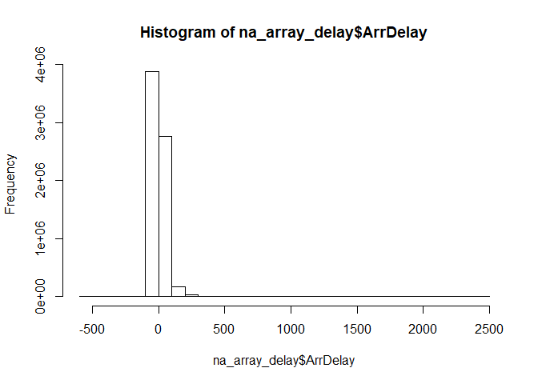

Managing data with dplyr
================

Importamos una tabla

``` r
flights <- readr::read_csv('data/flights/2008.csv', progress = FALSE)
```

    ## Parsed with column specification:
    ## cols(
    ##   .default = col_integer(),
    ##   UniqueCarrier = col_character(),
    ##   TailNum = col_character(),
    ##   Origin = col_character(),
    ##   Dest = col_character(),
    ##   CancellationCode = col_character()
    ## )

    ## See spec(...) for full column specifications.

Nombres de las columnas

``` r
names(flights)
```

    ##  [1] "Year"              "Month"             "DayofMonth"       
    ##  [4] "DayOfWeek"         "DepTime"           "CRSDepTime"       
    ##  [7] "ArrTime"           "CRSArrTime"        "UniqueCarrier"    
    ## [10] "FlightNum"         "TailNum"           "ActualElapsedTime"
    ## [13] "CRSElapsedTime"    "AirTime"           "ArrDelay"         
    ## [16] "DepDelay"          "Origin"            "Dest"             
    ## [19] "Distance"          "TaxiIn"            "TaxiOut"          
    ## [22] "Cancelled"         "CancellationCode"  "Diverted"         
    ## [25] "CarrierDelay"      "WeatherDelay"      "NASDelay"         
    ## [28] "SecurityDelay"     "LateAircraftDelay"

Cabecera

``` r
head(flights)
```

    ## # A tibble: 6 x 29
    ##    Year Month DayofMonth DayOfWeek DepTime CRSDepTime ArrTime CRSArrTime
    ##   <int> <int>      <int>     <int>   <int>      <int>   <int>      <int>
    ## 1  2008     1          3         4    2003       1955    2211       2225
    ## 2  2008     1          3         4     754        735    1002       1000
    ## 3  2008     1          3         4     628        620     804        750
    ## 4  2008     1          3         4     926        930    1054       1100
    ## 5  2008     1          3         4    1829       1755    1959       1925
    ## 6  2008     1          3         4    1940       1915    2121       2110
    ## # ... with 21 more variables: UniqueCarrier <chr>, FlightNum <int>,
    ## #   TailNum <chr>, ActualElapsedTime <int>, CRSElapsedTime <int>,
    ## #   AirTime <int>, ArrDelay <int>, DepDelay <int>, Origin <chr>,
    ## #   Dest <chr>, Distance <int>, TaxiIn <int>, TaxiOut <int>,
    ## #   Cancelled <int>, CancellationCode <chr>, Diverted <int>,
    ## #   CarrierDelay <int>, WeatherDelay <int>, NASDelay <int>,
    ## #   SecurityDelay <int>, LateAircraftDelay <int>

Dimensión

``` r
dim(flights)
```

    ## [1] 7009728      29

Descripción

``` r
summary(flights)
```

Cargamos librerías para operar con tablas

``` r
library(dplyr)
```

    ## 
    ## Attaching package: 'dplyr'

    ## The following objects are masked from 'package:stats':
    ## 
    ##     filter, lag

    ## The following objects are masked from 'package:base':
    ## 
    ##     intersect, setdiff, setequal, union

``` r
library(tidyverse)
```

    ## -- Attaching packages ------------------------------------------ tidyverse 1.2.1 --

    ## v ggplot2 2.2.1     v readr   1.1.1
    ## v tibble  1.4.2     v purrr   0.2.5
    ## v tidyr   0.8.1     v stringr 1.3.1
    ## v ggplot2 2.2.1     v forcats 0.3.0

    ## -- Conflicts --------------------------------------------- tidyverse_conflicts() --
    ## x dplyr::filter() masks stats::filter()
    ## x dplyr::lag()    masks stats::lag()

1. Select
=========

Selecciona columnas de un dataframe

``` r
a <- select(flights, ActualElapsedTime, ArrDelay, DepDelay)
head(a)
```

    ## # A tibble: 6 x 3
    ##   ActualElapsedTime ArrDelay DepDelay
    ##               <int>    <int>    <int>
    ## 1               128      -14        8
    ## 2               128        2       19
    ## 3                96       14        8
    ## 4                88       -6       -4
    ## 5                90       34       34
    ## 6               101       11       25

Funciones de ayuda para seleccionar:

`starts_with(“X”)`: every name that starts with “X” `ends_with(“X”)`: every name that ends with “X” `contains(“X”)`: every name that contains “X” `matches(“X”)`: every name that matches “X”, where “X” can be a regular expression `num_range(“x”, 1:5)`: the variables named x01, x02, x03, x04 and x05 `one_of(x)`: every name that appears in x, which should be a character vector

``` r
select(flights, Origin:Cancelled)  # Cógeme todas las columnas entre esas dos
select(flights, -(DepTime:AirTime))  # Cógeme todas las columnas menos las que están entre esas dos
select(flights, UniqueCarrier, FlightNum, contains("Tail"), ends_with("Delay"))  # Ambas condiciones (or)
```

2. Mutate
=========

Crea campos computados

``` r
foo <- mutate(flights, ActualGroundTime = ActualElapsedTime - AirTime)  # Creamos la columna ActualGroundTime
```

``` r
# Podemos combinar varias operaciones a la vez (crear varios campos a la vez)

foo <- mutate(flights, 
              loss = ArrDelay - DepDelay, 
              loss_percent = (loss/DepDelay) * 100 )  # Incluso aquí puedo usar la variable que he creado justo antes
```

3. Filter
=========

`x < y`, TRUE if x is less than y `x <= y`, TRUE if x is less than or equal to y `x == y`, TRUE if x equals y `x !=`y, TRUE if x does not equal y `x >= y`, TRUE if x is greater than or equal to y `x > y`, TRUE if x is greater than y `x %in% c(a, b, c)`, TRUE if x is in the vector c(a, b, c)

``` r
filter(flights, Distance > 3000)
filter(flights, UniqueCarrier %in% c('AA', 'UA'))
filter(flights, TaxiIn + TaxiOut > AirTime)  # No hace falta hacer el mutate
filter(flights, DepDelay > 0 & ArrDelay < 0)
filter(flights, Cancelled == 1, DepDelay > 0)  # La coma es equivalente al &
```

4. Arrange
==========

Ordena. Es un ORDER BY

``` r
( cancelled <- select(flights, UniqueCarrier, Dest, Cancelled, CancellationCode, DepDelay, ArrDelay) )

( cancelled <- filter(cancelled, Cancelled == 1, !is.na(DepDelay)) )  # Cancelados y que no tengan nulos en DepDelay
```

``` r
arrange(cancelled, DepDelay)  # Ordena cancelled por DepDelay

arrange(cancelled, CancellationCode)

arrange(cancelled, UniqueCarrier, DepDelay)

arrange(cancelled, UniqueCarrier, desc(DepDelay))  # Descending

arrange(flights, DepDelay + ArrDelay)  # Podemos hacer operaciones dentro del arrange (como en el filter)

arrange(filter(flights, Dest == 'JFK'), desc(AirTime))
```

5. Summarise
============

No es lo mismo que un GROUP BY. Aplicar un summarise es que me va a dar una sola fila con la media, mediana, etc... Esto será útil cuando lo juntemos con un groupby para que me obtenga esas magnitudes para grupos. Es la manera de agrupar en `dplyr`.

`min(x)` – minimum value of vector x. `max(x)` – maximum value of vector x. `mean(x)` – mean value of vector x. `median(x)` – median value of vector x. `quantile(x, p)` – pth quantile of vector x. `sd(x)` – standard deviation of vector x. `var(x)` – variance of vector x. `IQR(x)` – Inter Quartile Range (IQR) of vector x.

``` r
# Print out a summary with variables min_dist and max_dist
a <- summarize(flights, min_dist = min(Distance), max_dist = max(Distance))
head(a)
```

    ## # A tibble: 1 x 2
    ##   min_dist max_dist
    ##      <dbl>    <dbl>
    ## 1      11.    4962.

``` r
# Remove rows that have NA ArrDelay: temp1
na_array_delay <- filter(flights, !is.na(ArrDelay))

# Generate summary about ArrDelay column of temp1

df <- summarise(na_array_delay, 
                earliest = min(ArrDelay), 
                average = mean(ArrDelay), 
                latest = max(ArrDelay), 
                sd = sd(ArrDelay))

head(df)
```

    ## # A tibble: 1 x 4
    ##   earliest average latest    sd
    ##      <dbl>   <dbl>  <dbl> <dbl>
    ## 1    -519.    8.17  2461.  38.5

``` r
# Si hay NANs el summarize me va a dar error. Para eso, na.rm = True

df <- summarise(flights, 
                earliest = min(ArrDelay), 
                average = mean(ArrDelay), 
                latest = max(ArrDelay), 
                sd = sd(ArrDelay),
                na.rm = TRUE)
```

``` r
hist(na_array_delay$ArrDelay)
```


