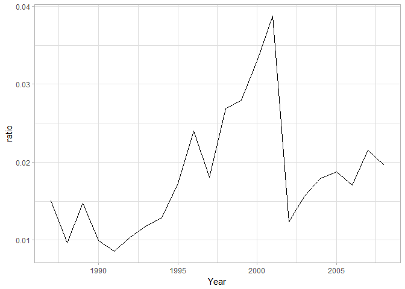
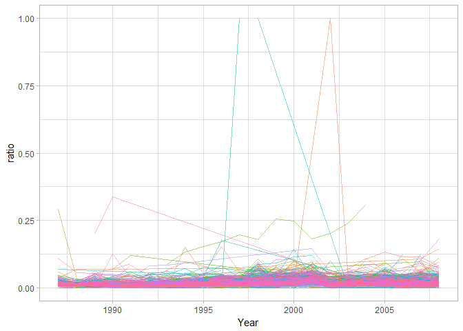
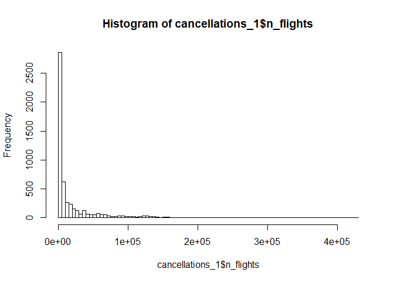
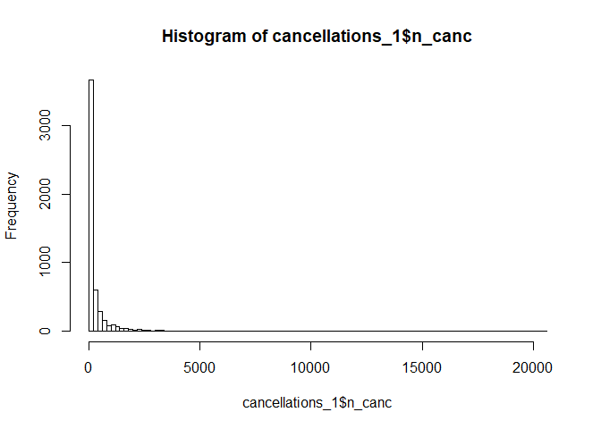
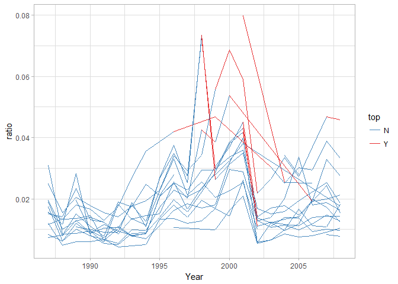

Big Data con BigQuery
================

Index
-----

1.  [Introducción](#introducción)
2.  [BigQuery](#bigquery)
3.  [BigQuery desde R](#bigquery-desde-r)

Introducción
============

BigQuery es un servicio de Google mediante el cual podemos realizar queries sobre datos enormes que no cabrían en memoria. Estas queries las hace muy rápido.

Google te cobra por el almacenamiento de datasets grandes. En este notebook nos vamos a conectar a unos datos que tiene subidos el profesor y realizaremos queries sobre ellos, en la interfaz de BigQuery en el navegador y en R.

Google también permite crearte tu propio clúster de big data (por ejemplo en spark). Pero para simplemente hacer consultas a una base de datos BigQuery es lo mejor.

BigQuery
========

Por tanto, con BigQuery podemos subir un archivo enorme (o aprovechar uno ya subido), hacer consultas en SQL y descargarnos el resultado.

Para acceder a BigQuery hay que crear un proyecto en Google Cloud Platform. Después, en el menú lateral entramos en BigQuery. En Compose Query podemos realizar una nueva query.

Para acceder al dataset del profesor (vuelos), entramos en:

<https://bigquery.cloud.google.com/table/datascience-open-data:flights.flights>

Probando una query, vemos que sobre un dataset de 16gb tarda **muy** poco. Probamos:

``` r
SELECT * FROM `datascience-open-data.flights.flights` LIMIT 1000
```

Cuidado, para poder ejecutar las queries, en Options hay que quitar lo de SQL Legacy.

BigQuery desde R
================

Podemos hacer queries en BigQuery directamente desde R:

``` r
library(bigrquery)
library(ggplot2)
library(sqldf)
```

    ## Loading required package: gsubfn

    ## Loading required package: proto

    ## Loading required package: RSQLite

``` r
library(dplyr)
```

    ## 
    ## Attaching package: 'dplyr'

    ## The following objects are masked from 'package:stats':
    ## 
    ##     filter, lag

    ## The following objects are masked from 'package:base':
    ## 
    ##     intersect, setdiff, setequal, union

``` r
# Al conectarnos con esto nos pide Seleccionar Yes o No para un tema del token. Le damos a Yes.

# Nos estamos conectando a la base de datos flights en datascience-open-data
con <- DBI::dbConnect(bigquery(),
                      project = "datascience-open-data",
                      dataset = "flights",
                      billing = "master-data-science-mfz")
```

``` r
# Ahora miro qué tablas tengo
DBI::dbListTables(con)
```

    ## [1] "airlines" "airports" "flights"

``` r
# Creamos un objeto tbl con esa conexión a flights

flights_db <- tbl(con, "flights")
```

Ahora yo puedo hacer ya la query desde aquí, no desde el navegador con BigQuery

``` r
sql <- "SELECT
  COUNT(DISTINCT Year) AS years,
COUNT(DISTINCT UniqueCarrier) AS carriers,
COUNT(DISTINCT Dest) AS airports
FROM (
SELECT
Year,
UniqueCarrier,
Dest
FROM
`datascience-open-data.flights.flights`
GROUP BY
1,
2,
3 )"


query_exec(sql, project = "master-data-science-mfz", use_legacy_sql = F)
```

    ## 0 bytes processed

    ##   years carriers airports
    ## 1    22       29      352

``` r
# En mi proyecto, me haces esa consulta (que es sobre los datos de otro proyecto)
```

También podemos hacer consultas con dplyr

``` r
flights_db %>% head 
```

    ## # Source:   lazy query [?? x 29]
    ## # Database: BigQueryConnection
    ##    Year Month DayofMonth DayOfWeek DepTime CRSDepTime ArrTime CRSArrTime
    ##   <int> <int>      <int>     <int> <chr>        <int> <chr>        <int>
    ## 1  1997     5         14         3 1138          1138 1503          1508
    ## 2  1997     5         19         1 951            951 1324          1322
    ## 3  1997     5         16         5 809            810 1004          1007
    ## 4  1997     5          2         5 1637          1625 1919          1905
    ## 5  1997     5         29         4 1146          1150 1300          1300
    ## 6  1997     1          9         4 <NA>             0 <NA>             0
    ## # ... with 21 more variables: UniqueCarrier <chr>, FlightNum <int>,
    ## #   TailNum <chr>, ActualElapsedTime <chr>, CRSElapsedTime <int>,
    ## #   AirTime <chr>, ArrDelay <chr>, DepDelay <chr>, Origin <chr>,
    ## #   Dest <chr>, Distance <int>, TaxiIn <chr>, TaxiOut <chr>,
    ## #   Cancelled <int>, CancellationCode <chr>, Diverted <int>,
    ## #   CarrierDelay <chr>, WeatherDelay <chr>, NASDelay <chr>,
    ## #   SecurityDelay <chr>, LateAircraftDelay <chr>

``` r
cancellations <- flights_db %>% 
  group_by(Year) %>% 
  summarise(n_flights = n(), 
            n_canc = sum(Cancelled)) %>% 
  collect()  # Esto es porque las querys son lazy, así que con collect nos lo devuelve.
```

    ## Warning: Missing values are always removed in SQL.
    ## Use `SUM(x, na.rm = TRUE)` to silence this warning

``` r
# Ahora que el dataset es más pequeño ya hacemos otra query en locsl

cancellations_by_year <- cancellations %>% 
  mutate(ratio = n_canc / n_flights) %>% 
  arrange(desc(Year)) 
```

``` r
ggplot(cancellations_by_year, aes(x=Year, y=ratio, group=1)) +
  geom_line() + 
  theme_light()
```



``` r
cancellations <- flights_db %>% 
  group_by(Year,Dest) %>% 
  summarise(n_flights = n(), 
            n_canc = sum(Cancelled)) %>% 
  collect() 
```

    ## Warning: Missing values are always removed in SQL.
    ## Use `SUM(x, na.rm = TRUE)` to silence this warning

``` r
cancellations_1 <- cancellations %>% 
  mutate(ratio = n_canc / n_flights) %>% 
  arrange(n_flights)
```

``` r
ggplot(cancellations_1, aes(x=Year, y=ratio, group=Dest, color=Dest)) +
  geom_line(show.legend=F, aes(color = Dest), size=0.6, alpha=.5) + 
  scale_x_continuous()+
  theme_light()
```



``` r
# What's happening?
cancellations_1 %>% summary()
```

    ##       Year          Dest             n_flights          n_canc       
    ##  Min.   :1987   Length:5337        Min.   :     1   Min.   :    0.0  
    ##  1st Qu.:1992   Class :character   1st Qu.:  1362   1st Qu.:   25.0  
    ##  Median :1998   Mode  :character   Median :  4172   Median :   78.0  
    ##  Mean   :1998                      Mean   : 23147   Mean   :  431.6  
    ##  3rd Qu.:2004                      3rd Qu.: 20494   3rd Qu.:  290.0  
    ##  Max.   :2008                      Max.   :429800   Max.   :20409.0  
    ##      ratio         
    ##  Min.   :0.000000  
    ##  1st Qu.:0.009642  
    ##  Median :0.016285  
    ##  Mean   :0.021890  
    ##  3rd Qu.:0.026622  
    ##  Max.   :1.000000

``` r
hist(cancellations_1$n_flights, breaks = 100)
```



``` r
hist(cancellations_1$n_canc, breaks = 100)
```



``` r
cancellations_2 <- cancellations %>% 
  filter(abs(n_flights - mean(n_flights)) > 2*sd(n_flights) ) %>% 
  mutate(ratio = n_canc / n_flights, 
         top = if_else(ratio > .04, "Y", "N") )%>% 
  arrange(n_flights)

ggplot(cancellations_2, aes(x=Year, y=ratio, group=Dest, color=top)) +
  geom_line(show.legend=T, aes(color = top), size=.6, alpha=.9) + 
  scale_x_continuous()+
  scale_colour_brewer(palette = "Set1", direction = -1) +
  theme_light()
```



Para cerrar la conexión:

``` r
DBI::dbDisconnect(con)  # Cerramos la conexión
```

-   Para subir datos a bigquery, hay varias maneras: directamente, desde google drive, etc...
-   También tenemos que determinar el schema -&gt; automático o manual. \*Destination Table, puedes tener Table type / External Type: esto es que no tengo mis datos almacenados como tabla de bigquery, sino que está apuntando a mi csv ycada vez que hago una consulta lo lee y la hace. Está bien para no tener que pagar el almacenamiento de la tabla en bigquery.
