Gráficos básicos en el análisis de datos
================

Index
-----

1.  [Introducción](#introducción)
2.  [Distribución de una variable](#distribución-de-una-variable)
3.  [Relación entre dos variables](#relación-entre-dos-variables)
4.  [Ejercicios](#ejercicios)

Introducción
============

Esta sección es una breve introducción a los gráficos más comunes para analizar conjuntos de datos. Para ello, utilizaremos el paquete ggplot2 (“gg” para “Grammar of Graphics”).

``` r
#install.packages("tidyverse")
library(tidyverse) #incluye ggplot2
```

    ## -- Attaching packages ---------------------------------------------------------------------------------------- tidyverse 1.2.1 --

    ## v ggplot2 2.2.1     v purrr   0.2.5
    ## v tibble  1.4.2     v dplyr   0.7.5
    ## v tidyr   0.8.1     v stringr 1.3.1
    ## v readr   1.1.1     v forcats 0.3.0

    ## -- Conflicts ------------------------------------------------------------------------------------------- tidyverse_conflicts() --
    ## x dplyr::filter() masks stats::filter()
    ## x dplyr::lag()    masks stats::lag()

Empezaremos con la función básica `qplot` (“quick plot”) de este paquete. Una descripción abreviada de esta función es:

``` r
qplot(x, y=NULL, data, geom="auto", xlim = c(NA, NA), ylim =c(NA, NA))
```

> **Nota**
>
> -   `x` : valores en el eje de abscisas.
> -   `y` : valores en el de ordenadas (opcional).
> -   `data` : data.frame de donde salen los datos (opcional).
> -   `geom` : elementos gráficos o geometrías (“point”,line“,”bar“,…). Por defecto, “point” si ´y´ viene especificado, e “histogram” si sólo se especifica `x`.
> -   `xlim`, `ylim`: limites en los ejes de `x` e `y`.
>
> Otros argumentos relacionados con los ejes y el titulo del gráfico son: main: titulo del gráfico; xlab, ylab: etiquetas los los ejes; log: ejes en escala log. Los valores permitidos son “x”, “y” o bien “xy”.

Cargamos el fichero mpg, que está en `ggplot`.

``` r
mpg <- mpg
```

Hacemos una conversión de formato para tener medidas más familiares

``` r
mpg <- mpg %>% mutate(consumo = 235 / hwy)
```

``` r
summary(mpg$consumo)
```

    ##    Min. 1st Qu.  Median    Mean 3rd Qu.    Max. 
    ##   5.341   8.704   9.792  10.724  13.056  19.583

Distribución de una variable
============================

Para intentar ver algo en un conjunto de datos, lo primero que se puede hacer es averiguar cómo se distribuyen sus valores. En R, hay funciones básicas (summary, stem, table, …) que permiten tener una idea de esta distribución.

El tipo de representación gráfica de la distribución cambia según la naturaleza de la variable en estudio. Una variable cuantitativa toma valores numéricos. Para una variable cuantitativa, se suele recurrir a un **histograma** o bien a un **diagrama de caja** para describir su distribución. Mientras que para variables cualitativas (o categóricas), se utilizará un **diagrama de barras**.

Histograma
----------

Con la función `stem` se construye un histograma "a mano":

``` r
stem(mpg$consumo)
```

    ## 
    ##   The decimal point is at the |
    ## 
    ##    5 | 337
    ##    6 | 455779
    ##    7 | 11333366666668888
    ##    8 | 1111111111111111111111444444477777777777777
    ##    9 | 000000000000000000000000000000004444444444444448888888888888
    ##   10 | 22222227777777
    ##   11 | 2288888888888
    ##   12 | 4444444444444
    ##   13 | 11111111118888888888888888888888888888888
    ##   14 | 7777777
    ##   15 | 7777777777
    ##   16 | 88
    ##   17 | 
    ##   18 | 
    ##   19 | 66666

Se interpreta: hay dos coches que tienen 5.3, uno de 5.7, uno de 6.4, etc...

Representamos el histograma:

``` r
qplot(consumo,data=mpg) #histograma 
```

    ## `stat_bin()` using `bins = 30`. Pick better value with `binwidth`.


La altura de cada barra en el histograma es proporcional a la frecuencia de datos que caen en el intervalo correspondiente. Por defecto, en la función `qplot` el número de barras es igual a `bins=30`. Este valor es muy arbitrario.

A la hora de elegir un ancho de barra, hay que encontrar el punto medio entre muchas y pocas. Hay técnicas y criterios que sugieren qué ancho coger (criterios de *Sturge* o *Rule*).

``` r
k <- 1+log(nrow(mpg),2)  # Sturges
k
```

    ## [1] 8.870365

``` r
k <- 2*nrow(mpg)^(1/3)  # Rule
k
```

    ## [1] 12.32448

``` r
qplot(consumo,data=mpg,bins=12,color=I("blue4"),fill=I("lightblue"))
```


El argumento `fill` controla el color de relleno de las barras y el argumento color el color del borde. Para especificar un color concreto se utiliza la función I(). Si el color varía con otra variable z, se especifica esta dependencia escribiendo fill=z.

``` r
qplot(consumo,data=mpg,bins=12,fill=class) # Distribución del consumo según tipo de coche
```


Esto es poco adecuado en general (no se ve muy bien). Para comparar distribuciones -&gt; boxplot.

Diagrama de caja (boxplot)
--------------------------

Otra representación similar es el diagrama de caja. Este diagrama describe la distribución de una variable numérica mediante una caja y unos segmentos que acotan las regiones donde la variable tiene el grueso de sus valores. Esta representación es menos fina que la del histograma pero es más robusta (menos sensible a valores extremos).

``` r
qplot(trans,consumo,data=mpg,geom="boxplot")
```

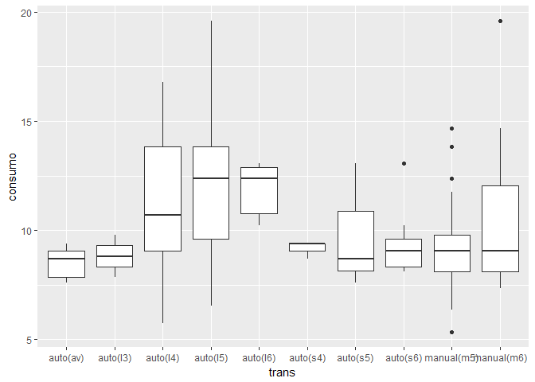

Esta representación es especialmente adecuada cuando se quiere describir como varía la distribución de una variable numérica en función de una variable categórica. Así, la distribución del consumo en consumo según el tipo de coche se puede representar de la siguiente manera:

``` r
qplot(class,consumo,data=mpg,geom="boxplot")
```


``` r
qplot(manufacturer,consumo,data=mpg,geom="boxplot")
```

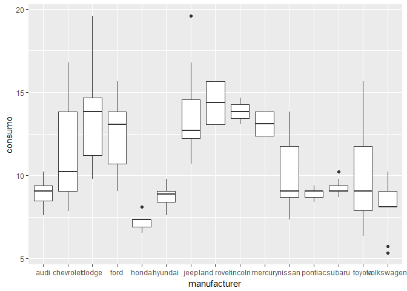

Se ve muy mal el eje x: giramos el gráfico:

``` r
qplot(manufacturer,consumo,data=mpg,geom="boxplot") + coord_flip()  # giramos con 'coord_flip' 
```


``` r
qplot(class,consumo,data=mpg,geom="boxplot", fill = drv) + coord_flip()  # giramos con 'coord_flip' 
```

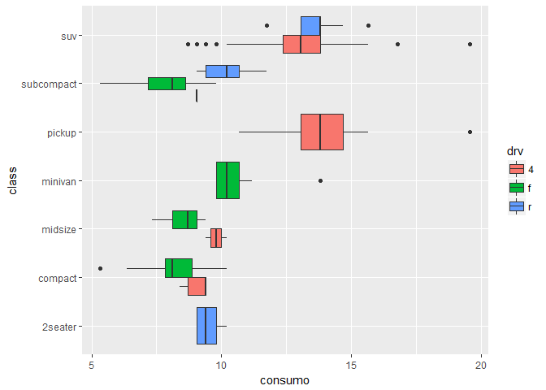

Diagrama de barras
------------------

Los diagramas de barras permiten representar la distribución de una variable categórica. En esta representación, cada categoría viene representada por una barra cuya altura es proporcional a su frecuencia en la base de datos.

Para variables categóricas, el "histograma" será un gráfico de barras.

``` r
qplot(class,data=mpg,fill=I("lightblue")) #Distribución de los tipos de coche en la base mpg
```


Relación entre dos variables
============================

Diagrama de dispersión
----------------------

Para describir la relación entre dos variables cuantitativas se suele utilizar gráficos de dispersión. Estos gráficos describen esta relación mediante una nube de puntos en un plano cartesiano. Cada punto de la nube corresponde a una fila de la base de datos y cada una de las variables corresponde a un eje. En el gráfico siguiente se describe la relación entre el consumo en autopista y la potencia (cilindradas) del coche:

``` r
qplot(displ,consumo,data=mpg,xlab="cilindrada")
```

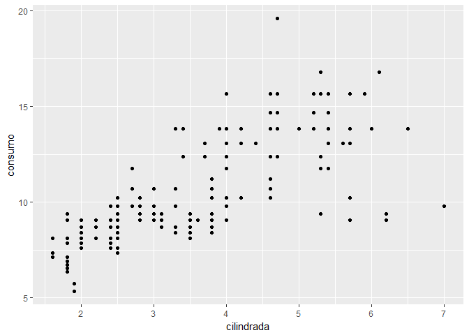

Se ve que la cilindrada toma pocos valores (aunque es continua). Lo malo es que esto hace que se solapen unos puntos con otros y no se ve del todo bien la tendencia (no se diferencian los sitios con alta densidad de puntos con los de baja).

Opciones:

-   Jugar con la transparencia
-   Poner un pequeño ruido, así los puntos se mueven un poquito y así podemos apreciar bien la densidad de los puntos.

``` r
qplot(displ, consumo, data = mpg, alpha = I(0.1))
```


Ya se ve mejor.

Otra opción -&gt; ruido:

``` r
qplot(displ,consumo,data=mpg, alpha=I(.25), geom="jitter") #Mejor resultado añadiendo algo de ruido
```


Para cambiar el tamaño de los puntos:

``` r
qplot(displ,consumo,data=mpg, alpha=I(.25), geom="jitter", size = I(5))
```


Ajustando una curva suave (“smooth”) a la nube de puntos, se puede apreciar mejor la tendencia en esta relación:

``` r
qplot(displ,consumo,data=mpg, alpha=I(.25), geom=c("jitter", "smooth"))
```

    ## `geom_smooth()` using method = 'loess'

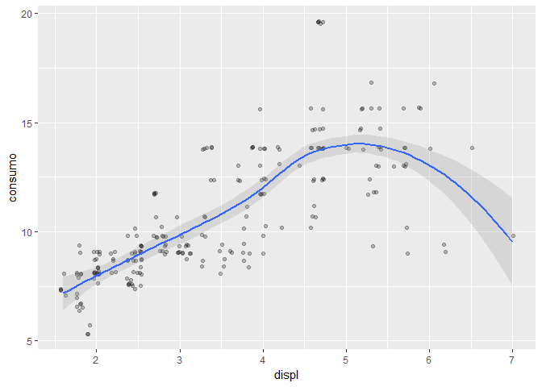

Para ajustar una recta:

``` r
qplot(displ,consumo,data=mpg, alpha=I(.25), geom=c("jitter", "smooth"), method = 'lm')
```

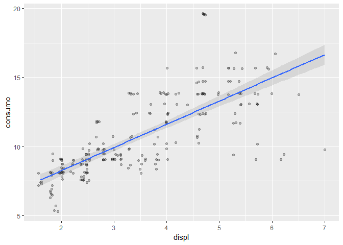

Dotchart
--------

Si una de las variables es categórica, el gráfico de dispersión puede ser también apropiado. Es parecido a un boxplot.

``` r
qplot(consumo, model, data = mpg)
```


Si meto una tercera variable:

``` r
qplot(consumo,model,data=mpg,col=cyl)
```


Es más fácil de ver si ordenamosla variable categórica de acuerdo a la otra variable:

``` r
mpg <- mpg %>% group_by(model) %>% mutate(media=mean(consumo))
qplot(consumo,reorder(model,media),data=mpg,col=cyl,xlab="modelo de coche")
```

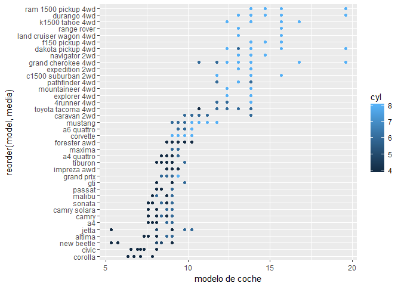

¿Cómo ordenamos los modelos? Los ordenamos de acuerdo a la media del consumo de cada modelo.

Ejercicios
----------

> **Ejercicio** Describir con un gráfico similar al anterior, los datos de la base de datos islands sobre superficies de islas. Puede ser oportuno recurrir a una escala log.

``` r
islas <- data_frame(nombre = names(islands),superficie=islands)
```

``` r
qplot(superficie, reorder(nombre, superficie), data = islas, log = 'x', ylab = 'Islas')
```

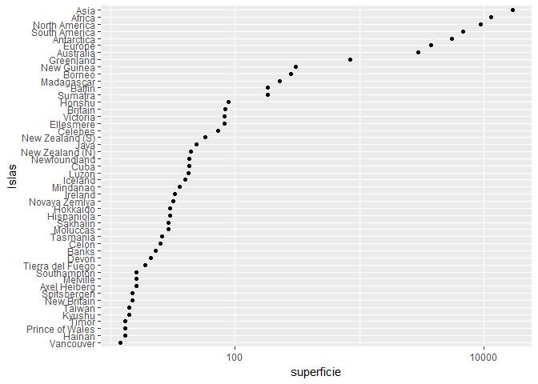

> **Ejercicio** Representar la distribución de la altura de los alumnos de la universidad de Adelaide y su variación con el sexo, a partir de la base de datos `survey` del paquete `MASS`.

``` r
require(MASS)
```

    ## Loading required package: MASS

    ## 
    ## Attaching package: 'MASS'

    ## The following object is masked from 'package:dplyr':
    ## 
    ##     select

``` r
survey <- as.tibble(survey) %>% filter(!is.na(Sex)) #quitamos el alumno sin información sobre su sexo
summary(survey)
```

    ##      Sex          Wr.Hnd          NW.Hnd        W.Hnd          Fold    
    ##  Female:118   Min.   :13.00   Min.   :12.50   Left : 17   L on R : 98  
    ##  Male  :118   1st Qu.:17.50   1st Qu.:17.50   Right:218   Neither: 18  
    ##               Median :18.50   Median :18.50   NA's :  1   R on L :120  
    ##               Mean   :18.66   Mean   :18.58                            
    ##               3rd Qu.:19.75   3rd Qu.:19.75                            
    ##               Max.   :23.20   Max.   :23.50                            
    ##               NA's   :1       NA's   :1                                
    ##      Pulse             Clap       Exer       Smoke         Height     
    ##  Min.   : 35.00   Left   : 39   Freq:114   Heavy: 11   Min.   :150.0  
    ##  1st Qu.: 66.00   Neither: 49   None: 24   Never:188   1st Qu.:165.0  
    ##  Median : 72.00   Right  :147   Some: 98   Occas: 19   Median :171.0  
    ##  Mean   : 74.16   NA's   :  1              Regul: 17   Mean   :172.4  
    ##  3rd Qu.: 80.00                            NA's :  1   3rd Qu.:180.0  
    ##  Max.   :104.00                                        Max.   :200.0  
    ##  NA's   :45                                            NA's   :28     
    ##        M.I           Age       
    ##  Imperial: 68   Min.   :16.75  
    ##  Metric  :140   1st Qu.:17.65  
    ##  NA's    : 28   Median :18.58  
    ##                 Mean   :20.37  
    ##                 3rd Qu.:20.17  
    ##                 Max.   :73.00  
    ## 

``` r
# El as.tibble es para convertir una tabla al formato en el que trabaja dplyr
```

``` r
qplot(Sex, Height, data = survey, geom = 'boxplot') + coord_flip()
```


Vemos que los hombres son más altos

``` r
qplot(Sex, Height, data = survey, geom = 'boxplot', fill = Exer) + coord_flip()
```

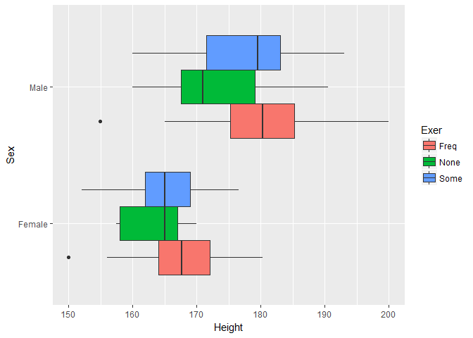

``` r
qplot(Sex, data = survey, fill = Fold)
```

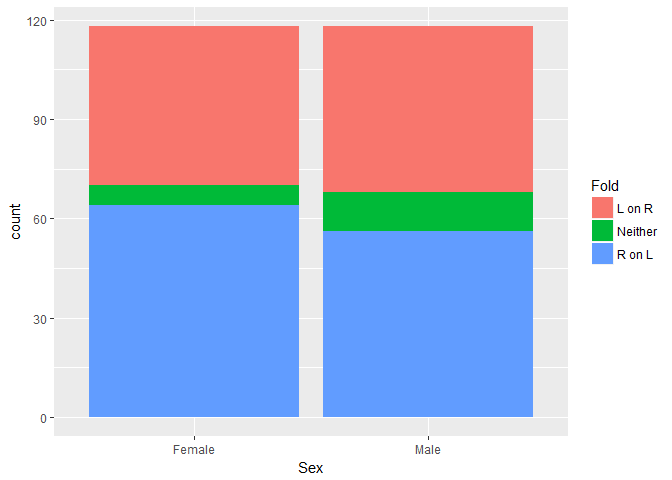

Age contra Smoke:

``` r
qplot(Smoke, Age, data = survey, geom = 'boxplot') + coord_flip()
```

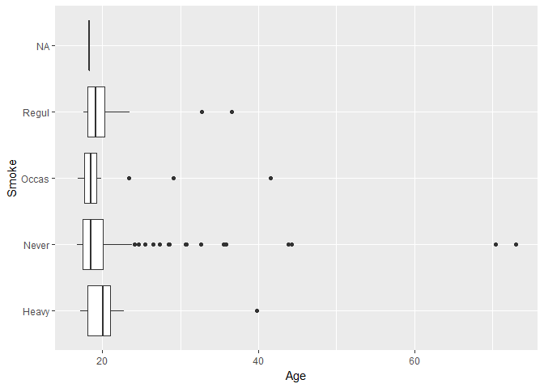

Sexo contra altura en función del Smoke

``` r
qplot(Sex, Height, data = survey, geom = 'boxplot', fill = Smoke)
```


Los valores de Smoke están ordenados de forma alfabética. Si queremos hacer esto más intuitivo:

``` r
survey <- survey %>% mutate(Smoke = factor(Smoke, levels = c('Never', 'Occas', 'Regul', 'Heavy' )))
```

``` r
qplot(Sex, Height, data = survey, geom = 'boxplot', fill = Smoke)
```


Para añadir etiquetas:

``` r
survey <- survey %>% mutate(Tabaco = factor(Smoke, levels = c('Never', 'Occas', 'Regul', 'Heavy' ), 
                                            labels = c('Nunca', 'Ocasionalmente', 'Regularmente', 'Siempre')))
```

``` r
qplot(Sex, Height, data = survey, geom = 'boxplot', fill = Tabaco)
```


La función factor es muy útil para ordenar, definir niveles, reducir...

¿Cómo varía el consumo de tabaco según el sexo?

``` r
qplot(Tabaco, data = survey, fill = Sex)
```

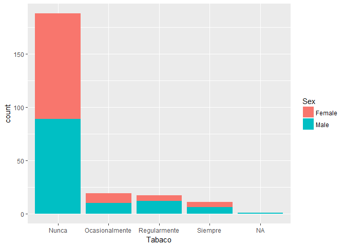

Esta es una manera de comparar dos variables categóricas, aunque no es la óptima.

``` r
qplot(Sex, data = survey, fill = Tabaco)
```


Se puede ver que los hombres fuman un poco más.

Lo malo de este gráfico es que no se puede comparar muy bien (a no ser que todas las barras tengan la misma altura, ya que ahí puedo ver mejor las proporciones. Pero si no no).

Ante este problema podemos representar proporciones.

> **Ejercicio** Función cut

``` r
# Nos inventamos un dataframe

N <- 5000
sueldos <- rnorm(N, 2000, 100)
edades <- rpois(N, sueldos / 40)
sexos <- sample(c('hombre', 'mujer'), N, replace = TRUE)  # Con sample cogemos de un conjunto X observaciones aleatoriamente.

datos <- data_frame(sueldo = sueldos, edad = edades, sexo = sexos)
head(datos)
```

    ## # A tibble: 6 x 3
    ##   sueldo  edad sexo  
    ##    <dbl> <int> <chr> 
    ## 1  1961.    48 hombre
    ## 2  1974.    38 hombre
    ## 3  1932.    52 hombre
    ## 4  1992.    46 mujer 
    ## 5  1996.    51 hombre
    ## 6  2039.    47 mujer

``` r
# Con la función cut podemos transformar una variable continua en una categórica (muy útil)

datos <- datos %>%
  mutate(edad.gr = cut(edad, seq(25,80,5)))

qplot(edad.gr, sueldo, data = datos, geom='boxplot', fill = sexo)
```


